# Upload Data to Hadoop Distributed File System and Object Storage

## Introduction

In this lab, you will download and run two sets of scripts. First, you will download and run the Hadoop Distributed File System (HDFS) scripts to download data from [Citi Bikes NYC](https://www.citibikenyc.com/system-data) to a new local directory on your master node in your BDS cluster. The HDFS scripts manipulates some of the downloaded data files, and then upload them to new HDFS directories. The HDFS scripts also create Hive databases and tables which you will query using Hue. Second, you will download and run the object storage scripts to download data from [Citi Bikes NYC](https://www.citibikenyc.com/system-data) to your local directory using OCI Cloud Shell. The object storage scripts uploads the data to a new bucket in Object Storage. See the [Data License Agreement](https://www.citibikenyc.com/data-sharing-policy) for information about the Citi Bikes NYC data license agreement.

**Note:** The Object Storage service provides reliable, secure, and scalable object storage. Object storage is a storage architecture that stores and manages data as objects. You can use Object Storage objects and buckets to store and manage data. An object stores any type of data, regardless of the content type. A bucket is a logical container for storing objects.  See [Overview of Object Storage](https://docs.cloud.oracle.com/en-us/iaas/Content/Object/Concepts/objectstorageoverview.htm#Overview_of_Object_Storage) in the Oracle Cloud Infrastructure documentation.

Estimated Lab Time: 45 minutes

### Objectives

* Download the HDFS and object storage scripts from a public bucket in Object Storage. The scripts are required to set up your environment and to download the dataset from [Citi Bikes NYC](https://www.citibikenyc.com/system-data) to the **`training`** Administrator user's local working directory and to your OCI Cloud Shell directory.
* Use SSH to connect to your master node in your cluster. You then run the HDFS scripts to set up your HDFS environment and to manipulate and upload the downloaded data from your local working directory to new HDFS directories.
* Use OCI Cloud Shell to run the object storage scripts to set up your Object Storage environment and to upload the downloaded data from the local working directory to a new bucket in Object Storage.
* Create Hive databases and tables that represents the data that you uploaded to HDFS, and then query the Hive tables using Hue.


### What Do You Need?
+ This lab assumes that you have successfully completed the following labs in the **Contents** menu:
    + **Lab 1: Setup the BDS Environment**
    + **Lab 2: Create a BDS Hadoop Cluster**
    + **Lab 3: Add Oracle Cloud SQL to the Cluster**
    + **Lab 4: Access a BDS Node Using a Public IP Address**
    + **Lab 5: Use Cloudera Manager and Hue to Access a BDS Cluster**
    + **Lab 6: Create a Hadoop Administrator User**

+ Download some stations and bike trips data files from [Citibikes](https://www.citibikenyc.com/system-data) and some randomized weather data from a public bucket in Object Storage.

## Task 1: Gather Information About the Compartment and the Master Node Reserved Public IP Address

1. Log in to the **Oracle Cloud Console** as the Cloud Administrator, if you are not already logged in. On the **Sign In** page, select your `tenancy`, enter your `username` and `password`, and then click **Sign In**. The **Oracle Cloud Console** Home page is displayed.

2. Click the **Navigation** menu and navigate to **Identity & Security > Compartments**. In the list of compartments, search for the **training-compartment**. In the row for the compartment, in the **OCID** column, hover over the OCID link and then click **Copy**. Next, paste that OCID to an editor or a file, so that you can retrieve it later in this lab.

  

3. Click the **Navigation** menu and navigate to **Networking > Reserved IPs**. The **Reserved Public IP Addresses** page is displayed. In the **List Scope** on the left pane, make sure that your **training-compartment** is selected.

4. In row for the `traininmn0-public-ip` reserved IP address, copy the reserved public IP address associated with the master node in the **Reserved Public IP** column. Next, paste that IP address to an editor or a file, so that you can retrieve it later in this lab. You might need this IP address to ssh to the master node, if you didn't save your ssh connection in Lab 6.

  


## Task 2: Connect to the Cluster's First Master Node Using Secure Shell (SSH)

In this step, you will connect to the first master node in your cluster, `traininmn0-public-ip`, using SSH as the **`training`** Hadoop Administrator user that you created in **Lab 6**.

**Important:** Since the cluster is secure and HA, you must have a Kerberos ticket before you can access HDFS. You already obtained a Kerberos ticket for the **`training`** user in **Lab 6**.


In this lab, we will connect to our cluster using Windows **PuTTY** and provide the SSH private key named `mykey.ppk` which is associated with our `mykey.pub` public key. Refer to **Lab 6: Create a Hadoop Administrator User**, if needed, to review the steps on how to connect to the first master node in your cluster. If you created or used an OpenSSH key pair (using your Linux system or Windows PowerShell), you will need to use your Linux system or Windows PowerShell as shown in **Lab 6**.

**Note:** You cannot use PuTTY while you are connected to a Virtual Private Network (VPN).

1. Start **PuTTY**. The **PuTTY Configuration** window is displayed. In the **Saved Sessions** section, click the `ssh to traininmn0 on BDS cluster` saved session that you created in **Lab 6**, and then click **Load**.

   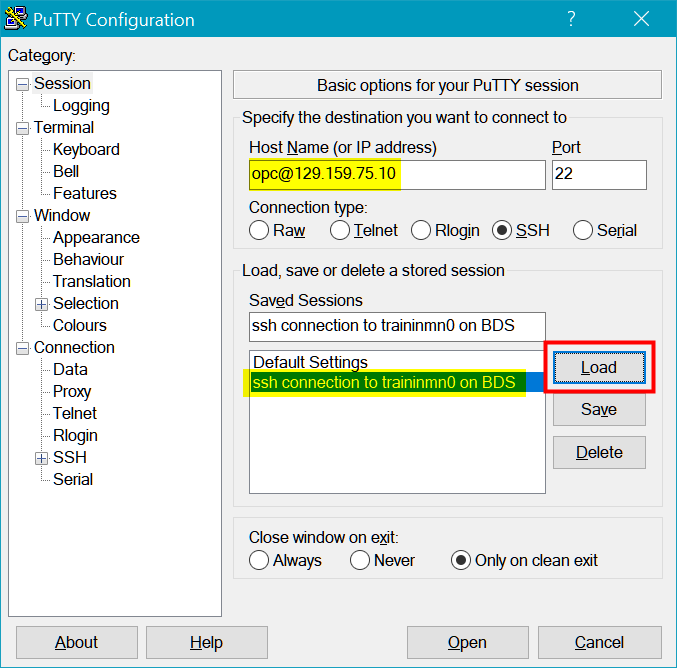

2. Click **Open**. You are connected to the **`traininmn0`** master node.

   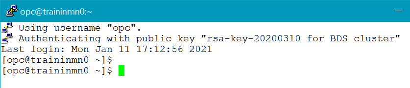


3.  Log in as the **`training`** Hadoop Administrator user that you created in **Lab 6**.

    ```
    $ <copy>sudo -su training</copy>
    ```

    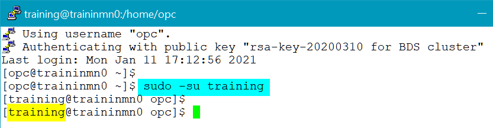


4. Use the `id` command to confirm that you are connected as the **`training`** Hadoop Administrator user.

    ```
    $ <copy>id</copy>
    ```

    

5. Use the `cd` command to change the working directory to that of the **`training`** user. Use the `ls -l` command to confirm that you are in the `training` working directory:

    ```
    $ <copy>cd</copy>
    $ <copy>ls -l</copy>
    ```

    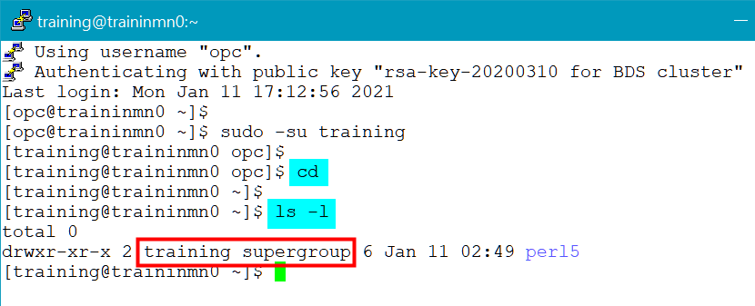


## Task 3: Download and Run HDFS Scripts to Set Up the HDFS Data

In this step, you download two scripts that will set up your HDFS environment and download the HDFS dataset from [Citibike System Data](https://www.citibikenyc.com/system-data). The scripts and a randomized weather data file are stored in a public bucket in Object Storage.

The Citi Bikes detailed trip data files (in zipped format) are first downloaded to a new local directory. Next, the files are unzipped, and the header row is removed from each file. Finally, the updated files are uploaded to a new **`/data/biketrips`** HDFS directory. Next, a new **`bikes`** Hive database is created with two Hive tables. **`bikes.trips_ext`** is an external table defined over the source data. The **`bikes.trips`** table is created from this source; it is a partitioned table that stores the data in Parquet format. The tables are populated with data from the `.csv` files in the **`/data/biketrips`** directory.

The stations data file is downloaded (and then manipulated) from the [station information](https://gbfs.citibikenyc.com/gbfs/es/station_information.json) page. The updated file is then uploaded to a new **`/data/stations`** HDFS directory.

The weather data is downloaded from a public bucket in Object Storage. Next, the header row in the file is removed. The updated file is then uploaded to a new **`/data/weather`** HDFS directory. Next, a new **`weather`** Hive database and **`weather.weather_ext`** table are created and populated with from the `weather-newark-airport.csv` file in the **`/data/weather`** directory.

**Note:**    
To view the complete data files that are available, navigate to [Citibike System Data](https://www.citibikenyc.com/system-data) page. In the **Citi Bike Trip Histories** section, click [downloadable files of Citi Bike trip data](https://s3.amazonaws.com/tripdata/index.html). The [Index of bucket "tripdata"](https://s3.amazonaws.com/tripdata/index.html) page displays the available data files. In this lab, you will be using only some of the data files on that page.  

1. Run the following command to download the **`env.sh`** script from a public bucket in Object Storage to the **`training`** working directory. You will use this script to set up your HDFS environment.

    ```
    $ <copy>wget https://objectstorage.us-phoenix-1.oraclecloud.com/n/oraclebigdatadb/b/workshop-data/o/bds-livelabs/env.sh</copy>
    ```

    

2. Run the following command to download the **`download-all-hdfs-data.sh`** script from a public bucket in Object Storage to the **`training`** working directory. You will run this script to download the dataset to your local working directory. The script will then upload this data to HDFS.

    ```
    $ <copy>wget https://objectstorage.us-phoenix-1.oraclecloud.com/n/oraclebigdatadb/b/workshop-data/o/bds-livelabs/download-all-hdfs-data.sh</copy>
    ```

    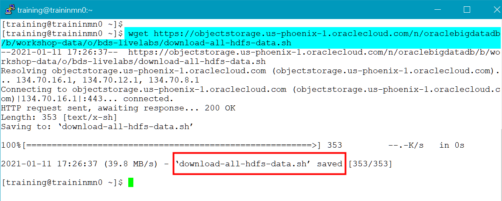

3. Add the **execute** privilege to the two downloaded `.sh` files as follows:

    ```
    $ <copy>chmod +x *.sh</copy>
    ```

    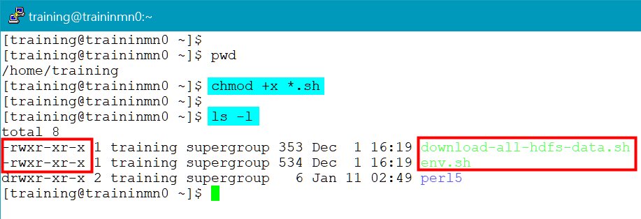

4. Display the content of the **`env.sh`** file using the **cat** command. This file sets the target local and HDFS directories.

    ```
    $ <copy>cat env.sh</copy>
    ```

  


  **Note:** You will download the data from [Citi Bikes NYC](https://www.citibikenyc.com/system-data) to the new **`Downloads`** local target directory as specified in the **`env.sh`** file. You will upload the data from the local **`Downloads`** directory to the following new HDFS directories under the new **`/data`** HDFS directory as specified in the **`env.sh`** and the HDFS scripts: **`biketrips`**, **`stations`**, and **`weather`**.

5. Use the **`cat`** command to display the content of the **`download-all-hdfs-data.sh`** script. This script downloads the **`download-citibikes-hdfs.sh`** and **`download-weather-hdfs.sh`** scripts to the local **`training`** working directory, adds execute privilege on both of those scripts, and then runs the two scripts.

    ```
    $ <copy>cat download-all-hdfs-data.sh</copy>
    ```

    

  The **`download-citibikes-hdfs.sh`** script does the following:

      + Runs the **`env.sh`** script to set up your local and HDFS target directories.
      + Downloads the stations information from the Citi Bike Web site to the local **`Downloads`** target directory.
      + Creates a new **`/data/stations`** HDFS directory, and then copies the `stations.json` file to this HDFS directory.
      + Downloads the bike rental data files (the zipped `.csv` files) from [Citi Bikes NYC](https://www.citibikenyc.com/system-data) to the local **`Downloads`** target directory.
      + Unzips the bike rental files, and removes the header row from each file.
      + Creates a new **`/data/biketrips`** HDFS directory, and then uploads the updated `csv` files to this HDFS directory. Next, it adds execute file permissions to both `.sh` files.
      + Creates the `bikes` Hive database with two Hive tables. **`bikes.trips_ext`** is an external table defined over the source data. **`bikes.trips`** is created from this source; it is a partitioned table that stores the data in Parquet format. The tables are populated with data from the `.csv` files in the **`/data/biketrips`** directory.

  The **`download-weather-hdfs.sh`** script provides a random weather data set for Newark Liberty Airport in New Jersey. It does the following:

      + Runs the `env.sh` script to set up your local and HDFS target directories.
      + Downloads the `weather-newark-airport.csv` file to the **`Downloads`** stations information from the Citi Bike Web site to the local **`Downloads`** target directory.
      + Removes the header row from the file.
      + Creates a new **`/data/weather`** HDFS directory, and then uploads the `weather-newark-airport.csv` file to this HDFS directory.
      + Creates the `weather` Hive database and the `weather.weather_ext` Hive table. It then populates the table with the weather data from the `weather-newark-airport.csv` file in the local **`Downloads`** directory.

6. Run the **`download-all-hdfs-data.sh`** script as follows:

    ```
    $ <copy>./download-all-hdfs-data.sh</copy>
    ```
    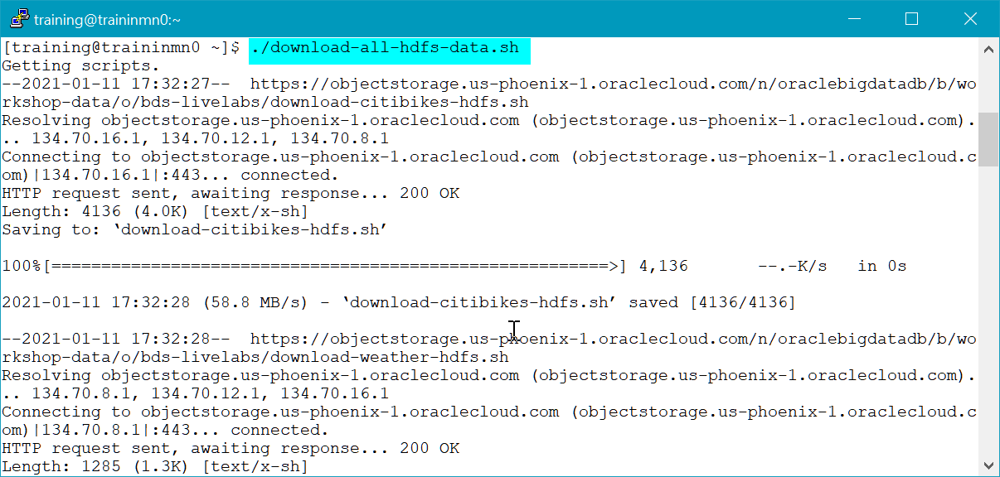


7. Text messages will scroll on the screen. After a minute or so, the **Weather data loaded** and **Done** messages are displayed on the screen.

    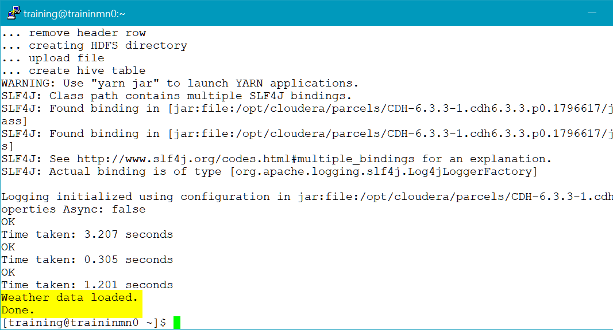

8. Navigate to the local **`Downloads`** directory, and then use the `ls -l` command to display the downloaded trips, stations, and weather data files.

    ```
    $ <copy>cd Downloads</copy>
    ```

    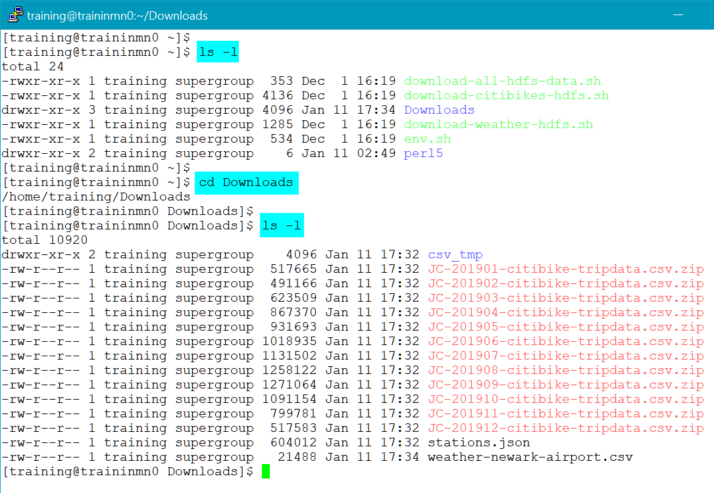

9. Use the **`head`** command to display the first two records from the **`stations.json`** file.

    ```
    $ <copy>head -2 stations.json </copy>
    ```

    

10. Use the **`head`** command to display the first 10 records from the **`weather-newark-airport.csv`** file.

    ```
    $ <copy>head weather-newark-airport.csv </copy>
    ```

    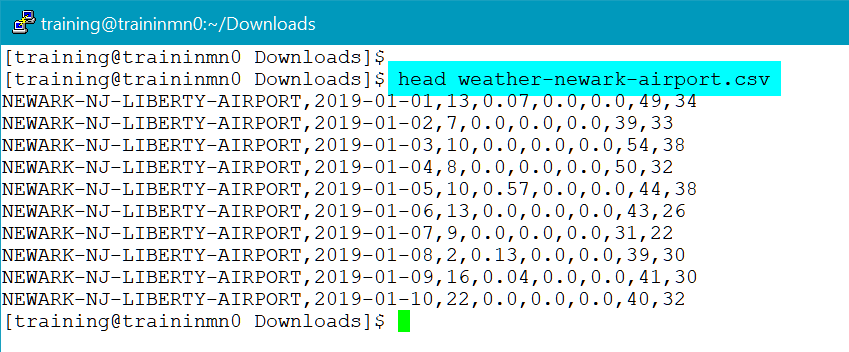

11. Use the following commands to display the HDFS directories that were created, and list their contents.

    ```
    $ <copy>hadoop fs -ls /data</copy>
    $ <copy>hadoop fs -ls /data/biketrips</copy>
    $ <copy>hadoop fs -ls /data/stations</copy>
    $ <copy>hadoop fs -ls /data/weather</copy>
    ```
    **Note:** Hit the **[Enter]** key on your keyboard to execute the last command above.

    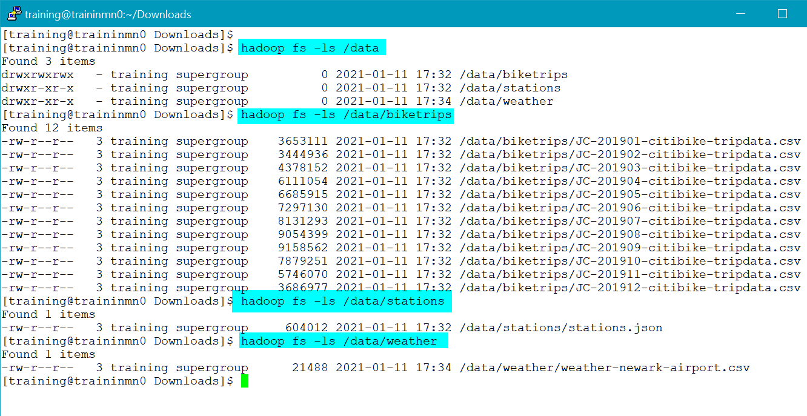

12. Use the following command to display the first 5 rows from the uploaded **`JC-201901-citibike-tripdata.csv`** file in the **`/data/biketrips`** HDFS folder. Remember, the header row for this uploaded `.csv` file was removed when you ran the **`download-citibikes-hdfs.sh`** script.

    ```
    $ <copy>hadoop fs -cat /data/biketrips/JC-201902-citibike-tripdata.csv | head -5</copy>
    ```

    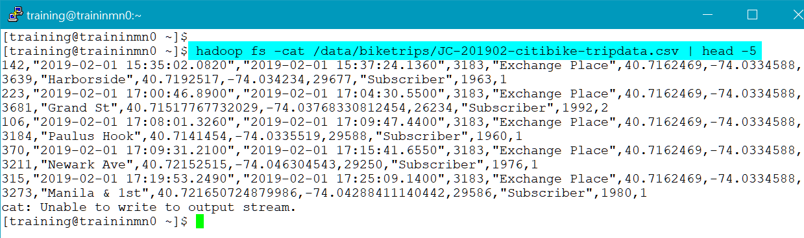


## Task 4: Query the Uploaded HDFS Data Using Hue

In this step, you log into Hue as the **`training`** administrator user and query the Hive tables that were created by the scripts that you ran in the previous step. Remember, in an BDS HA cluster, Hue runs on the **second utility node**. In a non-HA BDS cluster, Hue runs on the first utility node. You will use the reserved public IP address that is associated with **`traininun1`** that you created in **Lab 4, Access a BDS Node Using a Public IP Address**.

1. Open a Web browser window.

2. Enter the following URL:

    ```
    https://<ip-address>:8888
    ```
  **Note:**    
  In the preceding command, substitute **_``ip-address``_** with your own **_``ip-address``_** that is associated with the **second utility node** in your cluster, **`traininun1`**.

  In our example, we used the reserved public IP address that is associated with our **second utility node** as follows:

    ```
    https://150.136.16.64:8888
    ```

3. If this is the first time you are accessing Hue, the Hue Login screen is displayed. Enter your **`username`** (**`admin`** by default) and the **`password`** that you specified when you created the cluster such as **`Training123`**.

  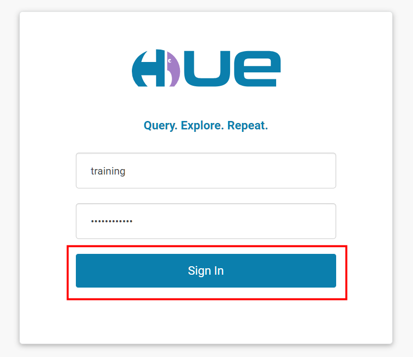

  The **Hue Editor** page is displayed. In addition to the **`default`** Hive database, note the **`bikes`** and **`weather`** Hive databases that were created when you ran the scripts in the previous step.

  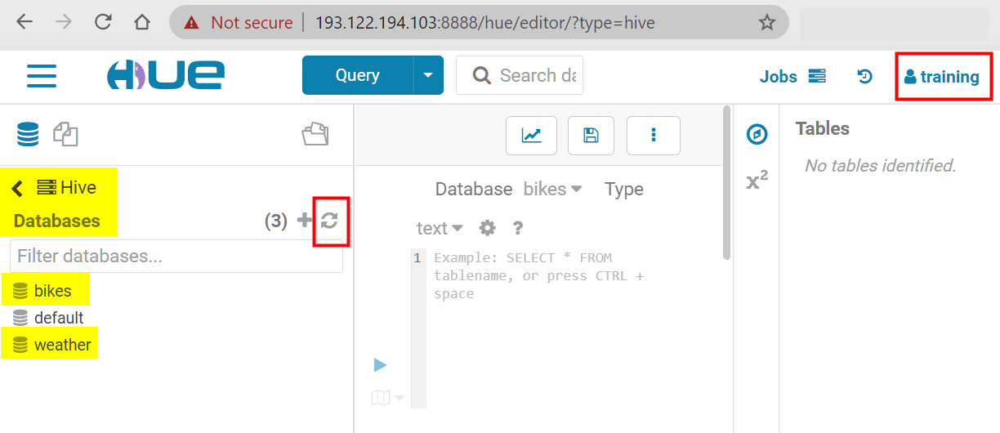

  **Note:** if the **`bikes`** and **`weather`** Hive databases are not displayed in the list of available databases, click **Refresh** .

4. Copy the following query that ranks the top 10 most popular start stations, paste it in the Query section in Hue, and then click **Execute** . You can also select the **`bikes`** database from the the **Database** drop-down list although that is not needed in the following query as we prefixed the table name with the database name, **`bikes.trips`**, in the `from` clause.

    ```
    <copy>select start_station_name, value,
       rank() over (order by value desc) as ranking
    from (
    select start_station_name, count(*) as value
    from bikes.trips
    group by start_station_name
  ) as t
limit 10;</copy>
    ```

    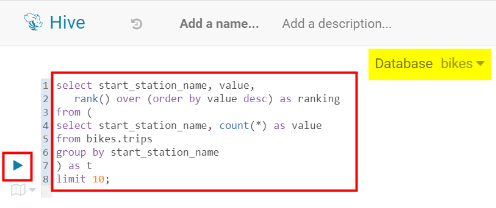

    It can take up to two minutes before the query result is displayed.

    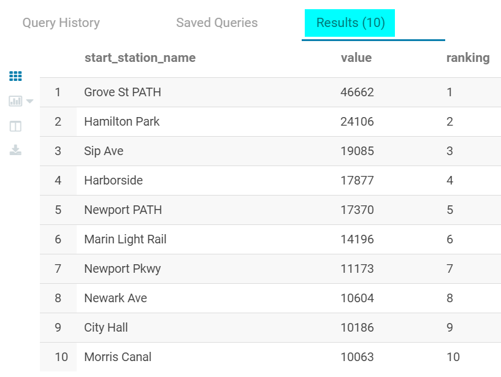

    **Note:** For documentation on using Hue, see [Introduction to Hue](https://docs.cloudera.com/documentation/enterprise/6/6.3/topics/hue.html). You can also select **Help** from the **User** drop-down menu for general help topics.

  


## Task 5: Download and Run Object Storage Scripts to Set Up the Object Storage Data

In this step, you will download two scripts that will set up your Object Storage environment and download the object storage dataset from [Citi Bikes NYC](https://www.citibikenyc.com/system-data). The scripts and a randomized weather data file are stored in a public bucket in Object Storage.

1. Log in to the **Oracle Cloud Console** as the Cloud Administrator that you used to create the resources in **Lab 1**, if you are not already logged in. On the **Sign In** page, select your `tenancy` if needed, enter your `username` and `password`, and then click **Sign In**. The **Oracle Cloud Console** Home page is displayed.

2. On the **Oracle Cloud Console** banner at the top of the page, click **Cloud Shell**
. It may take a few moments to connect and authenticate you.

    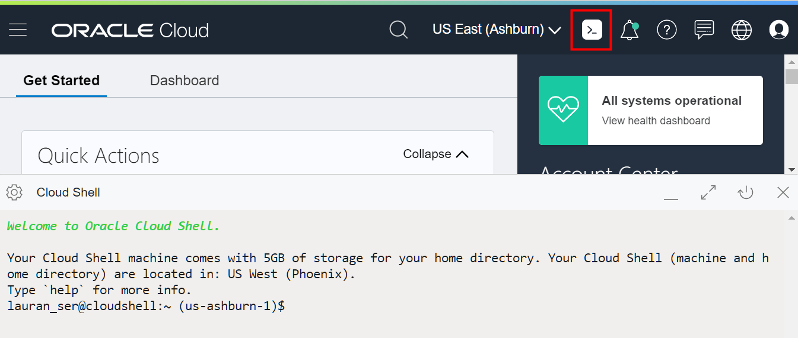


3. Click **Copy** to copy the following command. Right-click your mouse, select **Paste**, and then paste it on the command line.  You will use this script to set up your environment for the Object Store data. Press the **[Enter]** key to run the command.

    ```
    <b>$</b> <copy>wget https://objectstorage.us-phoenix-1.oraclecloud.com/n/oraclebigdatadb/b/workshop-data/o/bds-livelabs/env.sh
    </copy>
    ```

    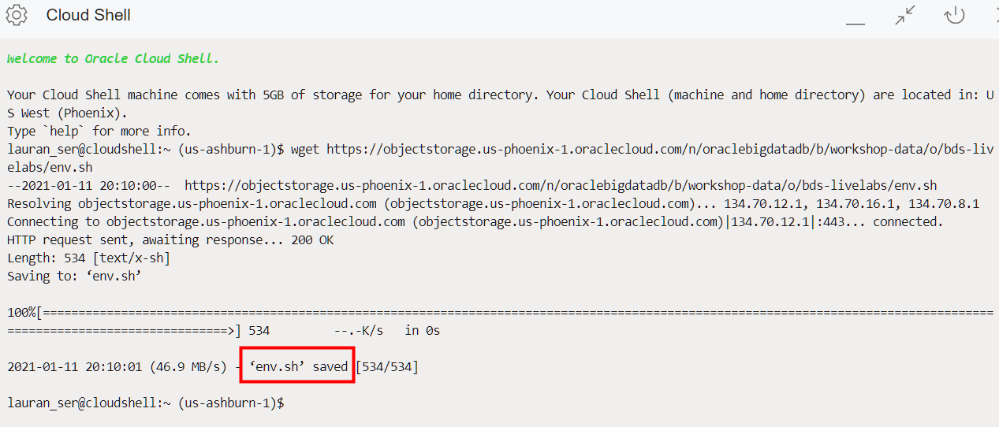

4. Edit the downloaded **`env.sh`** file using the **vi** Editor (or an editor of your choice) as follows:

    ```
    $ <copy>vi env.sh</copy>
    ```

    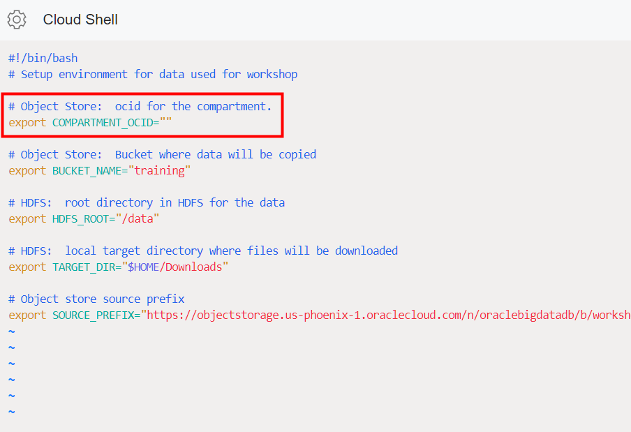

5. To input and edit text, press the **[i]** key on your keyboard (insert mode) at the current cursor position. The **INSERT** keyword is displayed at the bottom of the file to indicate that you can now make your edits to this file. Scroll-down to the line that you want to edit. Copy your **training-compartment** **OCID** value that you identified in **STEP 1**, and then paste it between the **`" "`** in the **`export COMPARTMENT_OCID=""`** command.

    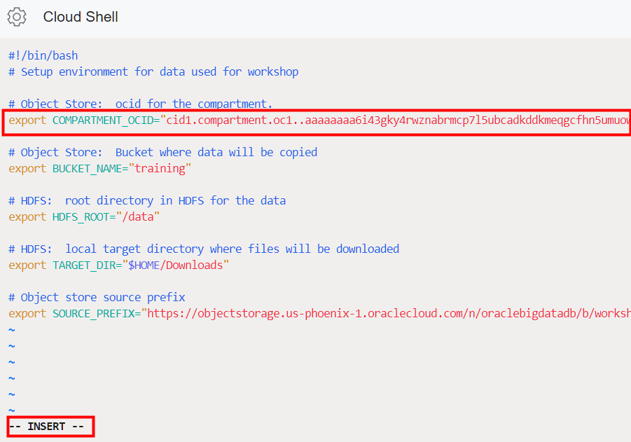


    **Note:** You will upload the Object Store data to the **`training`** bucket as specified in the `env.sh` file.

6. Press the **[Esc]** key on your keyboard, enter **`:wq`**, and then press the **[Enter]** key on your keyboard to save your changes and quit **vi**.    

    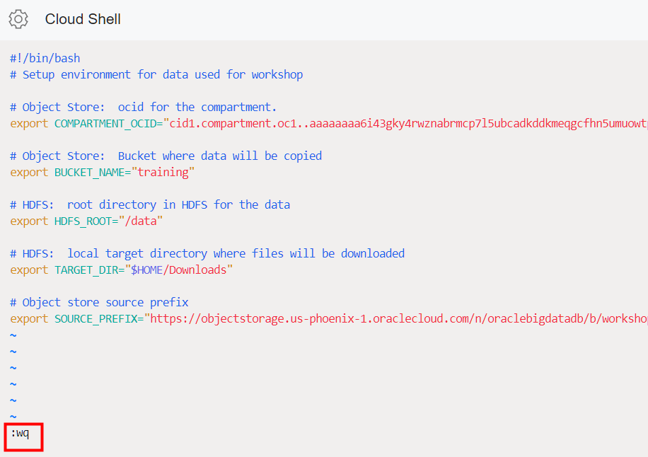

7. At the **$** command line prompt, click **Copy** to copy the command, right-click your mouse, select **Paste**, and then paste it on the command line. You will run this script to download the dataset to your local working directory. You will then upload this data to a new object in a new bucket. Press the **[Enter]** key to run the command.

    ```
    <b>$</b> <copy>wget https://objectstorage.us-phoenix-1.oraclecloud.com/n/oraclebigdatadb/b/workshop-data/o/bds-livelabs/download-all-objstore.sh
    </copy>
    ```
    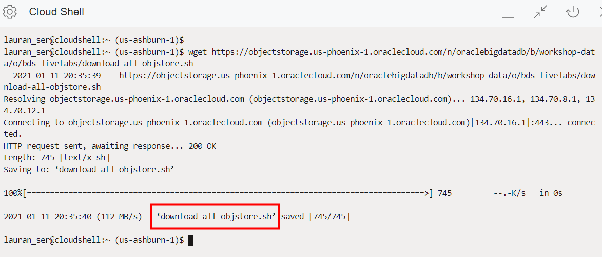


8. Add the **execute** privilege to the two downloaded `.sh` files as follows:

    ```
    $ <copy>chmod +x *.sh</copy>
    ```

    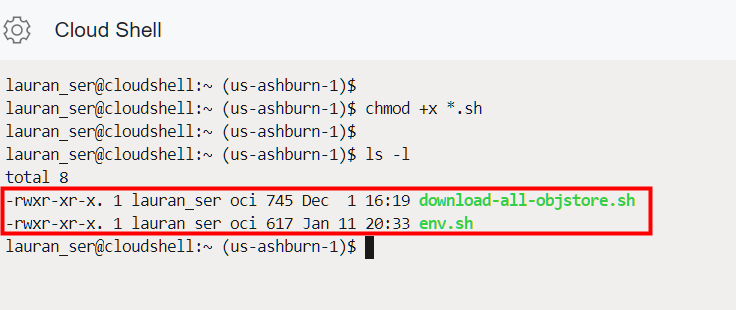

9. Use the **`cat`** command to display the content of this script. This script runs the `env.sh` script, downloads the **`download-citibikes-objstore.sh`** and **`download-weather-objstore.sh`** scripts, adds execute privilege to both of those scripts, and then runs the two scripts.

    ```
    $ <copy>cat download-all-objstore.sh</copy>
    ```

    

  You can use the **`cat`** command to display the content of this script. The **`download-all-objstore.sh`** script runs the **`env.sh`** script which sets the environment. The script writes some of the data from [Citi Bikes NYC](https://www.citibikenyc.com/system-data), and a randomized weather data that is stored in a public bucket in Object Storage to the your local Cloud Shell directory and to new objects in a new bucket named **`training`**, as specified in the **`env.sh`** script. The **`training`** bucket will contain the following new objects:

    + The **`weather`** object which stores the weather data.
    + The **`stations`** object which stores the stations data.
    + The **`biketrips`** object which stores the bike trips data.

10. Run the **`download-all-objstore.sh`** script as follows:

    ```
    $ <copy>./download-all-objstore.sh</copy>
    ```

11. Text messages will scroll on the screen. After a minute or so, the **Done** message along with the location of the data (both compartment and bucket) are displayed on the screen.

    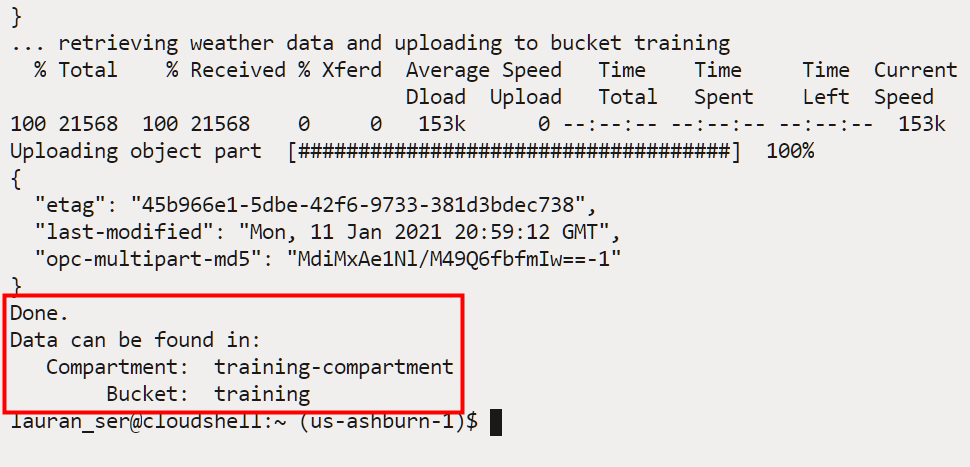

12. Navigate to the local **`Downloads`** directory to display the downloaded data files.

    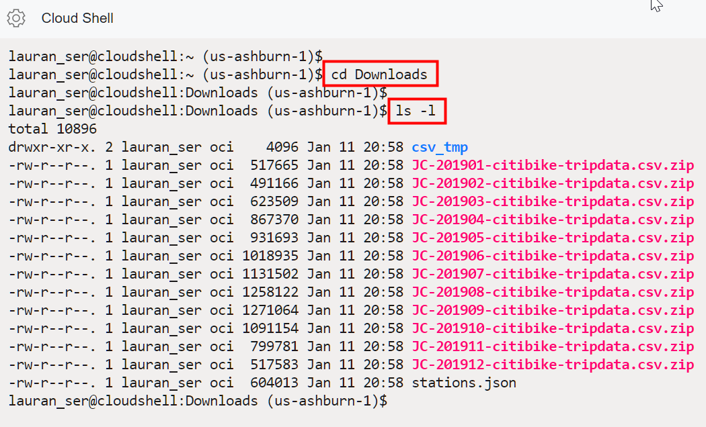

13. Click the **Navigation** menu and navigate to **Storage**. In the **Object Storage & Archive Storage** section, click **Buckets**. The **Buckets** page is displayed. In the **List Scope** on the left pane, make sure that your **training-compartment** is selected. In the list of available buckets, the newly created **training** bucket is displayed in the **Name** column. Click the **training** link.

    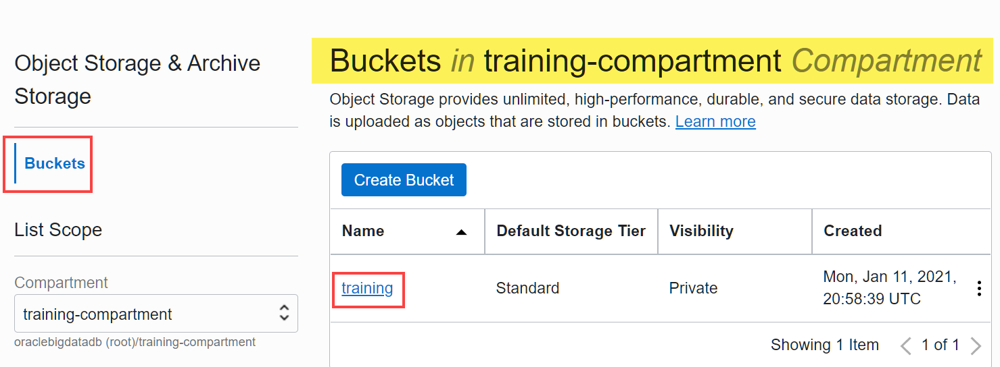

14. The **Buckets Details** page for the **training** bucket is displayed. Scroll-down to the **Objects** section to display the newly created **biketrips**, **stations**, and **weather** objects.

    

15. To display the data files in an object such as the **biketrips** object, click **Expand**  next to the object's name. The files contained in that object are displayed. To collapse the list of files, click **collapse**  next to the object's name.

    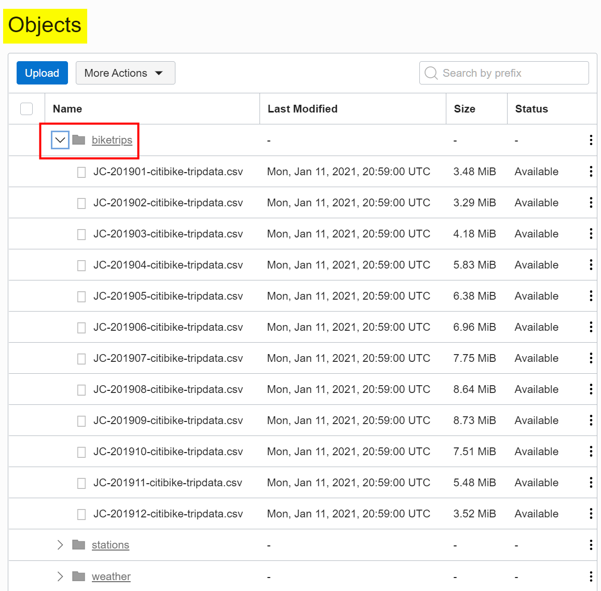

16. To display the first 1KB of the file's content (in read-only mode), click the **Actions** button on the row for the file, and then select **View Object Details** from the context menu.

    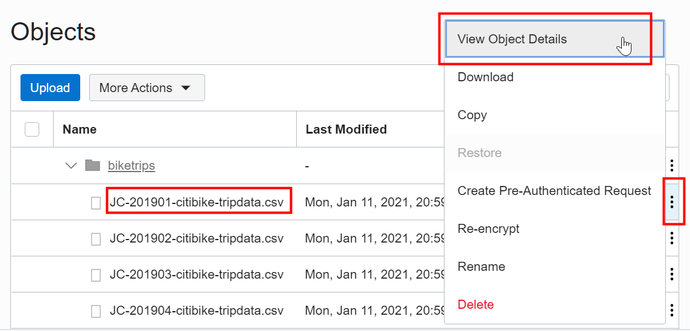

    The Object Details panel is displayed:

    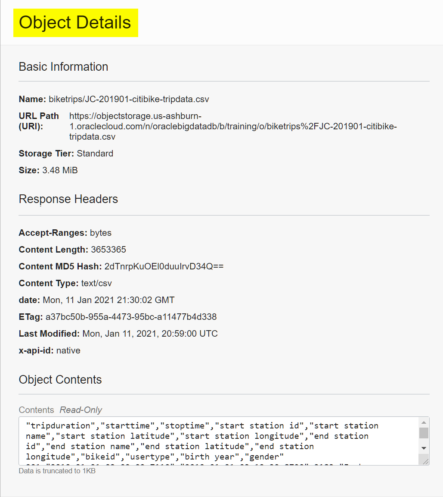

    **Note:** To view all the data in a file, select **Download** from the context menu, and then double-click the downloaded file to open it using its native application, MS-Excel (.csv) in this example.

**This concludes this lab and the workshop. You may optionally complete Lab 8: Clean up Resources Used in this Workshop.**


## Want to Learn More?

* [Overview of Object Storage](https://docs.cloud.oracle.com/en-us/iaas/Content/Object/Concepts/objectstorageoverview.htm#Overview_of_Object_Storage)
* [Using Oracle Big Data Service](https://docs.oracle.com/en/cloud/paas/big-data-service/user/index.html)
* [Oracle Cloud Infrastructure Documentation](https://docs.cloud.oracle.com/en-us/iaas/Content/GSG/Concepts/baremetalintro.htm)
* [Using Hue](https://docs.cloudera.com/documentation/enterprise/6/6.3/topics/hue_using.html)

## Acknowledgements

* **Author:**
    + Lauran Serhal, Principal User Assistance Developer, Oracle Database and Big Data User Assistance
* **Contributor:**
    + Martin Gubar, Director, Oracle Big Data Product Management
* **Last Updated By/Date:** Lauran Serhal, May 2021
