# Use Ambari and Hue to Access a BDS Cluster

## Introduction

To ensure security, when BDS deploys a cluster, the nodes in the cluster are not accessible on the public internet. By default, the IP addresses for the cluster nodes are private.

In the previous lab, you made the two utility nodes in your HA-cluster accessible from the internet by mapping the nodes' private IP addresses to public IP addresses; however, making the utility nodes publicly available isn't enough to make services that run on those nodes available from the internet.

All services are only available on certain ports. For example, in an HA-cluster such as **`training-cluster`**, Ambari runs on the first utility node, **`traininun0`**, and Hue runs on the second utility node, **`traininun1`**. Before you can access Ambari and Hue on the utility nodes using a Web browser, you must also open the ports that are associated with both services. You do this by defining an ingress rule on the public subnet to a security list for each service. Security lists act as virtual firewalls for your Compute instances and other kinds of resources with ingress and egress rules that specify the types of traffic allowed in and out of the cluster. Ingress security rules expose HTTP and HTTPS routes from outside the cluster to services within the cluster.

In this lab, you will learn how to access Ambari and Hue directly in a web browser.

Estimated Lab Time: 30 minutes

### Objectives

* Use Ambari and Hue to access a Big Data Service (BDS) cluster.
* Add ingress rules to the default security rule that enables you to access both Ambari and Hue.

### What Do You Need?

This lab assumes that you have successfully completed the following labs in the **Contents** menu:

+ **Lab 1: Setup the BDS Environment**
+ **Lab 2: Create a BDS Hadoop Cluster**
+ **Lab 3: Add Oracle Cloud SQL to the Cluster**
+ **Lab 4: Access a BDS Node Using a Public IP Address**

### Video Preview

Watch a video demonstration of using Ambari and Hue to access a Big Data Service cluster

[](youtube:dAGD1If39fw)

## Task 1: Create Ingress Security Rules (and Open Ports) for Ambari and Hue

In this step, you will add ingress security rules to the default security list in your cluster's VCN. This will allow access from anywhere on the internet to Ambari on port **`7183`** and Hue on port **`8888`**.

1. Log in to the **Oracle Cloud Console** as the Cloud Administrator, if you are not already logged in. On the **Sign In** page, select your `tenancy`, enter your `username` and `password`, and then click **Sign In**. The **Oracle Cloud Console** Home page is displayed.
2. Click the **Navigation** menu and navigate to **Networking > Virtual Cloud Networks**.

   
3. On the **Virtual Cloud Networks** page, click your cluster's Virtual Cloud Network, **`training-vcn`**, to display the **Virtual Cloud Network Details** page.

  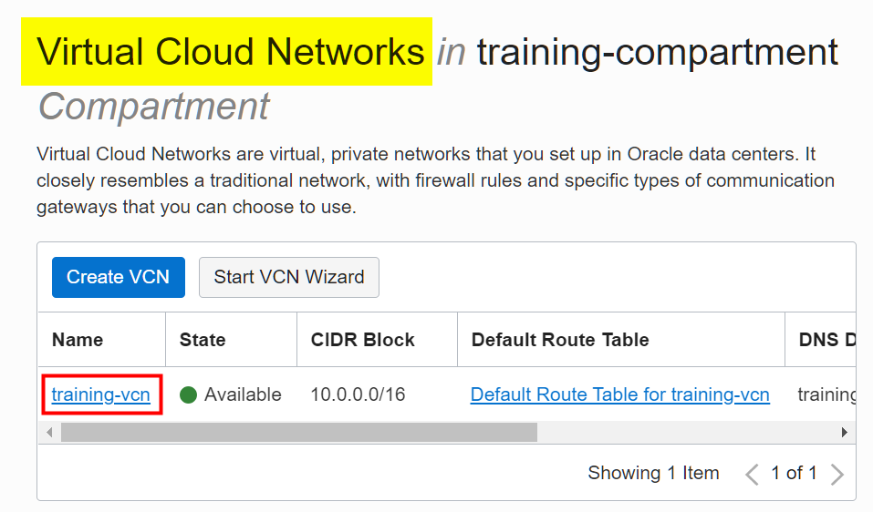

4. Next, you will update the default security list for the public subnet in your VCN. Remember, when you created the cluster, you needed to specify that your cluster belongs to a public subnet. On the **Virtual Cloud Network Details** page, scroll-down to the **Subnets** section. In the **Name** column, click the public subnet for the selected network, **`Public Subnet-training-vcn`**.

  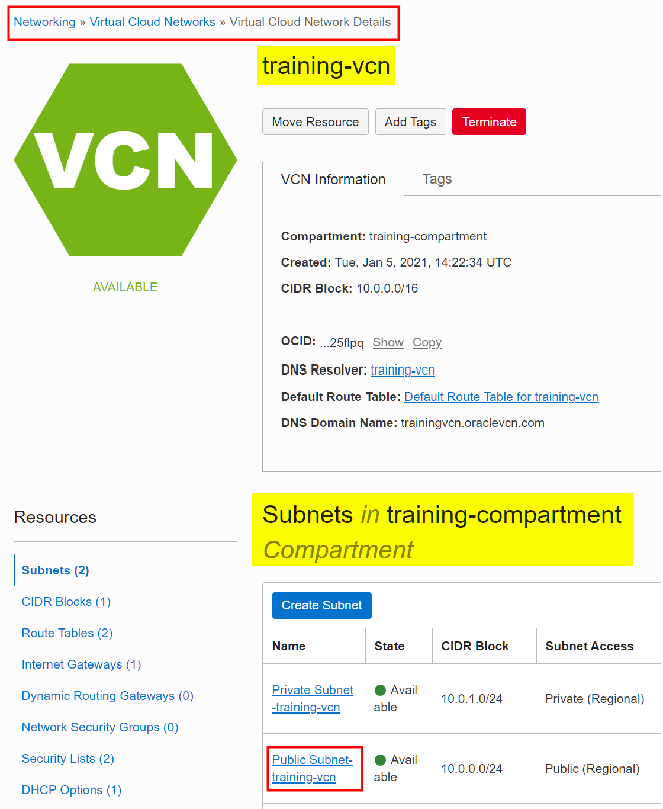

5. On the **Subnet Details** page, scroll-down to the **Security Lists** section. In the **Name** column, click your **Default Security List** link for your selected network, **`Default Security List for training-vcn`**.

  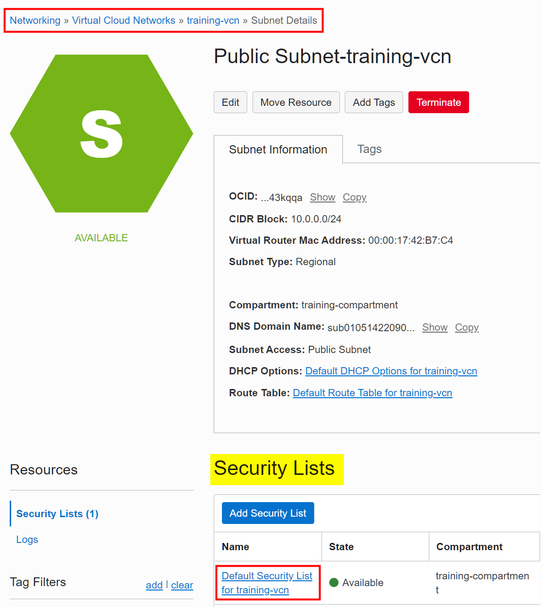

6. On the **Security List Details** page, scroll-down to the **Ingress Rules** section. This section shows the currently available security rules in the selected **Default Security List**. Next, click **Add Ingress Rules**.

  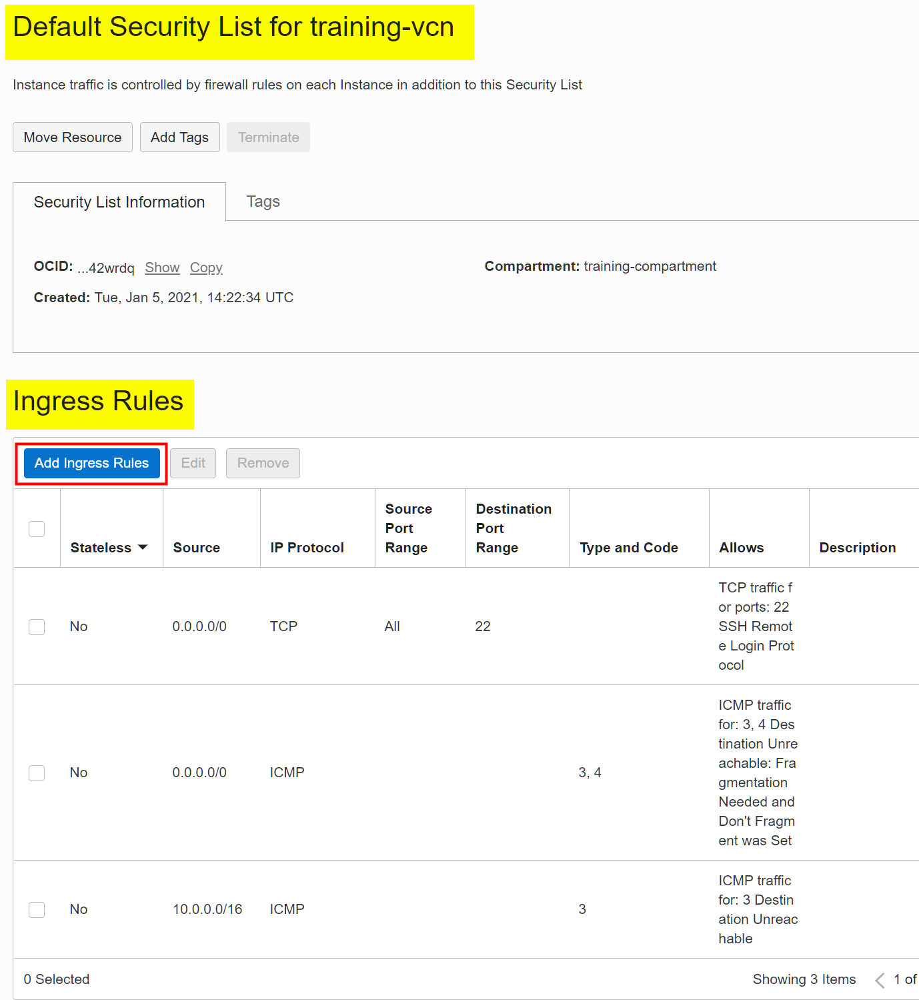

7. In the **Add Ingress Rules** dialog box, add the rule for the TCP protocol which enables you to use Ambari to access your cluster. You can add values to this dialog box to meet your security needs. In our example, we are opening up the port for Ambari to all sources by entering **`0.0.0.0/0`** for the **Source CIDR**. Anyone on the internet can access port **`7183`** for Ambari. No egress rule is required to allow the response traffic. Update the source to a more restrictive CDIR if required. Provide the following information:

   + For the **STATELESS** checkbox, leave it unchecked which makes the rule stateful. Any response to the incoming traffic is allowed back to the originating host, regardless of any egress rules applicable to the instance.
   + For the **SOURCE TYPE**, select **`CIDR`**.
   + For the **SOURCE CIDR**, enter **`0.0.0.0/0`**.
   + For the **IP PROTOCOL**, select **`TCP`**.
   + For the **SOURCE PORT RANGE**, enter **`All`**.
   + For the **DESTINATION PORT RANGE**, enter **`7183`**.
   + For the **DESCRIPTION**, enter **`Access Ambari on Port 7183`**.

  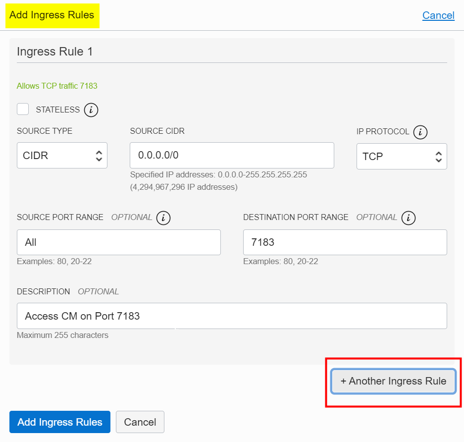

8. Click **+Additional Ingress Rule** to add an ingress security rule for Hue.
9. At the bottom of the **Add Ingress Rules** dialog box, the **Ingress Rule 2** section is displayed. Provide the following information:

   + For the **STATELESS** checkbox, leave it unchecked which makes the rule stateful.
   + For the **SOURCE TYPE**, select **`CIDR`**.
   + For the **SOURCE CIDR**, enter **`0.0.0.0/0`**.
   + For the **IP PROTOCOL**, select **`TCP`**.
   + For the **SOURCE PORT RANGE**, enter **`All`**.
   + For the **DESTINATION PORT RANGE**, enter **`8888`**.
   + For the **DESCRIPTION**, enter **`For Hue Access on Port 8888`**.
10. Click **Add Ingress Rules**.

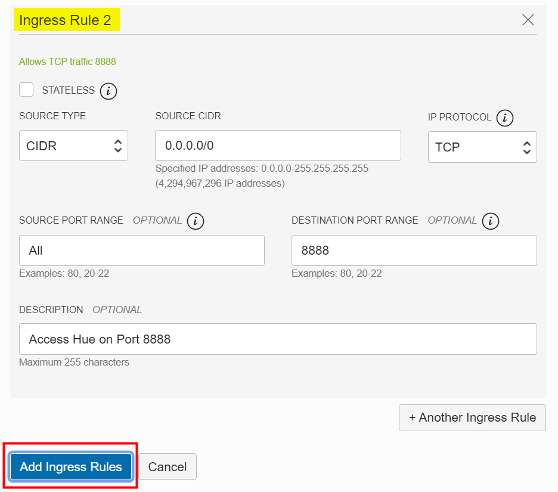

11.Click **+Additional Ingress Rule** to add an ingress security rule for Ranger.

* At the bottom of the **Add Ingress Rules** dialog box, the **Ingress Rule 3** section is displayed. Provide the following information:
  + For the **STATELESS** checkbox, leave it unchecked which makes the rule stateful.
  + For the **SOURCE TYPE**, select **`CIDR`**.
  + For the **SOURCE CIDR**, enter **`0.0.0.0/0`**.
  + For the **IP PROTOCOL**, select **`TCP`**.
  + For the **SOURCE PORT RANGE**, enter **`All`**.
  + For the **DESTINATION PORT RANGE**, enter **`8888`**.
  + For the **DESCRIPTION**, enter **`For Ranger Access on Port 6182`**.
* Click **Add Ingress Rules**.


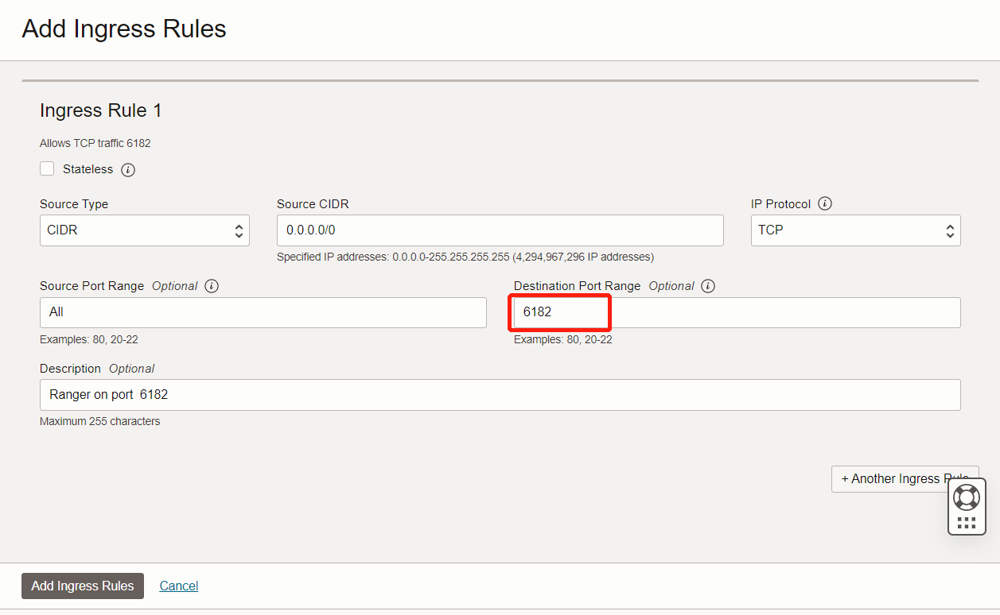

The three ingress rules are added to the **Default Security List**.

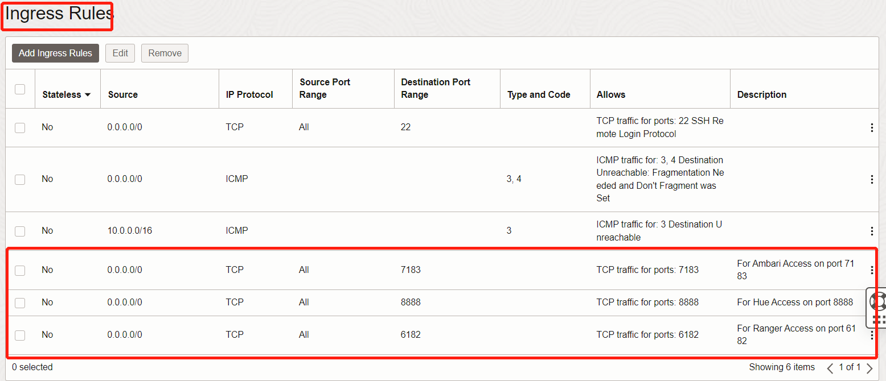


## Task 2: Use Ambari to Access the Cluster

In this step, you will use Ambari to access the cluster. In an HA-cluster, Ambari runs on the first utility node, **`traininun0`**. You will use the reserved public IP address that is associated with **`traininun0`** that you created in step 2 of **Lab 4, Access a BDS Node Using a Public IP Address**.

1. Open a Web browser window.
2. Enter the following URL:

   ```
   https://<ip-address>:7183
   ```

   **Note:**In the preceding command, substitute **_``ip-address``_** with your own **_``ip-address``_** that is associated with the first utility node in your cluster, **`traininun0`**, which you created in the previous lab. To view your reserved public IP address in the console, click the **Navigation** menu and navigate to **Networking**. In the **IP Management** section, click **Reserved IPs**. The new reserved public IP address is displayed in the **Reserved Public IP Addresses** list.

   In our example, we used the reserved public IP address that is associated with our **first utility node** as follows:

   ```
   https://193.122.201.162:7183
   ```
3. On the Ambari Login screen, enter your **`username`** which is **`admin`** by default in Ambari. For the password, enter the **`password`** that you specified when you created the cluster such as **`Training#123`**.


  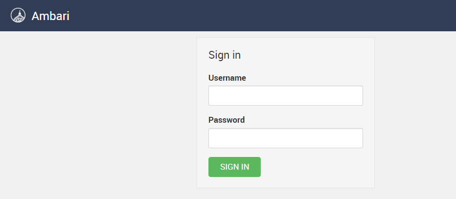

4. In the Ambari Home page, note the name of the cluster, and the services running on the cluster.

  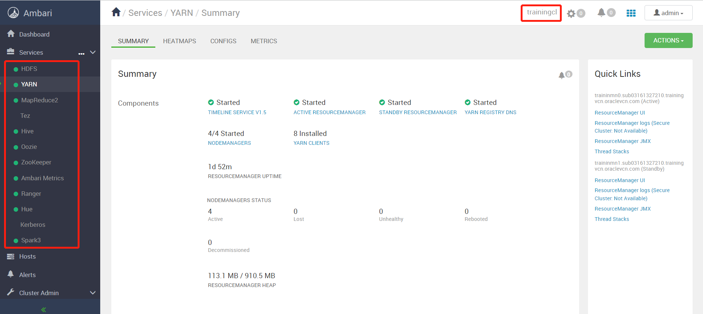

5. From the **Hosts** drop-down menu.

  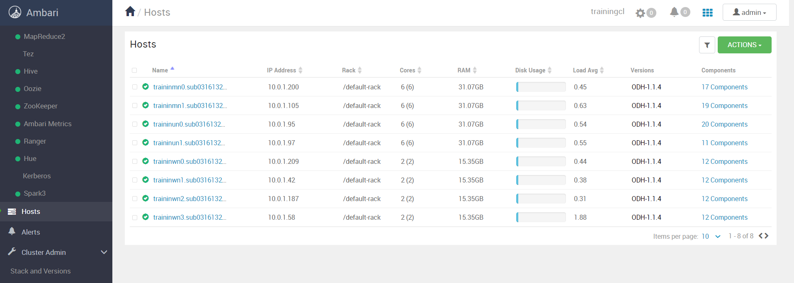


The hosts of the cluster are displayed. Hosts are configured with one or more role instances, each of which corresponds to a service. The role indicates which daemon, also known as service, runs on the host. Typically, a host will run multiple roles in support of the various services running in the cluster.

6. Drill-down on the roles associated with the first Master node in the cluster, **`traininmn0`**.


   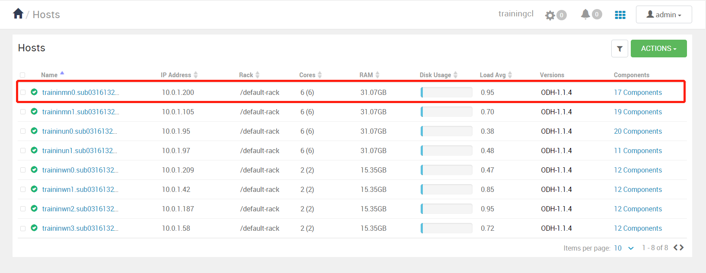

   The services and roles that are running on the first Master node are displayed such as the `HDFS NameNode`, `Spark History Server`, `YARN's Job History Server`, and `Yarn's ResourceManager` among other services and gateways. A gateway is a type of role that typically provides client access to specific cluster services. For example, Hive and Spark each have gateway roles to provide access for their clients to their respective services.

   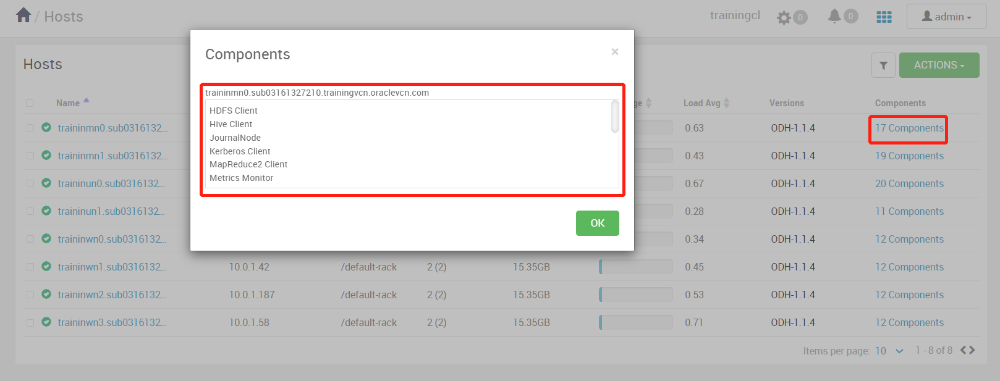
7. Click the `traininmn0`, it will display all of the running services in this node.

   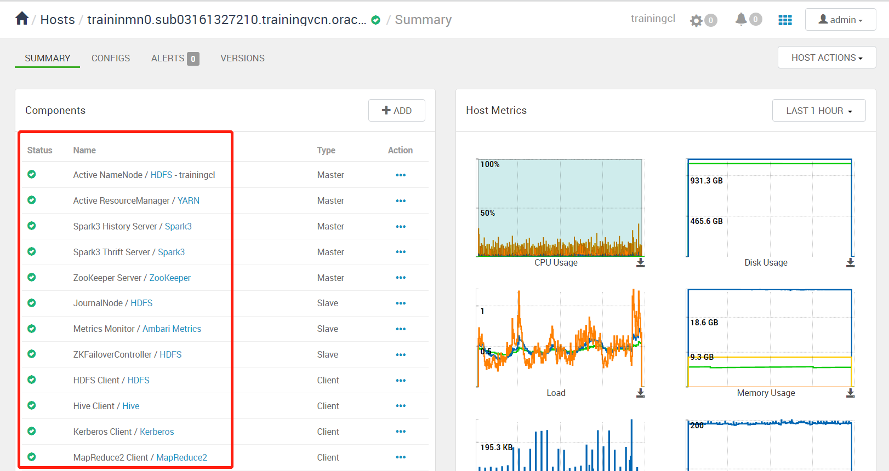
8. Exit Ambari. From the **User** drop-down menu, select **Sign out**.

   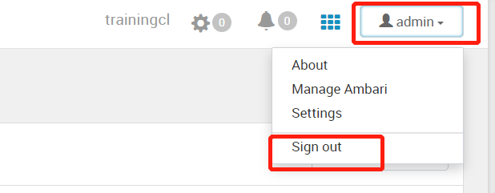

## Task 3: Use Hue to Access the Cluster

In this step, you will use Hue to access the cluster. In an HA cluster, Hue runs on the **second utility node**. You will use the reserved public IP address that is associated with **`traininun1`** that you created in **Lab 4, Access a BDS Node Using a Public IP Address**.

1. Open a web browser window.
2. Enter the following URL:

   ```
   https://<ip-address>:8888
   ```

   **Note:**In the preceding command, substitute **_``ip-address``_** with your own **_``ip-address``_** that is associated with the **second utility node** in your cluster, **`traininun1`**, which you created in the previous lab.

   In our example, we used the reserved public IP address that is associated with our second utility node as follows:

   ```
   https://150.136.16.64:8888
   ```
3. On the Hue Login screen, enter your **`username`** which is **`admin`** by default in Hue. For the password, enter the **`password`** that you specified when you created the cluster such as **`Training#123`**.

   **Note:** If Hue accounts haven’t been created yet, you can create other user and administrator accounts.

   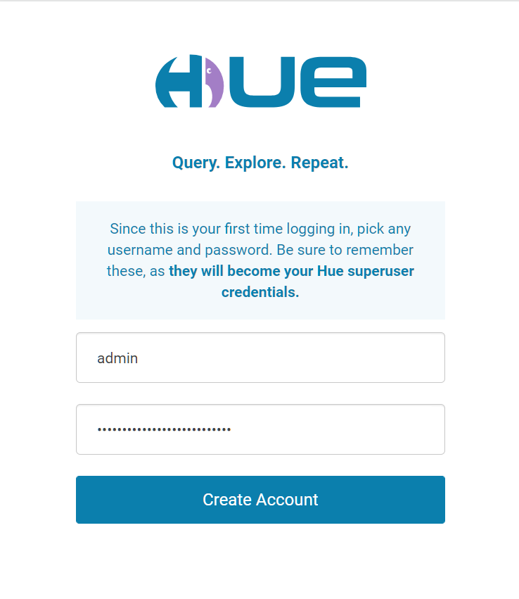

   The **Hue Editor** page is displayed.

  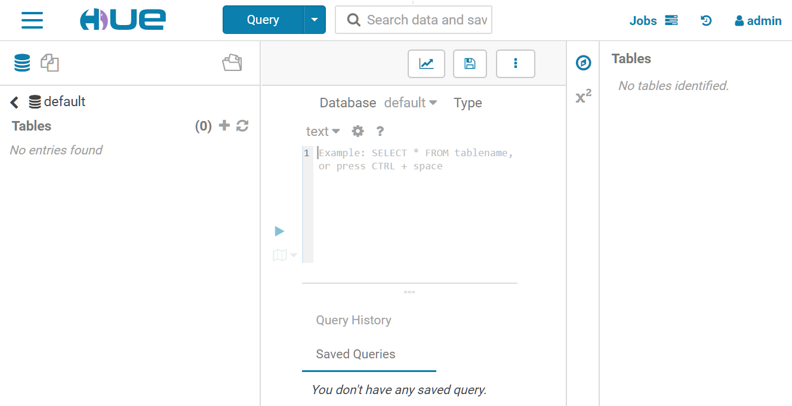

4. For documentation on using Hue, see [Introduction to Hue](https://docs.cloudera.com/documentation/enterprise/6/6.3/topics/hue.html). You can also select **Help** from the **admin** drop-down menu for general help topics.
5. Exit Hue. From the **admin** drop-down menu, select **Sign out**.

  

You may now [proceed to the next lab](#next).

## Want to Learn More?

* [Oracle Big Data Service](https://docs.oracle.com/en/cloud/paas/big-data-service/)
* [Oracle Cloud Infrastructure Documentation](https://docs.cloud.oracle.com/en-us/iaas/Content/GSG/Concepts/baremetalintro.htm)
* [Security Lists](https://docs.cloud.oracle.com/en-us/iaas/Content/Network/Concepts/securitylists.htm)
* [Security Rules](https://docs.cloud.oracle.com/en-us/iaas/Content/Network/Concepts/securityrules.htm)
* [Configure Security Rules for the Network](https://docs.oracle.com/en/cloud/paas/big-data-service/user/configure-security-rules-network.html)
* [VCN and Subnets](https://docs.cloud.oracle.com/iaas/Content/Network/Tasks/managingVCNs.htm)
* [Ambari](https://ambari.apache.org/)
* [Using Hue](https://docs.cloudera.com/documentation/enterprise/6/6.3/topics/hue_using.html)

## Acknowledgements

* **Author:**

  + Anand Chandak, Principal Product Manager, Big Data Services
  + Justin Zou, Principal Data Engineer,Japan & APAC Hub
* **Last Updated By/Date:** Justin Zou, March 2023
