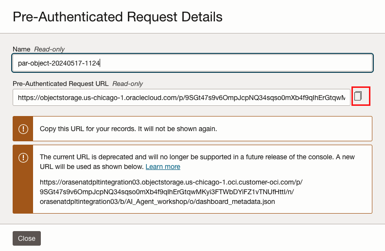

# Provision OCI OpenSearch Cluster

## About this Workshop

OCI Generative AI Agents is a fully managed service that combines the power of large language models (LLMs) with an intelligent retrieval system to create contextually relevant answers by searching your knowledge base,
making your AI applications smart and efficient.

OCI Generative AI Agents supports several ways to onboard your data, one of the option is to bring your own (BYO) ingested and indexed OCI Search with OpenSearch data for the agents to use.
In this workshop, we'll create an OCI OpenSearch Cluster to be used as knowledge base to store business dashboards' metadata.

In this lab, you'll use following services:

- **OCI Search with OpenSearch** is a managed service that you can use to build in-application search solutions based on OpenSearch to enable you to search large datasets and return results in milliseconds, without having to focus on managing your infrastructure.
- **OCI Object Storage** is an internet-scale, high-performance storage platform that offers reliable and cost-efficient data durability. You can create a bucket and store an object in the bucket, safely and securely retrieve data, and easily manage storage at scale. 
- **OCI Vault** is an encryption management service that stores and manages encryption keys and secrets to securely access resources.
- **Resource Manager** automates deployment and operations for Oracle Cloud Infrastructure resources.

Estimated Workshop Time: 50 minutes

### Objectives

In this workshop, you will learn how to:
* Create OCI Object Storage Bucket, upload data to bucket and create Pre-Authenticated Request
* Create OCI OpenSearch Cluster using Resource Manager Terraform stack
* Create OCI Vault Secret

### Prerequisites

* Oracle cloud tenancy that is subscribed to Chicago region, and configured to work with OCI Object Storage service
* Familiar with Oracle Cloud Infrastructure is advantage, but not required
* Download the data file by clicking the url: [dashboar_metadat.json](https://objectstorage.us-chicago-1.oraclecloud.com/p/zaJxpillGZNeRFdZjaZoCn_TPlkjIypkQw6LEFspMa2ItWxD_mZ9HpQVBgBcUQRZ/n/orasenatdpltintegration03/b/AI_Agent_workshop/o/dashboard_metadata.json)

### About the data
*explain json data here*
[dashboar_metadat.json](https://objectstorage.us-chicago-1.oraclecloud.com/p/zaJxpillGZNeRFdZjaZoCn_TPlkjIypkQw6LEFspMa2ItWxD_mZ9HpQVBgBcUQRZ/n/orasenatdpltintegration03/b/AI_Agent_workshop/o/dashboard_metadata.json)

## Task 1: Create Object Storage Bucket to Upload Data
1. Log into the OCI Cloud Console, switch to Chicago region. Click Menu bar  -> Storage -> Buckets

2. Select the compartment you have created. 

3. Click Create Bucket, enter Bucket Name, then click Create

4. Open the Bucket just created, click Upload. Drag and drop the xxx.json you just downloaded, upload

## Task 2: Create Pre-Authenticated Request
1. Now you have uploaded the json file, click the 3 dots on the right of console, click Create Pre-Authenticated Request

2. Select Object, Permit object reads. Choose an expiration date, then click Create Pre-Authenticated Request

3. In the pop-up window, copy the PAR-URL and paste into your notepad. Make sure you take the copy of url, it will show up once.

## Learn More

* [Getting Started with OCI Object Storage](https://apexapps.oracle.com/pls/apex/r/dbpm/livelabs/view-workshop?wid=655&clear=RR,180&session=35038433542341)

## Acknowledgements
* **Author** - Jiayuan Yang, Cloud Engineer 
* **Contributors** -  Pavan Kumar Manuguri, Senior Cloud Engineer
* **Last Updated By/Date** - Jiayuan Yang, June 2024
