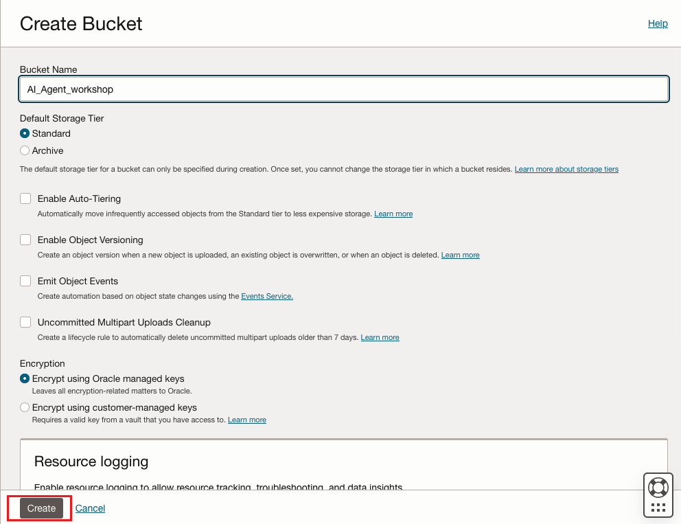
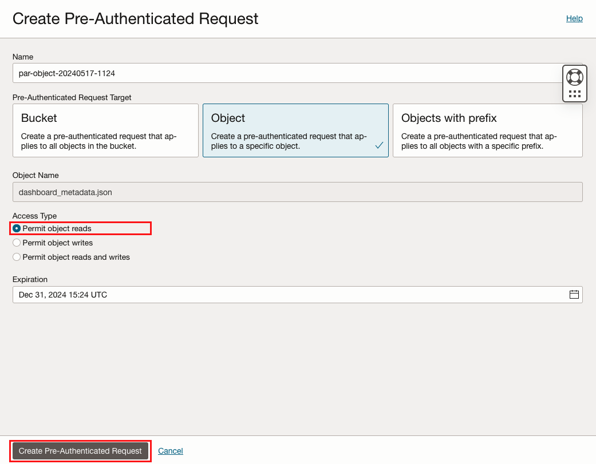
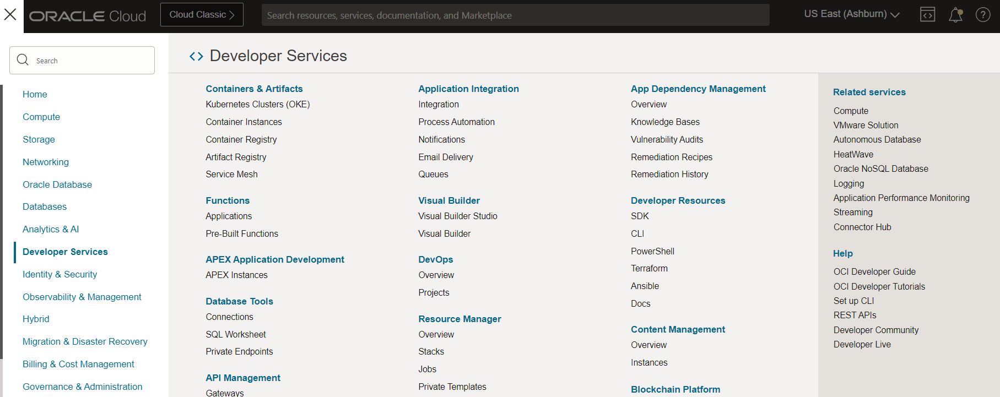
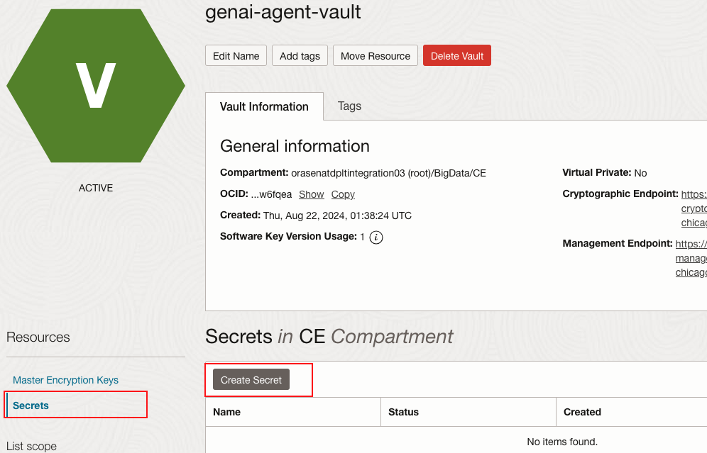

# Provision OCI OpenSearch Cluster

## About this Workshop


OCI Generative AI Agents is a fully managed service that combines the power of large language models (LLMs) with an intelligent retrieval system to create contextually relevant answers by searching your knowledge base,
making your AI applications smart and efficient.

OCI Generative AI Agents supports several ways to onboard your data, one of the option is to bring your own (BYO) ingested and indexed OCI Search with OpenSearch data for the agents to use.
In this workshop, we'll create an OCI OpenSearch Cluster to be used as knowledge base to store business dashboards' metadata.

In this lab, you'll use following services:

- **OCI Search with OpenSearch** is a managed service that you can use to build in-application search solutions based on OpenSearch to enable you to search large datasets and return results in milliseconds, without having to focus on managing your infrastructure.
- **OCI Object Storage** is an internet-scale, high-performance storage platform that offers reliable and cost-efficient data durability. You can create a bucket and store an object in the bucket, safely and securely retrieve data, and easily manage storage at scale. 
- **OCI Vault** is an encryption management service that stores and manages encryption keys and secrets to securely access resources.
- **Resource Manager** automates deployment and operations for Oracle Cloud Infrastructure resources.

Estimated Workshop Time: 50 minutes


### Objectives

In this workshop, you will learn how to:
* Create OCI Object Storage Bucket, upload data to bucket and create Pre-Authenticated Request
* Create OCI OpenSearch Cluster using Resource Manager Terraform stack
* Create OCI Vault Secret

### Prerequisites

* Oracle cloud tenancy that is subscribed to Chicago region, and configured to work with OCI Object Storage service
* Familiar with Oracle Cloud Infrastructure is advantage, but not required
* Your cloud tenancy should have below Identity and Access Management (IAM) resources set up in the root compartment:
    - Dynamic Group with below matching rule:
    ```
      ALL {resource.type='genaiagent'}
    ``` 
    - Policies:
    ```
      allow group <your-group-name> to manage genai-agent-family in tenancy
      allow group <your-group-name> to manage object-family in tenancy
      allow dynamic-group <dynamic-group-name> to read secret-bundle in tenancy
    ```

### Download the data
* Before you start, download the data:
    - [genaiagent_stack](https://objectstorage.us-chicago-1.oraclecloud.com/p/7-Tbg6kk0p11-HNj3p4kbJHS9X9SasoGb4c7mOXaUM5Ge8s0jyndHD2Oaj-0_Jyb/n/orasenatdpltintegration03/b/AI_Agent_workshop/o/genaiagent-solution-accelerator-quickstart_v2.zip)
    - [dashboard_metadata.json](https://objectstorage.us-chicago-1.oraclecloud.com/p/zaJxpillGZNeRFdZjaZoCn_TPlkjIypkQw6LEFspMa2ItWxD_mZ9HpQVBgBcUQRZ/n/orasenatdpltintegration03/b/AI_Agent_workshop/o/dashboard_metadata.json)


## Task 1: Upload Data to Object Storage and Create Pre-Authenticated Request URL
1. Log into the OCI Cloud Console, switch to Chicago region. Click Menu bar  -> Storage -> Buckets

2. Select the compartment where you want the bucket to be created. 

3. Click Create Bucket, enter Bucket Name, then click Create

4. Open the Bucket just created, click Upload. Drag and drop the dashboard_metadata.json you just downloaded, upload


5. Now you have uploaded the json file, click the 3 dots on the right of console, click Create Pre-Authenticated Request

6. Select Object, Permit object reads. Choose an expiration date, then click Create Pre-Authenticated Request

7. In the pop-up window, copy the PAR-URL and paste into your notepad. Make sure to copy of url before close the window, it will show up only once.


## Task 2: Provision OpenSearch Cluster

1. Go to OCI Cloud Console Menu -> Developer Services -> Resource Manager -> Stack



2. Create a Stack


3. If you haven't done so, download the [OCI Resource Manager Terraform stack](https://objectstorage.us-chicago-1.oraclecloud.com/p/7-Tbg6kk0p11-HNj3p4kbJHS9X9SasoGb4c7mOXaUM5Ge8s0jyndHD2Oaj-0_Jyb/n/orasenatdpltintegration03/b/AI_Agent_workshop/o/genaiagent-solution-accelerator-quickstart_v2.zip) that creates an OCI Search with OpenSearch cluster with a public management instance.
   
4. In Stack Configuration, Select zip file, Browse and upload the file downloaded from above link.


5. From Zip file, all variables in Stack are reflected automatically. We have to Select Terraform version 1.2.x. to get started. 
   
6. First we need to get the OpenID URL.

   a. If you're using OCI Identity Domain for authentication, in the Console, navigate to the domain section and copy the domain URL. For example, https://idcs-xxx.identity.oraclecloud.com:443

      

   b. If you're using a federation-based tenancy, in the Console, navigate to Federation and under Identity, select your identity provider. Get the OpenID URL by copying the IDCS URL. For example, https://idcs-xxxx.identity.oraclecloud.com
   


7. Get the PAR URL we copied earlier from Object Storage. 

8. Review all Configuration variables. 


9. By default, both master username and password are generated from Zip file. Save them for future use in a notepad. 
    


10. Review the Redis parameters (optional). No changes.
    


11. Review the Compute Instance variables. 


12. Click Next to Review all variable again and Submit. The above steps will provision all the resources required for Open Search Clusters, Redis Cluster and a Compute Instance for Management.

13. Note: It takes around 45-50mins to complete and create all the resources listed in the stack configuration. 

## Task 3: Create Vault Secret
1. Navigate to OCI Vault by clicking Menu bar -> Identity & Security -> Vault.

2. Click Create Vault, provide name to create.


3. In the Vault, click Create Key. Pick software protection mode, AES Algorithm, 256 bits. Click Create Key.

4. In the Vault, click Secrets, then create Secret. Provide name, select the encryption key created from last step. Choose Plain-Text type, then provide following text as secret contents:
```
   osmaster:Osmaster@123
```

  


## Learn More
* [OpenSearch Guidelines for Generative AI Agents](https://docs.public.oneportal.content.oci.oraclecloud.com/en-us/iaas/Content/generative-ai-agents/opensearch-guidelines.htm)
* [Getting Started with OCI Object Storage](https://apexapps.oracle.com/pls/apex/r/dbpm/livelabs/view-workshop?wid=655&clear=RR,180&session=35038433542341)
* [Creating Dynamic Group](https://docs.public.oneportal.content.oci.oraclecloud.com/en-us/iaas/Content/Identity/dynamicgroups/To_create_a_dynamic_group.htm)

## Acknowledgements
* **Author** 
  - Jiayuan Yang, Principal Cloud Architect 
  - Pavan Kumar Manuguri, Principal Cloud Architect
* **Last Updated By/Date** - Pavan Kumar Manuguri, August 2024
