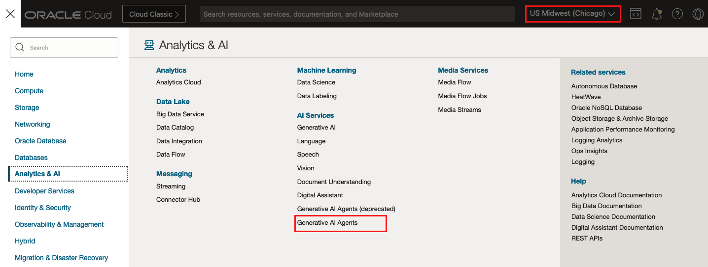
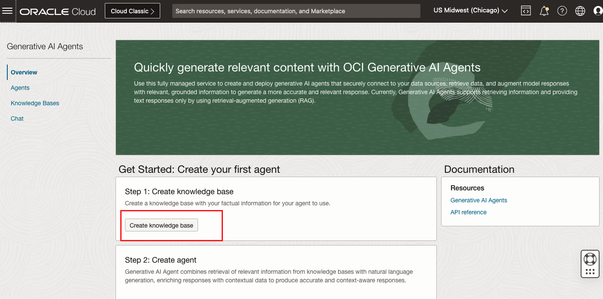
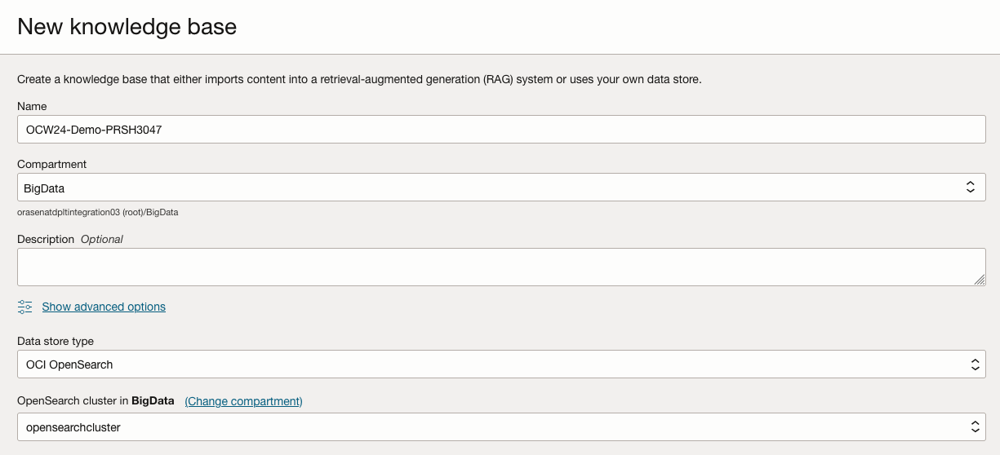
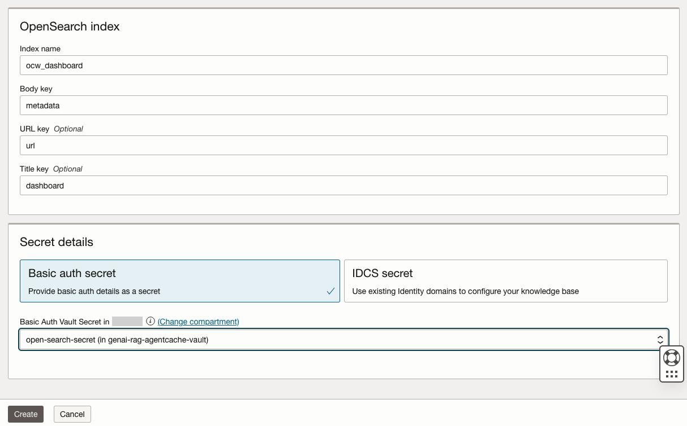

# Provision Knowledge Base

## About this Workshop

In this lab you will learn how to provision AI Agent Knowledge Base with OCI Open Search Cluster.

An agent connects to a knowledge base, which is a vector-based storage that enables the integration or ingestion of data from a data source. Data sources provide connection information to the data stores that an agent uses to generate responses.
Generative AI Agent can connect with supported data sources using Oracle Vector 23ai, OCI Open Search Cluster, and Object Storage.

Estimated Workshop Time: 15 minutes

### Objectives

In this workshop, you will learn how to:
* Provision Knowledge Base
* Configur Knowledge Base with OCI Open Search

### Prerequisites

* Oracle cloud tenancy that is subscribed to Chicago region, and configured to work with Generative AI Agents
* familiar with Oracle Cloud Infrastructure is advantage, but not required

## Task 1: Provision Knowledge Base
1. Log into the OCI Cloud Console, switch to Chicago region. Click Menu bar -> Analytics & AI -> Generative AI Agents

2. Click Create knowledge base.

3. Fill a knowledge base name and select the compartment where you want the resource to be created. Choose OCI OpenSearch as the Data store type, then select the OpenSearch cluster created in Lab 1.

   In OpenSearch index panel, provide following input:
    - Index name: ocw_dashboard
    - Body key: metadata
    - URL key: url
    - Title key: dashboard 

  Choose Basic auth secret, select the Vault Secret you've created from previous lab. Click Create.

Once the provision is completed, the Knowledge base will become Active and you can review it from console.

## Learn More

* [Managing Knowledge Bases in Generative AI Agents](https://docs.public.oneportal.content.oci.oraclecloud.com/en-us/iaas/Content/generative-ai-agents/knowledge-bases.htm)

## Acknowledgements
* **Author** - Jiayuan Yang, Principal Cloud Architect 
* **Contributors** -  Pavan Kumar Manuguri, Principal Cloud Architect
* **Last Updated By/Date** - Jiayuan Yang, August 2024
