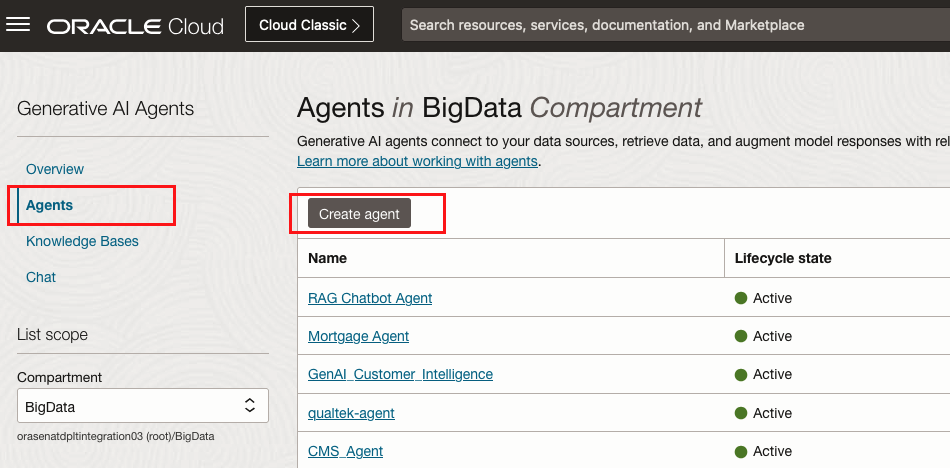

# Provision Agent

## About this Workshop

In this lab you will learn how to provision Generative AI Agent.

Agent is an LLM-based autonomous system that understands and generates human-like text, enabling natural-language processing interactions. 
The Generative AI Agents supports retrieval-augmented generation (RAG) agents. 
A RAG agent connects to a data source, retrieves data, and augments model responses with the information from the data sources to generate more relevant responses. 

Estimated Workshop Time: 10 minutes

### Objectives

In this workshop, you will learn how to:
* Create Generative AI Agent

### Prerequisites

* Oracle cloud tenancy that is subscribed to Chicago region, and configured to work with Generative AI Agents
* familiar with Oracle Cloud Infrastructure is advantage, but not required

## Task 1: Provision Agent
1. From Generative AI Agents console, click Agents, then Create agent.

2. Provide name and compartment. Choose the knowledge base which is created in Lab 2. Select Automatically create an endpoint for this agent. Then click Create.

   Agent will take few minutes to turn to active.

## Task 2: Review Agent
1. Once the Agent is active, you can select the Agent from console to review the knowledge base and the endpoint associated.

## Learn More

* [Managing Agents in Generative AI Agents](https://docs.public.oneportal.content.oci.oraclecloud.com/en-us/iaas/Content/generative-ai-agents/ai-agents.htm)

## Acknowledgements
* **Author** - Jiayuan Yang, Principal Cloud Engineer 
* **Contributors** -  Pavan Kumar Manuguri, Principal Cloud Engineer
* **Last Updated By/Date** - Jiayuan Yang, August 2024
