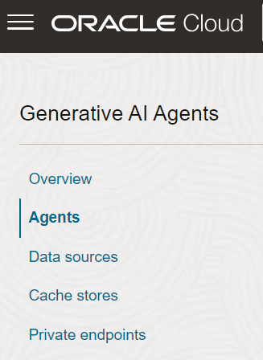
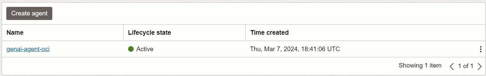

# Launch the Chatbot

## About this Workshop

OCI Generative AI Agents is a fully managed service that combines the power of large language models (LLMs) with an intelligent retrieval system to create contextually relevant answers by searching your knowledge base,
making your AI applications smart and efficient.

In this lab, you'll launch AI Agent chatbot and make interaction with the chatbot.

Estimated Workshop Time: 10 minutes

### Objectives

In this workshop, you will learn how to:
* Launch Chat with Agent
* Ask questions related to the data using example prompts

### Prerequisites

* Oracle cloud tenancy that is subscribed to Chicago region, and configured to work with OCI Object Storage service and OCI Open Search Cluster.
* Completed Previous Labs to create Open Search Cluster or create a bucket with sample documents in Storage for reviewing the RAG feature using Agent.  

#### Let's try out the Generative AI Agent chat widget.

## Task 1: Launch Chatbot

1. On your cloud console, navigate to the Generative AI Agents in Analytics & AI. Click on Agents to see the list of all Agents created.



2. Select the Agent created.



3. Click on the Agent and select the option "Launch Chat"


4. Start communicating with the Agent by asking for help and/or making specific questions, such as listing available metrics.


5. For example, let's enter the prompt "give me inventory report details".


6. We will directly get the link of the Dashboard from the AI Agent as a response along with the available metric details. Let's click the link to review the dashboard.


7. Here are some of the sample prompts to try
```
    “which dashboards has sales information”
    “show me the facility utilization report”
    “give me the key metrics in Retail Analytics”
    “list some of the preventive maintenance metrics for manufacturing”
```
## Acknowledgements
* **Author** - Pavan Kumar Manuguri, Principal Cloud Architect 
* **Contributors** -  Jiayuan Yang, Principal Cloud Architect 
* **Last Updated By/Date** - Pavan Kumar Manuguri, August 20 2024
