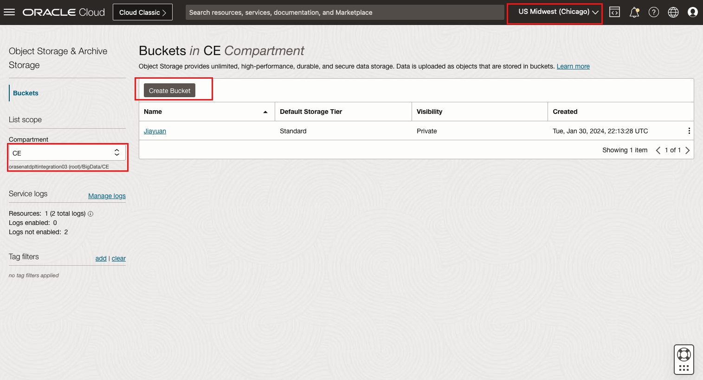
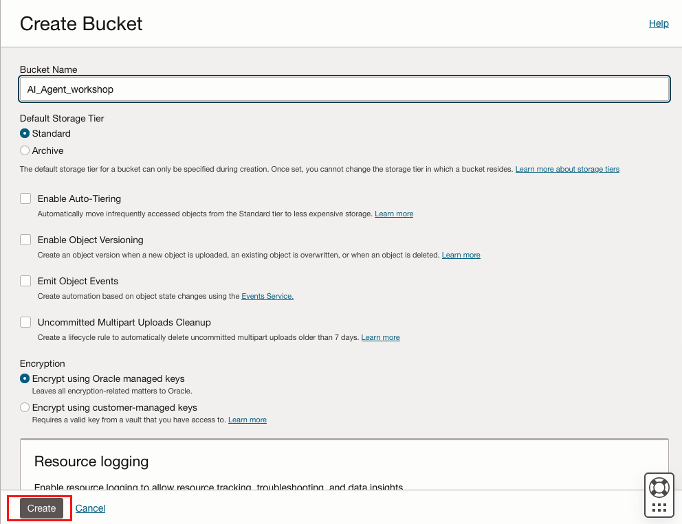
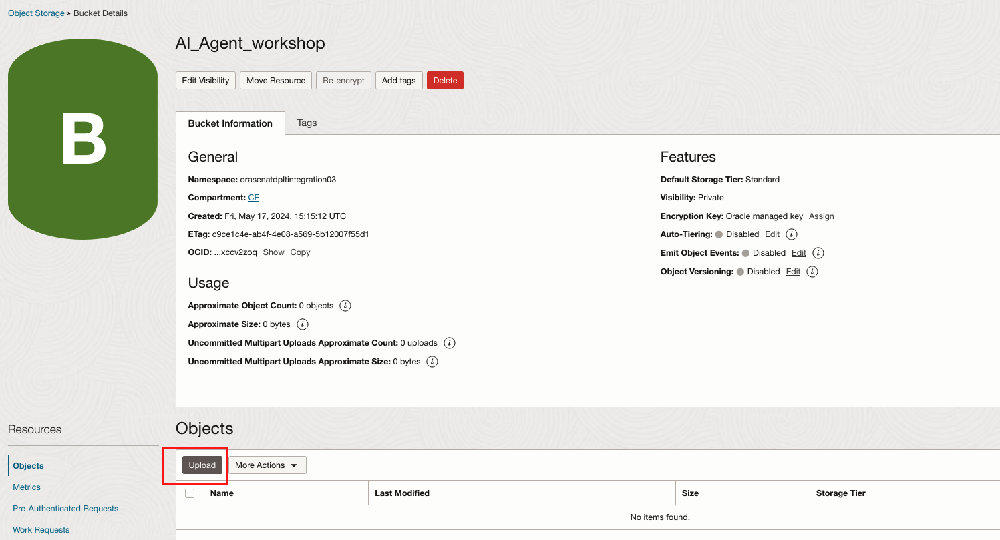
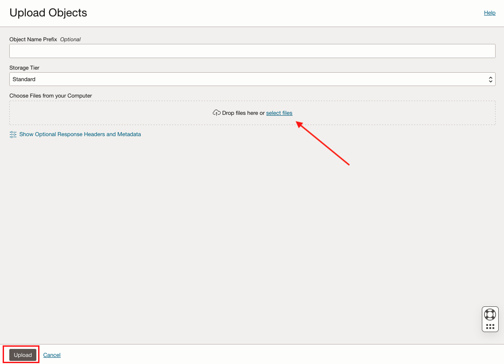
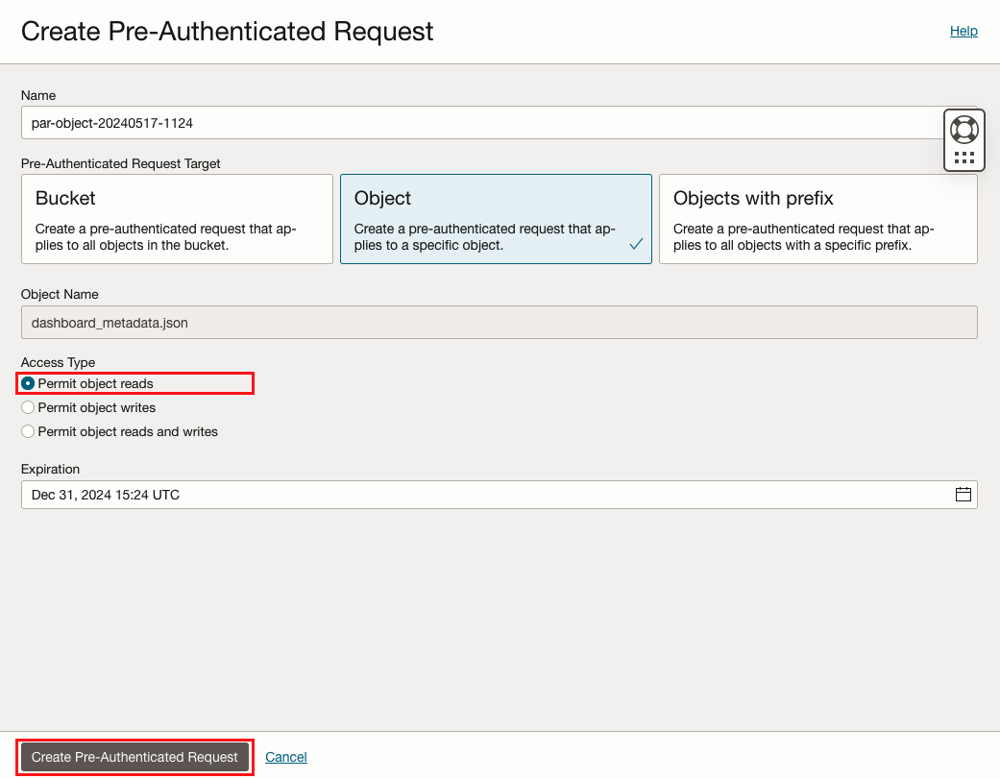
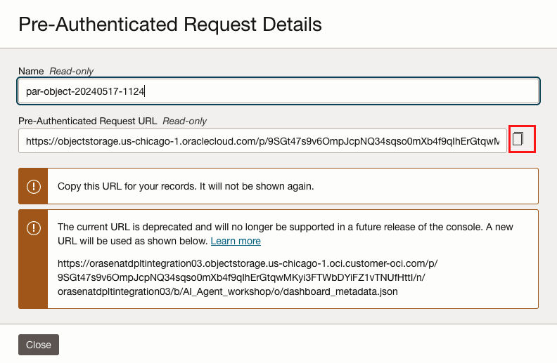

# Upload Data to Object Storage

## About this Workshop

In this lab you will learn how to upload data to OCI Object Storage, and make a use of the object.

OCI Object Storage service is an internet-scale, high-performance storage platform that offers reliable and cost-efficient data durability. You can create a bucket and store an object in the bucket, safely and securely retrieve data, and easily manage storage at scale. 

Estimated Workshop Time: 5 minutes

### Objectives

In this workshop, you will learn how to:
* Create OCI Object Storage Bucket
* Upload data file to Bucket
* Create Pre-Authenticated Request

### Prerequisites

* Oracle cloud tenancy that is subscribed to Chicago region, and configured to work with OCI Object Storage service
* familiar with Oracle Cloud Infrastructure is advantage, but not required
* Download the data file by clicking the url: *embed the json data url here*

### About the data
*explain json data here*

## Task 1: Create Object Storage Bucket to Upload Data
1. Log into the OCI Cloud Console, switch to Chicago region. Click Menu bar  -> Storage -> Buckets

2. Select the compartment you have created. 

3. Click Create Bucket, enter Bucket Name, then click Create

4. Open the Bucket just created, click Upload. Drag and drop the xxx.json you just downloaded, upload

## Task 2: Create Pre-Authenticated Request
1. Now you have uploaded the json file, click the 3 dots on the right of console, click Create Pre-Authenticated Request

2. Select Object, Permit object reads. Choose an expiration date, then click Create Pre-Authenticated Request

3. In the pop-up window, copy the PAR-URL and paste into your notepad. Make sure you take the copy of url, it will show up once.

## Learn More

* [Getting Started with OCI Object Storage](https://apexapps.oracle.com/pls/apex/r/dbpm/livelabs/view-workshop?wid=655&clear=RR,180&session=35038433542341)

## Acknowledgements
* **Author** - Jiayuan Yang, Cloud Engineer 
* **Contributors** -  Pavan Kumar Manuguri, Senior Cloud Engineer
* **Last Updated By/Date** - Jiayuan Yang, June 2024
