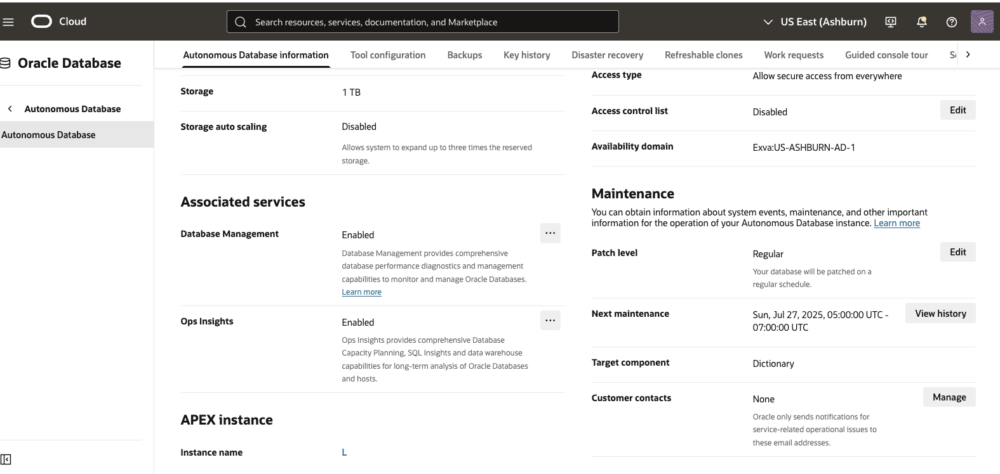
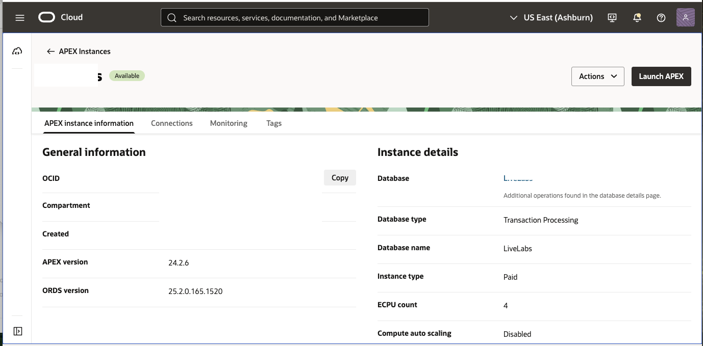

# Deploy APEX Sample Application 

## Introduction

This lab will take you through the steps needed to access APEX Administrative services, create an APEX workspace and deploy a sample APEX app.

Estimated Time: 30 minutes

### About Oracle APEX REST Services

### Objectives

In this lab, you will:

* Deploy an APEX sample app that is accessible from the public internet 
* Implement REST services that allow for updates on the data used in the app

### Prerequisites

This lab assumes you have:

* Successfully Provisioned the Autonomous Database from Lab 1
* have the Administrator credentials for the Autonomous Database in Lab 1

## Task 1: Open APEX Administration Services

This task involves logging into APEX Administration Services

1. Locate the Autonomous Database created in Lab 1, and click thru the name to view the details.

    

2. Scroll down and find the APEX instance name, click thru the instance name to view APEX Instance details
    
    
    
3. From the APEX Instance Details click the Launch APEX button

    

4. Open APEX Administration Services, use the autonmous database admin password created in Lab 1

    

## Task 2: Create APEX workspace 

This task involves Creating an APEX workspace from APEX Administration Services

1. After logging into APEX Administration services, click the create workspace button.

    

2. In the next screen, click the New Schema button.

     

3. You should now be at the screen where you can name the workspace and add an admin user. Type in a name for your workspace, also type in a user name and password for the admin. Note, you can use the same name for workspace and user.

     

4. Finish Creating new workspace, use the link to log into your new workspace or logout and use the Launch APEX button from task 1, step 3.

    

## Task 3: Deploy Sample App

1. Login into the workspace using the name and credentials you created in task 2.

    

2. From the workspace home screen click the App Builder button.

    

3. Click the install Starter or Sample app button

    

4.  Type in Brookstrut in the search bar and click the install button in the Bookstrut Sample App card.

    

5.  After installation completes, you should see the install button replaced with a run button. Click the button to login the app and save the url for later.

    

6. Login to the sample app using the workspace credentials 

    

## Acknowledgements

* **Author**
    * **Jadd Jennings**, Principal Cloud Architect, NACIE
* **Contributors**
    * **Kaushik Kundu**, Master Principal Cloud Architect, NACIE
* **Last Updated By/Date**
    * **Jadd Jennings**, Principal Cloud Architect, NACIE, March 2025
