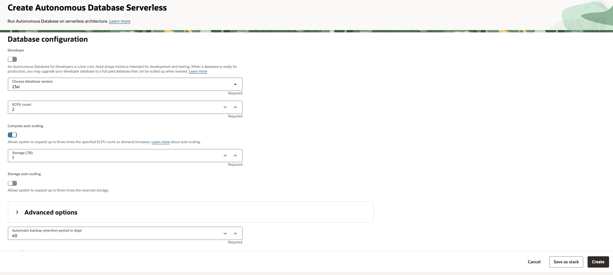
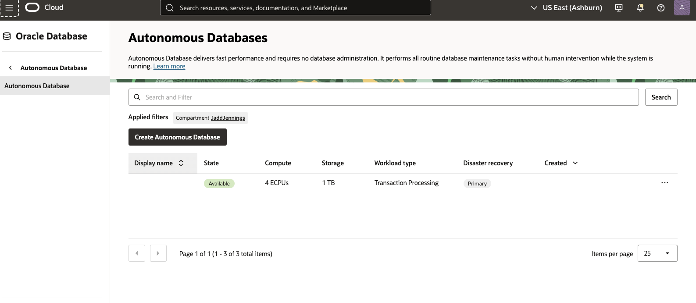

# Create ADB and Deploy APEX Sample Application 

## Introduction

This lab will take you through the steps needed to provision an Oracle Autonomous Database for APEX workload types. It also covers how to access APEX Administrative services, create an APEX workspace and deploy a sample APEX app.

Estimated Time: 60 minutes

### About Oracle ADB for APEX workloads

Oracle Autonomous Database is an autonomous database that can drive, secure and repair itself. It offers elastic scalability, rapid query performance and eliminates the need for manual database administration. It can also be provisioned in manner where performance and features are positioned for APEX workloads.

### About Oracle APEX 

Oracle APEX is a powerful low-code platform that empowers developers to create scalable and secure web and mobile applications with ease. Its robust features allow for deployment in various environments, whether in the cloud or on-premises.

With APEX, the development process is streamlined, enabling developers to rapidly build and launch innovative apps that address real-world challenges and deliver tangible results. The platform simplifies the development process, eliminating the need for expertise in numerous technologies. Developers can concentrate on problem-solving, while APEX handles the technical intricacies behind the scenes. 

### Objectives

In this lab, you will:

* Provision an Oracle Autonomous Database for APEX workloads
* Learn how to access APEX Administrative Services
* Learn how to create an APEX Workspace 
* Deploy an APEX sample app that is accessible from the public internet 

### Prerequisites

This lab assumes you have:

* Must have an Administrator Account or Permissions to manage several OCI Services: Oracle Databases, Networking, Policies.

## Task 1: Create Autonomous Database

This task involves creating Autonomous Database 23ai.

1. Locate Autonomous Databases under Oracle Databases. Click on Create Autonomous Database.

    

2. Provide information for Compartment, Display name, Database name. Also, choose workload type as APEX.
    
    
    
3. Choose database version as 23ai and disable Compute auto scaling.

    

4. Make sure Network Access is Secure access from everywhere, provide password, valid email ID and click on Create Autonomous Database.

    

5. After deployment is complete, check to make sure your autonomous database is available on the autonomous databases page with the specified compartment selected.

    

 
## Task 2: Access APEX Administration Services

This task involves logging into APEX Administration Services

1. Locate the Autonomous Database created in task 1, scroll down and find the APEX instance name. Click thru the instance name to view APEX Instance details.
    
    
    
2. From the APEX Instance Details click the Launch APEX button.

    

3. Open APEX Administration Services, use the autonomous database admin password created in task 1.

    

## Task 3: Create APEX workspace 

This task involves Creating an APEX workspace from APEX Administration Services

1. After logging into APEX Administration services, click the create workspace button.

    

2. In the next screen, click the New Schema button.

    

3. You should now be at the screen where you can name the workspace and add an admin user. Type in a name for your workspace, also type in a user name and password for the admin. Note, you can use the same name for workspace and user.

    

4. Finish creating new workspace, use the link to log into your new workspace or logout and use the Launch APEX button from task 2, step 3.

    

## Task 4: Deploy Sample App

In this task we deploy a sample Apex app into the workspace

1. Login into the workspace using the name and credentials you created in task 3.

    

2. From the workspace home screen click the App Builder button.

    

3. Click the Install a Starter or Sample App button.

    

4.  Type in Brookstrut in the search bar and click the install button in the Bookstrut Sample App card.

    

5.  After installation completes, you should see the install button replaced with a run button. Click the button to login the app and save the url for later.

    

6. Login to the sample app using the workspace credentials. 

    

You may now proceed to the next lab.

## Acknowledgements

* **Author**
    * **Jadd Jennings**, Principal Cloud Architect, NACIE
* **Contributors**
    * **Kaushik Kundu**, Master Principal Cloud Architect, NACIE
* **Last Updated By/Date**
    * **Jadd Jennings**, Principal Cloud Architect, NACIE, Aug 2025
