# Implement Select AI, REST for Select AI and REST for APEX

## Introduction

This lab will take you through the steps needed to implement Select AI on the autonomous database created in the previous lab and implement REST services for Select AI and APEX

Estimated Time: 60 minutes

### About Oracle Select AI
Oracle's Select AI is an innovative feature within the Autonomous Database system. It allows users to interact with their data using natural language queries. By employing Large Language Models (LLMs) and generative AI techniques, Select AI translates user-inputted text into Oracle SQL. The process involves interpreting the natural language prompt, enhancing it with relevant database metadata, and subsequently generating and executing a SQL query.

### About Oracle REST Data Services
Oracle REST Data Services (ORDS) is a service that enables the development of REST interfaces for relational data in a database. ORDS can map HTTP(S) verbs (like GET, POST...) to database transactions and return results as JSON data.

### Objectives

In this lab, you will:


* Implement Select AI  
* Implement REST services that allows Select AI to be called from outside sources 
* Implement REST services that allow for updates on the APEX app
* Create an OCI API Key


### Prerequisites

This lab assumes you have:

* Successfully completed Lab 1 
* have the Administrator credentials for the Autonomous Database in Lab 1
* OCI Privileges to create API Keys and access generative AI services


## Task 1: Implement REST services for the APEX App

1. Open the APEX workspace from previous lab, and navigate to the Object Browser via the SQL Workshop drop down.

    

2. Expand the Tables tree towards the top left of page.

    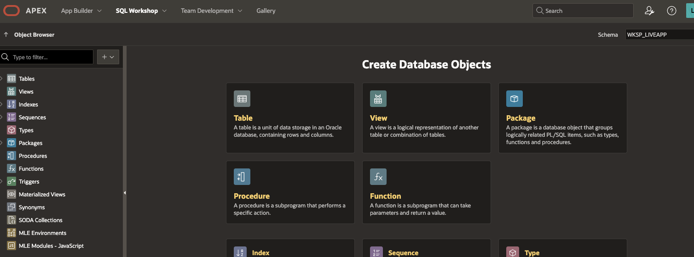

3. Note the tables of the app, they will be used later to enable Select AI.

    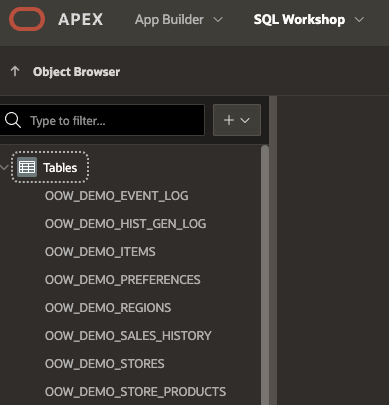

4. Navigate to RESTFul services via the SQL Workshop drop down menu.

    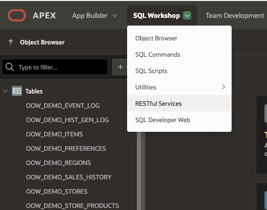

5. Look for the button named "Register Schema with ORDS" and click it, disable Install Sample Service and leave others as default. Click the "Save Schema Attributes" button.

    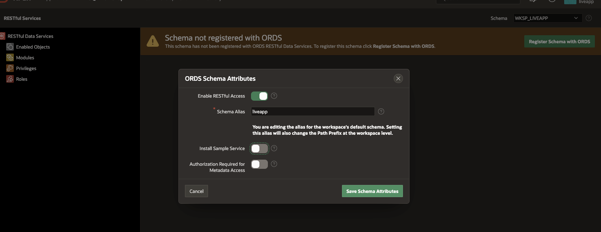

6. Click the Module item under Restful Data Services on the left side, then Click the "Create Module" button. Use the values in screenshot (or similar) and click the other "Create Module" button.

    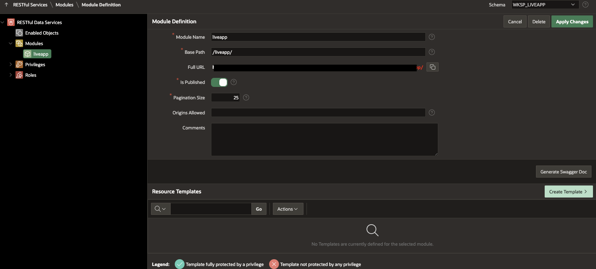

7. From the same screen, click the "Create Template" button. Use the values in the screenshot (or similar)  and click "Create Template".

    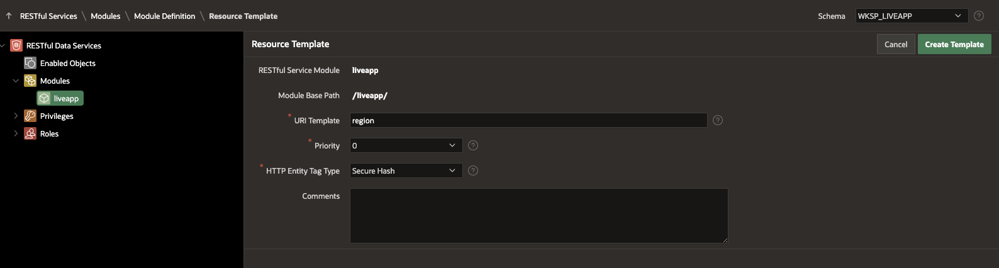

8. From the same screen, click the "Create Handler" button. Make sure Method is POST, type/paste the source from below and click "Create Handler".

    Paste the PL/SQL:

    ```text
       <copy>
            BEGIN
                    INSERT INTO OOW_DEMO_REGIONS (REGION_NAME)
                    values (:region_name);
                    :status_code := 201;
                exception
                WHEN VALUE_ERROR
                    THEN
                        :errmsg := 'Error';
                        :status_code := 400;
                WHEN others then
                    :status_code := 400; 
                    :errmsg := sqlerrm;
                END;
       </copy>
    ```

    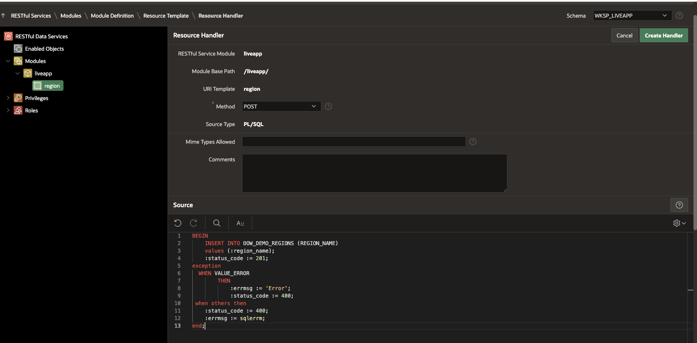


9. Look towards the bottom of the same page for the Parameters section, click "Add Row" and use the values in the screenshot. Click "Apply Changes" to update the handler.


    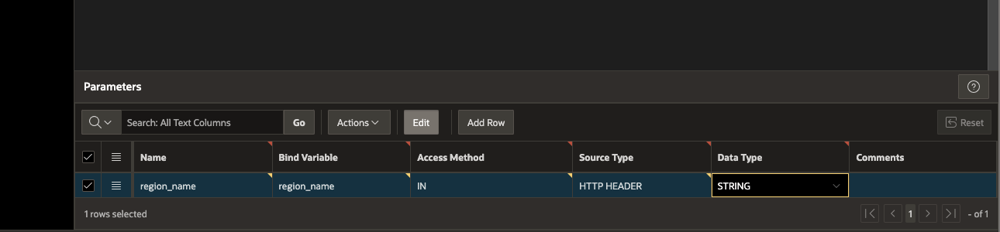

10. Note the Full URL for the Resource Handler, this will be used later in the workshop.

    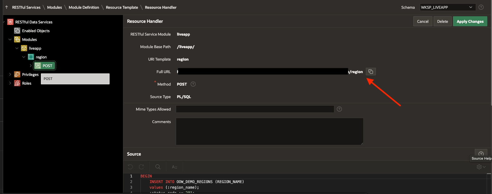

## Task 2: Create API Key in OCI

This task involves creating and API Key in OCI, the key will be used to implement Select AI.

1. Login the OCI Console and click the person icon on the top right.

    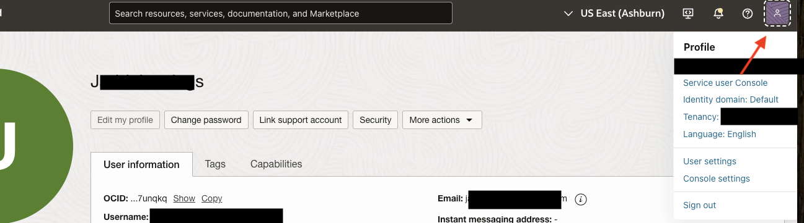

2. Click API keys at the bottom left, then click the add API Key button.

    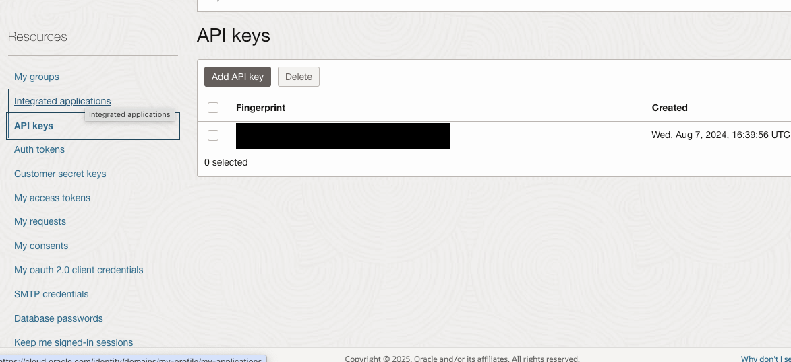

3. Select the generate API Key Pair and click the add button. Make sure to download the private key.

    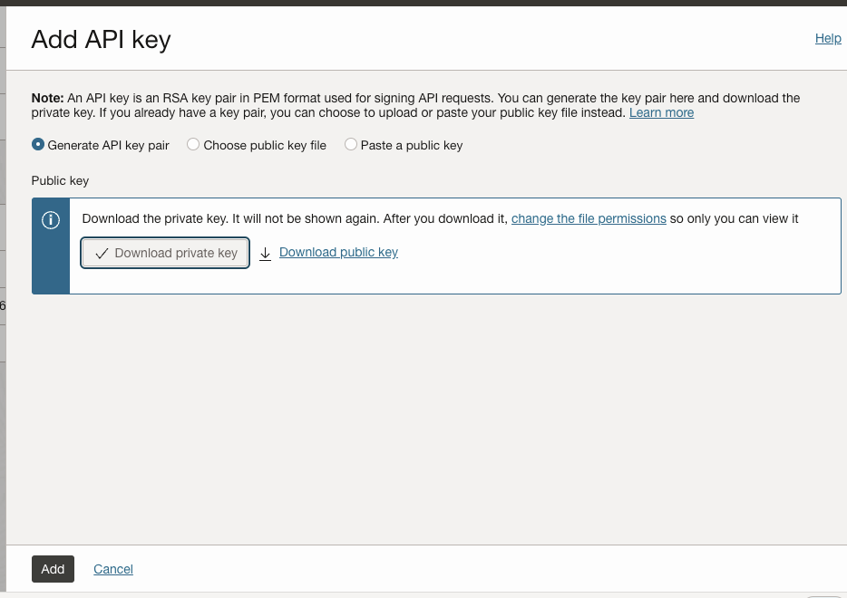

4. Make note of the API configurations, it will be needed later.

    

## Task 3: Enable Select AI on the APEX workspace objects

This task involves implementing Select AI for the autonomous database created in previous lab, you will also need the API Key created in the previous task.

1. Locate the Autonomous Database created in Lab 1, and click thru the name to view the details.

    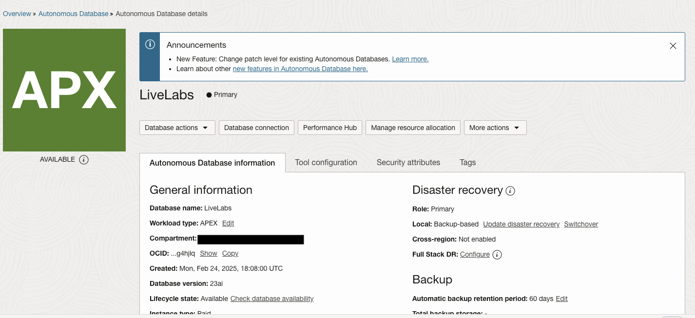

2. Click the database actions drop down and select SQL, this will take you to SQL developer.
    
    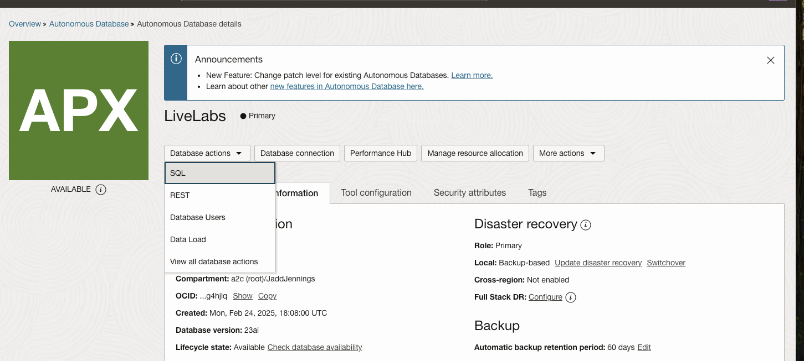
    
3.  Type the following sql code in the worksheet area and update with API Key configurations in four places. Update for user_ocid, tenancy_ocid, private_key, and fingerprint. Each value can be found in task 1, steps 3/4. Click the run script button and check the script output to make sure it completed successfully.
        
    Paste the PL/SQL:

    ```text
        <copy>
            BEGIN                                                                         
            DBMS_CLOUD.CREATE_CREDENTIAL(                                               
                credential_name => 'GENAI_CRED',                                          
                user_ocid       => '<UPDATE HERE>',
                tenancy_ocid    => '<UPDATE HERE>',
                private_key     => '<UPDATE HERE>',
                fingerprint     => '<UPDATE HERE>'
                );
        </copy>
    ```

    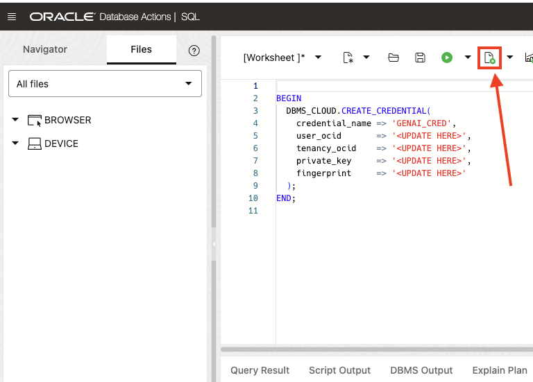

4. Clear the worksheet area and type the script below in the worksheet. Update script for the name(use uppercase) of the workspace you created in Lab 2 Step 3. Click the run script button and check the script output to make sure it completed successfully.

    Paste the PL/SQL:

    ```text
        <copy>
            BEGIN                                                                        
                DBMS_CLOUD_AI.CREATE_PROFILE(                                              
                profile_name =>'GENAI',                                                             
                attributes   =>'{"provider": "oci",                                                                   
                                "credential_name": "GENAI_CRED",
                                "object_list": [
                                        {"owner": "WKSP_<PUT WORKSPACE NAME HERE>", "name": "OOW_DEMO_EVENT_LOG"},    
                                        {"owner": "WKSP_<PUT WORKSPACE NAME HERE>", "name": "OOW_DEMO_HIST_GEN_LOG"},    
                                        {"owner": "WKSP_<PUT WORKSPACE NAME HERE>", "name": "OOW_DEMO_STORE_ITEMS"},                
                                        {"owner": "WKSP_<PUT WORKSPACE NAME HERE>", "name": "OOW_DEMO_PREFERENCES"},                
                                        {"owner": "WKSP_<PUT WORKSPACE NAME HERE>", "name": "OOW_DEMO_REGIONS"},
                                        {"owner": "WKSP_<PUT WORKSPACE NAME HERE>", "name": "OOW_DEMO_SALES_HISTORY"},                  
                                        {"owner": "WKSP_<PUT WORKSPACE NAME HERE>", "name": "OOW_DEMO_STORES"},               
                                        {"owner": "WKSP_<PUT WORKSPACE NAME HERE>", "name": "OOW_DEMO_STORE_PRODUCTS"}]
                }');                                                                  
            END;
        </copy>
    ```
     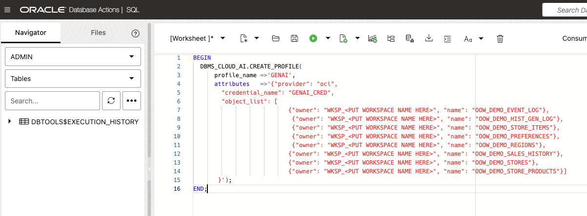

5. Test that Select AI is working with the query below. Clear the worksheet area, type in the query and click run script. The query result should give you an understandable result with no errors.

Paste the PL/SQL:

    ```text
        <copy>
            SELECT DBMS_CLOUD_AI.GENERATE(prompt       => 'how many customers',
                                    profile_name => 'GENAI',
                                    action       => 'narrate')
            FROM dual
        </copy>
    ```

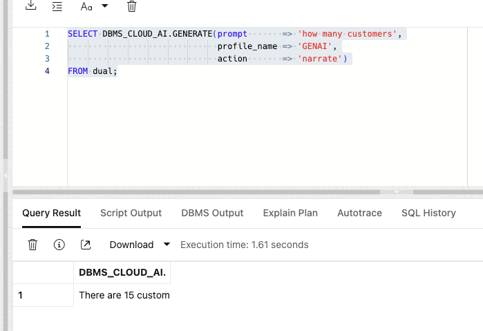


## Task 4: Implement REST for Select AI

This task involves creating REST services for Select AI, it will allow Select AI to be called via REST Endpoint. 

1. Locate the Autonomous Database created in Lab 1 and click thru the name to view the details.

    

2. Click the database actions drop down and select REST, this will take you to Database Actions REST services.
    
    

3. Click thru the Modules box then click the Create Module button, use the values in screenshot and select "Not protected" in the Protected by Privilege drop down. Click create and move to next step.

    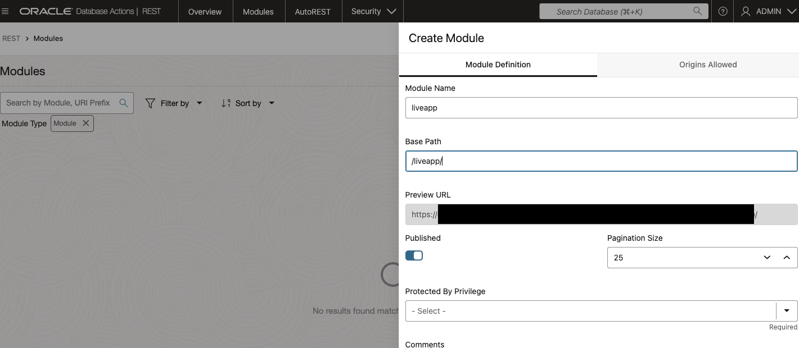

4. You should be in page of the module you just created, click Create Template, make sure values match example in screenshot and click Create.

    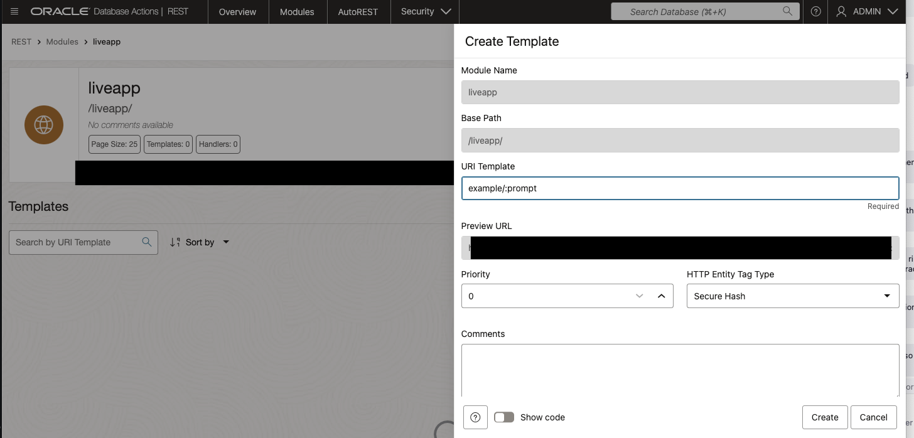

5. The previous step should bring you to the handlers page, click the Create Handler button. Match the Method, Source Type and Source values with the example in the screenshot. Click Save.
    
    Paste the PL/SQL:

    ```text
        <copy>
            SELECT DBMS_CLOUD_AI.GENERATE(prompt       => :prompt,
                                    profile_name => 'GENAI',
                                    action       => 'narrate')
            FROM dual
        </copy>
    ```

    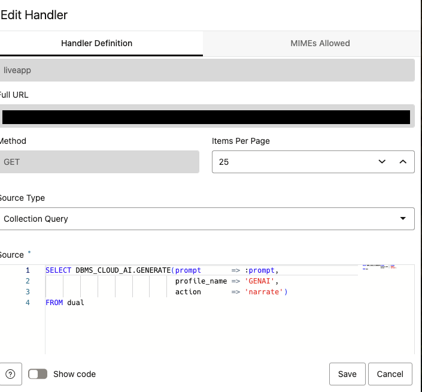

6. Test the handler using the open in new tab button. Also, use the copy button to paste/save the endpoint url for later.

    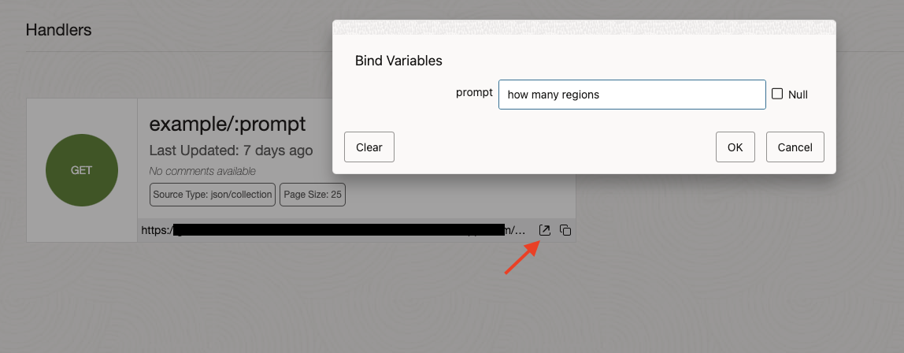


You may now proceed to the next lab.

## Acknowledgements

* **Author**
    * **Jadd Jennings**, Principal Cloud Architect, NACIE
* **Contributors**
    * **Kaushik Kundu**, Master Principal Cloud Architect, NACIE
* **Last Updated By/Date**
    * **Jadd Jennings**, Principal Cloud Architect, NACIE, March 2025
