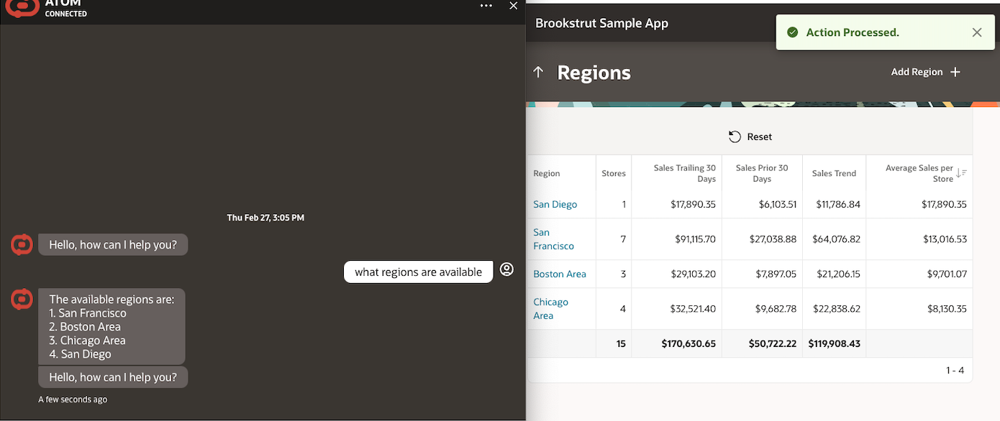

# Introduction

## About this Workshop

This workshop helps you interact with the backend of a live app (APEX Sample App) using a multi skilled chatbot  and without requiring any knowledge of Structured Query Language (SQL). The chatbot allows you update the application backend with natural language, you can even combine the results with the other chatbot skills like getting a weather report via api. When everything is put together, it makes have a very intelligent and robust system.

This solution implements OCI Generative AI Multi-step Tool, so it also supports tool-calling in a sequence. The output of one tool can be the input to another tool. Thus this solution can even support highly complex questions, that requires leveraging multiple different Tools (Agents/APIs) together.

This multi-agent approach offers a powerful and flexible framework for developers to create next-generation conversational AI applications, catering to a wide range of user needs.

Estimated Workshop Time: 5 hours

### Objectives

Objective of this workshop is to set-up the required OCI services to create a Multi Agent/API Chatbot solution.

)

* Oracle Autonomous database – 
* Oracle APEX 
* OCI Integration Cloud (OIC) - Users can use Oracle Integration Cloud to pull a city's weather information leveraging Weather API
* OCI Digital Assistant (ODA) – Users can create ODA Digital Assistance and import the provided ODA Skills for Generative AI Agents and OIC APIs.
Users can then connect from ODA chatbot and get responses of their natural language questions.
* OCI Visual Builder (VB) ATOM Application – User can create OCI Visual Builder (VB) instance and import ATOM VB web application.
Users can then embed the ODA chatbot in ATOM VB application, and interact with the ODA Chatbot

In this workshop, you will learn how to:

* Provision Autonomous Database and enable SELECT AI.
* Create a sample APEX app and add REST Services.
* Setup & configure Oracle Integration Cloud to integrate with Weather API.
* Setup & configure Oracle Digital Assistant (ODA) as an OCI Generative AI powered chatbot.
* Setup & configure Visual Builder as a frontend channel for ODA.
* Test out the features and capabilities of this Visual Builder application.

### Prerequisites

This lab assumes you have:

* An Oracle Cloud Account
* Access to OCI Integration Cloud (OIC)
* Access to OCI Digital Assistant (ODA)
* Access to OCI Visual Builder (VB)
* Access to a Region where the Generative AI service is available: Chicago, Frankfurt
* Must have an Administrator Account or Permissions to manage several OCI Services: Generative AI Services, Digital Assistant, Visual Builder, Autonomous database, Object Storage, Integration Cloud, OCIR, Network, Dynamic Groups, Policies, IDCS/Identity Domain Confidential Applications, Resource Manager
* Familiarity with Oracle Cloud Infrastructure (OCI) is helpful

## Learn More

* [What Is Generative AI? How Does It Work?](https://www.oracle.com/artificial-intelligence/generative-ai/what-is-generative-ai/)
* [Overview of Generative AI Service](https://docs.oracle.com/en-us/iaas/Content/generative-ai/overview.htm)
* [Overview of Oracle Integration](https://docs.oracle.com/en-us/iaas/application-integration/doc/overview.html)
* [Overview of Digital Assistants and Skills](https://docs.oracle.com/en-us/iaas/digital-assistant/doc/overview-digital-assistants-and-skills.html)
* [Overview of Visual Builder](https://docs.oracle.com/en-us/iaas/visual-builder/doc/oracle-visual-builder.html)
* [Oracle Digital Assistant's large language model integration](https://docs.oracle.com/en/cloud/paas/digital-assistant/use-chatbot/llm-blocks-skills.html)

## Acknowledgements

* **Author**
    * **Jadd Jennings**, Principal Cloud Architect, NACIE
    * **Kaushik Kundu**, Master Principal Cloud Architect, NACIE

* **Contributors**
    * **Abhinav Jain**, Senior Cloud Engineer, NACIE
    * **Luke Farley**, Staff Cloud Engineer, NACIE
   
* **Last Updated By/Date**
    * **Jadd Jennings**, Principal Cloud Architect, NACIE, March 2025
