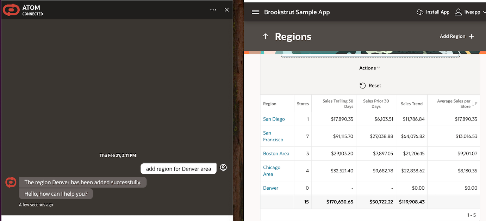

# Introduction

## About this Workshop

This workshop goes thru the step to create a multi-skilled chatbot you can use to interact with the backend of a live app (APEX Sample App) and without requiring the use of Structured Query Language (SQL). The chatbot allows you update the application backend with natural language, you can also combine the results with other chatbot skills like getting a weather report for location-based data. When its all put together, you have an intelligent and robust system.

This multi-agent approach offers a powerful and flexible framework for developers to create next-generation conversational AI applications, catering to a wide range of user needs.

Estimated Workshop Time: 6 hours

### Objectives

Objective of this workshop is to use OCI to create a chatbot solution that can update and query the data from a live Apex App using natural language.

* Oracle Autonomous database – world's first autonomous database that is self-driving, self-repairing, self-securing.
* Oracle APEX - low-code development environment that enables users to quickly build and deploy a wide range of business applications.
* OCI Integration Cloud (OIC) - Users can use Oracle Integration Cloud to pull a city's weather information leveraging Weather API.
* OCI Digital Assistant (ODA) – Users can create ODA Digital Assistance and import the provided ODA Skills for Generative AI Agents and OIC APIs.
Users can then connect from ODA chatbot and get responses of their natural language questions.
* OCI Visual Builder (VB) ATOM Application – User can create OCI Visual Builder (VB) instance and import ATOM VB web application.
Users can then embed the ODA chatbot in ATOM VB application, and interact with the ODA Chatbot.

In this workshop, you will learn how to:

* Provision Autonomous Database and enable SELECT AI.
* Create a sample APEX app and add REST Services.
* Setup & configure Oracle Integration Cloud to integrate with Weather API.
* Setup & configure Oracle Digital Assistant (ODA) as an OCI Generative AI powered chatbot.
* Setup & configure Visual Builder as a frontend channel for ODA.
* Test out the features and capabilities of this Visual Builder application.

### Prerequisites

This lab assumes you have:

* An Oracle Cloud Account
* Access to OCI Integration Cloud (OIC)
* Access to OCI Digital Assistant (ODA)
* Access to OCI Visual Builder (VB)
* Access to OCI Autonomous Database (ADB)
* Access to a Region where the Generative AI service is available: Chicago, Frankfurt
* Must have an Administrator Account or Permissions to manage several OCI Services: Generative AI Services, Digital Assistant, Visual Builder, Autonomous Database, Integration Cloud, Dynamic Groups, Policies, Identity Access Management, Resource Manager

* Familiarity with Oracle Cloud Infrastructure (OCI) is helpful

## Learn More

* [What Is Generative AI? How Does It Work?](https://www.oracle.com/artificial-intelligence/generative-ai/what-is-generative-ai/)
* [Overview of Generative AI Service](https://docs.oracle.com/en-us/iaas/Content/generative-ai/overview.htm)
* [Overview of Autonomous Database Serverless](https://docs.oracle.com/en-us/iaas/autonomous-database-serverless/index.html)
* [Overview of Select AI](https://docs.oracle.com/en-us/iaas/autonomous-database-serverless/doc/sql-generation-ai-autonomous.html)
* [Overview of Oracle APEX Application Development](https://docs.oracle.com/en/cloud/paas/apex/index.html)
* [Overview of Oracle Integration](https://docs.oracle.com/en-us/iaas/application-integration/doc/overview.html)
* [Overview of Digital Assistants and Skills](https://docs.oracle.com/en-us/iaas/digital-assistant/doc/overview-digital-assistants-and-skills.html)
* [Overview of Visual Builder](https://docs.oracle.com/en-us/iaas/visual-builder/doc/oracle-visual-builder.html)

## Acknowledgements

* **Author**
    * **Jadd Jennings**, Principal Cloud Architect, NACIE
    * **Kaushik Kundu**, Master Principal Cloud Architect, NACIE

* **Contributors**
    * **Abhinav Jain**, Senior Cloud Engineer, NACIE
    * **Luke Farley**, Senior Cloud Engineer, NACIE
   
* **Last Updated By/Date**
    * **Jadd Jennings**, Principal Cloud Architect, NACIE, March 2025
