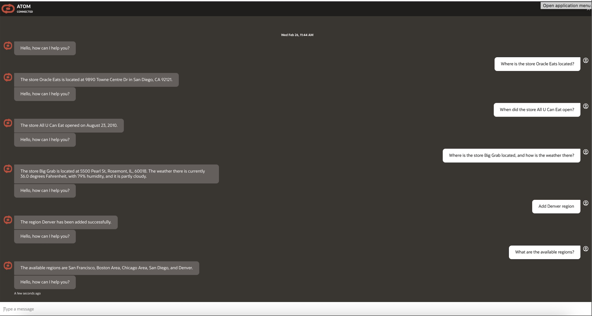
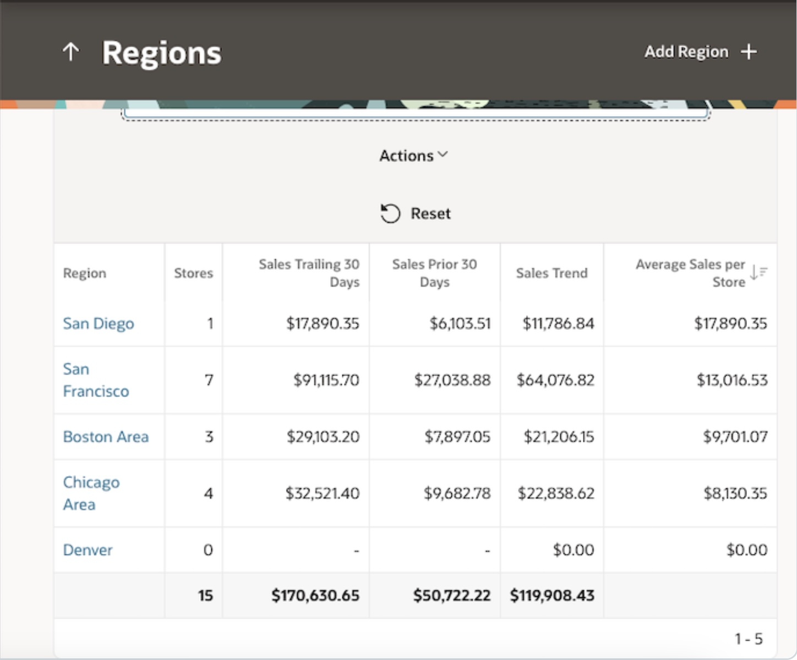

# Introduction

## About this Workshop
This workshop guides participants in configuring and deploying a cutting-edge chatbot solution that leverages a multi-API architecture to revolutionize conversational AI. Each API or tool contributes unique capabilities, combining to create an intelligent and versatile system.  

Through this workshop, developers can create multiple Database APIs (connected via Oracle REST Data Services - ORDS) and third-party APIs (integrated through OCI Integration Cloud Service - OIC). These APIs are then exposed through an OCI Digital Assistant (ODA) Chatbot.  

The Database APIs can serve as data retrieval NL2SQL APIs (using Autonomous Database Select AI) or data addition APIs. The Autonomous Database can also be accessed by an APEX App.  

When a user asks a question in natural language, the ODA Chatbot leverages Generative AI Tools to dynamically orchestrate and route the user’s request to the appropriate API, fetching the correct response.  

This solution implements the OCI Generative AI Multi-step Tool, enabling sequential tool-calling. The output of one tool can serve as the input for another, allowing the system to handle highly complex questions that require multiple tools or APIs working together.  

This multi-tool approach provides a powerful and flexible framework for developers to build next-generation conversational AI applications, catering to a wide range of user needs.

Estimated Workshop Time: 5 hours

### Objectives

Objective of this workshop is to set-up the required OCI services to create a Multi Tool/API Chatbot solution for Database NL2SQL operations.

* Oracle Autonomous database – World's first autonomous database that is self-driving, self-repairing, self-securing.
* Oracle APEX - Low-code development environment that enables users to quickly build and deploy a wide range of business applications.
* OCI Integration Cloud (OIC) - Users can use Oracle Integration Cloud to pull a city's weather information leveraging Weather API.
* OCI Digital Assistant (ODA) – Users can create ODA Digital Assistance and import the provided ODA Skills for DB APIs and OIC APIs. Users can then connect from ODA chatbot and get responses of their natural language questions.
* OCI Visual Builder (VB) ATOM Application – User can create OCI Visual Builder (VB) instance and import ATOM VB web application.
Users can then embed the ODA chatbot in ATOM VB application, and interact with the ODA Chatbot.

In this workshop, you will learn how to:

* Provision Autonomous Database and enable Select AI.
* Create a sample APEX app and add REST Services.
* Setup & configure Oracle Integration Cloud to integrate with Weather API.
* Setup & configure Oracle Digital Assistant (ODA) as an OCI Generative AI powered chatbot.
* Setup & configure Visual Builder as a frontend channel for ODA.
* Test out the features and capabilities of this Visual Builder application.

### Prerequisites

This lab assumes you have:

* An Oracle Cloud Account
* Access to OCI Integration Cloud (OIC)
* Access to OCI Digital Assistant (ODA)
* Access to OCI Visual Builder (VB)
* Access to OCI Autonomous Database (ADB)
* Access to a Region where the Generative AI service is available: Chicago, Frankfurt
* Must have an Administrator Account or Permissions to manage several OCI Services: Generative AI Services, Digital Assistant, Visual Builder, Autonomous Database, Integration Cloud, Dynamic Groups, Policies, Identity Access Management, Resource Manager

* Familiarity with Oracle Cloud Infrastructure (OCI) is helpful

## Learn More

* [What Is Generative AI? How Does It Work?](https://www.oracle.com/artificial-intelligence/generative-ai/what-is-generative-ai/)
* [Overview of Generative AI Service](https://docs.oracle.com/en-us/iaas/Content/generative-ai/overview.htm)
* [Overview of Autonomous Database Serverless](https://docs.oracle.com/en-us/iaas/autonomous-database-serverless/index.html)
* [Overview of Select AI](https://docs.oracle.com/en-us/iaas/autonomous-database-serverless/doc/sql-generation-ai-autonomous.html)
* [Overview of Oracle APEX Application Development](https://docs.oracle.com/en/cloud/paas/apex/index.html)
* [Overview of Oracle Integration](https://docs.oracle.com/en-us/iaas/application-integration/doc/overview.html)
* [Overview of Digital Assistants and Skills](https://docs.oracle.com/en-us/iaas/digital-assistant/doc/overview-digital-assistants-and-skills.html)
* [Overview of Visual Builder](https://docs.oracle.com/en-us/iaas/visual-builder/doc/oracle-visual-builder.html)

## Acknowledgements

* **Author**
    * **Jadd Jennings**, Principal Cloud Architect, NACIE
    * **Kaushik Kundu**, Master Principal Cloud Architect, NACIE

* **Contributors**
    * **Abhinav Jain**, Senior Cloud Engineer, NACIE
    * **Luke Farley**, Senior Cloud Engineer, NACIE
   
* **Last Updated By/Date**
    * **Jadd Jennings**, Principal Cloud Architect, NACIE, March 2025
