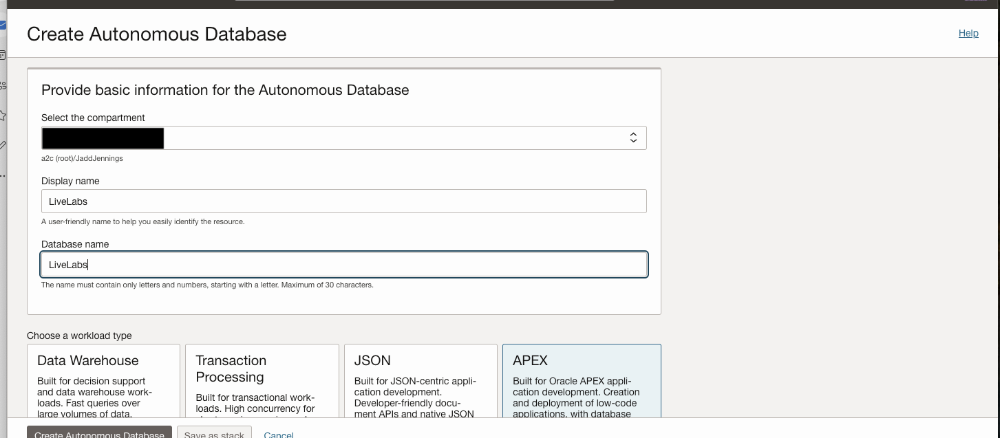

# Create ADB 

## Introduction

This lab will take you through the steps needed to provision an Oracle Autonomous Database for APEX workload types. 

Estimated Time: 15 minutes

### About Oracle ADB for APEX workloads

Oracle Autonomous Database is an autonomous database that can drive, secure and repair itself. It offers elastic scalability, rapid query performance and eliminates the need for manual database administration. It can also be provisioned in manner where performance and features are positioned for APEX workloads.

Oracle APEX is a low-code development environment that enables users to quickly build and deploy a wide range of business applications, while delivering scalable performance and supporting standard business needs.

### Objectives

In this lab, you will:

* Provision an Oracle Autonomous Database for APEX workloads

### Prerequisites

This lab assumes you have:

* Must have an Administrator Account or Permissions to manage several OCI Services: Oracle Databases, Networking, Policies.

## Task 1: Create Autonomous Database

This task involves creating Autonomous Database 23ai.

1. Locate Autonomous Databases under Oracle Databases. Click on Create Autonomous Database.

    

2. Provide information for Compartment, Display name, Database name. Also, choose workload type as APEX.
    
    
    
3. Choose deployment type as Serverless, database version as 23ai and disable Compute auto scaling.

    

4. Make sure Network Access is Secure access from everywhere, provide password, valid email ID and click on Create Autonomous Database.

    

5. After deployment is complete, check to make sure your autonomous database is available on the autonomous databases page with the specified compartment selected.

    
## Acknowledgements

* **Author**
    * **Jadd Jennings**, Principal Cloud Architect, NACIE
* **Contributors**
    * **Kaushik Kundu**, Master Principal Cloud Architect, NACIE
* **Last Updated By/Date**
    * **Jadd Jennings**, Principal Cloud Architect, NACIE, March 2025
