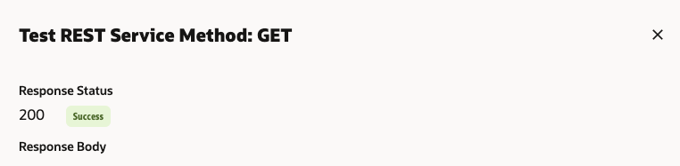
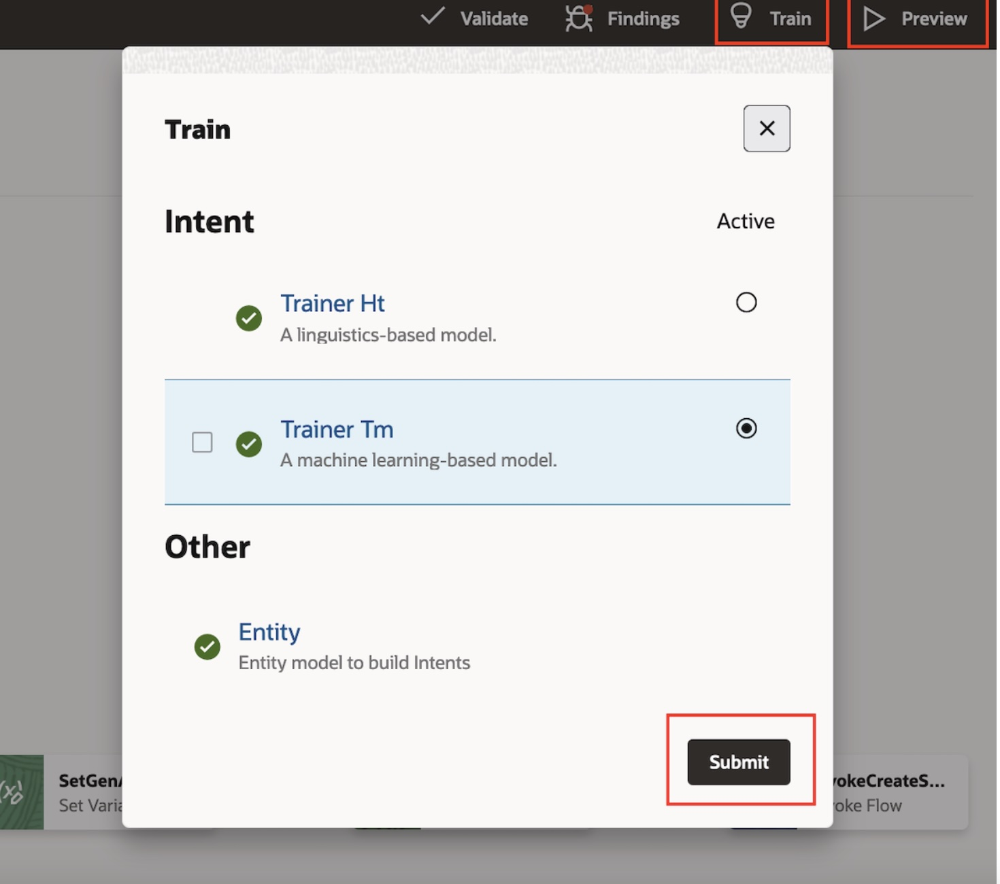
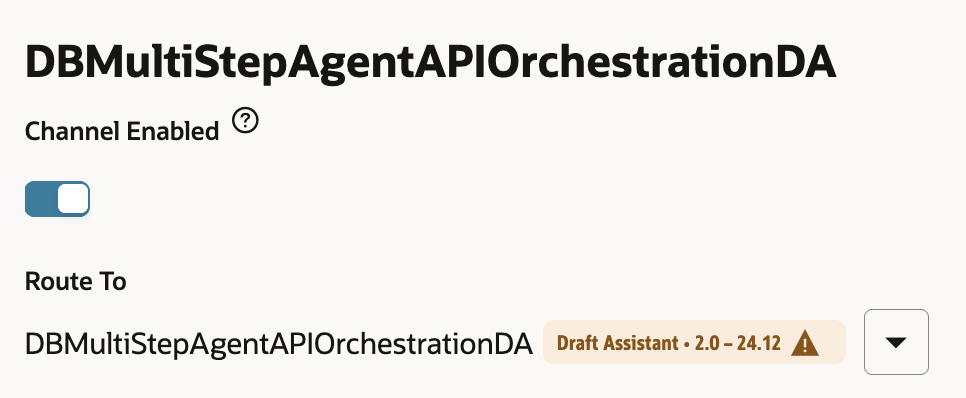

# Setup OCI Digital Assistant (ODA)

## Introduction

This lab will take you through the steps needed to provision Oracle Digital Assistant Cloud Service

Estimated Time: 60 minutes

### About OCI Digital Assistant

Oracle Digital Assistant (ODA) is a platform that allows you to create and deploy digital assistants for your users. Digital assistants are virtual devices that help users accomplish tasks through natural language conversations, without having to seek out and wade through various apps and web sites. Each digital assistant contains a collection of specialized skills. When a user engages with the digital assistant, the digital assistant evaluates the user input and routes the conversation to and from the appropriate skills.

### Objectives

In this lab, you will:

* Provision an ODA instance.
* Import and configure ODA Rest API Services to connect to different solution components.
* Import and configure ODA Digital Assistant and ODA Skills to use different solution components.
* Create a Channel to connect the ODA Digital Assistant to a frontend.

### Prerequisites

This lab assumes you have:

* All previous labs successfully completed
* Must have an Administrator Account or Permissions to manage several OCI Services: Digital Assistant

## Task 1: Provision Oracle Digital Assistant

This task will help you to create Oracle Digital Assistant under your chosen compartment.

1. Locate Digital Assistant under AI Services

    

    **Note** You can find Digital Assistant under the AI Services.

2. Provide the information for Compartment, Name , Description (optional) & Shape. Click Create

    


3. In few minutes the status of recently created Digital Assistant will change from Provisioning to Active

    

## Task 2: Create REST Services for the OCI Generative AI Agent

This task involves creating REST service which will be used by ODA to connect to OCI Generative AI Agent service.

1. Download the four REST Service Configurations

    a. [RESTService-DBSelectAIService.yaml](https://objectstorage.us-chicago-1.oraclecloud.com/n/idb6enfdcxbl/b/Excel-Chicago/o/Livelabs%2Fgenai-multi-agent%2FRESTService-DBSelectAIService.yaml)

    b.  [RESTService-DBAddRegionDataService.yaml](https://objectstorage.us-chicago-1.oraclecloud.com/n/idb6enfdcxbl/b/Excel-Chicago/o/Livelabs%2Fgenai-multi-agent%2FRESTService-DBAddRegionDataService.yaml)

    c. [RESTService-CohereToolChatServiceV2.yaml](https://objectstorage.us-chicago-1.oraclecloud.com/n/idb6enfdcxbl/b/Excel-Chicago/o/Livelabs%2Fgenai-multi-agent%2FRESTService-CohereToolChatServiceV2.yaml)

    d. [RESTService-OIC\_Weather\_Service.yaml](https://objectstorage.us-chicago-1.oraclecloud.com/p/HIomV4YoAvkW7IqNJA_T7KqSFb6ZxX21ObHS9jBchxkCa8_J0tcEJ-UErkj_Ij9I/n/idb6enfdcxbl/b/Excel-Chicago/o/Livelabs/genai-multi-agent/RESTService-OIC_Weather_Service.yaml)

2. Locate the ODA instance (created in Task 1)

    

3. Select the ODA Instance and click on Service Console

    

4. In the ODA Console, click on hamburger menu. Under Settings, click API Services

    

5. Click on More -> Import REST Services

    

    **Note** Import all Rest Services:
    - The DBSelectAIService Rest API service (using "RESTService-DBSelectAIService.yaml")
    - DBAddRegionDataService Rest API service (using "RESTService-DBAddRegionDataService.yaml")
    - CohereToolChatService Rest API service (using "RESTService-CohereToolChatServiceV2.yaml")
    - OIC\_Weather\_Service (using "RESTService-OIC\_Weather\_Service.yaml")

7. In the DBSelectAIService Rest API service, update the Endpoint field by replacing " < REST ENDPOINT HERE > " with the ORDS endpoint (Lab 2 Task 4) url up to the "/:prompt". Do not include the "/:prompt".
    

8. Test the DBSelectAIService Rest API service, by clicking on the Test Request button. You should see Response Status 200, with a proper Response Body. 

   

9. In the DBAddRegionDataService Rest API service, update the Endpoint field by replacing '< APEX REST ENDPOINT HERE >' with the APEX endpoint (Lab 2 Task 1) url.

    

10. Test the DBAddRegionDataService Rest API service, by clicking on the Test Request button. You should see Response Status 200, with a proper Response Body. 

    

11. For the OIC\_Weather\_Service, update the Endpoint (from Lab 3 Task 4 Step 28), UserName/Password (from Lab 3 Task 3 Step 6), click on the pencil icon to change the value of the city parameter to London, and then test the service using the Test Request button. You should see Response Status 200.

    Endpoint URL should have the format "https://****/getTemperature1?city"

    

12. Test the CohereToolChatService. Make sure in the request payload (in Edit Request Body) you reference your tenancy id from the API Key configuration (Lab 2, Task 2) or your own compartment id.

    

## Task 3: Import Digital Assistant (Provided)

1. Click on the link to download the required Digital Assistant

    [DBMultiStepAgentAPIOrchestrationDA(2.0).zip](https://objectstorage.us-chicago-1.oraclecloud.com/n/idb6enfdcxbl/b/Excel-Chicago/o/Livelabs%2Fgenai-multi-agent%2FDBMultiStepAgentAPIOrchestrationDA(2.0).zip)

2. Import the downloaded Digital Assistant.

   Click on the Menu -> Development -> Assistants.

   Click on Import Digital Assistant & select the zip file to import

    

3. Click on the Menu -> Development -> Skills.

    You'll see 4 new ODA Skills -
    - DBMultiStepAgentAPIOrchestrationTool,
    - MultiStepAgentAPIOrchestrationDBSelectAIAPI
    - MultiStepAgentAPIOrchestrationDBAddRegionAPI
    - MultiStepAgentAPIOrchestrationOICWeatherAPI

    

4.  Open the DBMultiStepAgentAPIOrchestrationTool Skill, go to Settings -> Configuration -> Custom Parameters.

    Please provide your own values for CompartmentOCID

       

5.  Ensure the Chatbot Training is completed for the Digital Assistant and Skills.

    Then click on the “Preview” button at top-right corner.

    

7.  To start the conversation loop in ODA preview, send this initial message: "MultiAgentAPIChat"

    You can use the following sample prompts to test this Digital Assistant:

     ```text
       <copy>

       1. Where is the store Oracle Eats located?

       2. When did the store All U Can Eat open?

       3. What is address of the store Moscone Store?

       4. Where is the store Big Grab located, and how is the weather there?

       5. What are the available regions?

       6. Add Denver region?

       7. What are the available regions?

       </copy>
    ```

    

## Task 4: Create Channel to Embed ODA in Visual Builder Application or in any custom Web App

1. Click on hamburger menu and select Development > Channels, and click on Add Channel

    

2. Enter the Channel Name and Description. Select the following option on the form:
    * Channel Type = Oracle Web
    * Allowed Domain = *
    * Client Authentication Enabled = Toggle off

    

3. After channel creation, route it to Digital Assistant imported in Task 3, and enable the Channel by using the toggle button.

    

4. Ensure that the Client Authentication Enabled is disabled. **Take note of Channel Id**.

## Task 5: (optional) View Conversation Analytics

From ODA service console homepage -> skill **Display name** -> **Insights** on side nav bar

* On this overview page, you can see stats such as **Total number of Conversations** and **Number of Unique users
* The View dropdown on the top right allows you to set a time window
* The Channels filter allows you to filter data from a specific frontend channel
* The Conversations tab allows you to see user messages and the agent's responses
  

You may now proceed to the next lab.

## Acknowledgements

* **Author**
    * **Kaushik Kundu**, Master Principal Cloud Architect, NACIE
    * **Jadd Jennings**, Principal Cloud Architect, NACIE

* **Contributors**
    * **Abhinav Jain**, Senior Cloud Engineer, NACIE
    * **Luke Farley**, Senior Cloud Engineer, NACIE

* **Last Updated By/Date**
    * **Kaushik Kundu**, Master Principal Cloud Architect, NACIE, March 2025
