# Setup OCI Visual Builder (VB)

## Introduction

This lab will take you through the steps needed to provision Oracle Visual Builder (VB)

Estimated Time: 30 minutes

### About Visual Builder

Oracle Visual Builder is a cloud-based software development platform and a hosted environment for your application development infrastructure. It provides an open source standards-based solution to develop, collaborate on, and deploy applications within Oracle Cloud.

In this workshop, we are using Visual Builder as the frontend solution end users will interact with. You can substitute this with any [frontend technology](https://docs.oracle.com/en/cloud/paas/digital-assistant/use-chatbot/channels-topic.html) with the ability to embed an ODA channel

### Objectives

In this lab, you will:

* Create a Visual Builder Instance
* Deploy a Visual Builder Application
* Customize the Application to use your ODA skill
* Provide end user access to the Application

### Prerequisites

This lab assumes you have:

* All previous labs successfully completed
* Must have an Administrator Account or Permissions to manage several OCI Services: Visual Builder, IDCS/Identity Domain Confidential Applications

## Task 1: Create VBCS Instance & Import Application

1. Click on main hamburger menu on OCI cloud console and navigate Developer Services > Visual Builder

    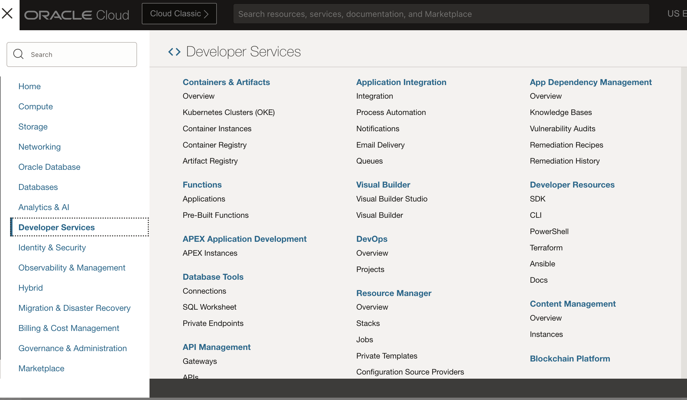

2. Create Visual Builder Instance by providing the details and click Create Visual Builder Instance:
    * Name =
    * Compartment =
    * Node =

    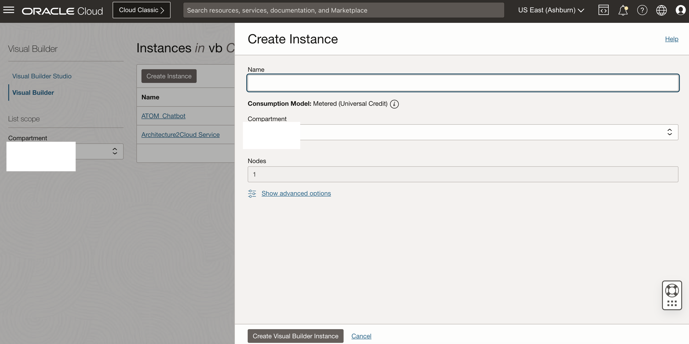

3. Wait for the instance to come to Active (green color) status

4. Click on the link to download the VB application (zip file)

    [MultiStepAgentAPIOrchestration-1.0.zip](https://objectstorage.us-chicago-1.oraclecloud.com/p/1RihiAG-eK8EEOa5rEL-lbJSbqHEYinN_S_zioLaijvTUaTjxqCJUL0axv_1eQyt/n/idb6enfdcxbl/b/Excel-Chicago/o/Livelabs/genai-multi-agent/MultiStepAgentAPIOrchestration-1.0.zip)

5. Import the application in provisioned instance as per the screenshots. Users only need one VCBS instance created. They can import/create multiple applications in the instance for each additional chatbot they have
    * Click on Import from Visual Builder Instance

    

    * Choose the option as below

    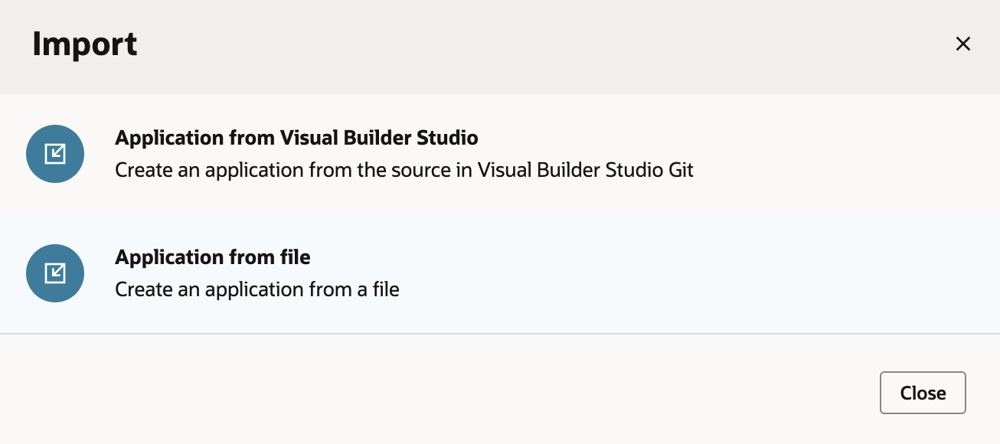

    * Provide the App Name with other details and select the provided application zip file

    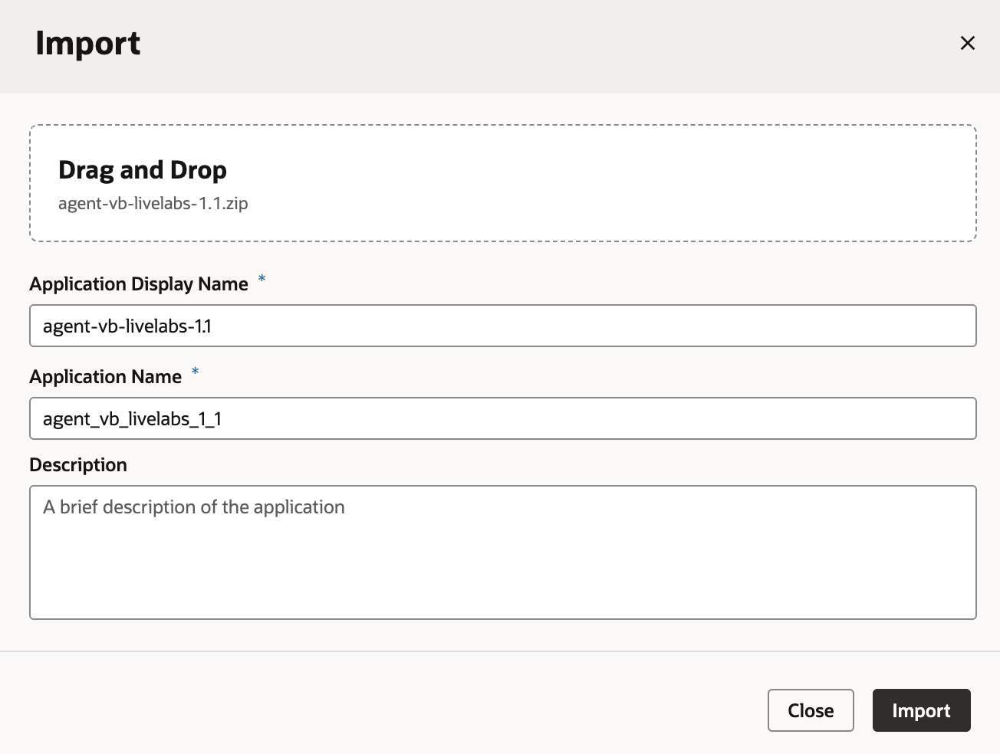

    **Note** If you are do not see the standard left hand menu bar and instead see a yellow upgrade banner like the image below, upgrade the runtime dependency by clicking on the **Upgrade** button in the top right. After the migration is successful and you close the window. The page should refresh and you should now have a nav bar on the left hand side.

    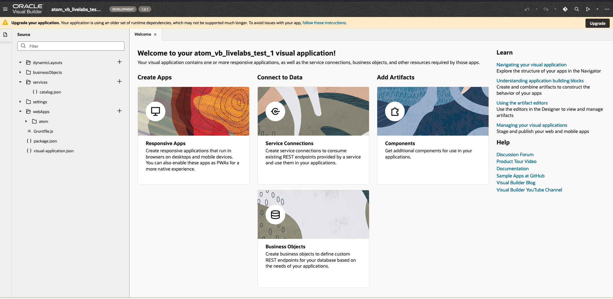

## Task 2: Configure and Customize Application

1. Once import is completed, update the ODA JavaScript
    * In the Web Applications sidebar on the left
    * Click on the carrot next to **atom** -> **main** -> **main-embedded-chat**
    * On the main screen, make sure you are on the **JavaScript** tab for **main-embedded-chat**
    * update the details as follows:
        * URI = 'oda-XXXXXXXXXXXX.data.digitalassistant.oci.oraclecloud.com/'
            * URI is the hostname of the ODA instance provisioned in Task 2 of the previous lab.
            * You can copy the base web url from the digital assistant instance details, but remove the **botsui/** path
        * channelId = 'XXXXXXXXXXXXXXXXXXXXXXXXXXXX'
            * channelId is created during Task 5 - Step 3 of the previous lab
    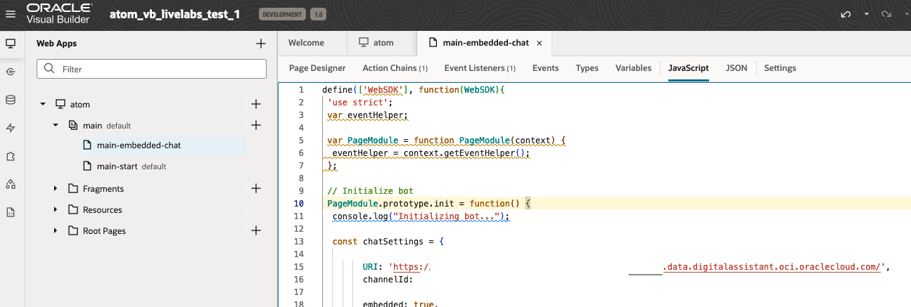

2. The UI of the chatbot such as theme, color and icon can be changed by modifying the parameters under const chatSettings in this Javascript
    Recommended Customizations:
    * icons -> logo
    * icons -> avatarBot
    * i18n -> en -> chatTitle

3. Install the Markdown Component
    * In the **components** sidebar on the left
    * Browse for **Markdown Document Viewer** and install it

    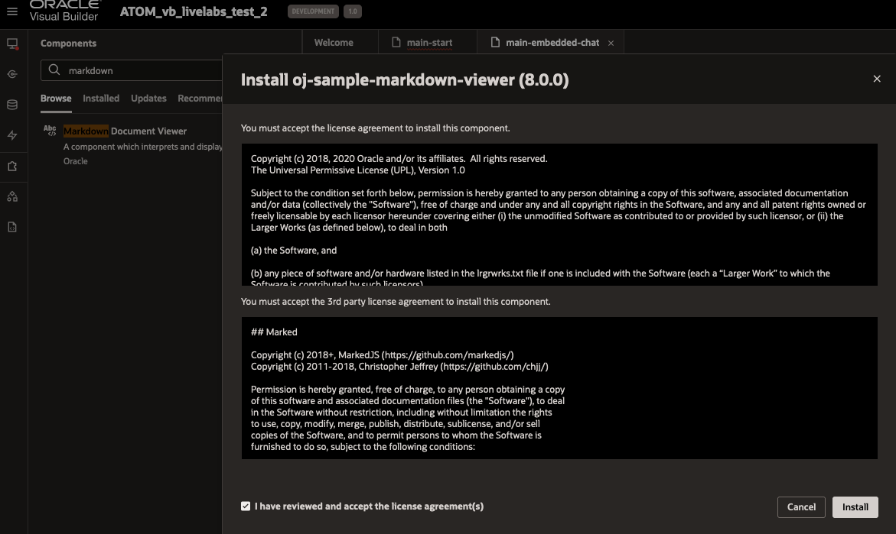

4. Update the Acknowledgement page
    * In the Web Applications sidebar on the left
    * Click on the carrot next to **atom** -> **main** -> **main-start**
    * On the main screen, make sure you are on the **Page Designer** tab for **main-start**
    * Under Structure, look for the **Markdown Document Viewer** under the flex containers
    * To edit a line, click on the corresponding **Markdown Document Viewer** component and click on it's data tab on the right (under Properties)

    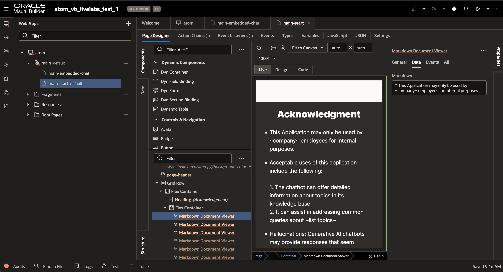

    Recommended Customizations:
    * Company name
    * valid Employees/users
    * Knowledge Base topics
    * Links to corporate policies, standards, Data use, and/or Personal Information

5. Click on the Play button shown in the above image on the top right corner to launch ATOM chatbot and start chatting with ATOM.

    You can use the following sample prompts to chat:

     ```text
       <copy>
       1. Where is the store Oracle Eats located?

       2. When did the store All U Can Eat open?

       3. What is address of the store Moscone Store?

       4. Where is the store Big Grab located, and how is the weather there?

       5. What are the available regions?

       6. Add Denver region?

       7. What are the available regions?
       </copy>
    ```

## Task 3: (optional) Setup Production version of VB

In this Task, we will use VB's development lifecycle to create a **Live** version of the app and get the corresponding url. Then we will setup access the app through OCI IAM. Once complete, you can distribute this app url to your end users. Before accessing the app, users will need to login using your Tenancy's login page.

1. Promote app to Live
    Visual Builder has management tools for application versioning and environments. Your app starts out with a 1.0 Development environment

    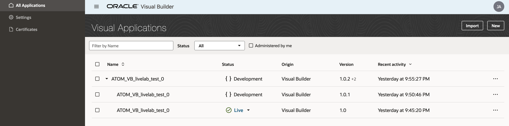
    * In the Visual Builder Service Console, the first page to load should be the **All Applications** page (also available via hamburger menu in top left)
        * If you don't see the desired application, check the **Administered by me** box
        * click on the carrot button next to the name to see all versions of the app
    * To promote a version from Development to Staging, click on the ellipses menu on the right -> **Stage**
        **Note** Your choice for **Business Object Data** does not matter as this VB app stores no data.
    * To promote a version from Staging to Live, click on the ellipses menu on the right -> **Publish**
    * After publishing a live version, you will no longer be able to make changes to that version. You can create a new version of the app by clicking on the ellipses menu on the right -> **New Version**
        * The new version of the app will start in Development, and can be similarly promoted
    * To get the live url, click on the carrot button next to Live -> atom. The live app will open in a new Browser window
        * The url will follow the format `https://<VB_service_name>-vb-<tenancy_namespace>.builder.<region>.ocp.oraclecloud.com/ic/builder/rt/<VB_app_name>/live/webApps/atom/`

2. Enable Access to VB Apps
    * Note your VB instance name that was created in Task 1 step 2.
    * Navigate in the OCI Console to Identity & Security -> Identity -> Domains
        * If your tenancy does not have Identity Domains yet, follow [these instructions](https://docs.oracle.com/en/cloud/paas/app-builder-cloud/visual-builder-oci-admin/setting-users-and-groups-cloud-accounts-that-do-not-use-identity-domains-1.html#GUID-8B11C575-3CB9-4E46-BD09-17BD9B9897EE)
    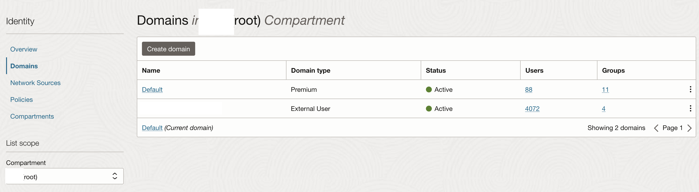
    * Click on the domain tied to your VB instance
        * Likely the current domain, **Default** domain, or **OracleIdentityCloudService** domain
        * If you do not see these domains, change the compartment view to **root**
    * Under **Oracle Cloud Services**, search for your VB instance name or **VisualBuilder Cloud Service**
    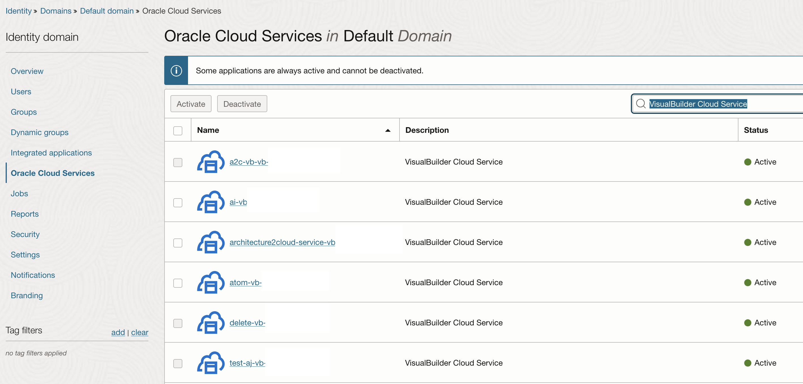
    * Click on the VB instance with naming convention {VB instance Name}-vb-{tenancy namespace}
    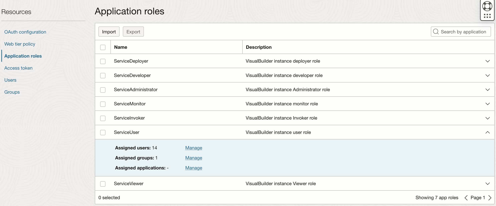
    * under **Application roles** add users or groups (preferred) to the appropriate roles
        * Fellow Developers and Admins should be added to ServiceDeveloper or ServiceAdministrator roles
        * End Users should be added to the ServiceUser role
        * [See the documentation for privilege details](https://docs.oracle.com/en/cloud/paas/app-builder-cloud/visual-builder-oci-admin/oracle-visual-builder-roles-and-privileges-1.html#GUID-198BB498-5B16-4408-9E9C-86A1F6252083)
    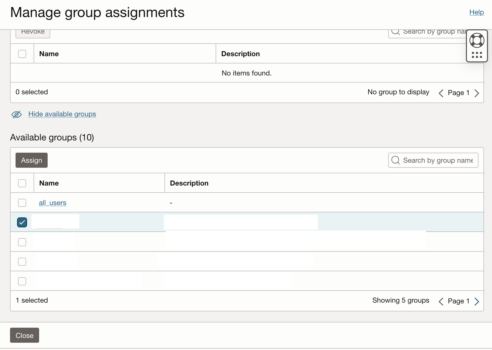
    * To add a group to a role:
        * click on the carrot button on the right side
        * click **Manage** under assigned groups
        * click **Show available groups**
        * check the box next to each group to add
        * click **Assign**

3. Remove Authentication (Not Recommended)
    You can remove the authentication requirement for this application by updating the security settings in the **JSON** tab from **Root Pages/shell**. Set **requiresAuthentication** to false.

    ```
    <copy>"security": {
        "access": {
            "requiresAuthentication": false
        }
    }</copy>
    ```
You may now proceed to the next lab.

## Acknowledgements

* **Author**
    * **Abhinav Jain**, Senior Cloud Engineer, NACIE
    * **Kaushik Kundu**, Master Principal Cloud Architect, NACIE
    * **Luke Farley**, Senior Cloud Engineer, NACIE

* **Last Updated By/Date**
    * **Jadd Jennings**, Principal Cloud Architect, NACIE, March 2025
