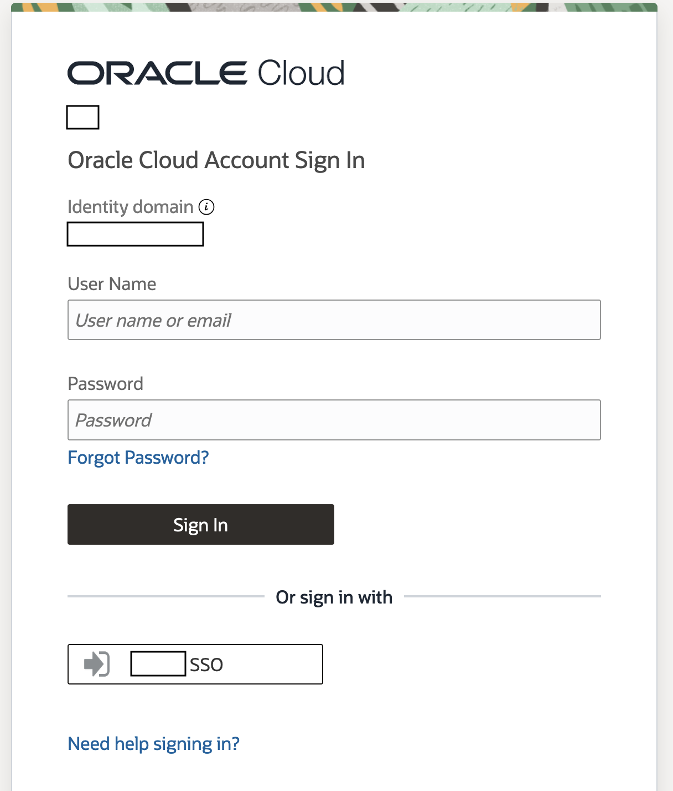
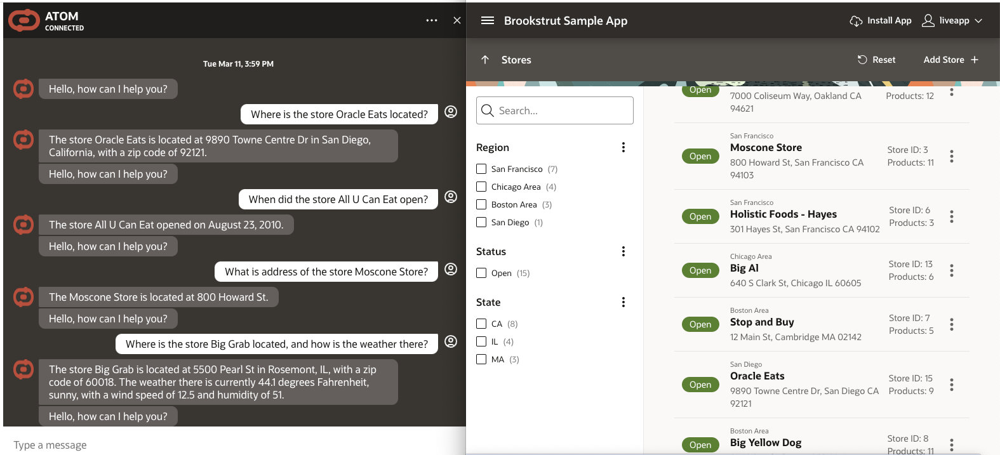
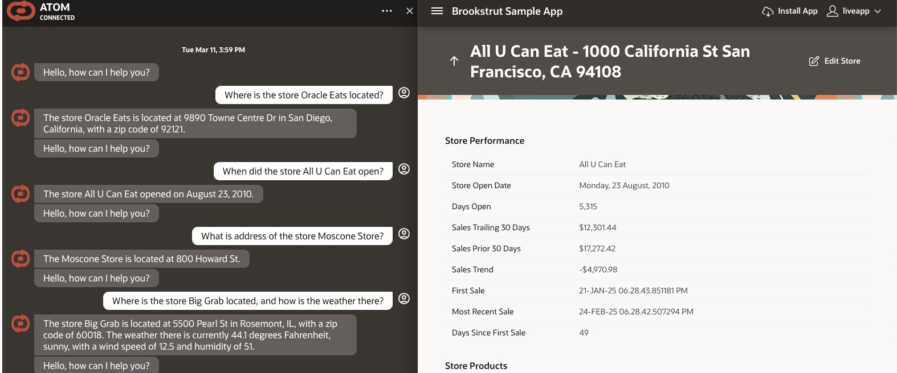
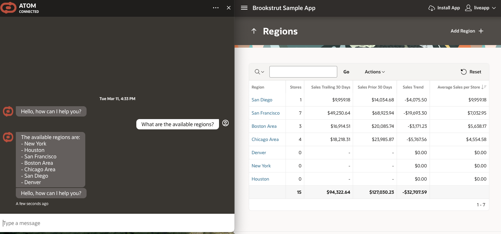
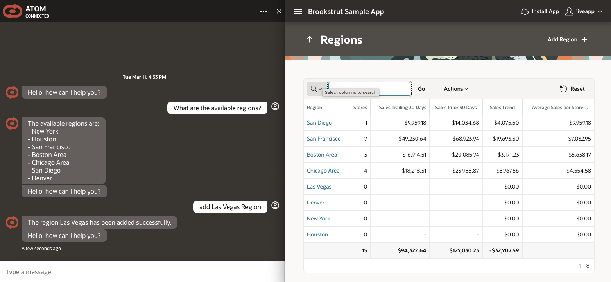

# Demo User Experience

## Introduction

This lab walks you through using the application as an end user.

Estimated Time: 15 minutes

### Objectives

In this lab, you will:

* Login to the application
* Chat with the agent

### Prerequisites

This lab assumes you have:

* Access to a fully deployed application

## Task 1: Login to the Application

1. Navigate to the website url your application administrator provided you.

    The url may be a vanity url or look like this:

    `https://<vb_instance_name>-vb-<tenancy_namespace>.builder.<region>.ocp.oraclecloud.com/ic/builder/rt/<vb_app_name>/live/webApps/atom/`

2. If you do not have an active session, you will be prompted to login to the OCI tenancy.

    

    * If your tenancy has an SSO option, try that first
    * If you have issues logging in or do not know what credentials to use, reach out to your application administrator
    * If this is your first time logging into the tenancy, you may need to setup a MFA device

## Task 2: Collaborate with Chatbot

1.  Chatbot loop:
    This chatbot provides a simple continuous loop for you to ask questions against. These questions should be about the apex sample app you deployed in lab 1 or APIs configured.
    It will not be able to answer general world questions like a foundational model typically does. Instead, the agent will respond saying it cannot answer your question

    

    
    
    

    

2. Some sample prompts for you to try:

     ```text
       <copy>
       1. Where is the store Oracle Eats located?

       2. When did the store All U Can Eat open?

       3. What is address of the store Moscone Store?

       4. Where is the store Big Grab located, and how is the weather there?

       5. What are the available regions?

       6. Add Denver region?

       7. What are the available regions?
       </copy>
    ```

## Acknowledgements

* **Author**
    * **Jadd Jennings**, Principal Cloud Architect, NACIE
    * **Kaushik Kundu**, Master Principal Cloud Architect, NACIE
* **Last Updated By/Date**
    * **Jadd Jennings**, Principal Cloud Architect, NACIE March 2025
