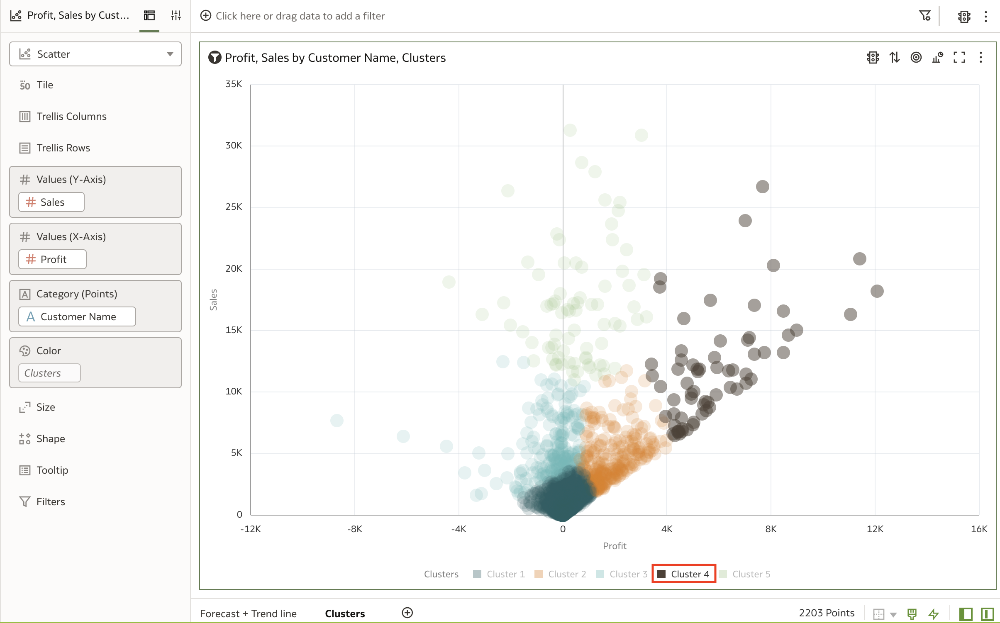

# One-Click Advanced Analytics

## Introduction

In this lab, you will learn about Oracle Analytics' one-click advanced analytics capabilities and build your own Forecast, Trend line, and Clusters.

Estimated Time: 10 minutes

### Objectives

In this lab, you will:
* Create a Forecast, Trend line, and Clusters

### Prerequisites

This lab assumes you have:
* Access to Oracle Analytics Cloud
* [Sample Order Lines DS](https://objectstorage.us-ashburn-1.oraclecloud.com/p/x4wryiFOjhANhy2yDOy08kMOKKaR_b3jW6KX2Dpbi3cN3QCcdradiPZ7BJBNmtAM/n/idmqvvdwzckf/b/LiveLabs-Files/o/Sample%20Order%20Lines%20DS.xlsx) dataset

## Task 1: Create a Forecast and Trend line

1. From the homepage, click **Create** and select **Workbook.**

  

2. In the **Add Data** dialogue box, search for **Sample Order Lines DS**. Click **Add to Workbook.**

    >Note: If you do not have the Sample Order Lines DS dataset, click **Create Dataset** and import the **Sample Order Lines DS** dataset.

  

3. Close the auto-insights panel.

  

4. CTRL (Command on mac) + click **Sales** and **Month** from **Ship Date** and drag it onto the canvas.

  

5. A line graph is automatically created.

  

6. Drag **Month** from **Ship Date** to the filter.

  

7. Select **January 2023** from the list and then check the **Exclude** box. Since our data for January 2023 is incomplete, it will mess up our forecast. Click away from the filter options.

  

8. Right-click on the visualization. Click **Add Statistic** and then select **Add forecast.**

  

9. With just two clicks, Oracle Analytics auto-generated a forecast of our sales. The default value is 3 for period which means this is a forecast for the next 3 months.

  

10. Change the **Period** to **6** to get a forecast for the next six months.

  

11. To add a trend line, right-click the visualization again, and from **Add Statistics,** click **Trend Line.**

  

12. You can change the trend line method based on the type of data you're looking at.

  

13. Rename the canvas as **Forecast + Trend line.** Then add a new canvas by clicking the **Add Canvas** button.

  

## Task 2: Create a Cluster

1. CTRL (Command on Mac) + click **Sales,** **Profit,** and **Customer Name.** Then drag it onto the canvas to create a Scatter plot.

  

2. Right-click, and from **Add Statistics,** click **Clusters.**

  

3. Oracle Analytics automatically creates a cluster. In this example, a K-Means cluster with five groups is created, which can be modified to your liking.

  

4. Hover your mouse over the **Cluster 4** from the key and you'll notice that you can easily highlight all of your most profitable customers.

  

5. Let's rename our canvas. Click the drop-down option for the canvas name and click **Rename.** Type **Clusters** for the name and click Enter.

  

In this lab, you have successfully learned how to use Oracle Analytics' Advanced Analytics capabilities. You may now **proceed to the next lab**.

## Learn More
* [Enhance Data in Visualizations with Advanced Analytics Functions](https://docs.oracle.com/en/middleware/bi/analytics-desktop/bidvd/enhance-data-visualizations-advanced-analytics-functions.html#GUID-87DD71E5-9AFC-405C-A812-6EF9FEE96454)

* [Getting Started with Oracle Analytics Cloud](https://docs.oracle.com/en/cloud/paas/analytics-cloud/acsgs/what-is-oracle-analytics-cloud.html#GUID-E68C8A55-1342-43BB-93BC-CA24E353D873)

## Acknowledgements
* Author - Nagwang Gyamtso, Product Manager, Analytics Product Strategy
* Last Updated By/Date - Nagwang Gyamtso, February, 2023
