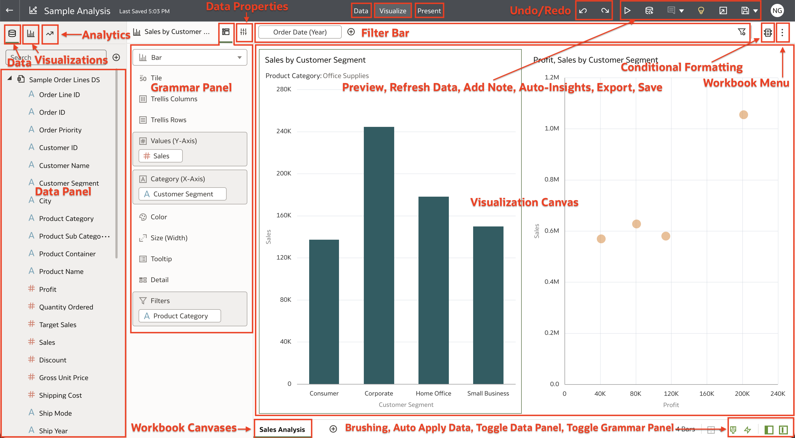

# Basic Data Visualization

## Introduction

In this lab, you will learn how easy it is to create data visualizations and understand how brushing works in Oracle Analytics Cloud.

  

Estimated Time: 15 minutes

### Objectives

In this lab, you will:
* Create basic visualizations
* Understand how Brushing works in Oracle Analytics

### Prerequisites

This lab assumes you have:
* Access to Oracle Analytics Cloud
* [Sample Order Lines DS](https://objectstorage.us-ashburn-1.oraclecloud.com/p/x4wryiFOjhANhy2yDOy08kMOKKaR_b3jW6KX2Dpbi3cN3QCcdradiPZ7BJBNmtAM/n/idmqvvdwzckf/b/LiveLabs-Files/o/Sample%20Order%20Lines%20DS.xlsx) dataset

## Task 1: Basic Data Visualization
In this section, you will upload the Sample Order Lines DS and apply data transformations to enhance your dataset.

1. Log in to your Oracle Analytics instance.

2. From the homepage, click **Create** and then select  **Workbook**.

  

3. Select the **Sample Order Lines DS** dataset and click **Add to Workbook**.

  

4. If auto-insights are enabled for your dataset, you will get auto-generated visualizations as suggestions on the right side of your screen. We won't focus on Auto-Insights in this lab but feel free to explore the suggested visualizations. Close the auto-insights pane.

  

5. CTRL + click **Sales** and **Customer Segment**. Right-click and select **Create Best Visualization**. This lets Oracle Analytics pick the best visualization based on the metrics selected.

  

6. A Vertical Bar Chart is created based on the preconfigured logic, and we understand that Corporate is the Top Performing Customer Segment.

  

7. Now, let's create our own visualization and pick from the vast number of visualization types available. CTRL+click **Sales**, **Profit**, and **Customer Segment**. Right-click and select **Pick Visualization...**.

  

8. Oracle Analytics has over 40 visualizations types out of the box. Select the **Scatter** plot.

  

9. A **Scatter** plot is added as a second visual in the canvas.

  

10. Click the drop-down on **Order Date**. Select **Year** and drag it to the canvas filter pane to create a year filter for all the visualizations on the canvas.

  

11. From the list of years, select **2022**. This will give us the visualizations using 2022 data. Click on the canvas to exit the filter.

  

12. Now let's create a filter for our Sales by Customer Segment visualization. Click the Bar chart visualization. Select **Product Category** and drag it to the **Filters** section of the grammar pane.

  

13. From the filter values, select **Office Supplies**. This will filter our Sales by Customer Segment visualization to show us the data for the Office Supplies Product Category. Click on the canvas to exit the filter selection.

  

14. Your canvas now has a canvas filter for the year 2022 and the Sales by Customer Segment visualization is filtered to the Office Supplies Product Categories.

  

15. Rename the canvas by clicking the canvas option drop-down and selecting **Rename**. Enter <code>Sales Analysis</code> as the canvas name.

  

## Task 2: Brushing
In this section, we will explore brushing, which automatically highlights datapoints that are selected in one visualization in other visualizations.

1. Click the **Add Canvas** button to add a new canvas.

  

2. Ctrl (Command on Mac) + Select  **Sales** and **Customer Segment** from the **Sample Order Lines DS** dataset. Right-click and select **Pick Visualization**.

  

3. Select the **Donut** chart.

  

4. Ctrl (Command on Mac) + Select  **Sales**, **Customer Segment**, and **Product Category** from the **Sample Order Lines DS** dataset. Right-click and select **Pick Visualization**.

  

5. Choose the **Horizontal Stacked** chart.

  

6. Swap **Customer Segment** with **Product Category**.

  

7. Your final canvas will look like the following:

  

8. Click on the **Small Business** customer segment in the donut chart. When you click on one data point in a visual, the same data point gets highlighted in the other visual. We understand that out of 6M Sales generated, the Small Business Customer Segment generates 19.05% of Sales.

    >**Note:** Brushing is enabled by default. You can enable/disable this in the [Canvas Properties](https://docs.oracle.com/en/cloud/paas/analytics-cloud/acubi/update-canvas-properties.html).

  

9. If you hover over the highlight in **Furniture** on the second visual, we also understand that the **Furniture Product Category** contributes **$341,098** to the **Small Business Customer Segment**. Brushing helps us learn more about our data points in other contexts.

  

## Task 3: Reorder and Format Your Visualizations

1. Select **Product Category**, **Sales**, and **Month (Order Date)**. Drag these three columns to under the two visuals and drop it when a green bar appears under both existing visualizations.

  

2. To reorder your visualizations, you can drag them by the title and drop them anywhere on the canvas as long as a green bar appears indicating where the visualization will be placed. Drag the horizontal stacked chart to the right side of the donut chart. Make sure you drop the chart where the shorter green bar which aligns with the donut chart appears.

  

3. Let's change the title of our line chart. Select the **Sales by Order Date (Month), Product Category** line chart and click the **Properties** panel.

  

4. This is the properties panel which allows your to format your visualizations. You can format things like the title, font, legend, axis labels, values, date format, filters, and add statistics to your visualizations. For this lab, we will only change the title.

  

5. Click the **Title** setting and choose **Custom**. Here, you can input your custom title but for now, let's just input "How are sales for the product categories trending over time?" and hit Enter.

  

6. Save the workbook by clicking the **Save** icon.

  

7. Enter <code>Sample Analysis</code> for **Name** and click **Save**.

  

## Task 4: Share Your Insights

1. To share your insights, click the **Export** icon on the top right of the page.
  

2. You have the option to export a digital **File** or **Print** a physical copy. Select **File**.

  

3. Here, you have a few options such as the format, which canvas you want to export, where you want to include filters, titles, the size, and orientation of the file.

  

4. Click the dropdown for **Format** options. Oracle Analytics currently allows you to export five different formats. PowerPoint, Acrobat, and Image are all visual options while Data and Package allows you to export the underlying data and the whole workbook.

  

5. The **Include** setting lets you either choose the active visualization, the active canvas, or all canvases depending on the type of format you select.

  

6. The other options allow you to include filters used in the visualization, include titles, choose the size and finally the orientation of your file. Choose the following settings and click **Save**. This will export the file which you can distribute to your audience to share your insights!

  

Congratulations, you have completed the basic data visualizations in Oracle Analytics lab. To learn more, check out the resources listed below!

You may now **proceed to the next lab**.

## Learn More
* [Getting Started with Oracle Analytics Cloud](https://docs.oracle.com/en/cloud/paas/analytics-cloud/acsgs/what-is-oracle-analytics-cloud.html#GUID-E68C8A55-1342-43BB-93BC-CA24E353D873)
* [About Visualizaton Types](https://docs.oracle.com/en/cloud/paas/analytics-cloud/acubi/visualization-types.html)
* [About Brushing Between Visualizations on a Canvas](https://docs.oracle.com/en/cloud/paas/analytics-cloud/acubi/brushing-visualizations-canvas.html)
* [Export Content from Analyses and Dashboards](https://docs.oracle.com/en/cloud/paas/analytics-cloud/acubi/export-content-analyses-and-dashboards.html#GUID-317A5C27-0C7C-4026-9D4D-3AF4773C9725)

## Acknowledgements
* Author - Nagwang Gyamtso, Product Manager, Analytics Product Strategy
* Contributors - Shiva Oleti
* Last Updated By/Date - Nagwang Gyamtso, February 2023
