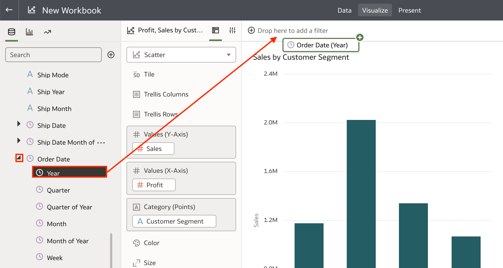

# Basic Data Visualization

## Introduction

In this lab, you will learn how easy it is to create data visualizations in Oracle Analytics Cloud.

  

Estimated Time: __ minutes

### Objectives

In this lab, you will:
* Create basic visualizations

### Prerequisites

This lab assumes you have:
* Access to Oracle Analytics Cloud
* Sample Order Lines DS dataset

## Task 1: Basic Data Visualization
In this section, you will upload the Sample Order Lines DS and apply data transformations to enhance your dataset.

1. Log in to your Oracle Analytics instance.

2. From the homepage, click **Create** and then select  **Workbook**.

  

3. Select the **Sample Order Lines DS** dataset and click **Add to Workbook**.

  

4. If auto-insights are enabled for your dataset, you will get auto-generated visualizations as suggestions on the right side of your screen. We won't focus on Auto-Insights in this lab but feel free to explore the suggested visualizations. Close the auto-insights pane.

  

5. CTRL + click **Sales** and **Customer Segment**. Right-click and select **Create Best Visualization**. This lets Oracle Analytics pick the best visualization based on the metrics selected.

  

6. A Vertical Bar Chart is created based on the preconfigured logic, and we understand that Corporate is the Top Performing Customer Segment.

  

7. Now, let's create our own visualization and pick from the vast number of visualization types available. CTRL+click **Sales**, **Profit**, and **Customer Segment**. Right-click and select **Pick Visualization...**.

  

8. Oracle Analytics has over 40 visualizations types out of the box. Select the **Scatter** plot.

  

9. A **Scatter** plot is added as a second visual in the canvas.

  

10. Click the drop-down on **Order Date**. Select **Year** and drag it to the canvas filter pane to create a year filter for all the visualizations on the canvas.

  

11. From the list of years, select **2022**. This will give us the visualizations using 2022 data. Click on the canvas to exit the filter.

  

12. Now let's create a filter for our Sales by Customer Segment visualization. Click the Bar chart visualization. Select **Product Category** and drag it to the **Filters** section of the grammar pane.

  

13. From the filter values, select **Office Supplies**. This will filter our Sales by Customer Segment visualization to show us the data for the Office Supplies Product Category. Click on the canvas to exit the filter selection.

  

14. Your canvas now has a canvas filter for the year 2022 and the Sales by Customer Segment visualization is filtered to the Office Supplies Product Categories.

  

15. Rename the canvas by clicking the canvas option drop-down and selecting **Rename**. Enter <code>Sales Analysis</code> as the canvas name.

  

16. Save the workbook by clicking the save icon.

  

17. Enter <code>Sample Analysis</code> for **Name** and click **Save**.

  

You just learned how to create basic visualizations and filters in Oracle Analytics.

## Learn More
* [Getting Started with Oracle Analytics Cloud](https://docs.oracle.com/en/cloud/paas/analytics-cloud/acsgs/what-is-oracle-analytics-cloud.html#GUID-E68C8A55-1342-43BB-93BC-CA24E353D873)
* [About Visualizaton Types](https://docs.oracle.com/en/cloud/paas/analytics-cloud/acubi/visualization-types.html)

## Acknowledgements
* Author - Nagwang Gyamtso, Product Manager, Analytics Product Strategy
* Contributors -
* Last Updated By/Date -
