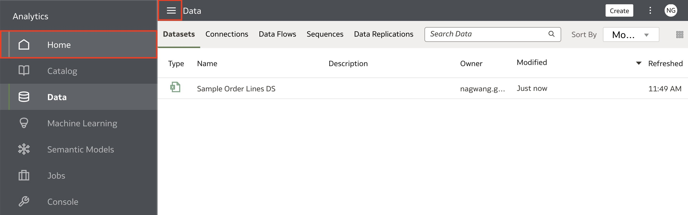

# BI Ask

## Introduction

In this lab, you will learn how to setup and use BI Ask, a natural language querying feature to answer business questions with visualizations based on your data.

  

Estimated Time: 5 minutes

### Objectives

In this lab, you will:
* Setup BI Ask
* Answer questions with BI Ask

### Prerequisites

This lab assumes you have:
* Access to Oracle Analytics Cloud
* [Sample Order Lines DS](https://objectstorage.us-ashburn-1.oraclecloud.com/p/J6wePlhCmLfKoZRTdaMTEKerOCkYrnN3cPd4-g899hTOureVn6tHRZ048xjb4tTv/n/idtlyhmtj68r/b/LiveLabFiles/o/Sample Order Lines DS.xlsx)

## Task 1: Set-up BI Ask
In this section, we will set-up the BI Ask feature for our dataset.

1. From the Homepage, open the **Navigator** menu and click **Data**.

  

2. Right-click the **Sample Order Lines DS** and click **Inspect**.

  

3. Here, you can get more details about your dataset, such as the Data Elements, Search settings, and Access to the dataset. Click **Search**.

  

4. Check the box for **Index Dataset for Searching**. This is where you can input the settings for the indexing schedule. Click **Save**.

  

5. Click **Run Now** to run the index, and after the index is successfully initiated, click **Close**.

  

## Task 2: Use BI Ask
In this section, we will use BI Ask to generate visuals from a query.

1. Open the **Navigator** and go back to the **Homepage**.

  

2. In the **Search Everything** bar, type in **What is Sales by Customer Segment and City** and hit **Shift+Enter** on your keyboard.

  

3. The BI Ask should return visuals based on the datasets available to you.
    > Note: If you do not see visuals generated, remove the question mark from your question and click Shift+Enter again. If it still doesn't work, ensure you run the index on your dataset and try re-logging into your instance.

  

4. Hover over the visual you want to explore further and click the **Explore as Workbook** option.

  

5. A new workbook will open with the visual. You can add additional visualizations or interact with the map to learn more about the Sales by City.

  

With this lab, you have learned how to set-up and use the BI Ask functionality in Oracle Analytics. You may now **proceed to the next lab**.

## Learn More
* [Getting Started with Oracle Analytics Cloud](https://docs.oracle.com/en/cloud/paas/analytics-cloud/acsgs/what-is-oracle-analytics-cloud.html#GUID-E68C8A55-1342-43BB-93BC-CA24E353D873)

## Acknowledgements
* Author - Nagwang Gyamtso, Product Manager, Analytics Product Strategy
* Last Updated By/Date - Nagwang Gyamtso February, 2023
