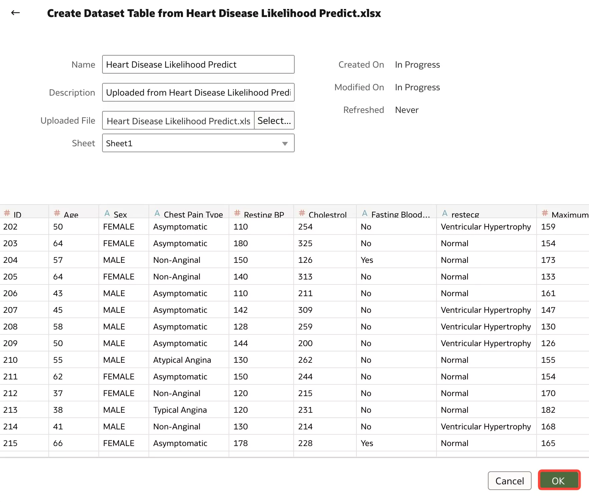
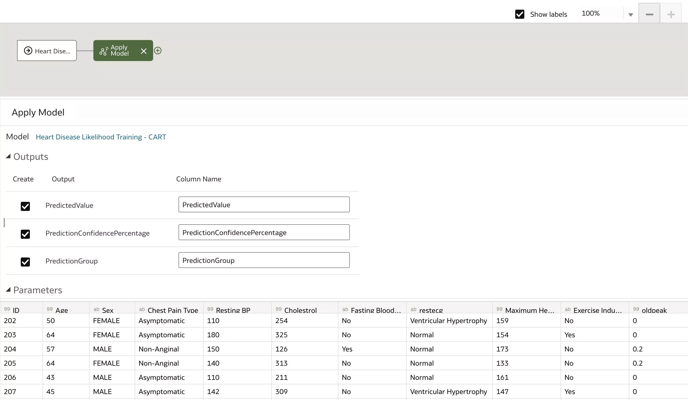

# Build a Machine Learning Model

## Introduction

In this lab, you will learn how to train, inspect, and apply a machine learning model in Oracle Analytics.

Estimated Time: 25 minutes

### Objectives

In this lab, you will:
* Train a model
* Inspect the model
* Apply the model

### Prerequisites

This lab assumes you have:
* Access to Oracle Analytics Cloud
* [Heart Disease Likelihood Predict](https://objectstorage.us-ashburn-1.oraclecloud.com/p/bKHNgjJfla3hV-Z-9lM6YSlJRmjNdj8WjKXyhmgF-W3ZB7y22Du-5mhTVni9-trJ/n/idmqvvdwzckf/b/LiveLabs-Files/o/Heart%20Disease%20Likelihood%20Predict.xlsx) dataset
* [Heart Disease Likelihood Training](https://objectstorage.us-ashburn-1.oraclecloud.com/p/WPnJyNIDo7OXU2-QrPi3PhvAvCWuYydaRA3YVA8IxMmmXQ-_t6LlHRfaG-QNgTR_/n/idmqvvdwzckf/b/LiveLabs-Files/o/Heart%20Disease%20Likelihood%20Training.xlsx) dataset

## Task 1: Train a Machine Learning Model

1. Let’s add the historical data set, or the training data set, in our analytics environment. Click on **Create** and the select **Data Set**.

  

2. Your training dataset could be in any source, but for this demo, we have it in an excel file. Click on the **File upload** icon.

  

3. From your local machine, select the **Heart Disease Likelihood Training.xlsx** file and click **Open**.

  

4. The selected file is now opened in the environment. As we browse through the columns, we find that it contains historical data of patients and the factors that influence the chances of getting a heart disease. Click **OK** to add the dataset.

  

5. Save the dataset as **Heart Disease Likelihood Training** and click **OK**. Then go back to the homepage.

  

6. From the Homepage, click **Create** and then select **Data Flow**.

  

7. Let’s add the dataset you just created to train your model. Select **Heart Disease Likelihood Training** and click **Add**

  

8. Once the dataset is added, you can click on the **+** icon to add steps. Now you could use the data set to run through any transformations if required. We will use the **Train Multi Classifier** task, from the available OOTB ML Classifications. Click on **Train Multi-Classifier**.

  

9. From the list of available model scripts, select **CART for Model Training** and click **OK**.

  

10. For the target column, lets select Likelyhood.

  

11. Change **Positive Class in Target** to **Present** instead of **Yes** and **Balancing Method** to **Oversample**.

  

12. The output of the training step is a model. Click on **Save Model**.

  

13. In **Model name**, type **Heart Disease Likelihood Training - CART**. Let’s save the DataFlow too. Saving the data flow is useful in cases where the user would like to revisit the model or tune the model to get better results. Click **Save**.

  

14. Save the data flow as **CART Heart Disease Training** and click **OK**.

  

15. You now need to run the data flow to create the ML Model. Click the **Run Data Flow** icon.

  

16. After the completion of the data flow, let's evaluate the ML model. Go back to the homepage.

  

17. Click the Navigation menu and select **Machine Learning**.

  

18. You will find your trained Multi Classifier CART machine learning model ready for use. In the next task, we will inspect this model.

  

## Task 2: Inspect the Machine Learning Model

1. To review the model created, click on the **Actions Menu** ellipsis for the CART model and select **Inspect**.

  

2. Here you have information on the model. Select the **Quality Tab**.

  

3. Here you get the information on the model accuracy metrics of the CART Model. Model accuracy shows 53%. Close the inspect box.

    >**Note**: You can improve the model accuracy by running the Train Step with additional data scenarios.

  

## Task 3: Apply the Machine Learning Model

1. Your model is trained/created, reviewed for quality, and is now ready to predict Heart Disease Prediction. To apply the model, you need to create a data flow with the dataset that needs prediction. Click **Create** and select **Data Flow**.

  

2. To bring in the dataset that requires prediction, click on **Create Dataset**.

  

3. Click on the **Upload File** icon.

  

4. Browse to the file location, select the **Heart Disease Likelihood Predict.xlsx** file and click **Open**.

  

5. Click **OK**.

  

6. Save the dataset as **Heart Disease Likelihood Predict** and click **OK**.

  

7. Go back to the data flow tab in your browser and **Add** the **Heart Disease Likelihood Predict** dataset.

  

8. Now that the dataset is added to the data flow, let's add the next steps. Click on **+** icon and select **Apply Model**.

  

9. Select the **Heart Disease Likelihood Training - CART** model which we created earlier and click **OK**.

  

10. Leave all other parameters and inputs as is.

  

11. Click on the **+** icon, and select **Save Data**.

  

12. On the Save Dataset name, type in **Heart Disease Likelihood Prediction**. In the **Save data to** field, select **Dataset Storage**. For columns, you will set all columns as attributes, except for **PredictionConfidencePercentage**, **Age**, **oldpeak**, **Resting BP**, and **Cholestrol**.

  

13. Save the data flow. In the name field, type in **Heart Disease Likelihood Prediction**. Click **OK**.

  

14. Click **Run Data Flow**. Once the run is completed, go back to the homepage.

  

15. Navigate to the **Data Sets** tab in **Data**. Here you will find the dataset with predicted values which was created with the execution of the data flow. Double-click the "Heart Disease Likelihood Prediction" dataset and click **Create Workbook**.

  

16. From the available columns, hold CTRL or Command and select **ID**, **Sex**, **Age**, **oldpeak**, **Predicted Confidence Percentage**, **Prediction Group**, and **Prediction Value**. Right-click and select **Pick Visualization**. Then select **Table**.

  

17. Reorder the columns in the Grammar Panel in the following order: **ID**, **Sex**, **Age**, **oldpeak**, **Predicted Confidence Percentage**, **Prediction Group**. Move **Prediction Value** to color on the Grammar Panel. You see the chances of getting a heart disease based on the Predicted Value generated OOTB using Score a Model.

  

18. Save the workbook as **Heart Disease Likelihood Prediction** and click **Save**. In this section, you learned to apply your ML model to create a prediction.

  

In this lab, you have successfully learned how to use Oracle Analytics to build, train, and apply a machine learning model to predict heart disease likelihood.

## Learn More
* [Create and Use Oracle Analytics Predictive Models](https://docs.oracle.com/en/cloud/paas/analytics-cloud/acubi/create-and-use-oracle-analytics-predictive-models.html)

## Acknowledgements
* Author - Nagwang Gyamtso, Product Manager, Analytics Product Strategy
* Last Updated By/Date - Nagwang Gyamtso, April, 2023
