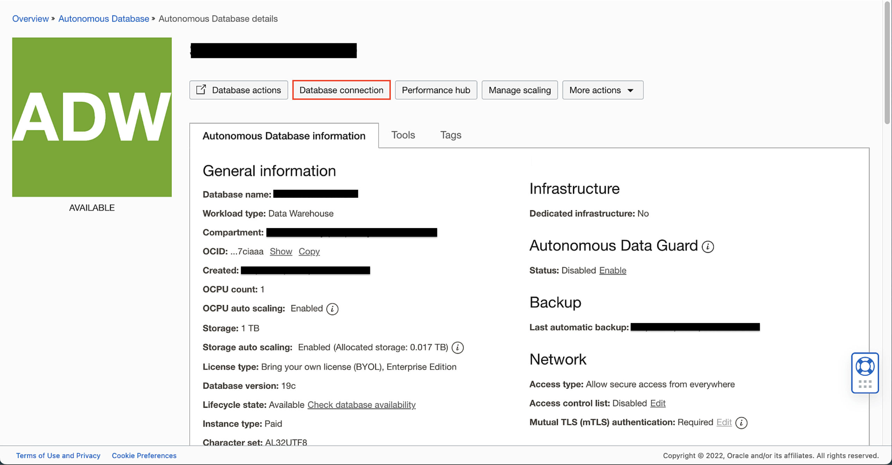
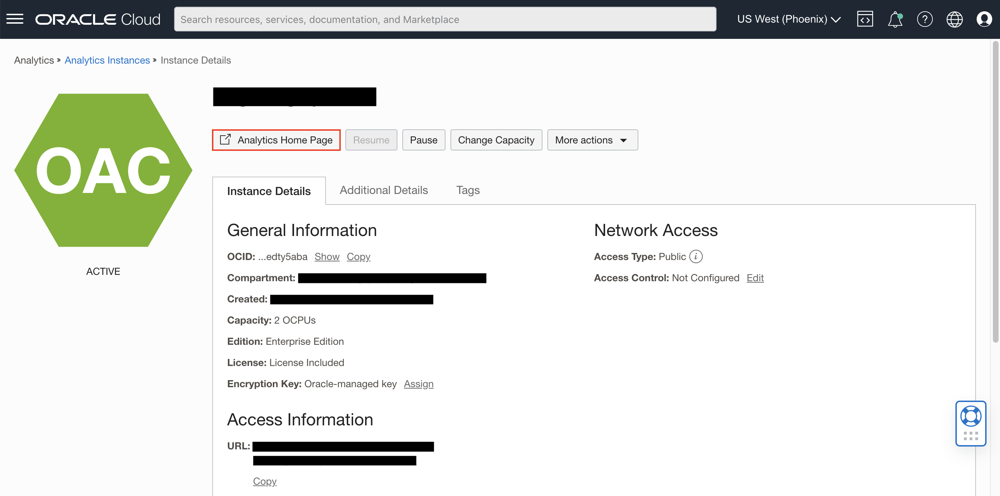

# Connect to Oracle Autonomous Data Warehouse

## Introduction

In this lab, you will learn how to create a connection to the Oracle Autonomous Data Warehouse from your Oracle Analytics Cloud instance.

Estimated Time: 5 minutes

### Objectives

In this lab, you will:
* Create a connection to an Oracle Autonomous Data Warehouse

### Prerequisites

This lab assumes you have:
* Access to Oracle Analytics Cloud
* Access to an Oracle Autonomous Data Warehouse

## Task 1: Download database connection wallet
In this section, you will download the Autonomous Data Warehouse wallet file which will be used to connect to the Autonomous Data Warehouse within Oracle Analytics Cloud.

1. Navigate to your ADW's details page and click **Database connection**.

	

2. Under wallet type, make sure **Instance Wallet** is selected and then click **Download wallet**.

	

3. Enter a wallet **Password** and click **Download**. We will use this wallet file in the next task to connect to the ADW.

	

## Task 2: Connect OAC to ADW
In this section, you define a connection to the data source to use for the Semantic Model. This lab uses the BISAMPLE schema to demonstrate the steps required to create an initial semantic model.

1. Launch your Oracle Analytics Cloud instance by clicking **Analytics Home Page** from your OAC instance details page in OCI. This will direct you to the OAC console.

	

2. On the Home page, click **Create**, and then select **Connection**.

	

3. In Create Connection, choose **Oracle Autonomous Data Warehouse**.

	

4. In the connection dialog, enter the following:

	* Connection Name: Semantic Modeler
	* Description:
	* Client Credentials: Select the wallet zip file you downloaded in task 3
	* Username: ADMIN
	* Password: (The ADMIN password you created for the ADW)
	* Service Name: This will auto load once you upload the wallet
	* System connection: Check

	

5. Select System Connection, and then click **Save**.

You have just created a connection to an Autonomous Data Warehouse.

## Learn More
* [Connecting Oracle Analytics Cloud to Your Data](https://docs.oracle.com/en/cloud/paas/analytics-cloud/acsds/connect-oracle-analytics-cloud-your-data.html)

## Acknowledgements
* **Author** - Nagwang Gyamtso, Product Manager, Analytics Product Strategy
* **Contributors** -
* **Last Updated By/Date** - Nagwang Gyamtso, February 2023
