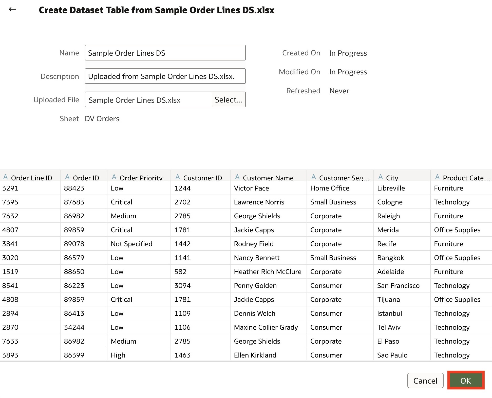
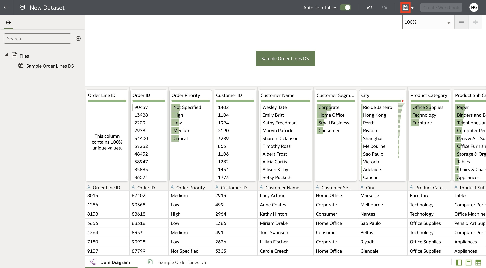

# Create a Dataset

## Introduction

In this lab, you will import data and create a dataset in Oracle Analytics in less than 5 minutes.

Estimated Time: 5 minutes

### Objectives

In this lab, you will:
* Import a local data file to create a dataset

### Prerequisites

This lab assumes you have:
* Access to Oracle Analytics Cloud
* Downloaded [Sample Order Lines DS](https://objectstorage.us-phoenix-1.oraclecloud.com/p/TBMVACa7qZgj8ijJ3j5wlILzaVVtw1jo6n4rO8mREaAKjRoWAPX0OVTaEL39buPQ/n/idbwmyplhk4t/b/LiveLabsFiles/o/Sample%20Order%20Lines%20DS.xlsx) dataset

## Task 1: Create a Dataset
In this section, you will upload the Sample Order Lines DS into Oracle Analytics and create a dataset.

1. Once you have downloaded the Sample Order Lines DS dataset, we need to create a dataset in Oracle Analytics. From the homepage, click "Create" and select "Dataset."

  

2. Click "Drop data file here or click to browse" and choose the "Sample Order Lines DS" dataset.

  

3. Click "OK".

  

4. Once the dataset is loaded, click save the dataset by clicking the "Save" button.

  

5. Enter "Sample Order Lines DS" for "Name" and click "OK".

  

6. There are two ways to create a Workbook. Click the "Go Back" button to create a Workbook from the homepage, or click "Create Workbook" on the top right after saving your dataset.

  

You may now **proceed to the next lab**.

## Learn More
* [Getting Started with Oracle Analytics Cloud](https://docs.oracle.com/en/cloud/paas/analytics-cloud/acsgs/what-is-oracle-analytics-cloud.html#GUID-E68C8A55-1342-43BB-93BC-CA24E353D873)
* [Create Datasets from Files](https://docs.oracle.com/en/cloud/paas/analytics-cloud/acubi/create-dataset-files.html#GUID-995C1D56-1B02-49EC-B097-0492539427B9)

## Acknowledgements
* Author - Nagwang Gyamtso, Product Manager, Analytics Product Strategy
* Last Updated By/Date - Nagwang Gyamtso, February 2023
