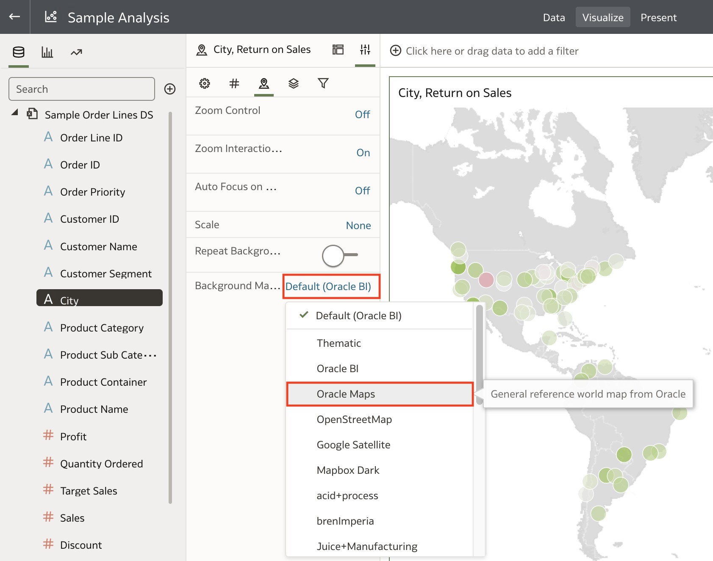

# Custom Calculations and Map Backgrounds

## Introduction

In this lab, you will create a custom Return on Sales calculation and create a map visualization using this new calculation.

  

Estimated Time: 10 minutes

### Objectives

In this lab, you will:
* Create a custom calculation
* Create a map visualization

### Prerequisites

This lab assumes you have:
* Access to Oracle Analytics Cloud
* [Sample Order Lines DS](https://objectstorage.us-phoenix-1.oraclecloud.com/p/TBMVACa7qZgj8ijJ3j5wlILzaVVtw1jo6n4rO8mREaAKjRoWAPX0OVTaEL39buPQ/n/idbwmyplhk4t/b/LiveLabsFiles/o/Sample%20Order%20Lines%20DS.xlsx) dataset

## Task 1: Create a Custom Calculation
In this section, we will explore how easy it is to create a custom calculation using the metrics available.

1. Scroll down on the Data Panel and right-click **My Calculations**. Click **Add Calculation...**

  

2. Type <code>Return on Sales</code> in the **Name** field.

  

3. The Return on Sales formula is: Operating Profit / Sales. Drag the **Profit** column from the data panel into the calculation box and enter <code>/</code>.

  

4. Now drag and drop **Sales** into the calculation and click **Validate**. Once the calculation is validated, click **Save**.

  

## Task 2: Create a Map Background
In this section, we will create a map background and explore a few customization options.

1. Click the **Add Canvas** button. We will create a map visualization using the new calculation in another canvas.

  

2. CTRL+click **Return on Sales** from **My Calculations** and CTRL+click **City**. Right-click and select **Pick Visualization**.

  

3. Select the **Map** visualization.

  

4. A default map is selected, showing the Return on Sales by City.

  

5. You may not like the colors that were picked by default. To change the Return on Sales value color, click the visualization **Menu**.

  

6. Click **Color** and select **Manage Assignments...**

  

7. Click the **Presets** dropdown for **Return on Sales**.

  

8. Select the **Diverging Red-White-Green** preset.

  

9. Make sure the **Midpoint Value** is set to **0**. Click **Done**.

  

10. The new color assignment makes understanding the Return on Sales much easier.

  

11. If you want to change the background map, click the **Data Properties** panel and then click **Map**.

  

12. Click **Default (Oracle BI)** and select any one of the background maps. In this example, we will select **Oracle Maps**.

  

13. The background map is now using Oracle Maps. You can manage your background maps and add additional mapping services in the Console.

  

## Learn More
* [Getting Started with Oracle Analytics Cloud](https://docs.oracle.com/en/cloud/paas/analytics-cloud/acsgs/what-is-oracle-analytics-cloud.html#GUID-E68C8A55-1342-43BB-93BC-CA24E353D873)
* [About Map Backgrounds](https://docs.oracle.com/en/cloud/paas/analytics-cloud/acubi/map-backgrounds.html)

## Acknowledgements
* Author - Nagwang Gyamtso, Product Manager, Analytics Product Strategy
* Contributors -
* Last Updated By/Date -
