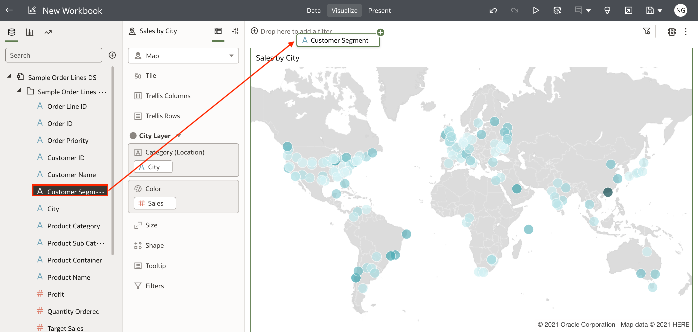
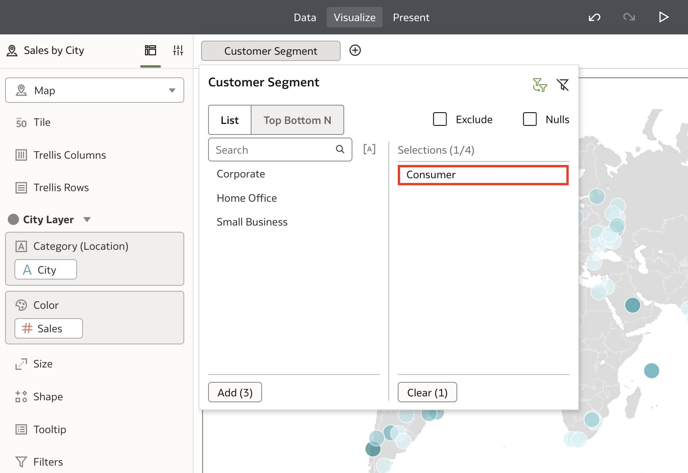
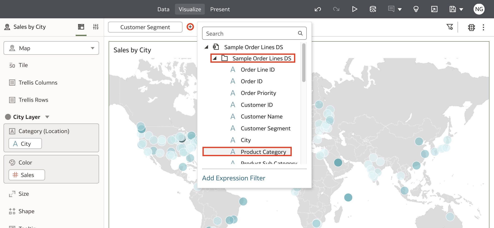
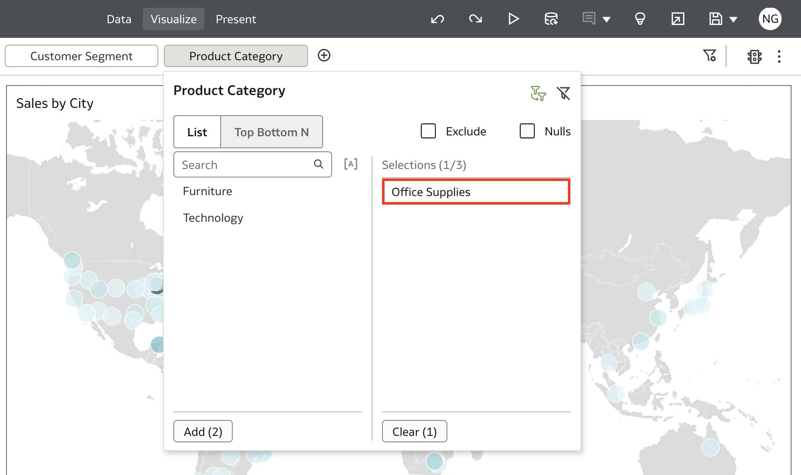
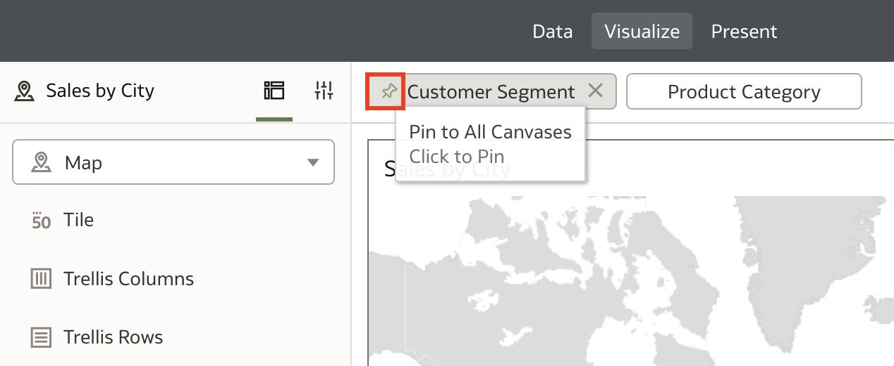

# Dashboard Filters and Export Options

## Introduction

In this lab, you will learn how to create dashboard filters and export workbooks for sharing in Oracle Analytics.

  

Estimated Time: 10 minutes

### Objectives

In this lab, you will:
* Create dashboard filters
* Export your visualizations as a file

### Prerequisites

This lab assumes you have:
* Access to Oracle Analytics Cloud
* [Sample Order Lines DS](https://objectstorage.us-phoenix-1.oraclecloud.com/p/TBMVACa7qZgj8ijJ3j5wlILzaVVtw1jo6n4rO8mREaAKjRoWAPX0OVTaEL39buPQ/n/idbwmyplhk4t/b/LiveLabsFiles/o/Sample%20Order%20Lines%20DS.xlsx)

## Task 1: Dashboard Filters
In this section, we will explore different ways to create and apply dashboard filters.

1. Click and drag **Customer Segment** from **Sample Order Lines DS** to the canvas filter bar.

  

2. Select the values you want to filter for. For this lab, select **Consumer**.

  

3. To add another filter, click the **Add Filter** button. Expand the **Sample Order Lines DS** data file and select **Product Category**.

  

4. Select **Office Supplies** and click away to apply the filter.

  

5. If you want to apply a filter to all canvases, hover over the filter and click **Pin to All Canvases,** represented by the pin icon. Your dashboard now as filters applied to **Customer Segment** and **Product Category**.

  

6. Rename the canvas as **BI Ask** and **Save** the workbook.

  

7. Name the workbook **BI Ask** and click **Save**.

  

## Task 2: Export Dashboard
In this section, we will explore export options for sharing your insights with your audience.

1. To share your insights, click the **Export** icon on the top right of the page.
  

2. You have the option to export a digital **File** or **Print** a physical copy. Select **File**.

  

3. Here, you have a few options such as the format, which canvas you want to export, where you want to include filters, titles, and the size and orientation of the file. Select your export settings and click **Save** to export your file. This will export the file which you can distribute to your audience to share your insights!

  

With this lab, you have learned how to blend two datasets together, apply dashboard filters and export your file for sharing in Oracle Analytics.

## Learn More
* [Add Joins Between Dataset Tables](https://docs.oracle.com/en/cloud/paas/analytics-cloud/acubi/add-joins-dataset-tables.html)

* [Export a Visualization or Story](https://docs.oracle.com/en/cloud/paas/analytics-cloud/acubi/export-visualization-or-story.html)

* [Getting Started with Oracle Analytics Cloud](https://docs.oracle.com/en/cloud/paas/analytics-cloud/acsgs/what-is-oracle-analytics-cloud.html#GUID-E68C8A55-1342-43BB-93BC-CA24E353D873)

## Acknowledgements
* Author - Nagwang Gyamtso, Product Manager, Analytics Product Strategy
* Last Updated By/Date - Nagwang Gyamtso February, 2023
