# Dashboard Filters and Export Options

## Introduction

In this lab, you will learn how to create dashboard filters and export workbooks for sharing in Oracle Analytics.

  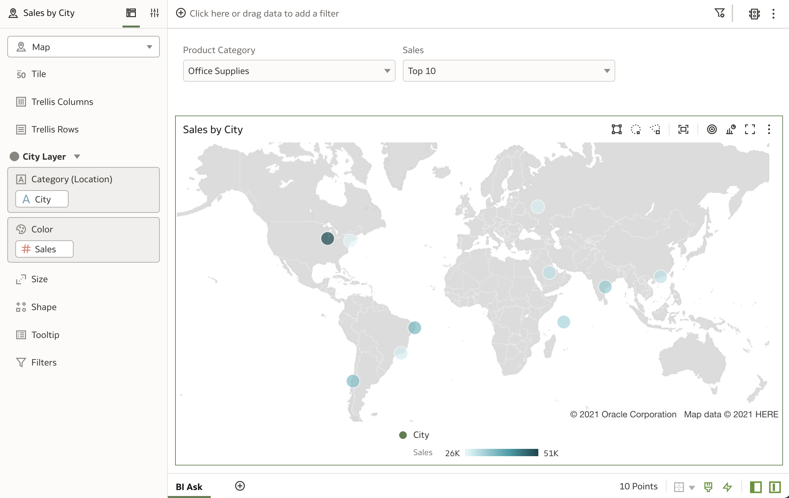

Estimated Time: 10 minutes

### Objectives

In this lab, you will:
* Create dashboard filters
* Export your visualizations as a file

### Prerequisites

This lab assumes you have:
* Access to Oracle Analytics Cloud
* [Sample Order Lines DS](https://objectstorage.us-ashburn-1.oraclecloud.com/p/J6wePlhCmLfKoZRTdaMTEKerOCkYrnN3cPd4-g899hTOureVn6tHRZ048xjb4tTv/n/idtlyhmtj68r/b/LiveLabFiles/o/Sample Order Lines DS.xlsx)

## Task 1: Dashboard Filters
In this section, we will explore the dashboard filter visualization.

1. To add the **Dashboard Filters** visualization, click **Visualizations** from the **Data Panel** and scroll down to the **Dashboard Controls** section.

  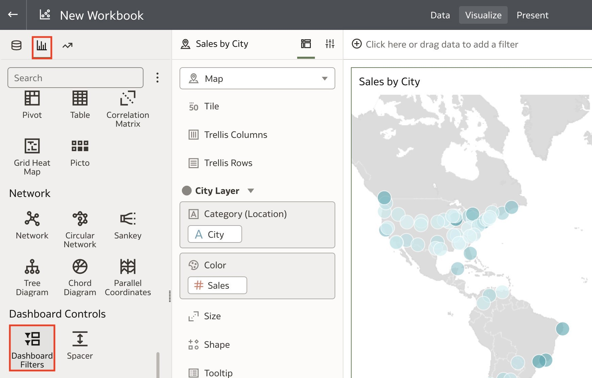

2. Click and drag the **Dashboard Filters** visualization onto the canvas above the map visualization. The benefit of using dashboard filters is that we can filter the dashboard based on the attributes we want to explore directly on the canvas.

  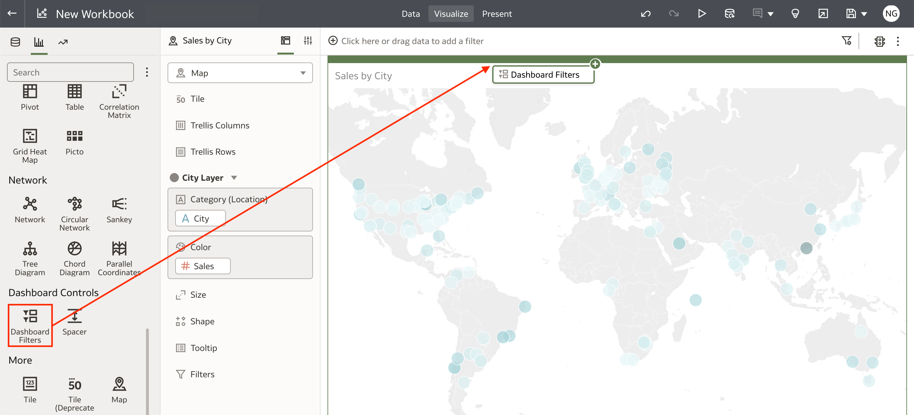

3. To add filters, double-click or drag and drop one or more dates, attributes, or measure columns to the dashboard filter. For this lab, double-click the **Product Category** column.

  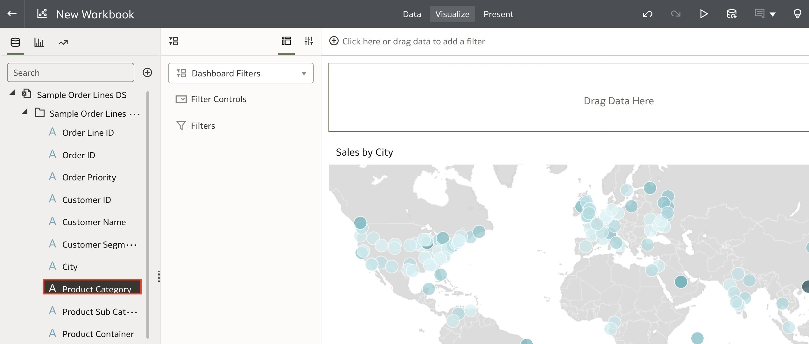

4. Then double-click **Sales** to add this measure as a filter.

  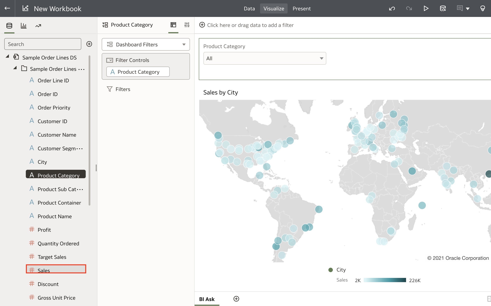

5. Let's say we wanted to see the top 10 cities by sales. Click **Full Range** under **Sales** to open the Sales filter options.

  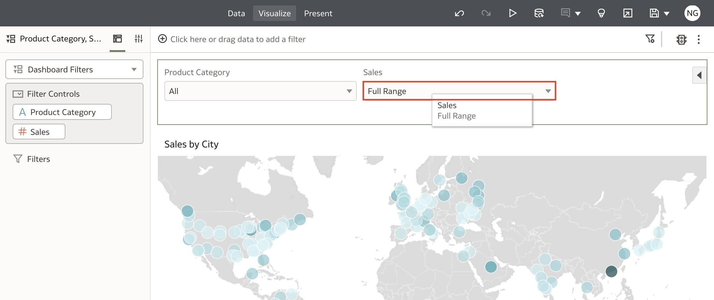

6. Here you have two options: You can either filter the Sales by **Range** if you want to filter for a specific range of sales or you can filter for the top or bottom counts. Since we want to look at the top 10, click **Top Bottom N**.

  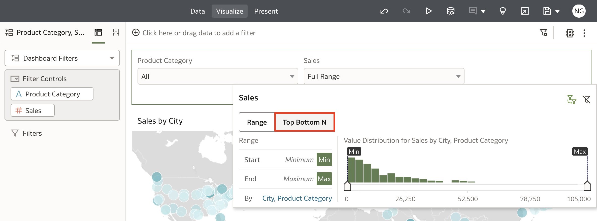

7. Here, you can modify the settings for this filter. You can choose Top or Bottom for **Method**, change the **Count** and select which attributes you want the filter to be based on. We'll stick with the default settings.

  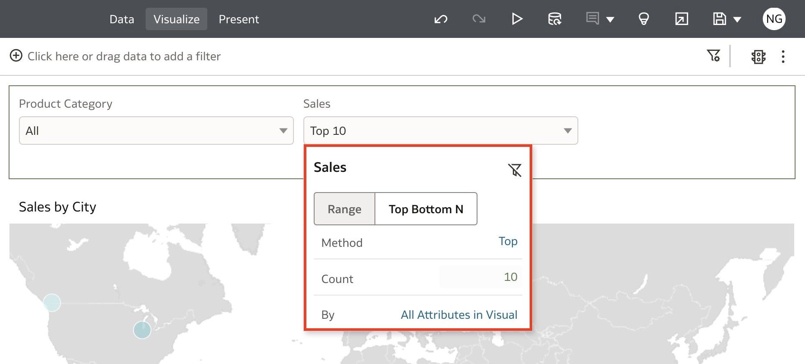

8. Let's say that instead of looking at the top 10 sales for all products, we want to filter for Office Supplies. Click the **Product Category** filter drop-down and select **Office Supplies**. Click away to apply the filter.

  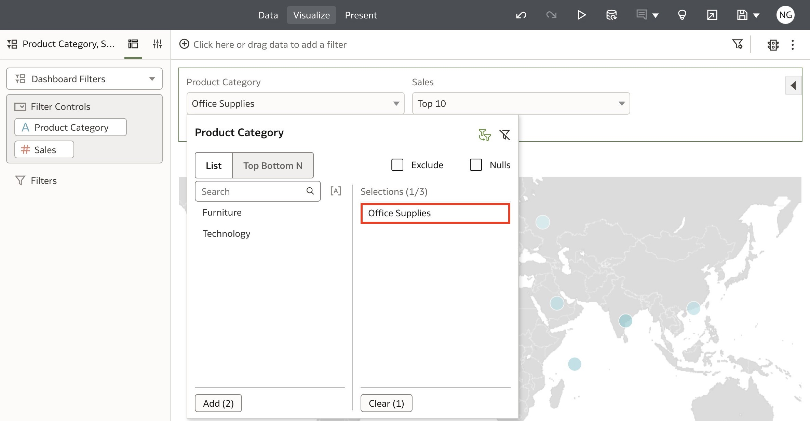

9. The result shows the Top 10 Sales by City for **Office Supplies**.

  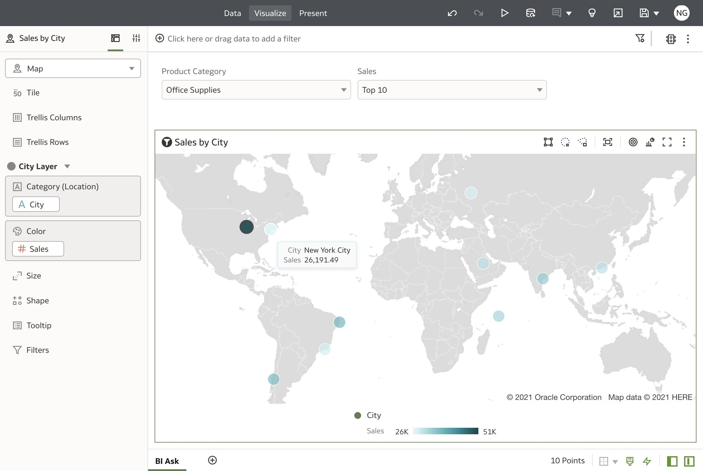

10. Rename the canvas as **BI Ask** and **Save** the workbook.

  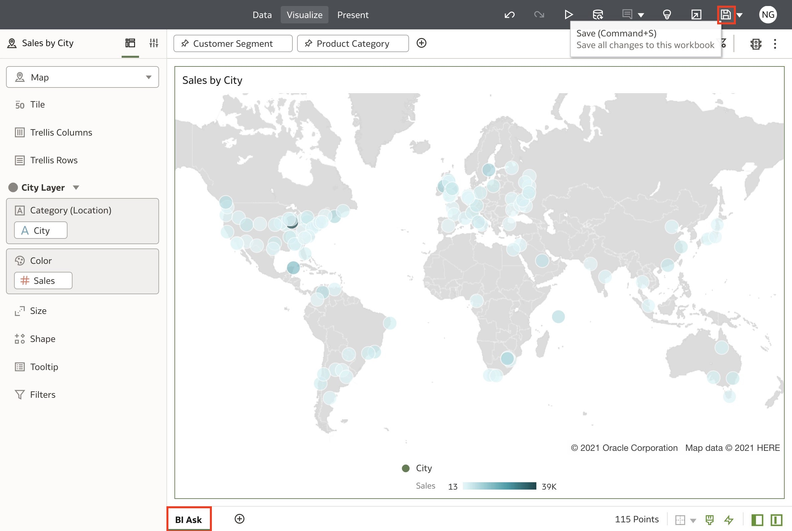

11. Name the workbook **BI Ask** and click **Save**.

  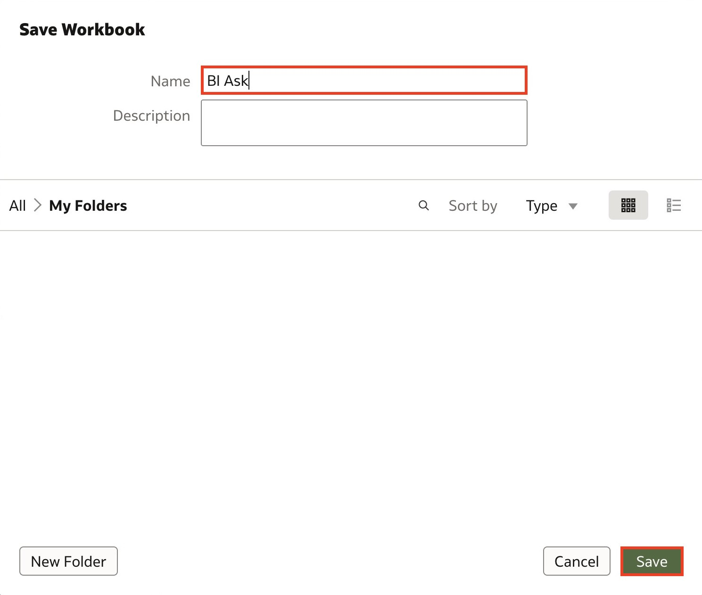

## Task 2: Export Dashboard
In this section, we will explore export options for sharing your insights with your audience.

1. To share your insights, click the **Export** icon on the top right of the page.
  

2. You have the option to export a digital **File** or **Print** a physical copy. Select **File**.

  

3. Here, you have a few options such as the format, which canvas you want to export, where you want to include filters, titles, and the size and orientation of the file. Select your export settings and click **Save** to export your file. This will export the file which you can distribute to your audience to share your insights!

  

With this lab, you have learned how to blend two datasets together, apply dashboard filters and export your file for sharing in Oracle Analytics. You may now **proceed to the next lab**.

## Learn More
* [Add Joins Between Dataset Tables](https://docs.oracle.com/en/cloud/paas/analytics-cloud/acubi/add-joins-dataset-tables.html)

* [Export a Visualization or Story](https://docs.oracle.com/en/cloud/paas/analytics-cloud/acubi/export-visualization-or-story.html)

* [Getting Started with Oracle Analytics Cloud](https://docs.oracle.com/en/cloud/paas/analytics-cloud/acsgs/what-is-oracle-analytics-cloud.html#GUID-E68C8A55-1342-43BB-93BC-CA24E353D873)

## Acknowledgements
* Author - Nagwang Gyamtso, Product Manager, Analytics Product Strategy
* Last Updated By/Date - Nagwang Gyamtso February, 2023
