# Data Actions

## Introduction

In this lab, you will build two simple canvases and learn how to create data actions to pass values between different canvases in a workbook.

  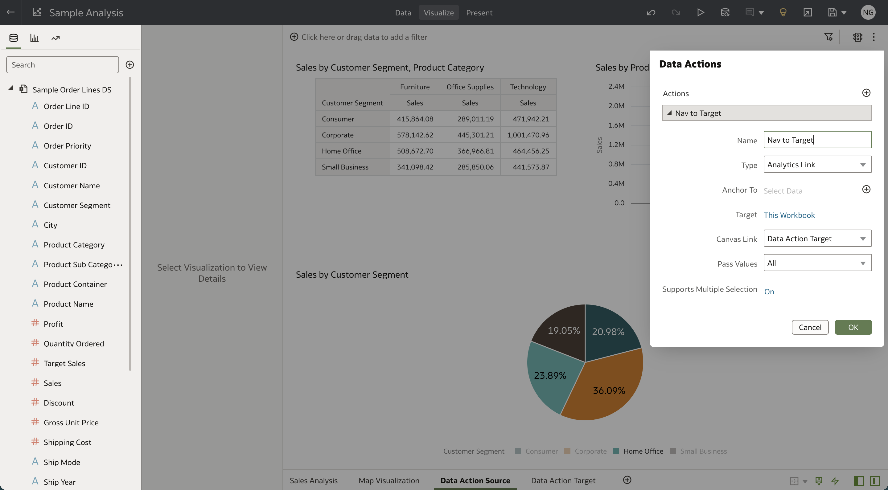

Estimated Time: 20 minutes

### Objectives

In this lab, you will:
* Create two visualization canvases
* Create a data action

### Prerequisites

This lab assumes you have:
* Access to Oracle Analytics Cloud
* [Sample Order Lines DS](https://objectstorage.us-ashburn-1.oraclecloud.com/p/J6wePlhCmLfKoZRTdaMTEKerOCkYrnN3cPd4-g899hTOureVn6tHRZ048xjb4tTv/n/idtlyhmtj68r/b/LiveLabFiles/o/Sample Order Lines DS.xlsx) dataset

## Task 1: Prepare Basic Visualization Canvases
In this section, we will create two canvases with simple visualizations to help us understand how data actions work. The two canvases will be the source canvas and the target canvas.

1. Add a new canvas by clicking the **Add Canvas** button.

  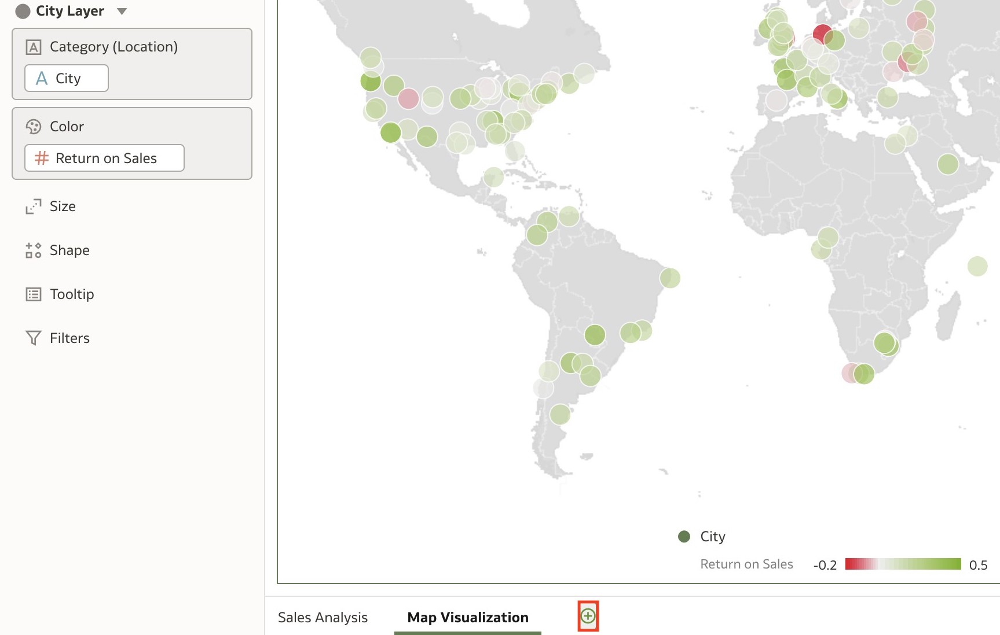

2. CTRL+click **Customer Segment**, **Product Category**, and **Sales**. Right-click and choose **Pick Visualization...**

  

3. Select the **Pivot** table.

  

4. For the next visualization, CTRL+click **Product Category**, **Profit**, and **Sales**. Right-click and select **Pick Visualization...**

  

5. Select the **Bar** graph.

  

6. Let's swap **Sales** and **Profit**. Drag **Sales** from **Color** and drop it over **Profit** in the Y-Axis.

  

7. The Bar graph should now look like this.

  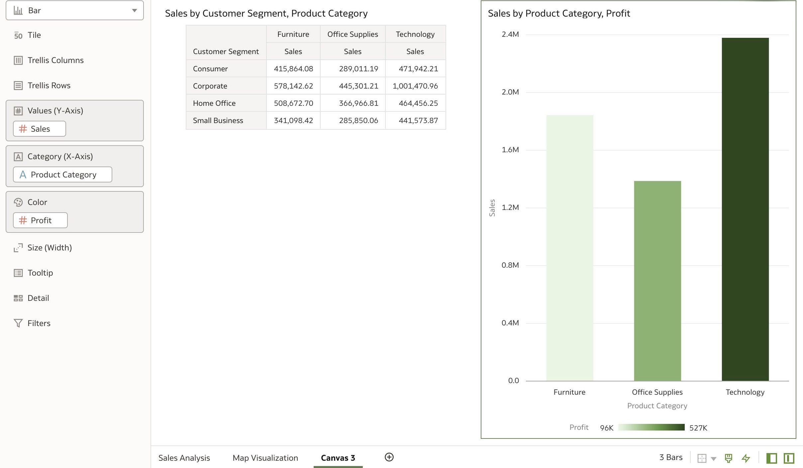

8. For our third visualization on this canvas, CTRL+click **Customer Segment** and **Sales** and select **Pick Visualization**.

  

9. Select the **Pie** chart.

  

10. Your canvas should have these three visualizations.

  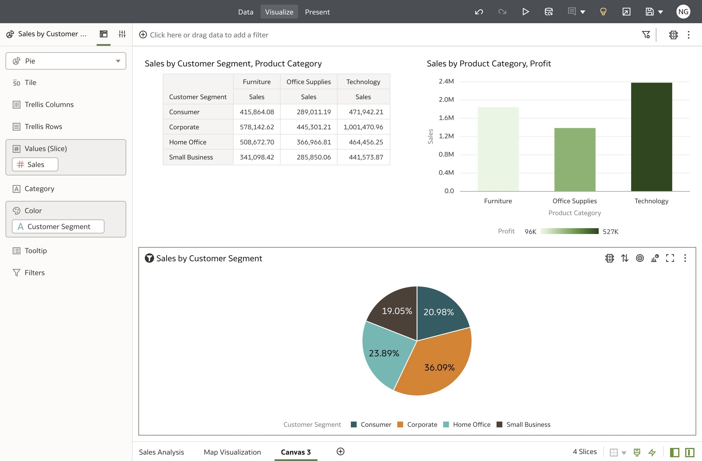

11. Click the drop-down icon on this canvas and click **Rename**. Type <code>Data Action Source</code> for the name and hit Enter.

  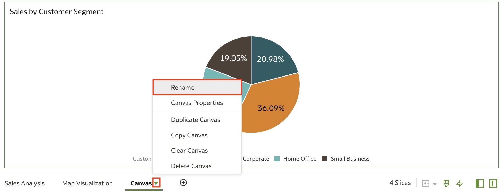

12. Click **Add Canvas**.

  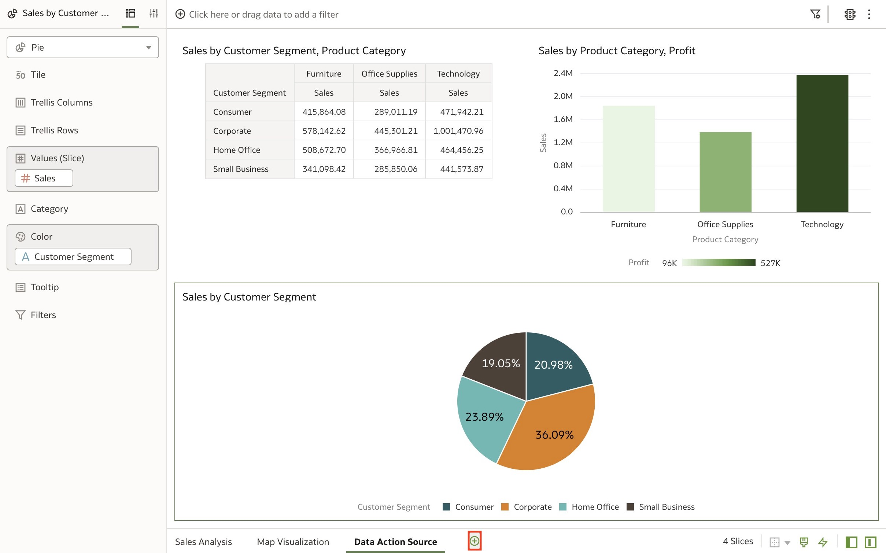

13. CTRL+click **Product Category**, **Sales**, and **Quarter of Year** from the **Order Date** drop-down. Right-click **Pick Visualization** and select the **Stacked Bar** graph.

  

14. Drag **Order Date (Quarter of Year)** from **Category** to **Trellis Columns**.

  

15. Click the visualization **Menu**.

  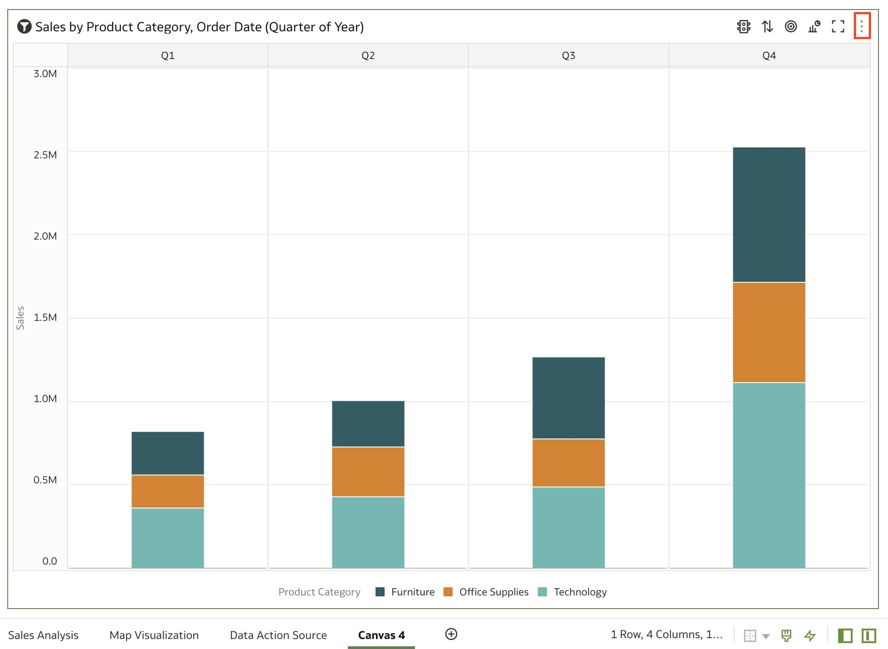

16. Click **Edit** and select **Duplicate Visualization**.

  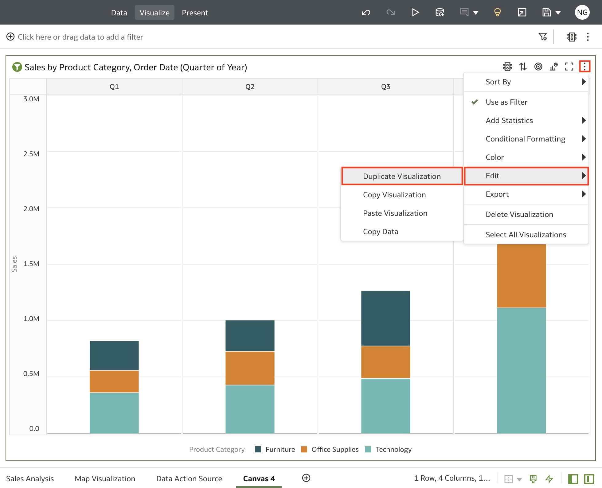

17. Click the **Change Visualization Type** icon and select the **Pivot** table.

  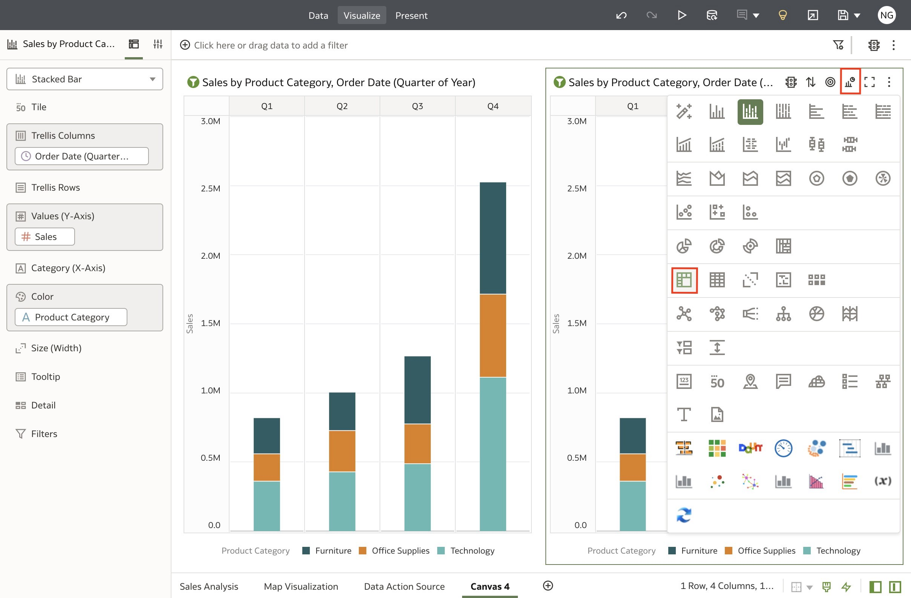

18. Drag **Customer Segment** from the data panel in the **Rows** section. Then drag **Product Category** from **Color** to Rows under **Customer Segment**.

  

19. Since this second visualization is a duplicate of the first, the **Use As Filter** is enabled. Click the **Toggle button to turn off the Use As Filter setting for the visualization**.

  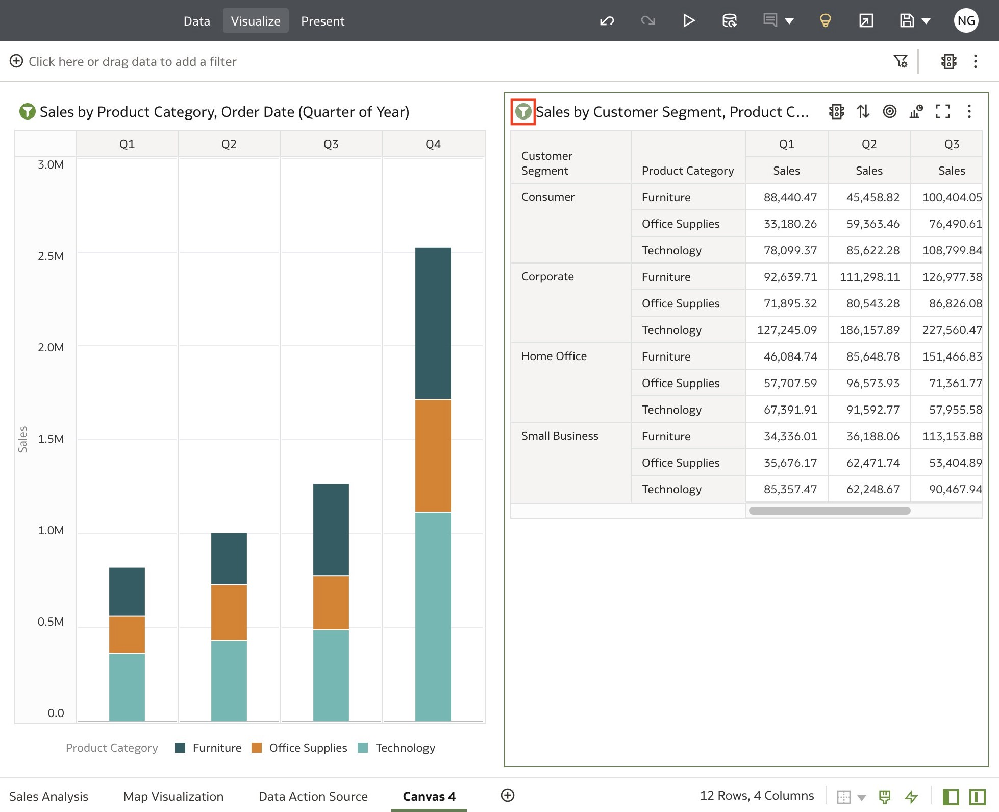

20. Rename this canvas to <code>Data Action Target</code>.

  

21. Now let's go back to the **Data Action Source** canvas.

  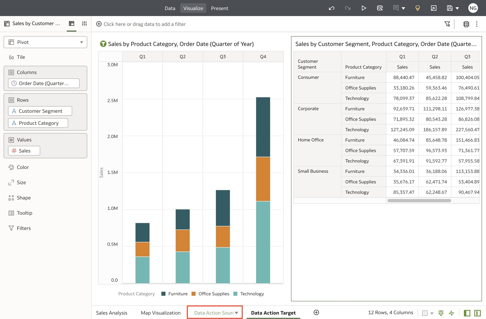

## Task 2: Create Data Actions
In this section, we will create a data actions to pass values to the target canvas.

1. Click the **Workbook Menu** and select **Data Actions**.

  

2. Click the **+** icon to add an Action.

  

3. This is where we configure the data action. Enter <code>Nav to Target</code> for **Name** and select **Analytics Link** for **Type**.

    >**Note**: Check the **Use Data Actions** link in the Learn More section at the bottom of this page to learn about other data action types.

  

4. In this step, we won't choose data to anchor the Data Action onto. This will allow you to call the data action from any visualization in any canvas. Select the **Data Action Target** canvas for **Canvas Link** and click **OK**.

  

5. Right-click the **Office Supplies** **Sales** value for the **Home Office** **Customer Segment** and click **Nav to Target**. This is the data action we just created.

  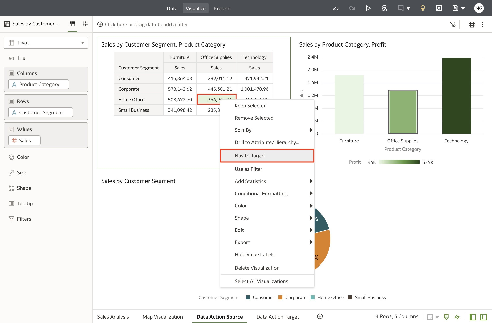

6. The Nav to Target data action brings in the attributes (Home Office from Customer Segment and Office Supplies from Product Category) from the previous value we select and filters the Target canvas for those attributes. In this step, filters for Customer Segment and Product Category have been brought in and applied.

  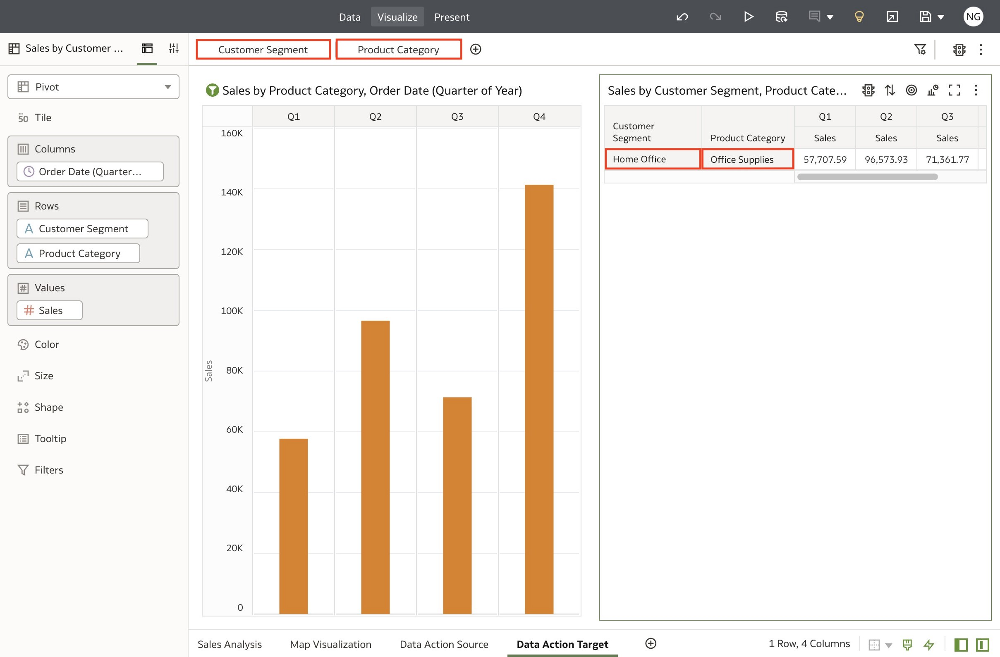

7. Go back to the **Data Action Source** canvas. Right-click the **Furniture** column and select **Nav to Target**.

  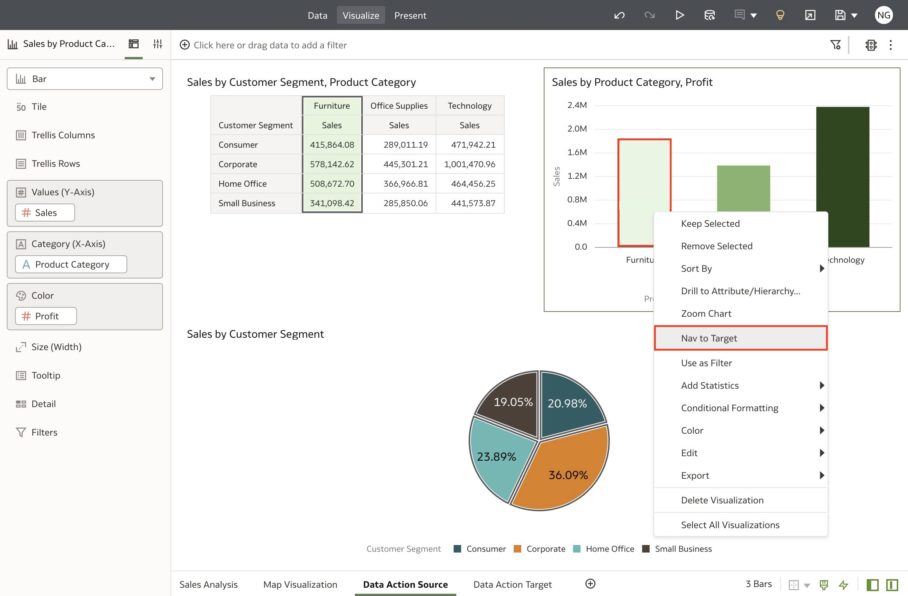

8. The **Furniture** **Product Category** filter is applied to the target visualization. This helps us drill into the Furniture product category and understand sales for the Quarters of the Year.

  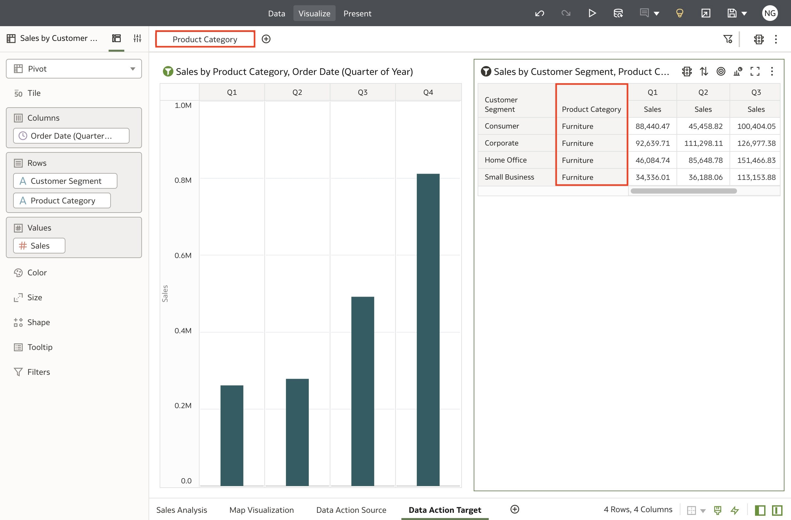

9. We know that the current Data Action can be called from any visualization. Let's edit the Data Action so it can only be called from specific visualizations. Click the **Workbook Menu** and select **Data Actions**.

  

10. Click **Select Data** on **Anchor To** and select **Product Category**.

  

11. The Data Action can only be called on visualizations with the **Product Category** attribute. Click **OK**.

  

12. In the pie chart, right-click a slice, and you'll notice that the **Nav to Target** data action is no longer visible. This is because this visualization doesn't use the **Product Category** column as a source.

  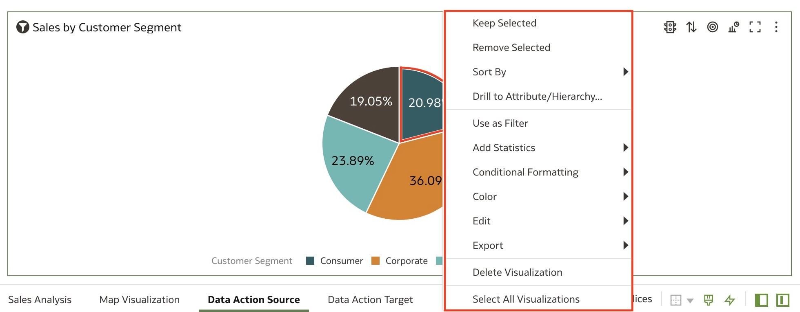

13. Right-click any of the values from the **Sales by Customer Segment, Product Category** visual. You will notice the **Nav to Target** Data Action is available. This is because the **Product Category** column is used in these two visualizations.

  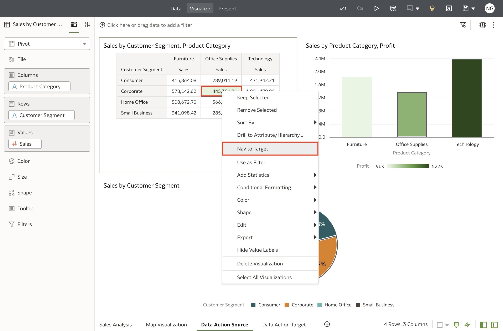

14. Right-click any of the values from the **Sales by Product Category, Profit** visual. You will notice the **Nav to Target** Data Action is available. The Nav to Target data action is available on both of these visuals since they use the **Product Category** column as a data source.

  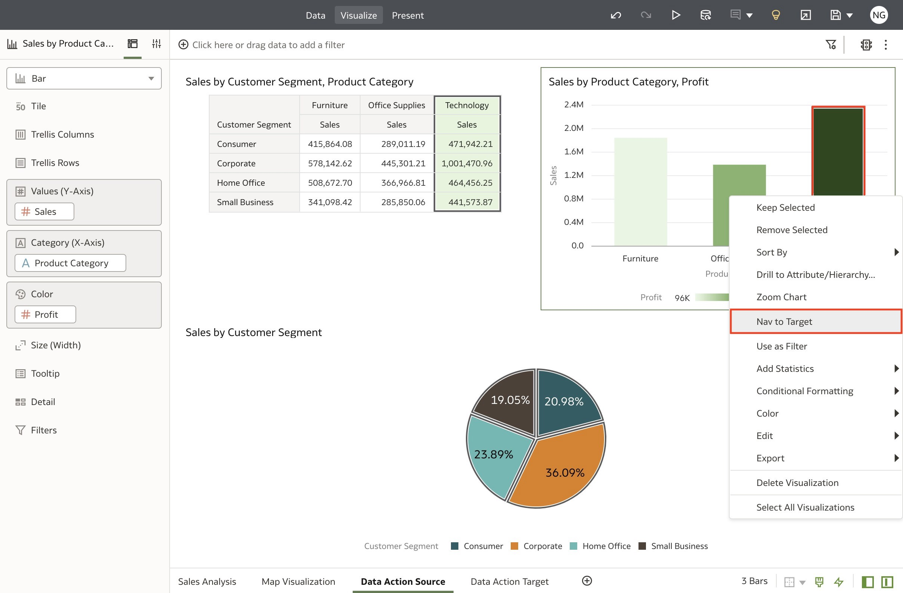

In this lab, you have successfully learned how to create data actions. You may now **proceed to the next lab**.

## Learn More
* [Use Data Actions](https://docs.oracle.com/en/cloud/paas/analytics-cloud/acubi/use-data-actions.html)

* [Getting Started with Oracle Analytics Cloud](https://docs.oracle.com/en/cloud/paas/analytics-cloud/acsgs/what-is-oracle-analytics-cloud.html#GUID-E68C8A55-1342-43BB-93BC-CA24E353D873)

## Acknowledgements
* Author - Nagwang Gyamtso, Product Manager, Analytics Product Strategy
* Contributors -
* Last Updated By/Date - Nagwang Gyamtso January, 2023
