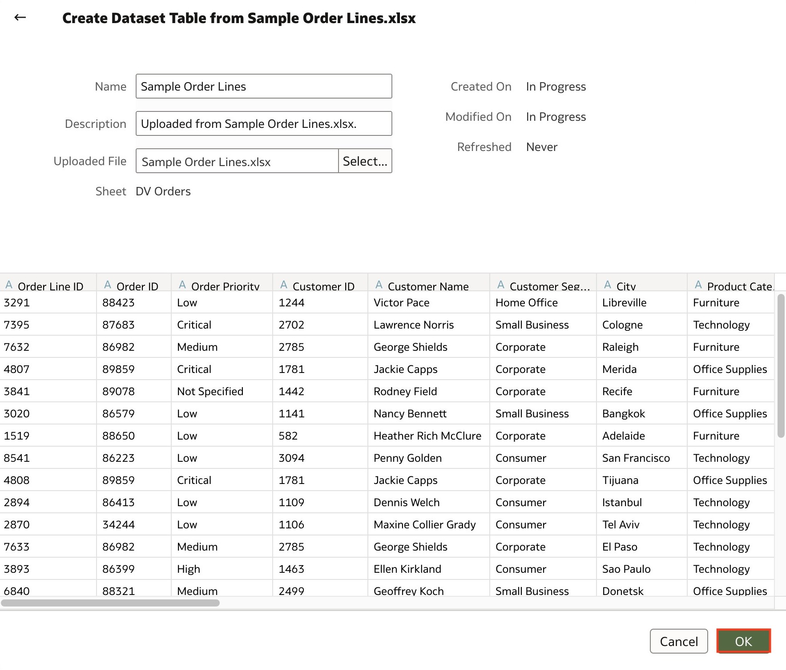
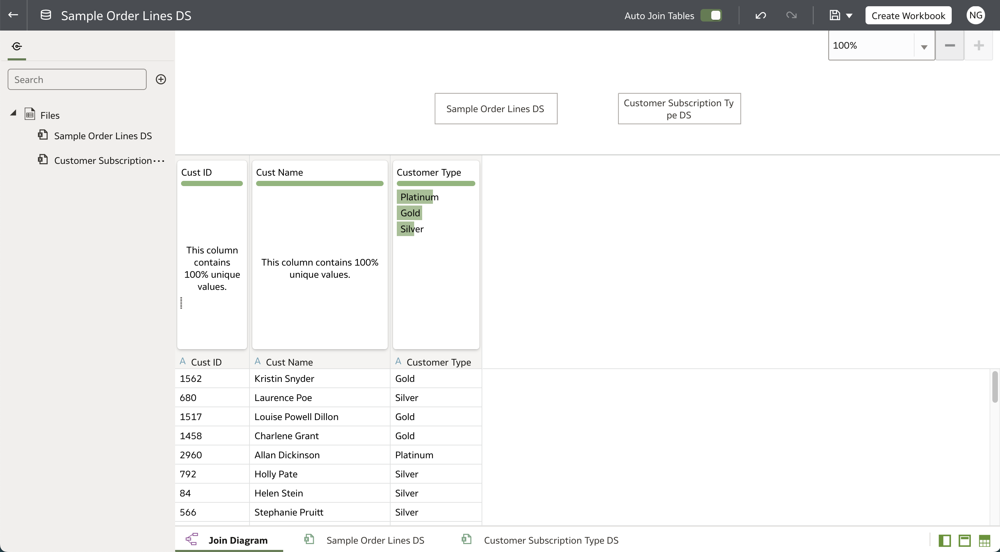
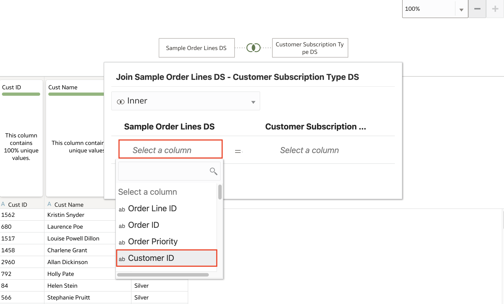
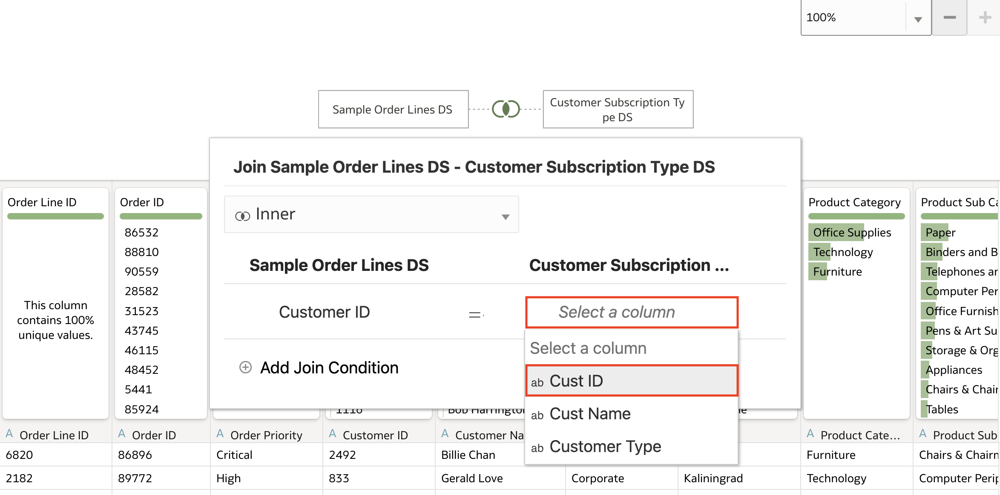
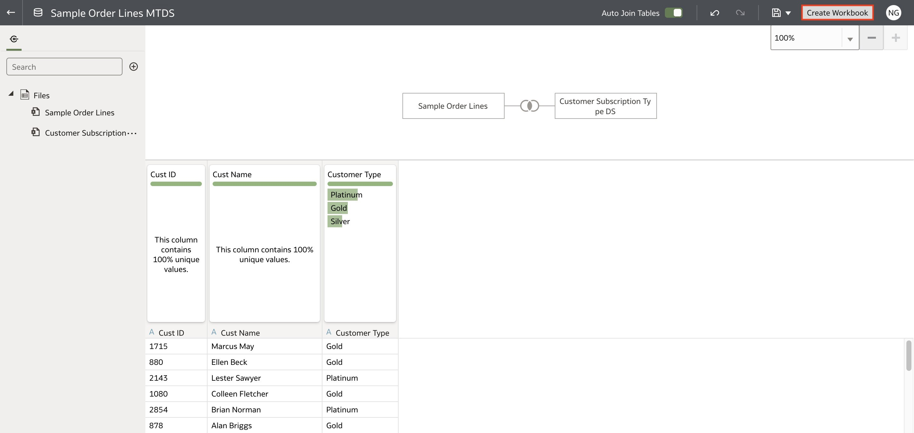

# Multi-Table Dataset

## Introduction

In this lab, you will learn how to create a multi-table dataset in Oracle Analytics.

  

Estimated Time: 10 minutes

### Objectives

In this lab, you will:
* Create a multi-table dataset

### Prerequisites

This lab assumes you have:
* Access to Oracle Analytics Cloud
* [Sample Order Lines DS](https://objectstorage.us-phoenix-1.oraclecloud.com/p/TBMVACa7qZgj8ijJ3j5wlILzaVVtw1jo6n4rO8mREaAKjRoWAPX0OVTaEL39buPQ/n/idbwmyplhk4t/b/LiveLabsFiles/o/Sample%20Order%20Lines%20DS.xlsx)
* [Customer Subscription Type DS dataset](https://objectstorage.us-phoenix-1.oraclecloud.com/p/SeENHPbE87z7lOqNK28NVVbCfWFJacuYjB0q1KE4rG-Ir_t8jWTsGYtHViziabNJ/n/idbwmyplhk4t/b/LiveLabsFiles/o/Customer%20Subscription%20Type%20DS.xlsx)

## Task 1: Create a Multi-Table Dataset
In this section, we will create a multi-table dataset using the Sample Order Lines and Customer Subscription Type DS data files.

1. From the homepage, click **Create.** Then select **Dataset.**

  

2. Click the **Drop data file here or click to browse** option and select the **Sample Order Lines** dataset.

  

3. Click **OK**.

  

4. Once the first dataset has loaded, click the **Add file** button. Here, you can add another file from your local machine or add a dataset from an existing data source connection. Click **Add File...**

  

5. Click **OK.**

  

6. Here, you'll notice the two data files you've added. If the two data files have identical column names, Oracle Analytics will auto-join tables based on those columns. Since it couldn't identify auto-joins, let's create a manual join.

  

7. Drag **Customer Subscription Type DS** and drop it over **Sample Order Lines** to start the join process.

  

8. Click **Select a column** under Sample Order Lines and select **Customer ID.**

  

9. Under **Customer Subscription Type DS,** select the **Cust ID** column.

  

10. Click outside of the Join condition box. The join between **Sample Order Lines** and **Customer Subscription Type DS** is created. You can join additional datasets by clicking the **Add** button and creating joins between the datasets. Click the **Save** button.

  

11. Enter <code>Sample Order Lines MTDS</code> and click **OK.**

  

12. Click **Create Workbook.**

  

13. Expand **Sample Order Lines** and **Customer Subscription Type DS.**

  

14. Hold **CTRL** or **Command** and select **Sales** from **Sample Order Lines** and **Customer Type** from **Customer Subscription Type DS.** Drag and drop the type metrics onto the canvas.

  

15. Click **Save**.

  

16. Enter <code>Sample Analysis</code> for **Name.** Click **Save.**

  

With this lab, you have learned how to create a multi-table dataset in Oracle Analytics.

## Learn More
* [Create a Dataset with Multiple Tables in Oracle Analytics](https://docs.oracle.com/en/cloud/paas/analytics-cloud/tutorial-mutli-table-data-set/#before_you_begin)

* [Getting Started with Oracle Analytics Cloud](https://docs.oracle.com/en/cloud/paas/analytics-cloud/acsgs/what-is-oracle-analytics-cloud.html#GUID-E68C8A55-1342-43BB-93BC-CA24E353D873)

## Acknowledgements
* Author - Nagwang Gyamtso, Product Manager, Analytics Product Strategy
* Contributors -
* Last Updated By/Date - Nagwang Gyamtso January, 2023
