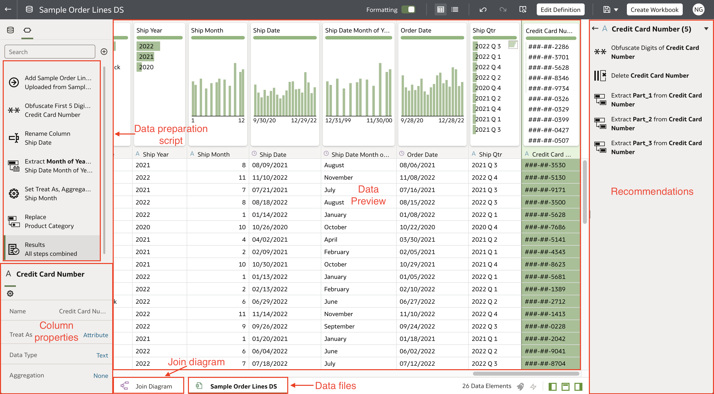
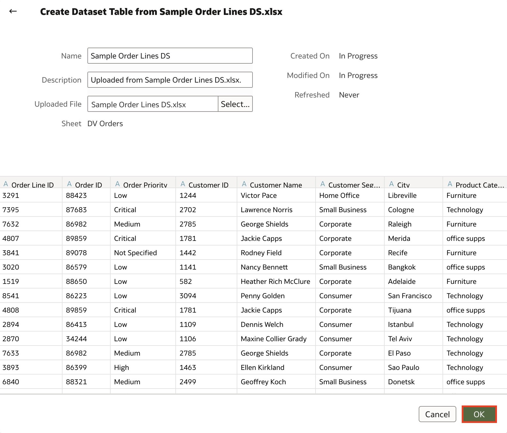
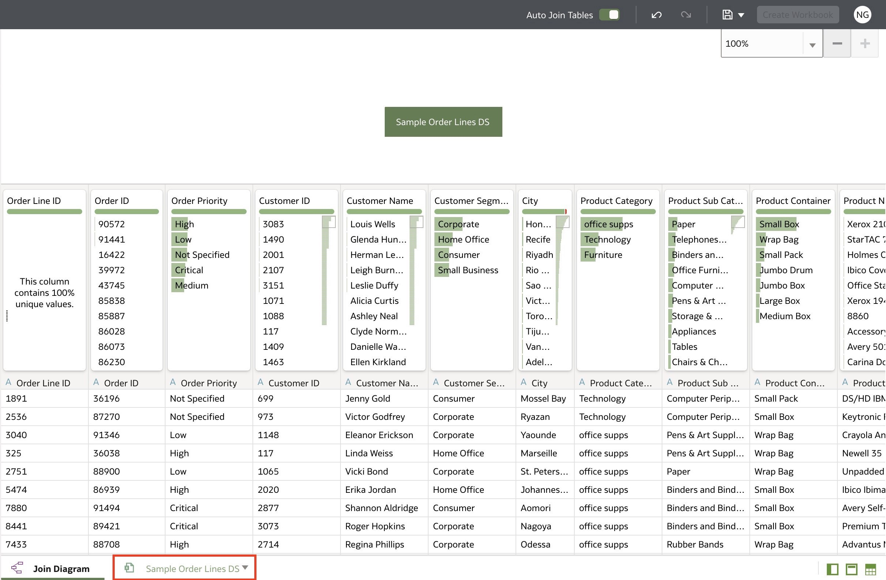
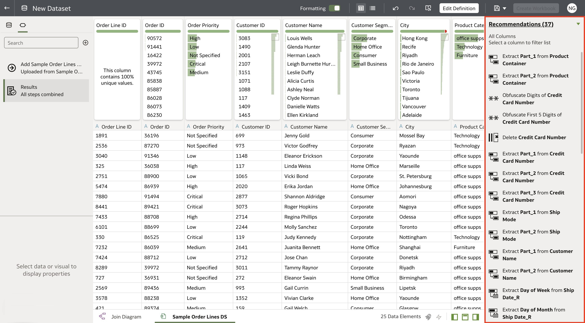
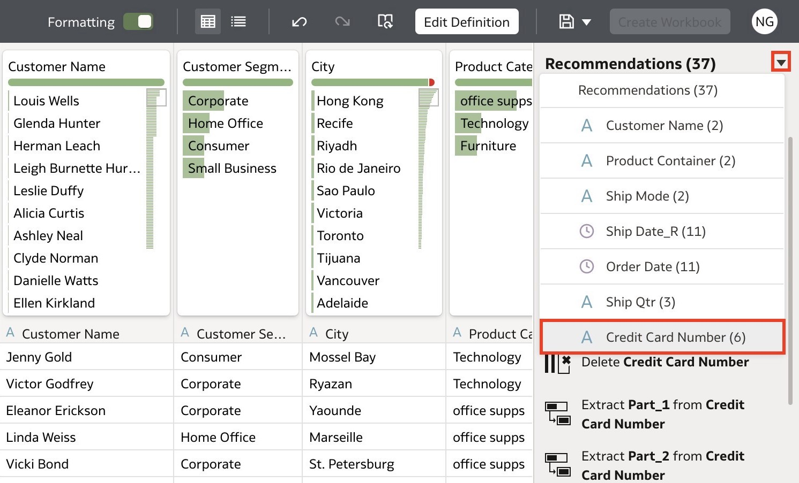
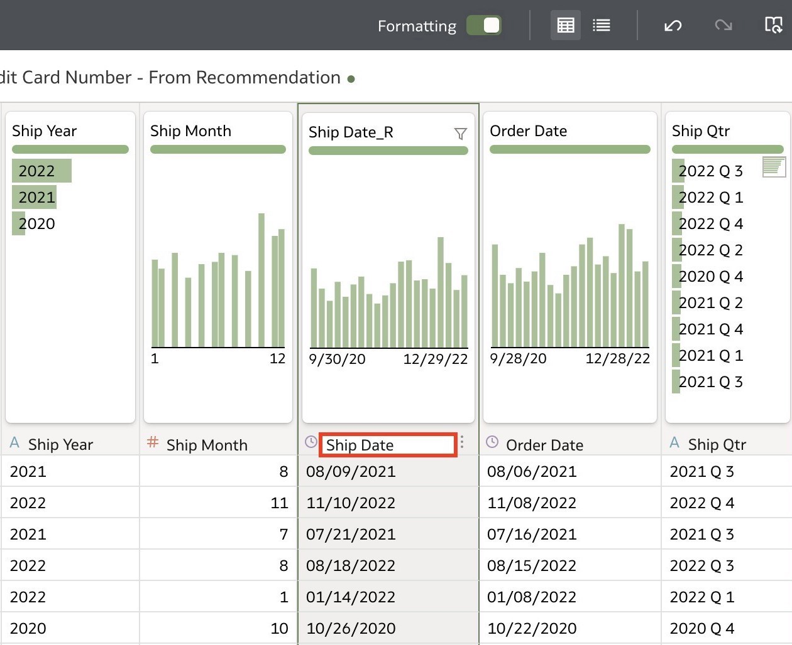
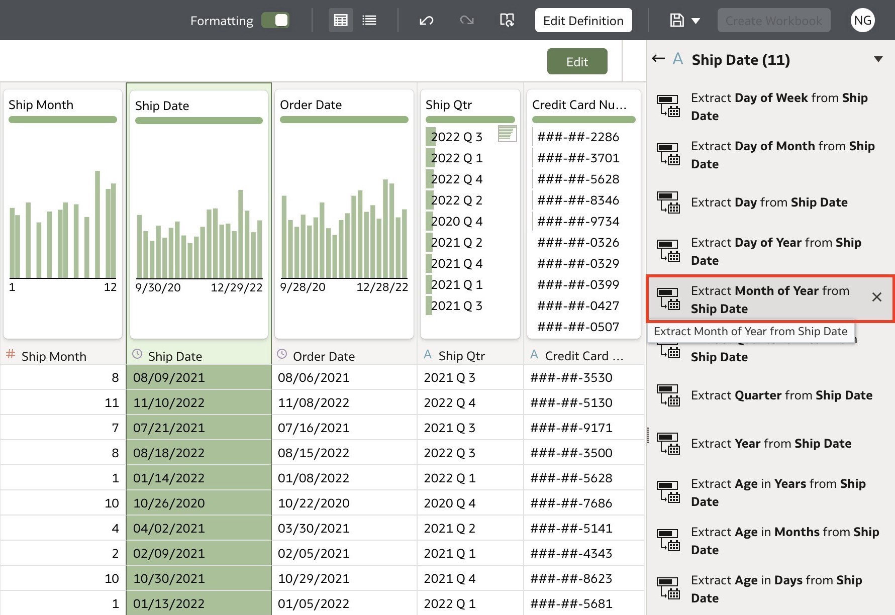
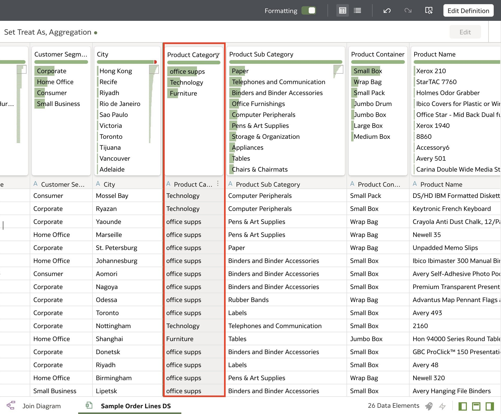
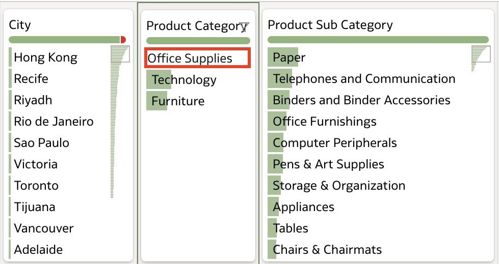

# Basic Data Visualization

## Introduction

In this lab, you will utilize Oracle Analytics' data prep capabilities to clean and transform your data in preparation for visual analysis.

  

Estimated Time: __ minutes

### Objectives

In this lab, you will:
* Apply data prep capabilities to clean and transform your data

### Prerequisites

This lab assumes you have:
* Access to Oracle Analytics Cloud
* Downloaded Sample Order Lines DS

## Task 1: Data Preparation
In this section, you will upload the Sample Order Lines DS and apply data transformations to enhance your dataset.

1. Log in to your Oracle Analytics instance with your user credentials.

2. From the homepage, click **Create** and select **Dataset**. Click here.

  

3. Click **Drag Data File Here or Click to Browse**.

  

4. Navigate to the File location and click **Open**. Once the data file loads, click **OK**. You can change the dataset name and description in this step if you want.

  

5. This is a preview of your dataset. Click **Sample Order Lines DS** to clean and transform your data.

  

6. You will find the list of enrichments in the recommendations tab on the right portion of the window.

  

7. Click the recommendations drop-down and select **Credit Card Number**.

  

8. Click **Obfuscate First 5 Digits of Credit Card Number**. Oracle Analytics has automatically identified customer-sensitive information and provided a solution to protect this data.

  

9. Navigate to the **Ship Date_R** column. Click the Options icon or right-click the column title and select  **Rename...**

  

10. Rename the column name to **Ship Date** and click <code>Enter</code>.

  

11. Click the **Ship Date** column and from the Recommendations pane, select **Extract Month of Year from Ship Date**.

  

12. Navigate to the **Ship Month** column. Click the **Measure** icon and change the data type to an **Attribute**.

  

13. Navigate to the **Product Category** column and notice that the value **office supps** isn't aligned with the formatting structure.

  

14. Double-click **office supps** and rename it to **Office Supplies**. Press **Enter** or click away to save.

  

15. Click **Save** to save the dataset.

  

16. Enter <code>Sample Order Lines DS</code> and a description if you wish and click **OK**

  

## Learn More
* [Getting Started with Oracle Analytics Cloud](https://docs.oracle.com/en/cloud/paas/analytics-cloud/acsgs/what-is-oracle-analytics-cloud.html#GUID-E68C8A55-1342-43BB-93BC-CA24E353D873)
* [Prepare Data](https://docs.oracle.com/en/cloud/paas/analytics-cloud/acubi/prepare-data.html)

## Acknowledgements
* Author - Nagwang Gyamtso, Product Manager, Analytics Product Strategy
* Contributors -
* Last Updated By/Date -
