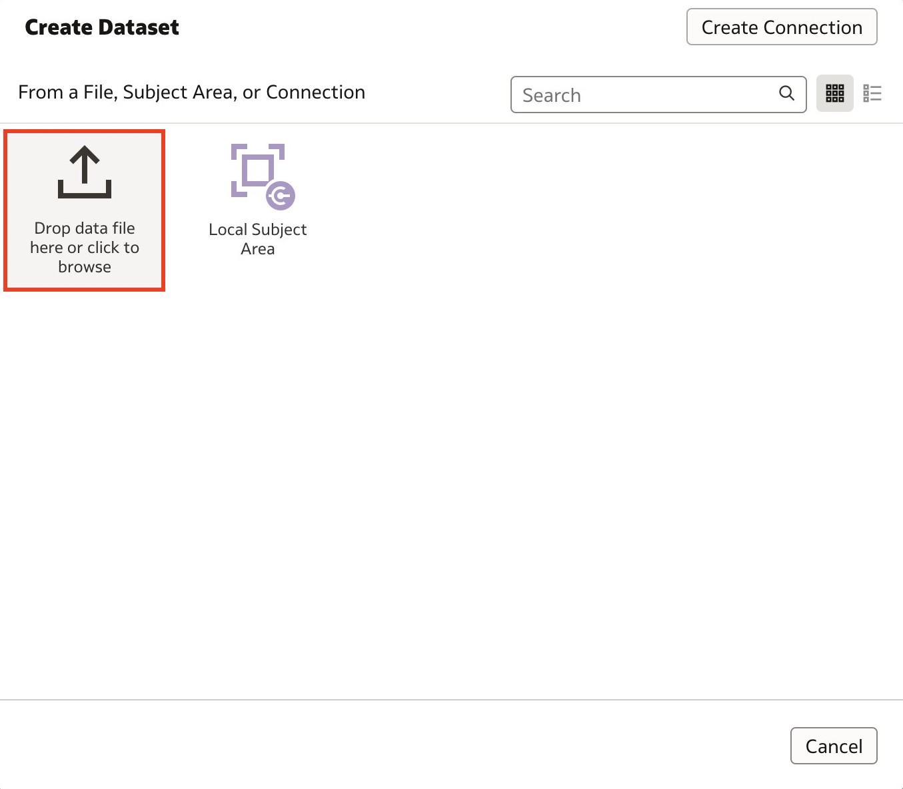

# Explore the Oracle Analytics Homepage

## Introduction

In this lab, you will get clean a messy dataset using Oracle Analytics Cloud's Data Prep capabilities. You will also create a multi-table dataset by joining two tables together to help us better understand our data.

Estimated Time: __ minutes

### Objectives

In this lab, you will:
* Clean a messy dataset using Data Data capabilities
* Create a multi-table dataset

### Prerequisites

This lab assumes you have:
* Access to Oracle Analytics Cloud
* Downloaded Sample Sales Messy dataset
* Downloaded Sample States dataset

## Task 1: Data Preparation
In this section, we will clean our messy dataset, Sample Orders Messy, in preparation for visualization.

1. **Login** to your Oracle Analytics instance.

2. From your Oracle Analytics **homepage**, click **Create** and then select **Dataset**.

  

3. Click **Drop data file here or click to browse**. Upload the **Sample Orders Messy** dataset from your local machine.

  

4. Here, you have the option to rename your data file and update the description. Click **OK**.

  

5. Once your dataset has loaded, click **Sample Orders Messy** on the bottom tab to start cleaning your data.

  

6. Here, you notice that the customer name is lowercase and lives in one column. Let's utilize the **Recommendations** to extract the first and last names.

  

7. Click the **Customer Name** column. From the recommendations pane, select **Extract Part_1 from Customer Name**.

  

8. Now click **Extract Part_2 from Customer Name**.

  

9. Rename the two new columns to stay consistent with the naming conventions. Right-click the new column name or click the **Actions** icon and select **Rename...** Type <code>Customer Last Name</code> and hit **Enter**. Let's do the same for **Customer Name_Part1...** and rename it to <code>Customer First Name</code>.

  

10. Now, let's go ahead and sentence case the names. Right-click the **Customer First Name** column and select **Sentence Case**. Make sure to do this for **Customer Last Name** too.

  

11. We no longer need the Customer Name column so right-click the **Customer Name** column and click **Delete**.

  

12. When you scroll to the **Product Category** column, you notice in the column summary that **office supps** doesn't fit the column format. To rename this value, double-click **office supps** and rename it <code>Office Supplies</code> and hit **Enter**.

  

13. In this step, we will leverage Oracle Analytics' enrichment capability to enrich the **Country** column with the respective continent. Click the **Country** column and on the recommendations pane, click **Enrich Country with continent**.

  

14. You'll notice that we have the continent in abbreviations. You can choose to keep it abbreviated but if you want it written out, double-click **NA** and type <code>North America</code>.

  

15. Do the same for the rest of the continent's abbreviations.
    * EU: Europe
    * AS: Asia
    * SA: South America
    * OC: Oceania
    * AF: Africa

  

16. If you scroll to the right, you'll notice that there are two columns titled **asdf** and **Sales2** which seem to be errors. To delete these two columns, right-click the column name and select **Delete**. Make sure to delete both columns.

  

17. When you click the **Age** column, you'll notice that the aggregation is automatically set to **Sum**. This isn't what we want, so let's change this to Average. Click **Sum** and select **Average** to change the aggregation method for **Age**.

  

## Task 2: Create a multi-table dataset
In this section, we will create a multi-table dataset by adding a data file called Sample States and joining this to our Sample Orders dataset.

1. Click **Join Diagram**. Now that we have cleaned our Sample Orders Messy dataset, let's add another data file to create a simple multi-table dataset. Click the **Add** icon. You can add data from a local file or a connection here. Select **Add File...**

  

2. Add the **Sample States** dataset from your local machine.

3. If **Auto Join Tables** is enabled, Oracle Analytics will automatically identify columns to join between the two datasets and create those joins. Click the join icon to inspect and modify the join conditions.

  

4. Here, you can change the Join type and add join conditions to strengthen your joins between the two datasets. Click **Add Join Condition**.

  

5. Oracle Analytics has identified an additional join condition with the **Country** column from both datasets. Click **Add Join Condition** again.

  

6. A third join condition is automatically identified. You can manually set the join conditions by clicking the columns and selecting the columns you want to create the join on.

  

7. Now that we have created the multi-table dataset, click the **Save** icon to save your dataset.

  

8. Enter <code>Sample Orders</code> in the **Name** field and click **OK**.

  

9. You have just cleaned your messy dataset using the Data Prep capabilities to enrich, clean, and create a multi-table dataset to prepare your dataset for analysis.

## Learn More
* [Getting Started with Oracle Analytics Cloud](https://docs.oracle.com/en/cloud/paas/analytics-cloud/acsgs/what-is-oracle-analytics-cloud.html#GUID-E68C8A55-1342-43BB-93BC-CA24E353D873)
* [Prepare Data](https://docs.oracle.com/en/cloud/paas/analytics-cloud/acubi/prepare-data.html)

## Acknowledgements
* Author - Nagwang Gyamtso, Product Manager, Analytics Product Strategy
* Contributors -
* Last Updated By/Date -
