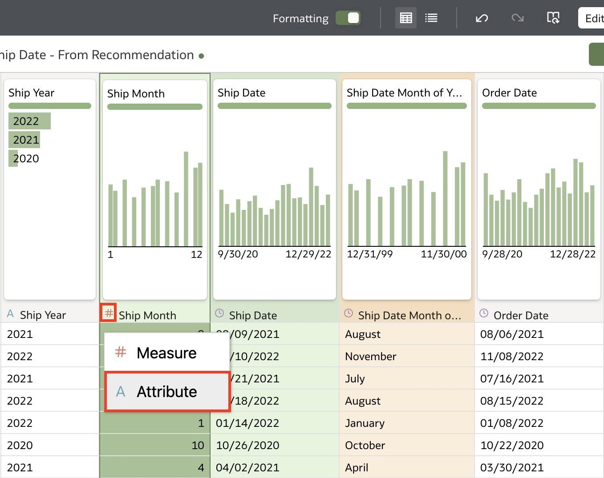

# Data Preparation

## Introduction

In this lab, you will utilize Oracle Analytics' data prep capabilities to clean and transform your data in preparation for visual analysis.

  

Estimated Time: 15 minutes

### Objectives

In this lab, you will:
* Apply data prep capabilities to clean and transform your data

### Prerequisites

This lab assumes you have:
* Access to Oracle Analytics Cloud
* Downloaded [Sample Order Lines DS-data prep](https://objectstorage.us-phoenix-1.oraclecloud.com/p/wF3a2m0cUSN7-O_hxcpQW6tk1k-MO8fqGyJFfBsNFW75j-cNemttyPZ7rWiE6heJ/n/idbwmyplhk4t/b/LiveLabsFiles/o/Sample%20Order%20Lines%20DS-data%20prep.xlsx)

## Task 1: Import Data Into Oracle Analytics
In this section, you will upload the Sample Order Lines DS-data prep into Oracle Analytics.

1. Log in to your Oracle Analytics instance with your user credentials.

2. From the homepage, click **Create** and select **Dataset**. Click here.

  

3. Click **Drag Data File Here or Click to Browse**.

  

4. Navigate to the File location and click **Open**. You can change the dataset name and description in this step if you choose. Once the data file loads, click **OK**.

  

## Task 2: Prepare Your Data
In this section, you will utilize Oracle Analytics' data preparation capabilities to clean and transform your data.

1. This is a preview of your dataset. Click **Sample Order Lines DS** to clean and transform your data.

  

2. You will find the list of enrichments in the recommendations tab on the right portion of the window.

  

3. Click the recommendations drop-down and select **Credit Card Number**.

  

4. Click **Obfuscate First 5 Digits of Credit Card Number**. Oracle Analytics has automatically identified customer-sensitive information and provided a solution to protect this data.

  

5. Navigate to the **Ship Date_R** column. Click the Options icon or right-click the column title and select  **Rename...**

  

6. Rename the column name to **Ship Date** and click <code>Enter</code>.

  

7. Click the **Ship Date** column and from the Recommendations pane, select **Extract Month of Year from Ship Date**.

  

8. Navigate to the **Ship Month** column. Click the **Measure** icon and change the data type to an **Attribute**.

  

9. Navigate to the **Product Category** column and notice that the value **office supps** isn't aligned with the formatting structure.

  

10. Double-click **office supps** and rename it to **Office Supplies**. Press **Enter** or click away to save.

  

11. Click **Save** to save the dataset.

  

12. Enter <code>Sample Order Lines DS</code> and a description if you wish and click **OK**

  

## Learn More
* [Getting Started with Oracle Analytics Cloud](https://docs.oracle.com/en/cloud/paas/analytics-cloud/acsgs/what-is-oracle-analytics-cloud.html#GUID-E68C8A55-1342-43BB-93BC-CA24E353D873)
* [Prepare Data](https://docs.oracle.com/en/cloud/paas/analytics-cloud/acubi/prepare-data.html)

## Acknowledgements
* Author - Nagwang Gyamtso, Product Manager, Analytics Product Strategy
* Contributors -
* Last Updated By/Date - Nagwang Gyamtso, February 2023
