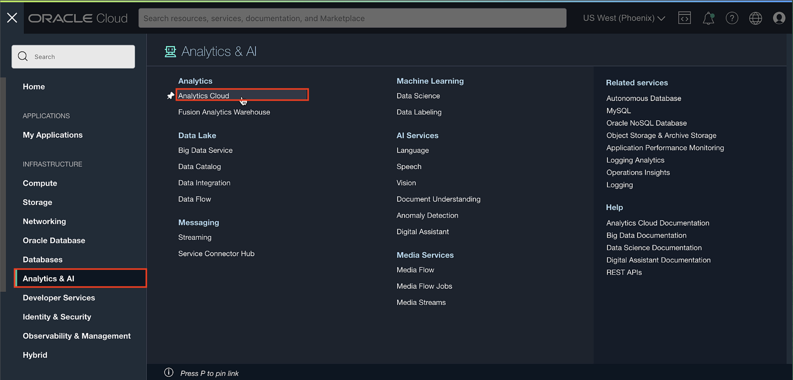
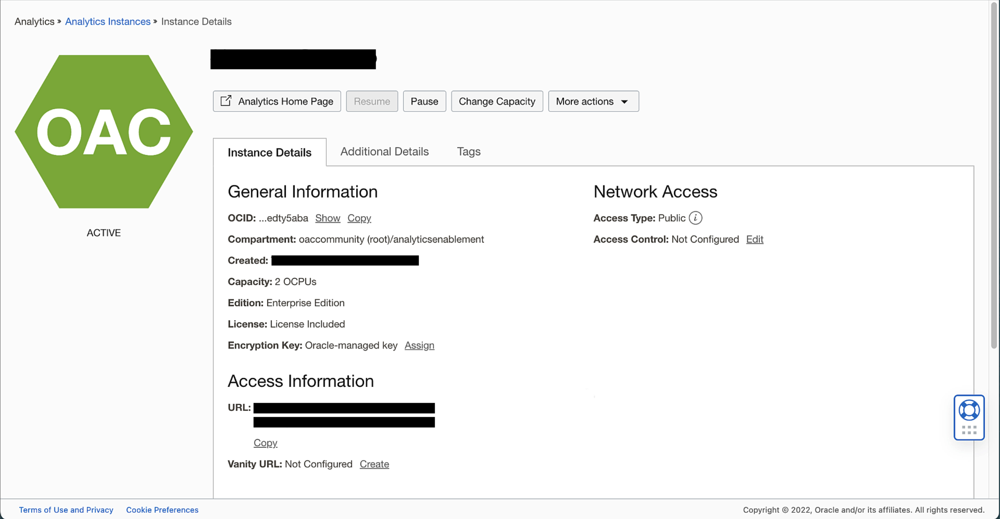
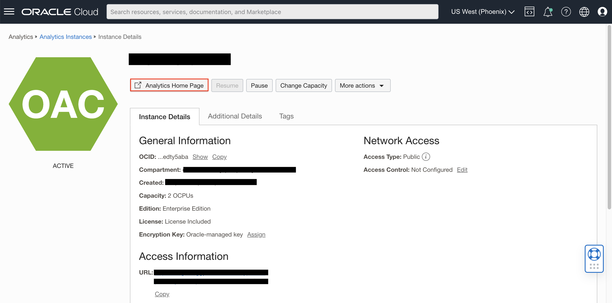

# Provision your Oracle Analytics Cloud (OAC) instance

## Introduction

Oracle Analytics Cloud is a scalable and secure Oracle Cloud service that provides a full set of capabilities to explore and perform collaborative analytics for you, your workgroup, and your enterprise.

This lab describes the process of deploying an **Oracle Analytics Cloud** instance on Oracle Cloud Infrastructure.

Your Oracle Cloud Free Tier account will use the Oracle Cloud Free Trial **credits** while this instance is provisioned, as Oracle Analytics Cloud is not part of the **Always Free** cloud services.

Provisioning an Oracle Analytics Cloud instance can take up to **40 minutes**.

_Estimated Time:_ 15 minutes.

### Objectives

- Create an Oracle Analytics Cloud instance

### Prerequisites

* An [_Oracle Cloud Free Tier Account_](https://www.oracle.com/cloud/free/) or a Paid account.  

  > **Note:** If you have a **Free Trial** account, when your Free Trial expires your account will be converted to an **Always Free** account. You will not be able to conduct Free Tier workshops unless the Always Free environment is available. **[Click here for the Free Tier FAQ page.](https://www.oracle.com/cloud/free/faq.html)**

## Task 1: Create an Oracle Analytics Cloud (OAC) Instance

Sign in to the Oracle Cloud Infrastructure from the **Oracle Home Page** (oracle.com) using your cloud account. Click on **View Account** and then **Sign in to Cloud**.  

1. Click the **Hamburger menu** on the top left and navigate to **Analytics & AI**. Then select **Analytics Cloud**.

    

2. Select **Create Instance**.

  

3. Enter the following options and click **Create**.
    * Instance name: Enter an instance name
    * Compartment: Choose a valid compartment in your tenancy
    * Capacity: OCPU
    * OCPU Count: 2
      > **Important:** 1 OCPU OAC instance is for Trials Only; you cannot scale up an 1 OCPU instance once needed, and the shape you choose comes with [Limits for Querying, Displaying, Exporting Data](https://docs.oracle.com/en/cloud/paas/analytics-cloud/acsom/create-services-oracle-analytics-cloud.html#GUID-164D8568-9AE3-4A74-9F1A-0D87B78713C9) => **DO NOT create an 1 OCPU instance for OAC Production environments**

    * License type: License Included
    * Edition: Enterprise Edition

  
  

4. The Analytics instance page will be displayed with a status of ***CREATING***.

    ***Reminder***: Provisioning an Oracle Analytics Cloud instance can take over **40 minutes**.

6. The Analytics instance page will be displayed with a status of ***ACTIVE*** when it's provisioned.  

    

## Task 2: Launch your OAC instance

1. From the Oracle Analytics Cloud instance details page and click **Analytics Home Page**. This will direct you to the OAC console.

	

You may now **proceed to the next lab**.

## **Acknowledgements**

* **Author** - Nagwang Gyamtso, Product Manager, Analytics Product Strategy
* **Contributors** -  Lucian Dinescu
- **Reviewed by** -
- **Last Updated By/Date** -
