# Geographical Relationships

## Introduction

In this lab, you will learn how to visualize a geographical relationship using a map and manage color assignments to easily understand profits by cities.

Estimated Lab Time: 10 minutes

### Objectives

In this lab, you will:
* Create a map visualization
* Manage map properties

### Prerequisites

This lab assumes you have:
* Access to Oracle Analytics Cloud
* Access to DV Content Author
* All previous labs successfully completed

## Task 1: Visualize Geographical Relationships

1. Ctrl (Command on Mac) + select **City**, **Profit**, and **Quantity Ordered**. Right-click and select **Pick Visualization...**

	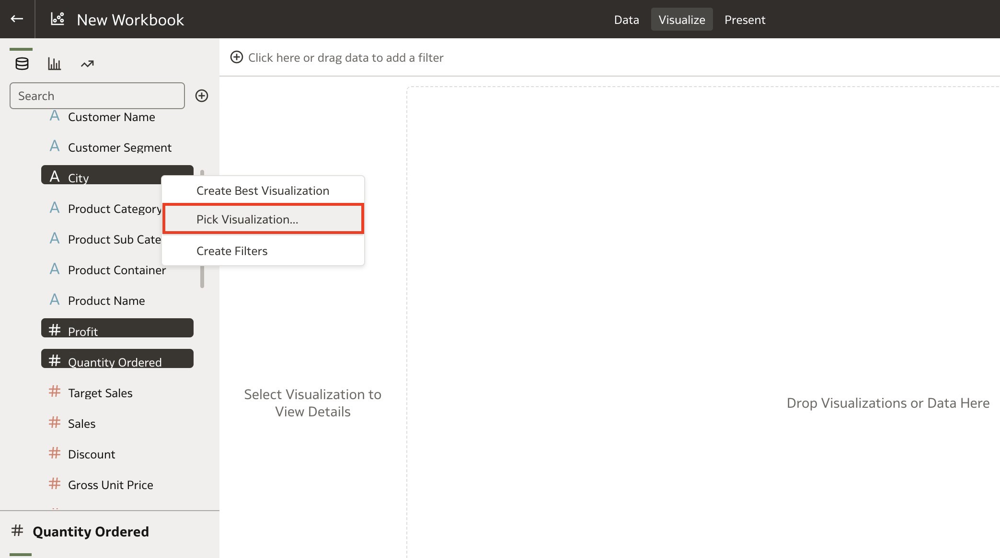

2. Pick the **Map** visualization.

	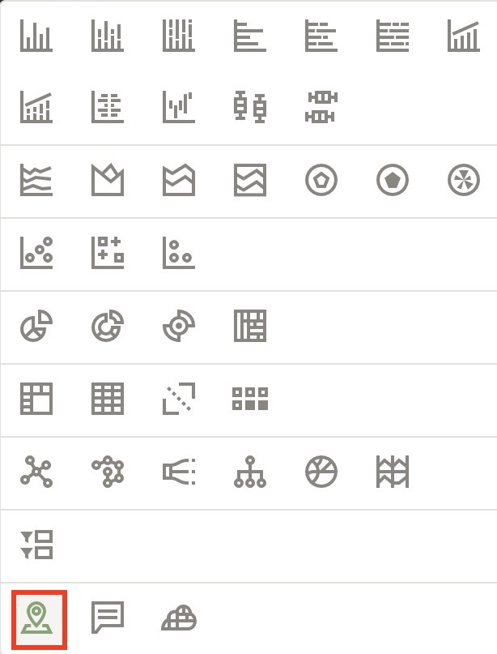

3. This is our simple map visualization which shows the Profit bubble by color and Quantity Ordered by the size of the bubble. We can improve this visualization further by using colors to help us identify cities that are in positive profit vs negative profit.

	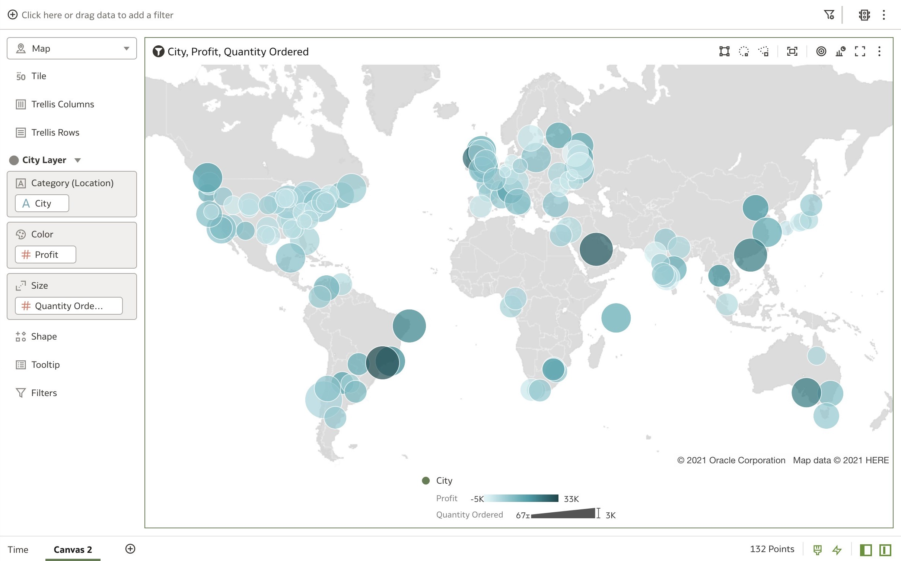

4. Right-click the map visualization and click **Color**. Then click **Manage Assignments...**

	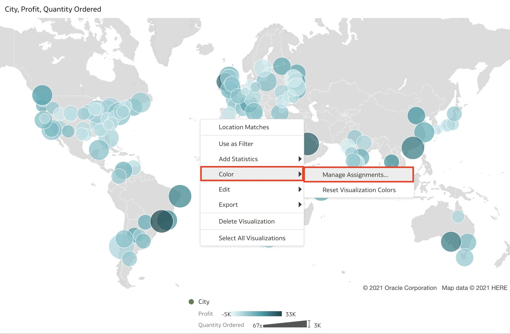

5. Click the drop-down option for **Profit** to change the color gradient.

	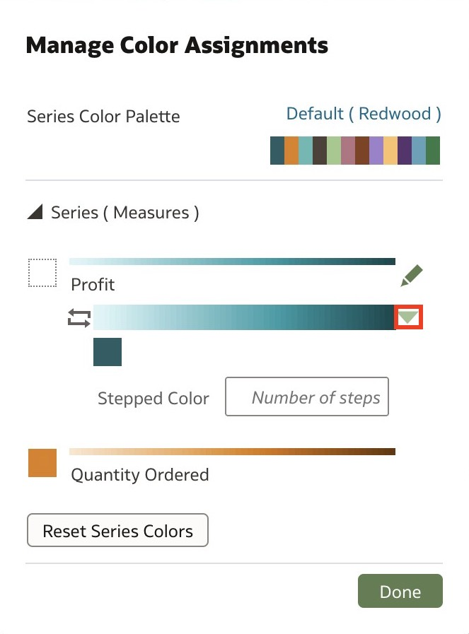

6. Select the **Diverging Red-White-Green** gradient.

	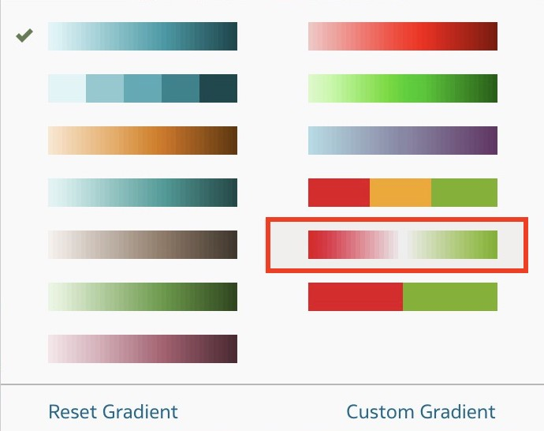

7. Click the Red color box to change the color for negative **Profit**.

	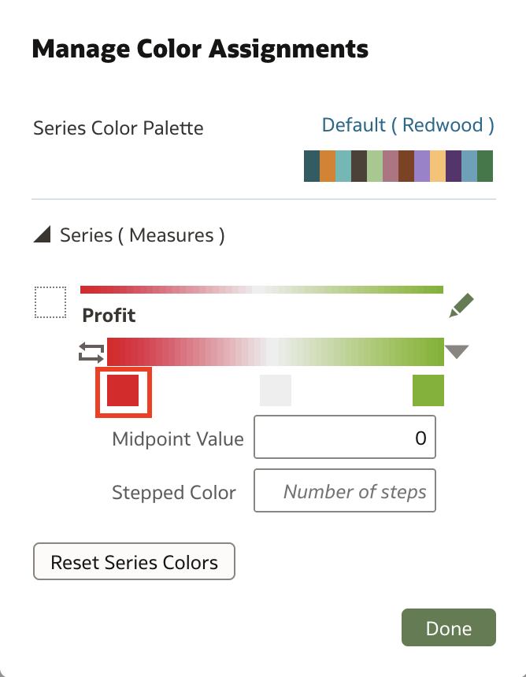

8. Select the rustic-orange preset and click **OK**. This will represent our negative profit values.

	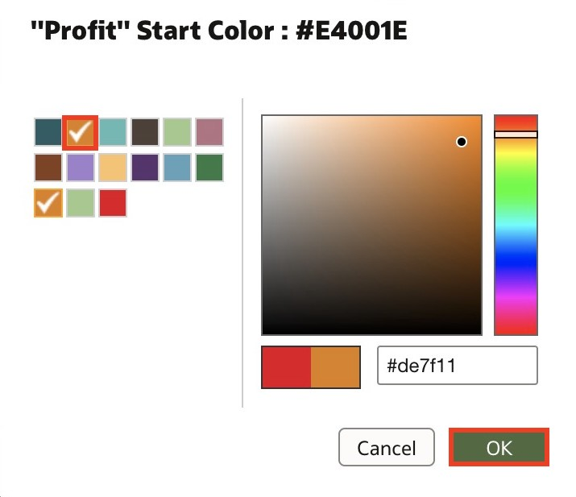

9. Click the green color box for positive profit.

	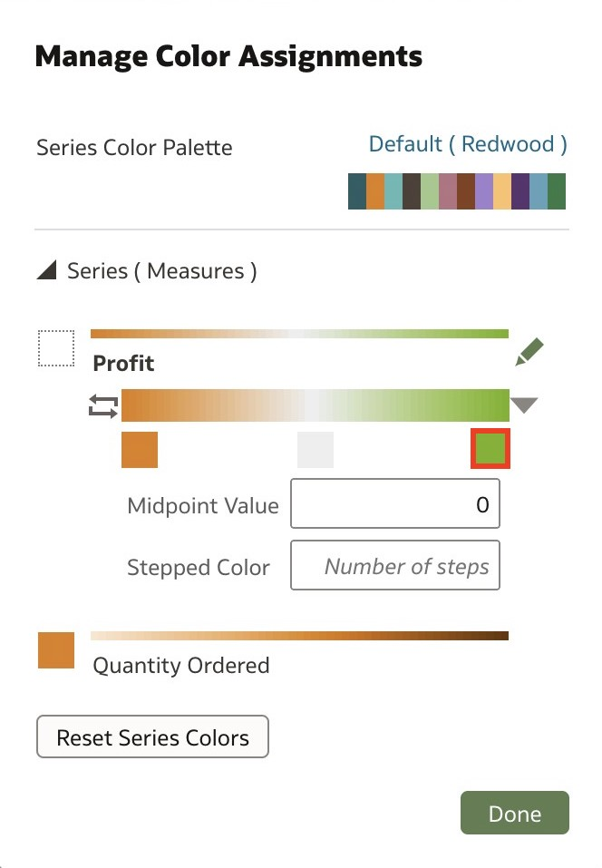

10. Select the sea-blue color from the preset. This will represent our positive profits. Click **OK**.

	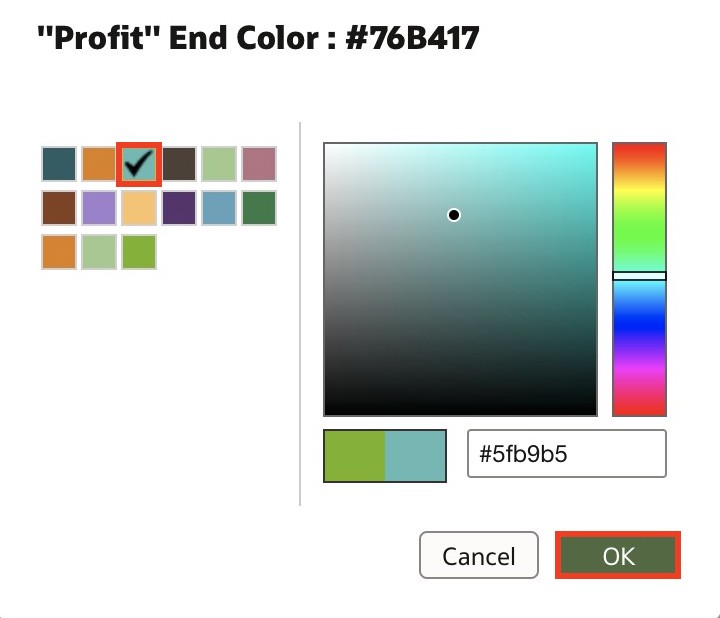

11. Click **Done** to apply the new color assignments.

	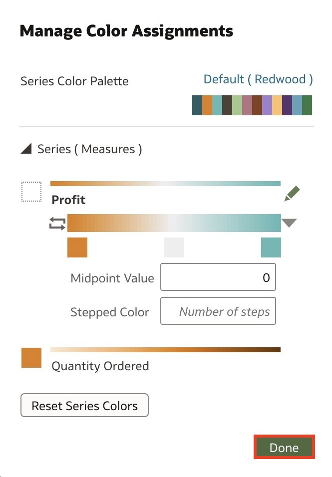

12. As you can see, it's now much easier to identify cities that are either profiting or losing money. This can help us easily decide where we need to re-allocate our resources. Maps are a great way to show geographical relationships in our data.

	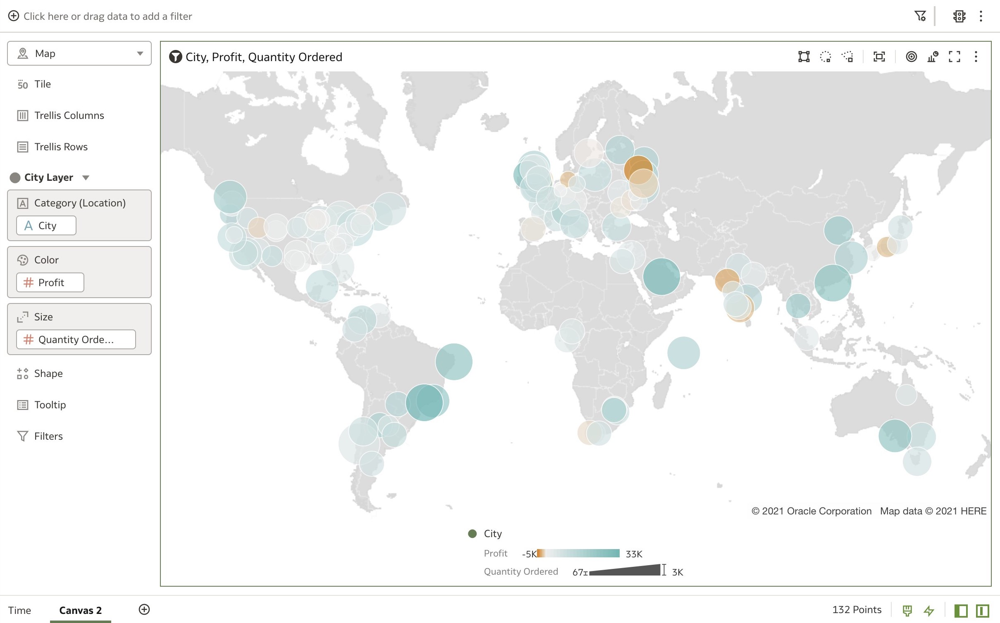

13. Change the **Title** of the visualization to **Geographical Relationships** and make the font **Bolded**.

	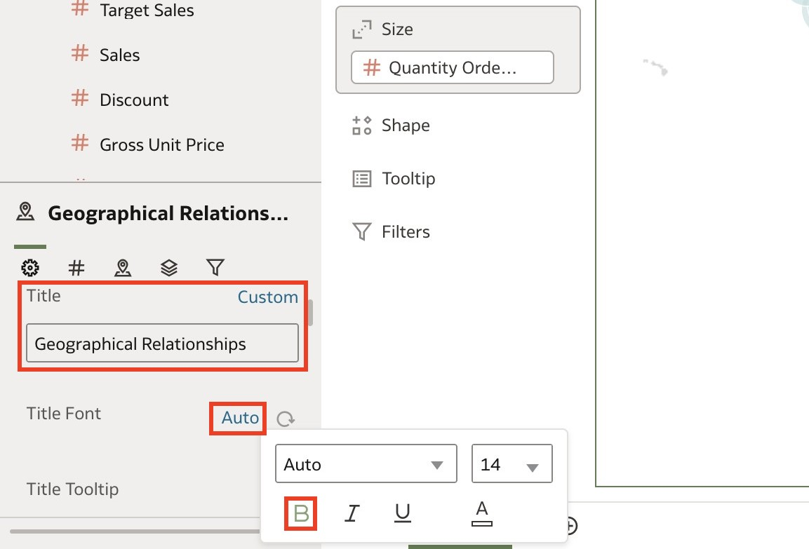

14. Rename the canvas to **Geographical Relationships** and click **Save** to save the workbook.

	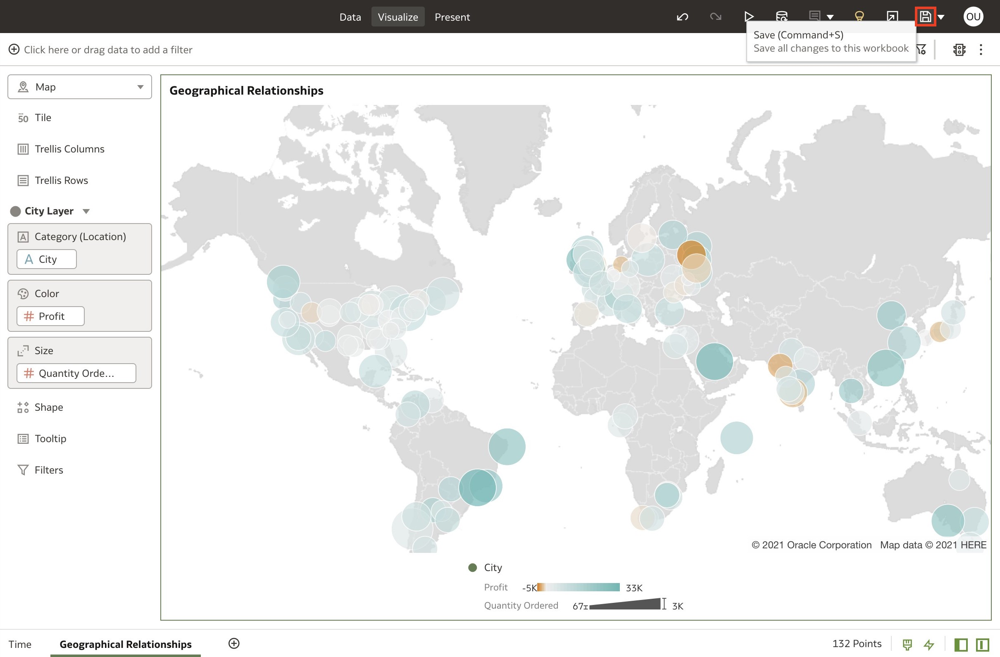

15. Name the workbook **Choosing the best visualizations** and click **Save**.

	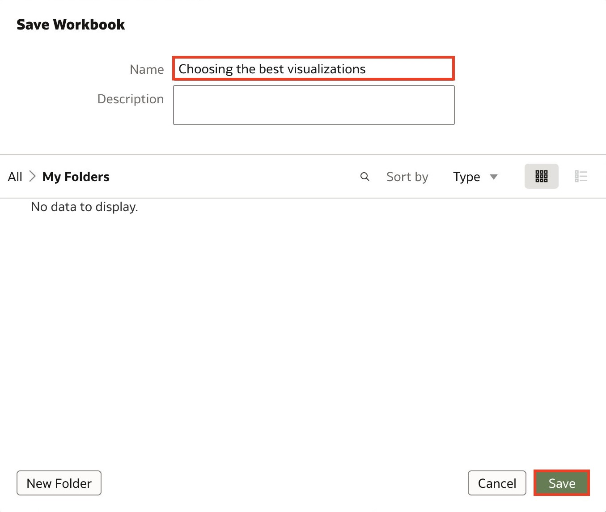

You have completed the Creating Better Data Visualizations with Oracle Analytics hands-on lab!

## Acknowledgements
* Author - Nagwang Gyamtso, Product Manager, Analytics Product Strategy
* Last Updated By/Date - Nagwang Gyamtso, July, 2023
