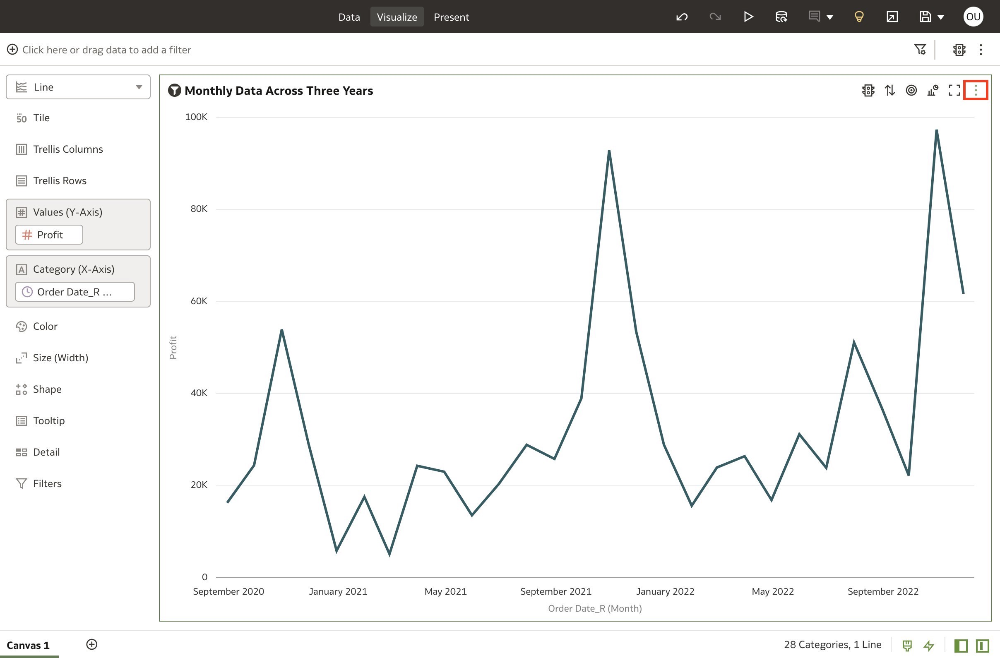

# Time comparison

## Introduction

In this lab, you will learn how to create visualizations that deal with time; specifically, comparison over time, and composition over time.

Estimated Time: 10 minutes

### Objectives

In this lab, you will:
* create a comparison over time chart (a line chart)
* create a composition over time chart (a stacked area chart)

### Prerequisites

This lab assumes you have:
* Access to Oracle Analytics Cloud
* Access to DV Content Author application role
* Download [Sample Order Lines DS](https://objectstorage.us-ashburn-1.oraclecloud.com/p/x4wryiFOjhANhy2yDOy08kMOKKaR_b3jW6KX2Dpbi3cN3QCcdradiPZ7BJBNmtAM/n/idmqvvdwzckf/b/LiveLabs-Files/o/Sample%20Order%20Lines%20DS.xlsx) dataset

## Task 1: Create a Comparison Over Time Chart

1. Login to your OAC instance with the credentials provided. From the homepage, click **Create**. Then click **Workbook**.

	

2. Search for the **Sample Order Lines DS** dataset and click **Add to Workbook**. Make sure you pick the right dataset.

	

3. Since we won't be using auto-insights, close the auto-insights panel.

	

4. Ctrl (Command for Mac) + select **Profit** and **Month** from **Order Date_R**. Drag and drop these two columns into the canvas to let Oracle Analytics auto-create a Line chart.

	

5. To format the title for this Line chart, navigate to the properties panel, and for **Title**, click on **Auto**. Then select **Custom**.

	

6. Type **Monthly Data Across Three Years**. To format the title font, click the **Title Font** option. This is where you can customize the Font properties. Click the **Bold** icon.

	

7. This was a simple comparison over time visualization. Now, let's create a composition over time visualization.

## Task 2: Create a Composition Over Time Chart

1. Click the **Menu** icon of our existing chart.

	

2. Click **Edit**, and then click **Duplicate Visualization**.

	

3. Drag the duplicate visualization and place it above the existing chart.

	

4. From the data panel, drag **Quantity Ordered** and drop it on top of **Profit** to replace Profit.

	

5. Drag **Order Priority** into the **Color** section.

	

6. Click the visualization type to change the visualization and select the **Stacked Area** chart.

	

7. Here, we have our **Stacked Area** chart, which shows the composition of **Quantity Ordered** based on the **Order Priority** over time.

	

8. Let's change the color assignments so that our eyes are drawn to the higher-priority orders. Right-click the visualization and select **Color**. Then click **Manage Assignments...**

	

9. This is where you can manage the color assignment for your attributes. Click the color box for **1 - Critical**.

	

10. Select the rusty-orange preset and click **OK**.

	

11. Let's change the color assignment for the high priority orders. Click the color box for **2 - High**.

	

12. Select the light-green preset and click **OK**.

	

13. We are fine with the other two color assignments for now. After you set the right color assignments, click **Done** to apply the colors.

	

14. Let's go ahead and change the **Title** of the **Stacked Area** chart to **2021 Trending Dimensions - Understanding Absolute Changes**.

	

15. Click the drop-down option on the Canvas and select **Rename**.

	

16. Name it **Time**, then click **Add Canvas**. We will create a geographical relationship visualization in this new canvas.

	

You may now **proceed to the next lab**.

## Learn More
* [Process Data Using a Sequence of Data Flows](https://docs.oracle.com/en/cloud/paas/analytics-cloud/acubi/process-data-using-sequence-data-flows.html#GUID-CA3C5C48-069B-4D4B-A989-5932A1B421EB)

## Acknowledgements
* **Author** - Nagwang Gyamtso, Product Manager, Analytics Product Strategy
* **Last Updated By/Date** - Nagwang Gyamtso, July, 2023
