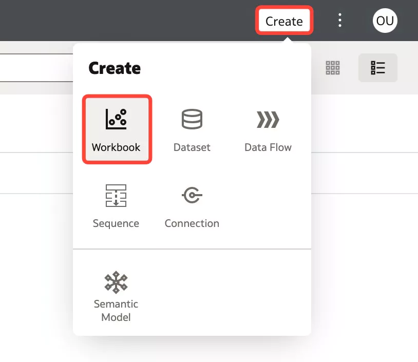
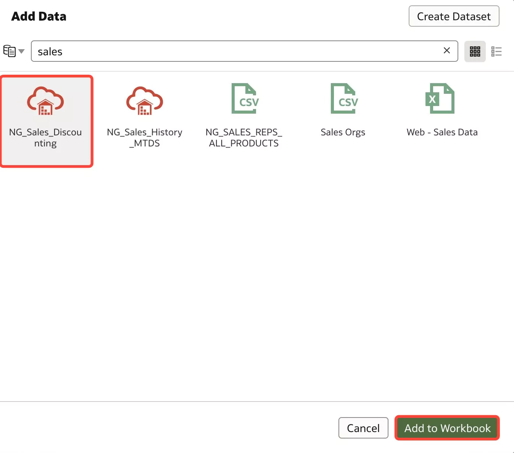
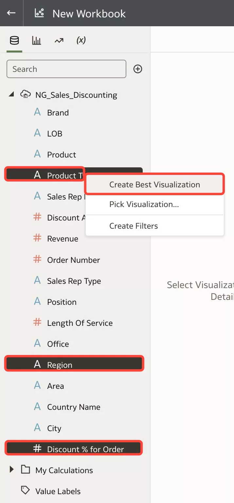
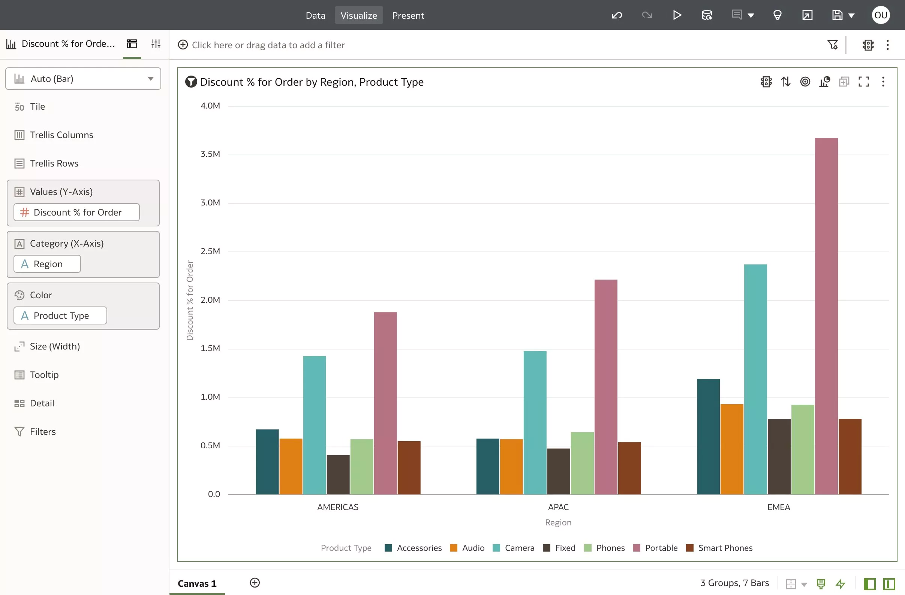
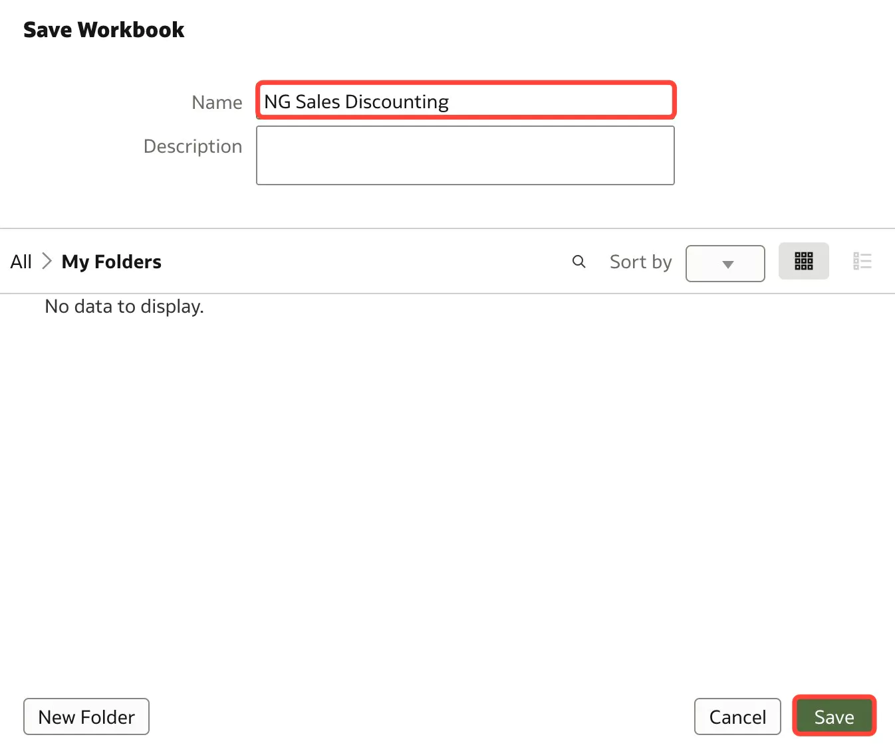
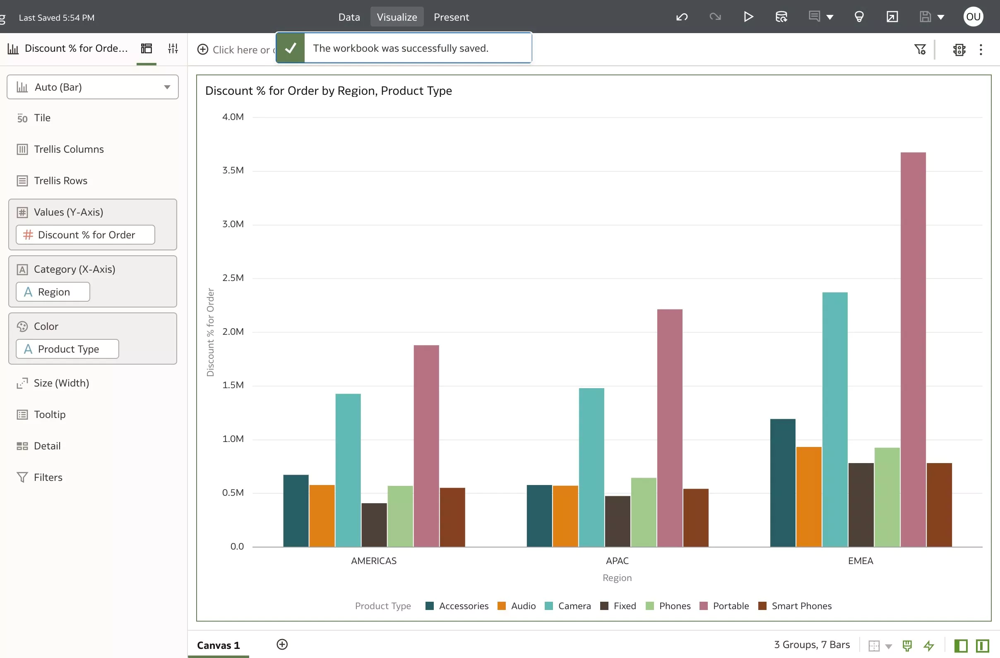

# Create the Logical Layer

## Introduction
In this lab, you will create a workbook using the **Sales\_Discounting** dataset you created from the data flow. You will create a simple visualization to help us get started with analyzing the sales discounting dataset.

Estimated Time: 5 minutes

### Objectives

In this lab, you will:
* Analyze your data using the Sales_Discounting dataset you created using the data flow

### Prerequisites

This lab assumes you have:
* Access to Oracle Analytics Cloud
* Access to DV Content Author, BI Data Model Author, or a BI Service Administrator role
* All previous labs successfully completed

## Task 1: Analyze Your Data

1. Click **Create** and select **Workbook**.

	

2. Search for and select the **xx\_Sales\_Discounting** dataset and click **Add to Workbook**.

	

3. Select **Product Type**, **Region**, and **Discount % for Order**. Right-click and select **Create Best Visualization**. This will let the system auto-determine the best visualization type to visualize these columns.

	

4. Here you can see that clearly, the Camera and Portable product types are receiving the highest discount across all three regions. With this information, we can investigate further to understand why these two product types are receiving the most discount and how that impacts our profit margins.

	

5. For now, we will save the workbook. Click the **Save** icon on the top right.

	

6. Enter **xx\_Sales\_Discounting** and hit **Save**.

	

7. In this workshop, we learned how to use Oracle Analytics' lightweight ETL tool called Data Flows to extract, transform, and load data using the combined powers of Oracle Analytics Cloud and Oracle Autonomous Data Warehouse. We created several data flow outputs using local subject area and flat file data sources and created a workbook to start uncovering insights on the datasets we created.

	

## Learn More
* [Analyze Your Data in Oracle Analytics](https://docs.oracle.com/en/cloud/paas/analytics-cloud/tutorial-analyze-data/#before_you_begin)

## Acknowledgements
* Author - Nagwang Gyamtso, Product Manager, Analytics Product Strategy
* Contributors - Lucian Dinescu
* Last Updated By/Date - Nagwang Gyamtso, July, 2023
