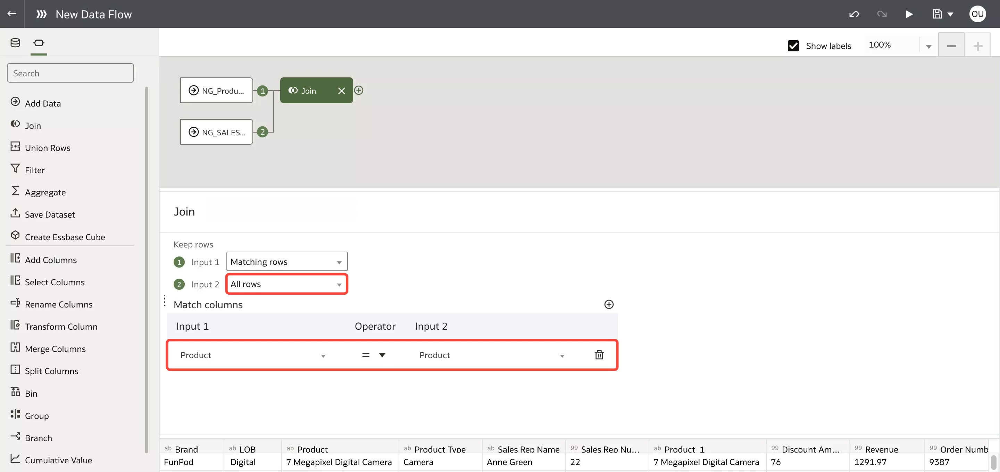
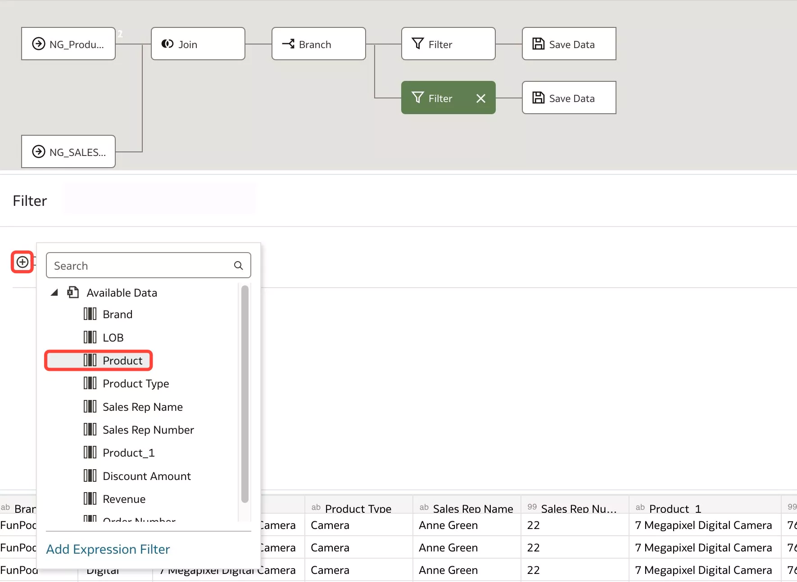

# Create the Physical Layer

## Introduction

This lab guides you through the steps of creating a data flow. Oracle Analytics Cloud's Data Flow is a lightweight ETL tool to extract, load, and transform your data. You can also train out-of-the-box machine learning models, create, sentiment analysis, and leverage OCI functions when you connect to an Oracle Autonomous Data Warehouse.

Estimated Lab Time: 10 minutes

### Objectives

In this lab, you will:
* Create a data flow to filter out null product values
* Create a branch to create two output datasets

### Prerequisites

This lab assumes you have:
* Access to Oracle Analytics Cloud
* Access to DV Content Author, BI Data Model Author, or a BI Service Administrator Problems
* Access to the Local Subject Area

## Task 1: Create a Dataset using a Local Subject Area

You will create two datasets: the first dataset will be a products dataset created using a Local Subject Area, and a second dataset which you will upload from your local machine.

1. Click **Create** and then select **Data Flow**.

	

2. All your available data sources will be listed in this window. For this lab, we will create a new dataset from an existing subject area. Click **Create Dataset**.

	

3. Select the **Local Subject Area** option.

	**Note**: We are selecting the Local Subject Area dataset because it contains the official, curated corporate product hierarchy which is our “single source of truth.” This is an example of how OAC enables fast, self-service data prep and analysis on ad hoc (spreadsheets) and curated datasets.

	

4. Drag and drop **SampleApp** into the data diagram pane. Then double-click SampleApp in the **Join Diagram**.

	

5. Expand the **Products** folder and select the following columns and click **Add Selected**:
	* A Brand
	* A LOB
	* A Product
	* A Product Type

	

6. At the upper left of your screen, enter **XX_Products** (XX being your initials) in the **Table Name** field and click **OK**.

	

7. Click the **Save** icon.

	

8. Enter **XX_Products** for **Name** and click **OK**.

	

9. Go back to the **New Data Flow** browser tab.

	

10. The **xx_Products** subject area dataset should be auto-selected. Click **Add**.

	

11. You will now be taken to the data flow editor. The data flow steps are shown on the left pane, the data flow diagram on the top shaded area, the step configurations are in the middle and the dataset preview is on the bottom of the screen.

	

## Task 2: Add More Data and Join Them

1. Click **Add a step**. Here, you'll see all the data transformations you can apply to your data. You can add more data, join tables, apply filters, aggregations, add columns, rename columns, apply advanced statistical analysis, or apply Oracle ML and AI models. Click **Add Data**.

	

2. You will bring in a flat file dataset and join the new dataset with the **Products** dataset you created. Click **Create Dataset**.

	

3. Click the **Upload** option and from your local machine, select the [**SALES\_REPS\_ALL\_PRODUCT**](https://objectstorage.us-phoenix-1.oraclecloud.com/p/S3gWL_n0qhXhs-7Th2JpvZ-_p-Y2-h9dinh37je_2nthEpsvVGDAhkwfuAnfhcH6/n/idbwmyplhk4t/b/LiveLabsFiles/o/SALES_REPS_ALL_PRODUCTS.csv) dataset.

	**Note:** Download the sales reps dataset [here](https://objectstorage.us-phoenix-1.oraclecloud.com/p/S3gWL_n0qhXhs-7Th2JpvZ-_p-Y2-h9dinh37je_2nthEpsvVGDAhkwfuAnfhcH6/n/idbwmyplhk4t/b/LiveLabsFiles/o/SALES_REPS_ALL_PRODUCTS.csv).

	

4. This dataset consists of product sales and discount amounts for each sales transaction a sales rep processed. Add your initials, **_XX** at the end of the table name and Click **OK**.

	

5. Save the dataset by clicking the **Save** icon.

	

6. Save the dataset as **XX\_Sales\_Reps\_All\_Products** and click **OK**.

	

7. Go back to the Data Flow browser tab. The sales reps dataset should be auto-selected. Click **Add**.

	

8. The tool automatically recommends a way to join the two data sets in the data flow, as indicated in the Match columns section. The system created an auto-join using the **Product** column. In the **Keep rows** configuration for **Input 2**, click the dropdown menu and select **All rows**. This will allow us to use all the sales data in the new combined dataset.

	

## Task 3: Create a Branch and Filter Data

1. Click **Add a step** next to the **Join** step. Select **Branch**. This will allow us to create a branch so that we can save two output datasets.

	

2. Hover between the first branch and click **Add a step**.

	

3. We will create a filter so that the first output includes all sales with missing product names. Click **Filter**.

	

4. Click the **Add Filter** icon and select **Product**.

	

5. Check the **Nulls** box to select only the **Product** columns with NULL values.

	

6. Click the **Save Data** step in the first branch. Enter **XX\_Missing\_Products** for the Dataset name. For **Save data to** select **Database Connection**.

	

7. Click **Select connection** and select the **ADW4Workshops** connection. This will save the output dataset to this ADW.

	

8. Hover over the second branch and click **Add a step**.

	

9. Click **Filter**. This time, we will create an output dataset that excludes the rows with Null values for **Product**.

	

10. Click the **Add filter** icon and select **Product**.

	

11. Select **Nulls** and then select **Exclude**. This will exclude all the rows with null **Product** values.

	

12. Click the **Save Data** step for this current branch. Enter **XX\_Matched\_Products** for the Dataset name and **Save data to** the **Database Connection**.

	

13. Select the **ADW4Workshops** connection. On the right side, the columns are displayed with their column names, data types, and aggregations. Change **SALES\_REP\_NUMBER** and **ORDER\_NUMBER** from Measure to Attribute. As a general rule, columns which you don't apply aggregation on should be set as Attributes.

	

## Task 4: Save and Run the Data Flow

1. Save this data flow by clicking the **Save** icon.

	

2. Type **XX\_Product\_Match\_DF** and Click **OK**.

	

3. Click the play icon to run the data flow. This is a good start. We have combined our products and sales datasets and then separated them into two segments: a dataset where the products DO match, and a dataset where the products DON’T match.

	

4. The data flow will run and complete in a few minutes. You can perform other tasks while the data flow is running. Click **Go back** to return to the homepage.

	

You may now **proceed to the next lab**.

## Learn More
* [Explore Data Flows in Oracle Analytics](https://docs.oracle.com/en/cloud/paas/analytics-cloud/tutorial-explore-data-flows/#before_you_begin)
* [Create Datasets Using Data Flows](https://docs.oracle.com/en/cloud/paas/analytics-cloud/acubi/create-datasets-using-data-flows.html#GUID-559E3C73-68A1-4982-AA1B-E0C487E9EA50)

## Acknowledgements
* Author - Nagwang Gyamtso, Product Manager, Analytics Product Strategy
* Contributors - Lucian Dinescu
* Last Updated By/Date - Nagwang Gyamtso, July, 2023
