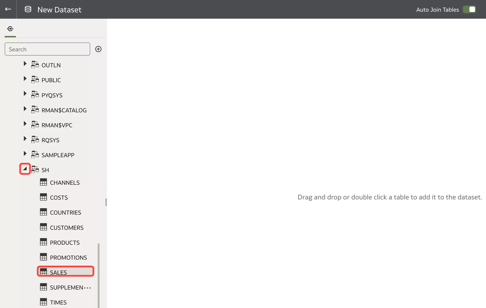
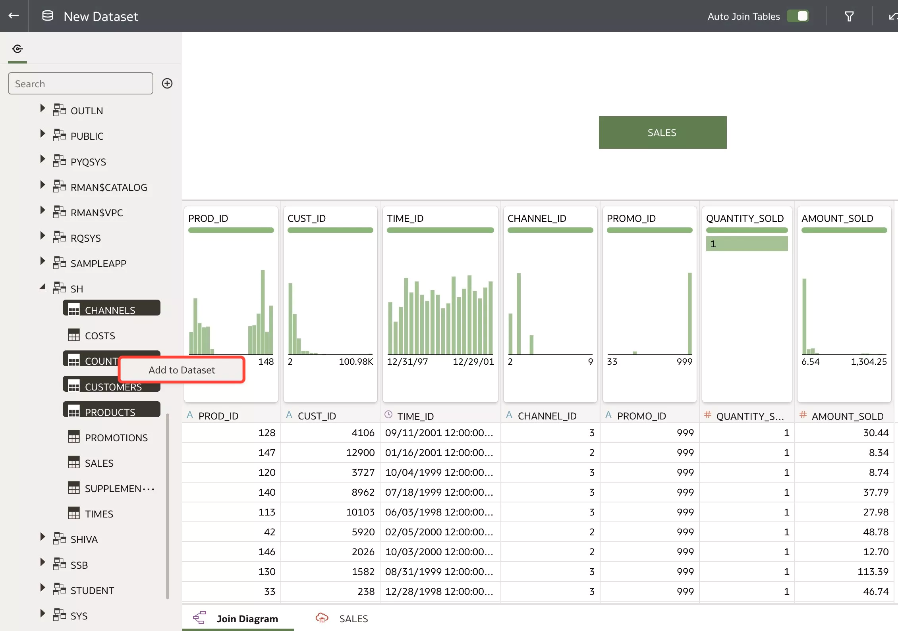
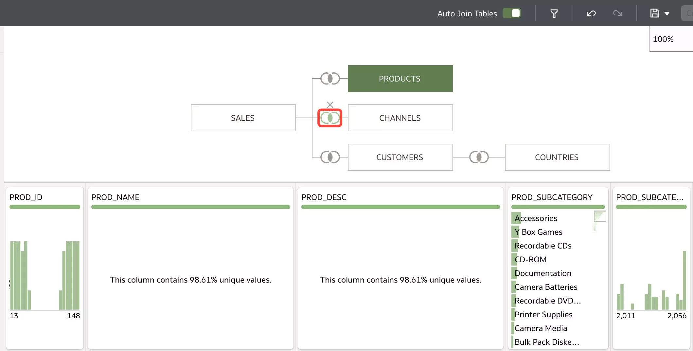
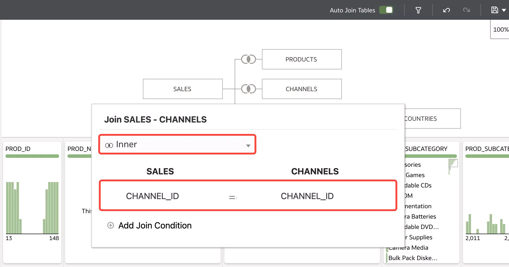
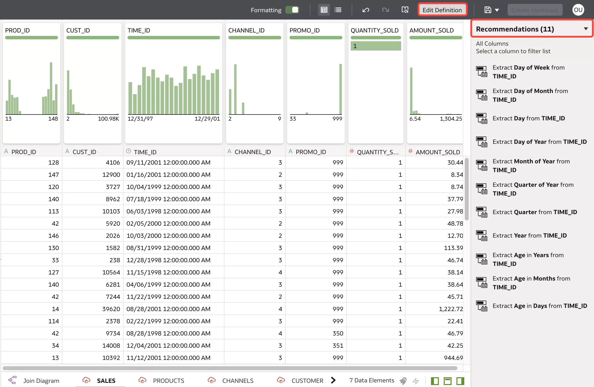
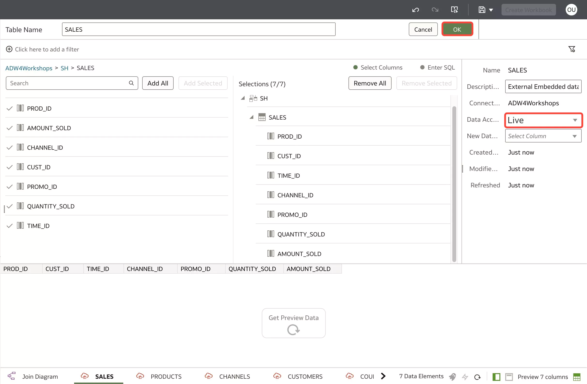
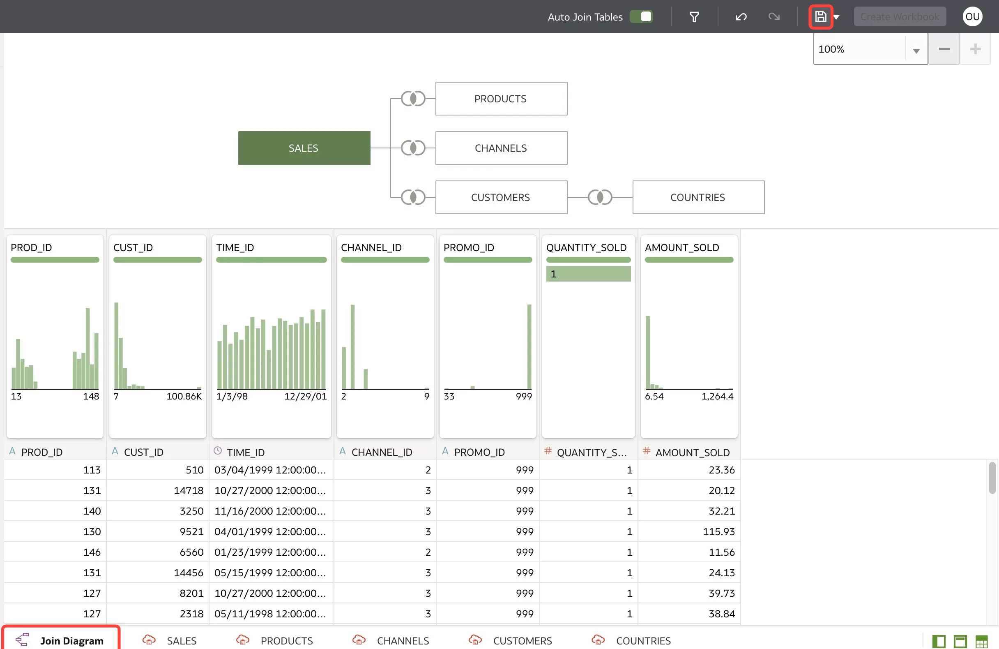

# Create a Dataset Using Multiple Tables

## Introduction

In this lab, you will create a multi-table dataset using the **SH** schema from your Autonomous Data Warehouse connection.

Estimated Time: 10 minutes

### Objectives

In this lab, you will:
* Create a multi-table dataset to model your data

### Prerequisites

This lab assumes you have:
* Access to Oracle Analytics Cloud
* Access to DV Content Author, BI Data Model Author, or a BI Service Administrator role
* Access to the SH schema in your ADW

## Task 1: Create Multi-Table Dataset

1. On the top right corner, click **Create** and then select **Dataset**.

	

2. Here, select the ADW that we connected to. We will use tables from a schema in this Autonomous Data Warehouse to create a multi-table dataset.

	

3. From the connections tab, expand **Schemas**.

	

4. You will see a list of schemas available within the ADW. Expand the **SH** schema and double click the **SALES** table to add it to the dataset we're creating. Optionally, you can drag and drop the **SALES** table into the Join Diagram.

	

5. Select the rest of the tables to add to the dataset. Ctrl+click **CHANNELS**, **COUNTRIES**, **CUSTOMERS**, AND **PRODUCTS**. Right-click the tables and click **Add to Dataset**. Again, you can optionally drag and drop the tables into the join diagram.

	

6. Since **Auto Join Tables** is enabled, the system will automatically create joins based on matched columns it has identified. To inspect a join, click the join icon between tables.

	

7. You can see that the SALES and CHANNELS tables were auto-joined on CHANNEL_ID. You also notice that the join type is an **Inner** join. You have the option to change the join type or add additional join conditions in this window.

	

8. On the bottom of the page, you notice tabs for all the tables we added. Click the **SALES** table.

	

9. This opens up the dataset editor. Here, you can clean your dataset by applying column transformations. On the right, you'll notice **Recommendations** which are machine learning generated recommendations to enrich your dataset. Self-service data preparation isn't the focus of this lab so we won't explore this dataset editor. Click **Edit Definition**.

	

10. Here, you can choose to Add or Remove columns used in the SALES table name. You can also set the **Data Access** option to **Live** or **Automatic Caching**. Live gets the latest data directly from the source into the table while Automatic Caching caches the data and updates the table only when a workbook using the dataset is refreshed or the dataset is refreshed in the dataset editor. This can provide faster performance. Set this option to the default **Live** and click **OK**.

	

11. Go back to the **Join Diagram** and click **Save**.

	

12. Save the dataset as **xx\_Sales\_Hisotry\_MTDS** where xx is your initials. Click **OK**. You have just created a multi-table dataset using the Autonomous Data Warehouse connection.

	

13. Click the back icon to return to the homepage. In the next lab, you will learn how to create a data flow.

	

You may now **proceed to the next lab.**

## Learn More
* [Create a Dataset with Multiple Tables in Oracle Analytics](https://docs.oracle.com/en/cloud/paas/analytics-cloud/tutorial-mutli-table-data-set/#before_you_begin)

## Acknowledgements
* Author - Nagwang Gyamtso, Product Manager, Analytics Product Strategy
* Contributors - Lucian Dinescu
* Last Updated By/Date - Nagwang Gyamtso, July, 2023
