# OCI Data Flow in the Data Lake

## Introduction

Data is constantly growing being enhanced, validated and updated. That is why once you have the data assets you need to make sure that processing continues to manage the data assets and provide updated values you data lake.

OCI Data Flows handles these processes by loading new data or updating.

Estimated time: 20 minutes

Watch the video below for a quick walk through of the lab.

[](youtube:arWzMjy5-y8)

### Objectives

* Learn how to create OCI Data Flow App
* Learn how to create OCI Data Load 
* Learn how to schedule to automate OCI Data Flow Apps

## Task 1: Create an OCI Data Flow app

You have several choices on how to create applications and languages. You can choose something that makes sense for your environment. First, we are going to take a look at the OCI Data Flow and create an application to read through files in the object storage or data lake.

We have created a python script for you to use as part of your OCI Data Flow application. It requires a little bit of editing to get your ADB ID, user name and password added to script and then uploaded to object storage. We are going to use Cloud Shell to do the editing and upload to our object storage bucket.

Start Cloud Shell


From the current directory (your home directory of your user in Cloud Shell), create a file called livelabs-df.py

```
<copy>
vi livelabs-df.py
</copy>
```
Copy the following script and insert it into the livelabs-df.py file you are currently editing in Cloud Shell:

```
<copy>
from pyspark.sql import SparkSession
import sys

def oracle_datasource_example(spark):
    # Wallet  information.
    properties = {"adbId": ADB_ID,"user" : USERNAME,"password": PASSWORD}

    ##print("Reading data from autonomous database.")
    ##df = spark.read.format("oracle").option("dbtable", SRC_TABLE).options(**properties).load()
    
    print("Reading data from json file in object storage")
    df = spark.read.json("oci://data_lakehouse@c4u04/export-stream-2020-custid-genreid.json")
    
    df.printSchema()

    print("Filtering recommendation.")
    df.filter(df.recommended == "Y")

    print("Writing to autonomous database.")
    df.write.format("oracle").mode("overwrite").option("dbtable",TARGET_TABLE).options(**properties).save()

if __name__ == "__main__":
    spark = SparkSession \
        .builder \
        .appName("Python Spark Oracle Datasource Example") \
        .getOrCreate()

    # TODO: PROVIDE THE ARGUMENTS 
    ADB_ID = "replacewithADBID"
    SRC_TABLE = "ADMIN.EXPORT_STREAM_2020_UPDATED" 
    TARGET_TABLE = "ADMIN.MOVIE_GENRE" 
    USERNAME = "replacewithUSER"
    PASSWORD = "replacewithPASSWORD"

    oracle_datasource_example(spark)

    spark.stop()
</copy>
```

After pasting the above script, in the TODO section at bottom of the script a few of the variables need values. Replace the ADB ID with your autonomous database ocid, replace the username and password for your autonomous database, probably ADMIN, where it states replacewithXXXX. If you are unsure of your ADB ID, with Cloud Shell still open you can navigate to your ADW database from the hamburger menu to Autonomous Database and **Copy** the OCID to be pasted in the script in Cloud Shellwhere it states "replacewithADBID".


Edit the replacewithXXXXX text with the correct information (paste with right click between the quotation marks):


See the edited file above for the three areas to edit. When finished editing press **esc** **:wq** to save the file and your changes.

Upload this edited file to your object storage using the command line in Cloud Shell after replacing REPLACEYOURNAMESPACE with your actual namespace name (Namespace name can be found in OCI tenancy:

```
<copy>
oci os object put --file livelabs-df.py --namespace REPLACEYOURNAMESPACE --bucket-name dataflow-warehouse
</copy>
```


Navigate from the hamburger memu to storage and select buckets. And you should see your python script in your dataflow-warehouse bucket ready for you to use in your application.


Now, navigate to the OCI Data Flow and click on Create Application.

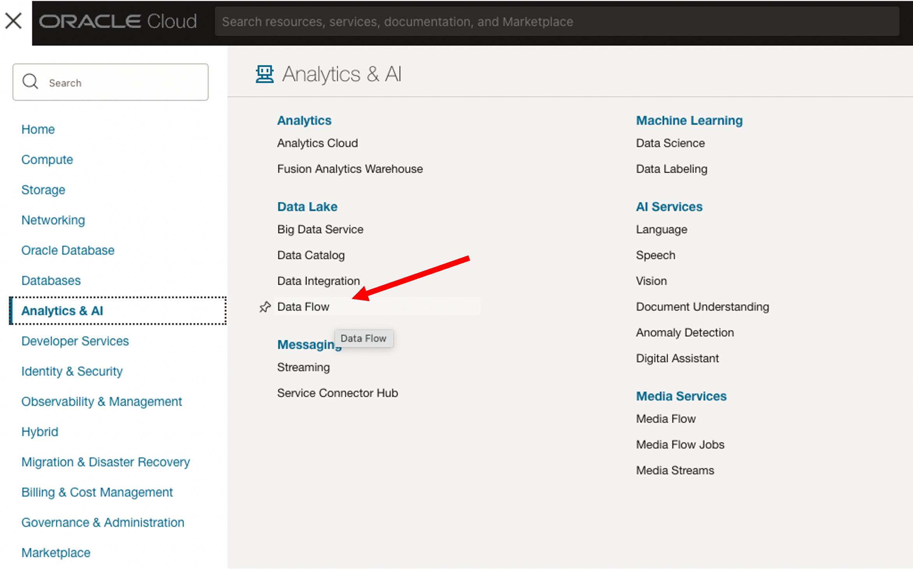

For creating the application, you need to have the python code and we are providing an example one. Also you will need to have access to the data files. Enter a name for the application and if you would like a description. Take the other defaults for the first part of the form.


For this example,Than choose python. Select Object Storage dataflow-warehouse, and then choose the file you just uploaded livelabs-df.py


The Application Log location is the dataflow-logs bucket that was created. Output logs and error messages will go into this bucket.
Click on Show advanced options. And enter in the Spark configuration properties the key: spark.oracle.datasource.enabled and the value: true


Click on Create Application.

Now we can run the application by selecting the more option dots and selecting Run from the menu.


It of course depends on how big your data file is but this sample takes about two minutes to return successfully. This job has filtered out the data and populated the movie_genre table with the job.


You can also monitor your applications in the Spark UI. Click on the application name and click on the Spark UI button.


And there are additional views to see the details about the jobs and applications running and completed.

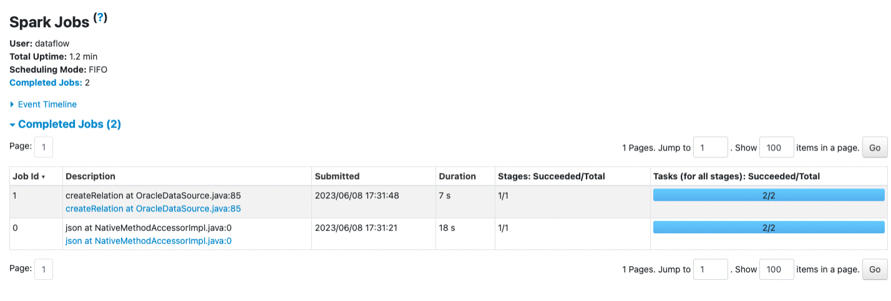

Now let's go back to OCI Data Integrations because we setup some other data sources to load as part of our data integration into the Data Lakehouse and use for additional queries as par of our analysis.

## Task 2: Create OCI Data Integration - Load

First we want to download the customer sales csv file that we can put into our object storage. This will show how you can do integrations from your object storage directly into your ADW or we can use the object storage to filter and change the files and stora back into our object storage without even going to the database.

Download the CSV file:

```
<copy>
https://objectstorage.us-ashburn-1.oraclecloud.com/n/c4u04/b/data_lakehouse/o/custsales_custsales-2020-01.csv
</copy>
```

Upload this file to your object storage bucket dataflow-warehouse:


Select the custsales_custsales-2020-01.csv file from your downloaded folder and click upload.

Navigate from the Hamburger menu to Analytics & AI, select Data Integration, and from the left menu select **Workspaces**. Here we will see our Workspace Lakehouse that we created as part of our configuration. We are going to then create a data loader task.

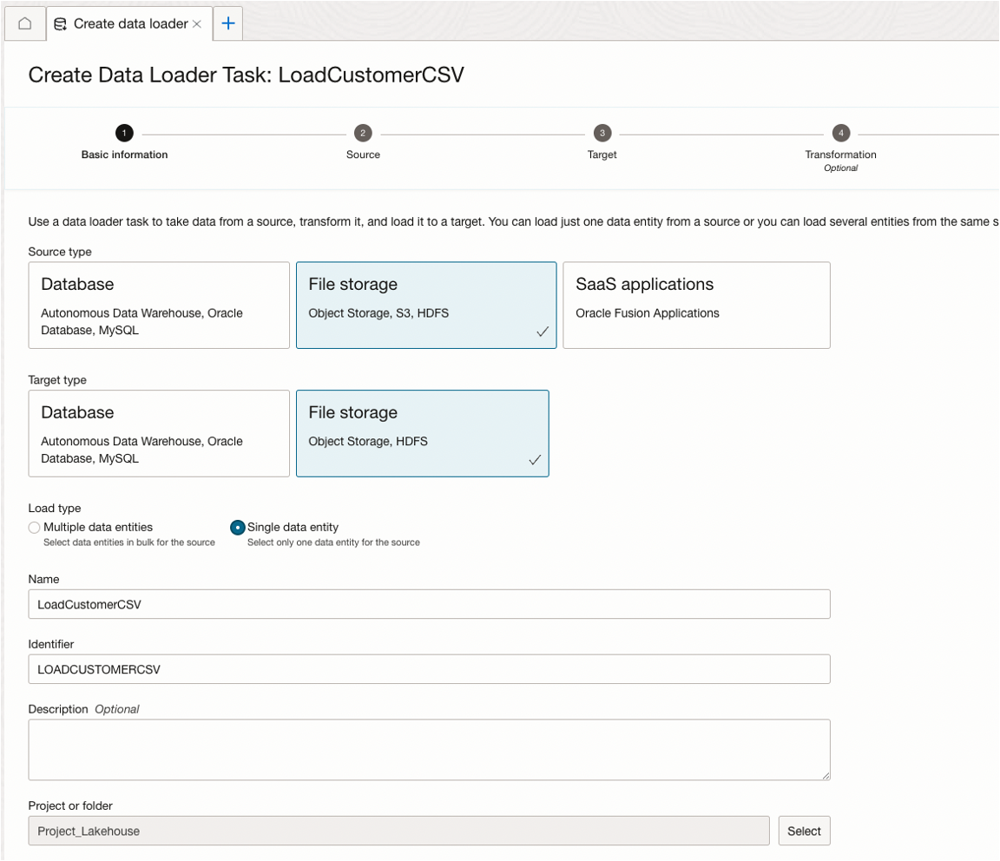

Lets give this task the name of LoadCustomerCSV, and before we create we need to select the project - Project_lakehouse.

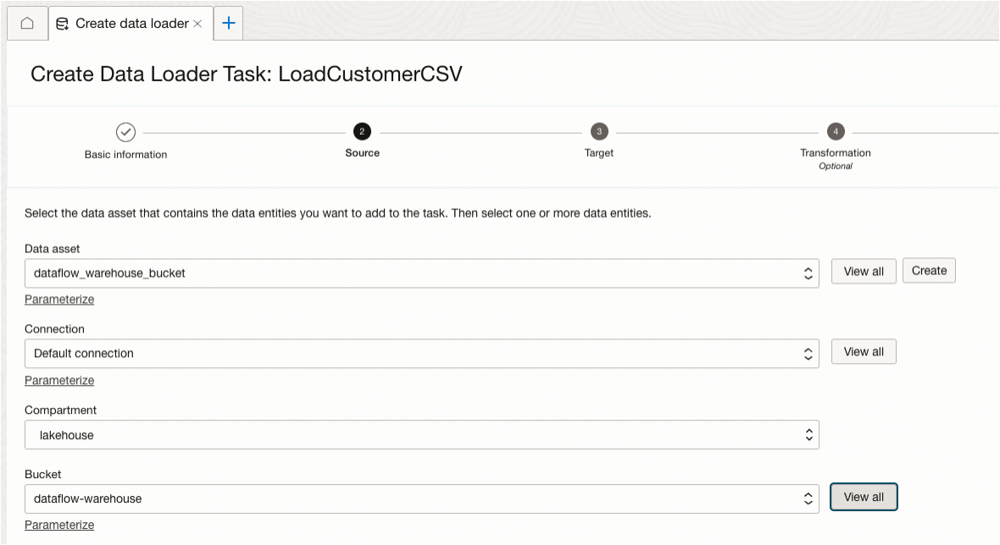

Now we have to just put in the Source, any transformations and Target for the load process. Click on Source and provide the data asset, dataflow\_warehouse\_bucket, and default connection, bucket would be the dataflow-warehouse, and finally the file type is CSV.

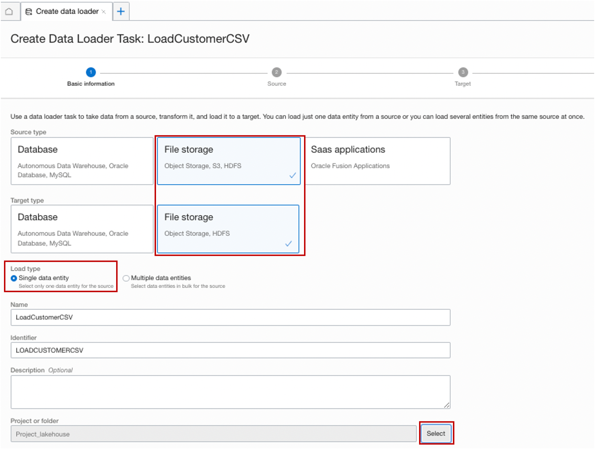


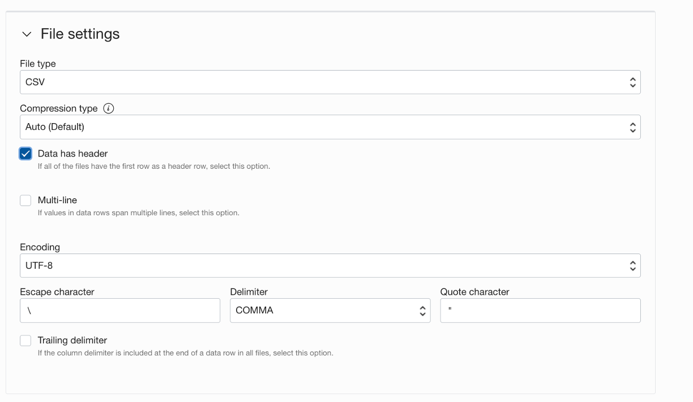

Now click on Configure Transformations, and here we are going to filter out, extract all of the APPs that are like chrome. This will then pull in just the data for those choices and if you wanted you can also exclude columns here.

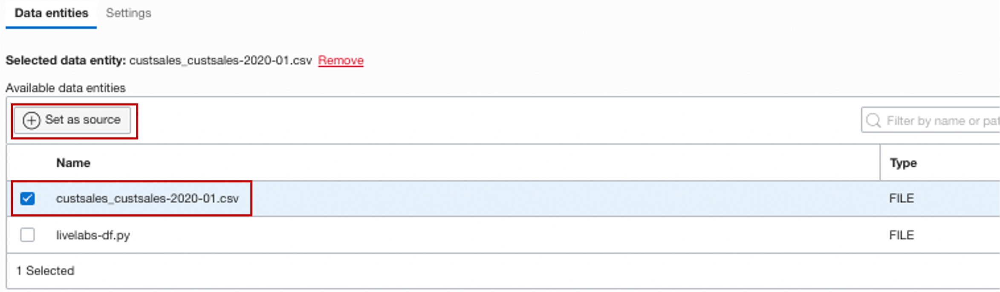

Before you select Target to fill in the details about the file, you want to **check** Create new data entity. After this first time, the target is created and when scheduling you will just need to either choose insert or overwrite, but the box only needs to be checked the first time loading a new entity.


Finally, select Target and here we are going to put the file back into object storage so that we can use it in an analytics query as an external table. 


Create and close the data loader task. We will put it into an application to run the job and load the data as part of the data integration tasks.

## Task 3: Create an application for automation

Now you are going to navigate back to the data integration workspace, and click on Application. Click on create application. Enter a name for the application, LAKEHOUSEAPP.

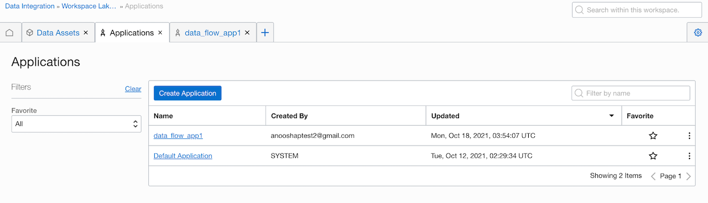

Click on Save and Close. It is just a shell of an application where you can now publish tasks to be scheduled and run through the application. Navigate to the Project_lakehouse, from the menu select Tasks. LoadCustomerCSV will be seen in the list and you will need to expand the three dot menu and add it to the application.

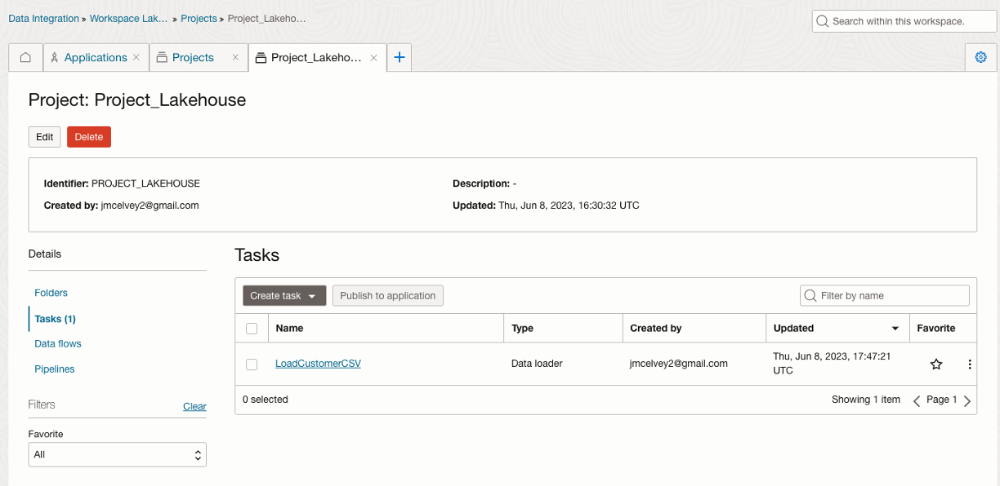

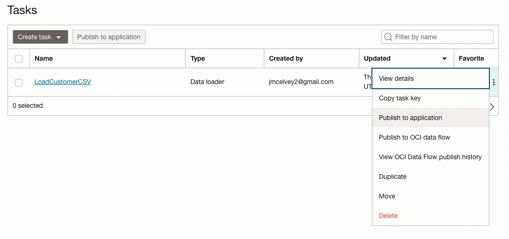

Select the application name, lakehouseapp:


## Task 4: Run and schedule apps for automation

Now under the application select the menu at the end of the LoadCustomerCSV task. 


Now select **Run** task. After this runs successfully, you can return here to schedule the task to run regularly.

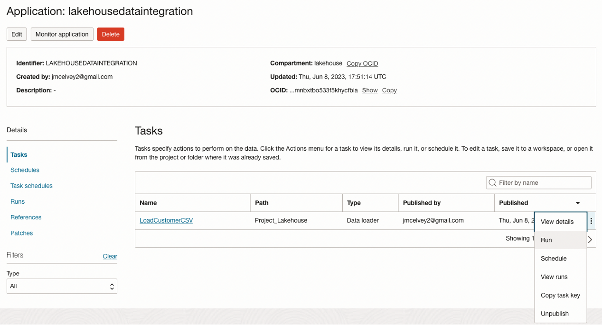

You may now proceed to the next lab.

## Acknowledgements

* **Author** - Michelle Malcher, Database Product Management, Massimo Castelli, Senior Director Product Management
* **Contributors** - 
* **Last Updated By/Date** - Michelle Malcher, Database Product Management, September 2021
