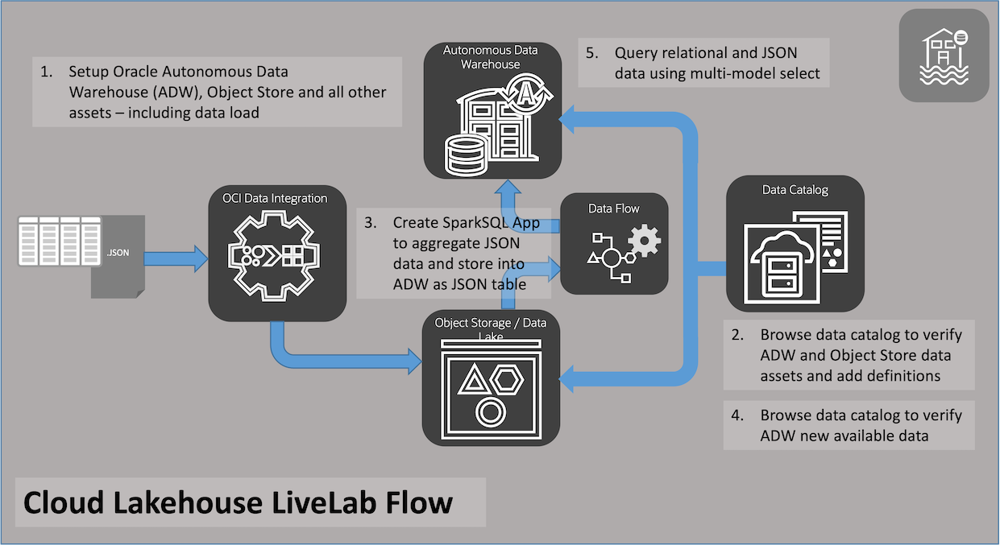

# Introduction

## About this Workshop

The requirements of many companies' business objectives demand the processing of very large volumes of data, in many different formats and imported from a large number of sources. To efficiently manage this information flood we need an high performance, integrated platform capable of minimizing transformations and copies while keeping secure and easy access to data.

Oracle Cloud Data Lakehouse fully meets these challenges and becomes the primary, integrated platform for your data management and data analytics offering performance, availability and security.

The Oracle Cloud Data Lakehouse LiveLab will demonstrate a typical usage scenario, highlighting some of the tools in  building the foundation of the data lake house.

Estimated Time: 70 minutes

<if type="odbw">If you would like to watch us do the workshop, click [here](https://youtu.be/NnRfE-MLN-A).</if>

### Objectives

This lab walks you through how Oracle Cloud Infrastructure services along with the feature rich Autonomous Data Warehouse will allow you to perform ETL, manage data updates, keep track of data using the data catalog, and finally perform a simple unifying query.

You will learn the following:
- How to configure users and policies
- Setup Autonomous Data Warehouse, Object Store and OCI Data Integration for supporting the Data Lake
- Learn about the OCI Data Catalog and add data assets
- Create new OCI Data Flow applications for filtering data and adding it as new data asset
- Use the data lake to pull data into analytics

## Learn More

* [Enterprise Data Warehousing - an Integrated Data Lake](https://docs.oracle.com/en/solutions/oci-curated-analysis/index.html#GUID-7FF7A024-5EB0-414B-A1A5-4718929DC7F2)
* [Autonomous Database Workshops](https://apexapps.oracle.com/pls/apex/dbpm/r/livelabs/livelabs-workshop-cards?p100_product=82&me=65&clear=100)
*[Autonomous Database web site](https://www.oracle.com/autonomous-database/)
* [Autonmous Data Warehouse Videos](https://docs.oracle.com/en/cloud/paas/autonomous-data-warehouse-cloud/videos.html)

## Acknowledgements

* **Author** - Michelle Malcher, Database Product Management, Massimo Castelli, Senior Director Product Management
* **Contributors** -  
* **Last Updated By/Date** - Michelle Malcher, Database Product Management, September 2021
