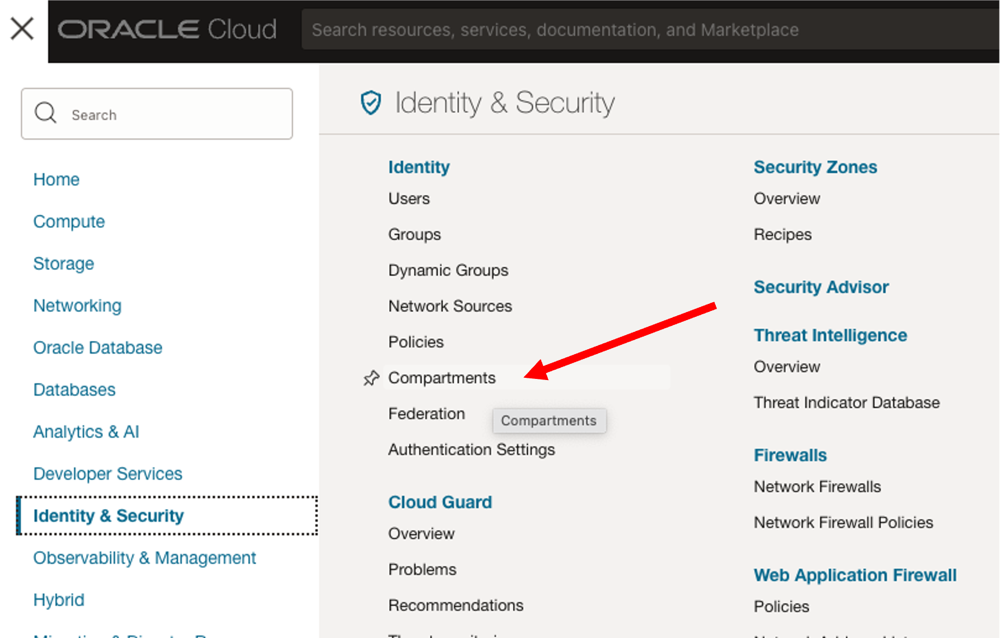
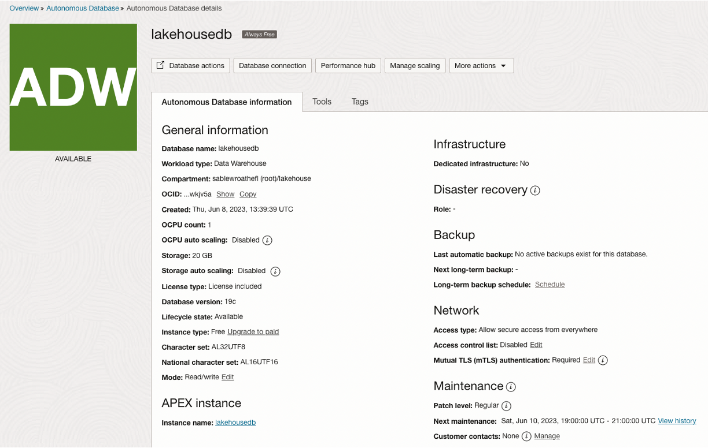

# Create groups, users, polices and Autonomous Data Warehouse (ADW)

## Introduction

In planning the Oracle Lakehouse, we know that there are several components that are needed to support the data lake and continue to maintain it. This first lab will allow us to combine these steps together for consistent polices, users and configurations for the Oracle Cloud Infrastructure tools that we will be using throughout this workshop.

Estimated Time: 15 minutes

### Objectives

In this lab, you will:
* Create users and policies to be administering and using the OCI Data Catalog, OCI Data Flow and ADW
* Create ADW for use as one of the data assets in the data lake
* Configure the OCI Object Storage Connections
* Load from OCI Object Storage a data set into ADW as part of the data lake

> **Note:** While this lab uses ADW, the steps are identical for loading data into an ATP database.

Estimated Time:20 minutes

Watch the video below for a quick walk through of the lab.

[](youtube:tYM6-qjij9A)

### About product

In this lab, we will learn more about the Autonomous Database's built-in Data Load tool - see the [documentation](https://docs.oracle.com/en/cloud/paas/autonomous-database/adbsa/data-load.html#GUID-E810061A-42B3-485F-92B8-3B872D790D85) for more information.

## Task 1: Configure Groups, Users and Polices for the Lakehouse

It is important to create separate groups and policies to keep the data lake and catalog secure. As data assets are discovered and used, the proper authorizations can be granted to users based on these groups. Having access to the data lake is critical for business processes and you will see how to grant this access and use this as a security plan for a data lake. In this step, you will set up users and policies for using the OCI Data Catalog, OCI Data Lake and ADW.

As part of the LiveLabs Sandbox configuration, the compartment and user policies have already been configured for you. The next couple of steps are for information purposes only. Please review and then continue to Task 2.

The compartment has been created for you in the LiveLabs sandbox. This allows for separation as well as grouping all of the items together in this area. If you are working in one of your tenancies, you may have already been assigned a compartment to use but it is a quick step and throughout the lab you will want to make sure that you are always in this compartment.

These steps are only for review. Continue to Task 2.

1. Once you are logged in, you are at the cloud services dashboard. Click the navigation menu in the upper left to show top level navigation choices.

    

2. Continue down to the Identity & Security menu and from there to Compartments.

    

3. There is a Create Compartment button to click on, and then the screen will come up for you to give the compartment a name, which we will be using lakehouse1 for this lab.

    

    You are going to be using this compartment for the rest of the lab. When you see the compartment listed on the left menu, just verify that it says lakehouse1. This will be important for the databases and the data tasks.

4. Select Groups from the left side menu. There are going to be a few groups that are needed to administer and use the data catalog, integrations and flows. For the interest of this lab, we are just going to add your user to each of these groups but in reality, administrators will only have the privileges to manage these areas of the data lake and other accounts will be added as users to have access to the data.

    

    

    

    Not all of these groups are needed in this lab, however, it is important to provide separation of duties for managing the lakehouse and these roles with policies will allow for that.
    Additional groups to create:
    - data-catalog-admin
    - data-catalog-users
    - data-flow-admin
    - data-flow-users
    - data-integration-admin
    - data-integration-users
    - data-lakehouse-admin

    After these groups are added. Click on a group and click on Add User. You will add your account you signed into the cloud with to each of the groups for the purpose of the lab. Ideally there will be the administrator accounts that would only be in the admin groups and those wanting to execute and view the values will be the user accounts in the user groups.

    To add a user, click on a group and below the group details, click on Add User.

    

5. After creating the groups and adding your user name to each of the groups we need to create the policies that will allow for the access to object storage and creation of the data assets. Take note of the policies and the areas they are allowed to access and how they are divided by what the user and administrator can do. Later on in the lab we will have to create a couple more policies based on the workspace ID for data integration, but having all of the policies and groups in this step of the lab combines the authorization part for the data lake and brings together what is needed to consider the security around the data lake process.


    Select Policies on the side menu and click on the button Create Policy.

    

    Name each policy for to match the group so they are easy to recognize what they are used for.
    - Name this first on DataFlowUsers (Notice no spaces, underscores or dashes are allowed here).
    - Add the description.
    - Select under Policy use cases Data Flow. This will bring up common policy templates for this area in OCI.
    - Select Let Data Flow users manage their own Applications and Runs.
    - Add the group dataflow-users and the location is the compartment lakehouse1

    

    Next create the policy for dataflow-admins. These are the same steps as above, selecting Let Data Flow admins manage all Applications and Runs. Make sure to select the group dataflow-admin and location of lakehouse1

    

    Policies can be added based on the common templates or added by manually adding the policy. These are the additional policies that are needed for the different groups. Notice when you use manual editor, the group disappears because these will be part of the policy statement being added. You can copy the following commands and paste into the manual edit. We are going to name this policy DataLakehousePolicy to cover the rest of the policies needed for the groups.


    ```
    <copy>
allow group data-lakehouse-admin to manage dis-workspaces in compartment lakehouse1

allow group data-lakehouse-admin to manage dis-work-requests in compartment lakehouse1

allow group data-lakehouse-admin to use virtual-network-family in compartment lakehouse1

allow group data-lakehouse-admin to manage tag-namespaces in compartment lakehouse1

allow group data-lakehouse-admin to use object-family in compartment lakehouse1

    </copy>
    ```

## Task 2: Create Object Storage buckets

Creating Object Storage Buckets allows for various types of data to be stored. For this lab, we are using a couple of buckets. Two are created for our data flow process which includes a place for the data and another one for the logs. Also we will create a moviestream bucket for placing the JSON file in which we will read later.

From the Home Menu click on Storage and then click on Buckets.

   

   Enter a Bucket Name, dataflow-warehouse and use the rest of the defaults and click Create.

   

   Next bucket, click on Create Bucket, Bucket Name, dataflow-logs and use the rest of the defaults and click Create.
    
   

The dataflow buckets are for the processing of the data and logs and the moviestream-bucket will allow you to keep copies of the data for loading and processing.


## Task 3: Create ADW

In this step, you will create an Oracle Autonomous Data Warehouse.

1. Once you are logged in, you are taken to the cloud services dashboard where you can see all the services available to you. Click the navigation menu in the upper left to show top level navigation choices.

    __Note:__ You can also directly access your Autonomous Data Warehouse or Autonomous Transaction Processing service in the __Quick Actions__ section of the dashboard.

    

2. The following steps apply similarly to either Autonomous Data Warehouse or Autonomous Transaction Processing. This lab shows provisioning of an Autonomous Data Warehouse database with data assets for the data lake, so click **Autonomous Data Warehouse**. The console probably shows that no database exists yet. Click on **Create Autonomous Database** to start the instance creation process.

3. Provide basic information for the autonomous database:

    - __Choose a compartment__ - Select your compartment that was part of your reservation for the database from the drop-down list **LLXXXX-COMPARTMENT**.
    - __Display Name__ - Enter a name and append it with your LL number LLXXXX for the database for display purposes. For this lab, use **LakehousedbXXXX**.
    - __Database Name__ - Use letters and numbers only, starting with a letter. Maximum length is 14 characters. (Underscores not initially supported.) For this lab, use **LakehousedbXXXX**.
    . Choose the workload type to be __Data Warehouse__ .

    

4. Configure the database, and for this lab we will be using **Always Free** resources.

    - __Always Free__ - If your Cloud Account is an Always Free account, you can select this option to create an always free autonomous database. An always free database comes with 1 CPU and 20 GB of storage. For this lab, we recommend you leave Always Free unchecked.
    - __Choose database version__ - Select a database version from the available versions.
    - __OCPU count__ - Number of CPUs for your service. For this lab, specify __1 CPU__. If you choose an Always Free database, it comes with 1 CPU.
    - __Storage (TB)__ - Select your storage capacity in terabytes. For this lab, specify __1 TB__ of storage. Or, if you choose an Always Free database, it comes with 20 GB of storage.
    - __Auto Scaling__ - For this lab, keep auto scaling enabled, to allow the system to automatically use up to three times more CPU and IO resources to meet workload demand.
    - __New Database Preview__ - If a checkbox is available to preview a new database version, do NOT select it.

    *Note: You cannot scale up/down an Always Free autonomous database.*

    

5. Create administrator credentials:

    - __Password and Confirm Password__ - Specify the password for ADMIN user of the service instance. The password must meet the following requirements:
    - The password must be between 12 and 30 characters long and must include at least one uppercase letter, one lowercase letter, and one numeric character.
    - The password cannot contain the username.
    - The password cannot contain the double quote (") character.
    - The password must be different from the last 4 passwords used.
    - The password must not be the same password that is set less than 24 hours ago.
    - Re-enter the password to confirm it. Make a note of this password.

    

6. Choose network access:

    - For this lab, accept the default, "Allow secure access from everywhere".

7. Choose a license type. For this lab, choose __License Included__. The two license types are:

    - __Bring Your Own License (BYOL)__ - Select this type when your organization has existing database licenses.
    - __License Included__ - Select this type when you want to subscribe to new database software licenses and the database cloud service.

    

8. Click __Create Autonomous Database__.

    

9.  Your instance will begin provisioning. In a few minutes, the state will turn from Provisioning to Available. At this point, your Autonomous Data Warehouse database is ready to use! Have a look at your instance's details here including its name, database version, OCPU count, and storage size.

    > **Note:** Take care not to use spaces in the name.

This completes the creation of the groups, polices, and database. We will now load the database with a full set of structured tables loaded into the Autonomous Database from the MovieStream Data Lake, with suitable constraints set up on the tables to avoid errors in attempting to load duplicate rows or invalid data. We will be working with these tables in later labs.

You may now proceed to the next lab.

## Acknowledgements

* **Author** - Michelle Malcher, Database Product Management
* **Contributors** -  Massimo Castelli, Niay Panchal, Mike Matthew and Marty Gubar, Autonomous Database Product Management
* **Last Updated By/Date** - Michelle Malcher, Database Product Management, September 2021, Nagwang Gyamtso, Solution Engineering, February 2022
