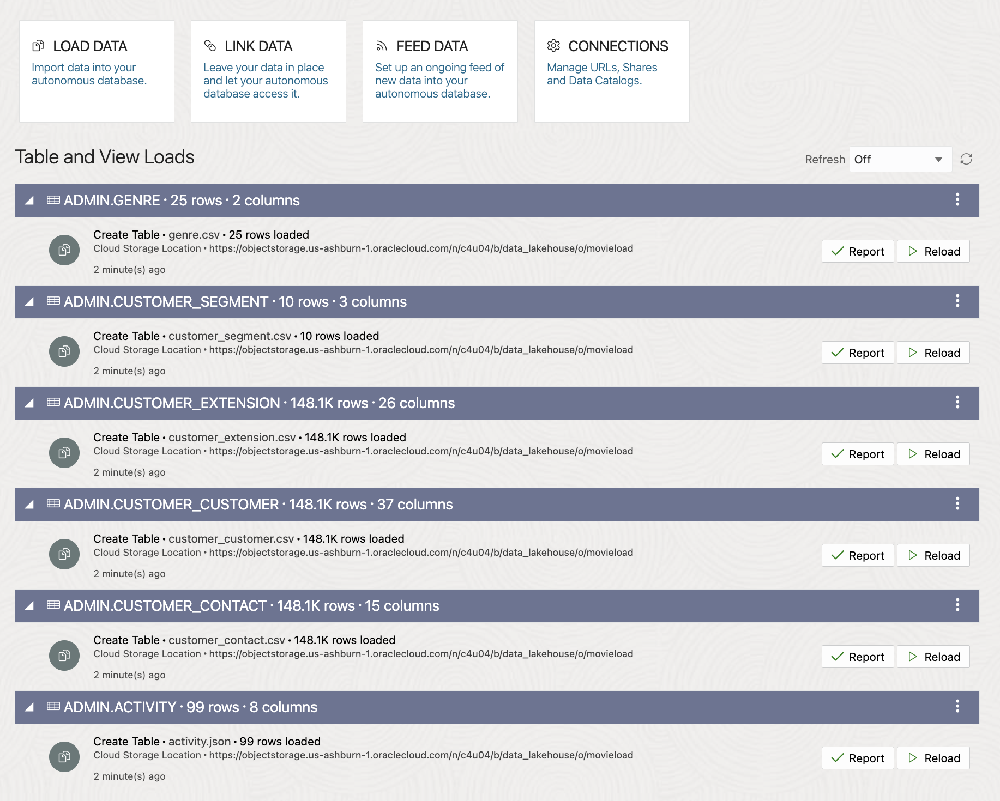

# Load initial data

## Introduction

Load the initial set of data into the Autonomous Data Warehouse and Load data into object storage

Estimated  Time: 15 minutes

Watch the video below for a quick walk through of the lab.

[](youtube:0j5B2ePXvEE)

### Objectives

In this lab, you will:
* Load from OCI Object Storage a data set into ADW as part of the data lake

**Note:** While this lab uses ADW, the steps are identical for loading data into an ATP database.

### About Product

In this lab, we will learn more about the Autonomous Database's built-in Data Load tool - see the [documentation](https://docs.oracle.com/en/cloud/paas/autonomous-database/adbsa/data-load.html#GUID-E810061A-42B3-485F-92B8-3B872D790D85) for more information.

## Task 1: Configure the Object Storage connections

In this step, you will set up access to the two buckets on Oracle Object Store that contain data that we want to load - the landing area, and the 'gold' area.

1. In your ADW database's details page, under the Database actions tab go to Data Load. Click **Data Load**

	  

3. Under **Data Studio**, click **LOAD DATA**

    

4. Now you can put in the Cloud Store URL to connect to object storage for the files to load. Click **Cloud Store** to see location field.

    

5. In the location field, you need to copy the bucket URI into this field.

    Copy and paste the following URI into the URI + Load Data from Cloud Store:

   ```
    <copy>
    https://objectstorage.us-ashburn-1.oraclecloud.com/n/c4u04/b/data_lakehouse/o/movieload
    </copy>
    ```
    Select No Credential as this is a public bucket and then click **Create**.


## Task 2: Load data from files in Object Storage using Data Tools

In this step, we will perform some simple data loading tasks, to load in CSV files from Object Storage into tables in our Autonomous Database.

1. You will see a list of folders which is the data available from the object storage bucket that we can load into our Autonomous Database. Select all of the files and drag them over to the right for adding files.

    

2. Click the Start button to run the data load job.

    

    The job should take about 20 seconds to run.

3. Check that all three data load cards have green tick marks in them, indicating that the data load tasks have completed successfully.

    

This completes the data load lab. We now have a full set of structured tables loaded into the Autonomous Database from the MovieStream Data Lake. We will be working with these tables in later labs.

You may now proceed to the next lab.

## Acknowledgements

* **Author** - Michelle Malcher, Database Product Management
* **Contributors** -  Niay Panchal, Mike Matthew and Marty Gubar, Autonomous Database Product Management
* **Last Updated By/Date** - Michelle Malcher, Database Product Management, June 2024
