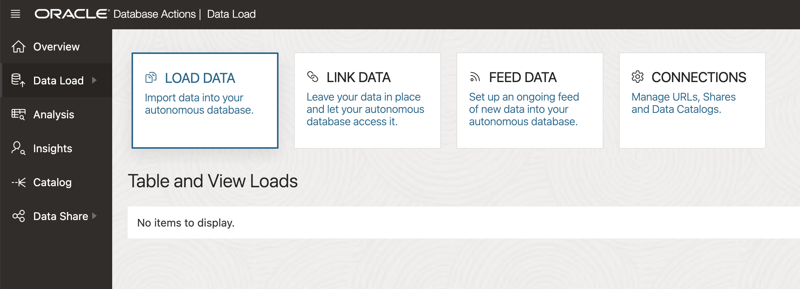
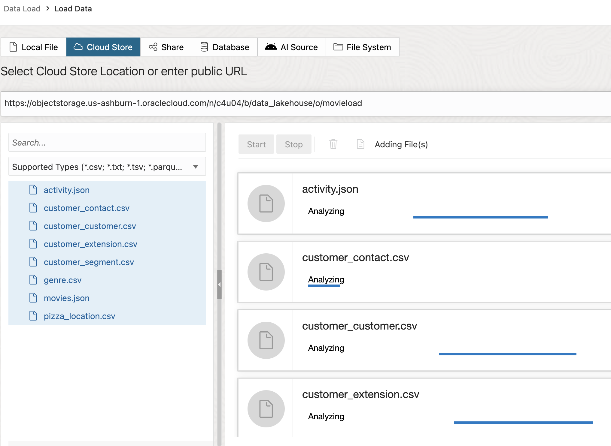

# Load initial data

## Introduction

Load the initial set of data into the Autonomous Data Warehouse and Load data into object storage

Estimated  Time: 15 minutes

Watch the video below for a quick walk through of the lab.

[](youtube:0j5B2ePXvEE)

### Objectives

In this lab, you will:
* Load from OCI Object Storage a data set into ADW as part of the data lake

**Note:** While this lab uses ADW, the steps are identical for loading data into an ATP database.

### About Product

In this lab, we will learn more about the Autonomous Database's built-in Data Load tool - see the [documentation](https://docs.oracle.com/en/cloud/paas/autonomous-database/adbsa/data-load.html#GUID-E810061A-42B3-485F-92B8-3B872D790D85) for more information.

## Task 1: Configure the Object Storage connections

In this step, you will set up access to the two buckets on Oracle Object Store that contain data that we want to load - the landing area, and the 'gold' area.

1. In your ADW database's details page, click the Tools tab. Click **Open Database Actions**

	  

2. On the login screen, enter the username ADMIN, then click the blue **Next** button.

3. Enter the password for the ADMIN user you entered when creating the database.

4. Under **Data Tools**, click **DATA LOAD**

    

5. In the **Explore and Connect** section, click **CLOUD LOCATIONS** to set up the connection from your Autonomous Database to OCI Object Storage.

    

6. To add access to the Moviestream landing area, click **+Add Cloud Storage** in the top right of your screen.

    In the **Name** field, enter 'MovieStreamLanding'

    > **Note:** Take care not to use spaces in the name.

    Leave the Cloud Store selected as **Oracle**.

    Copy and paste the following URI into the URI + Bucket field:

   ```
    <copy>
    https://objectstorage.us-ashburn-1.oraclecloud.com/n/c4u04/b/moviestream_landing/o
    </copy>
    ```

    Select **No Credential** as this is a public bucket and then click **Create**.
    

## Task 2: Load data from files in Object Storage using Data Tools

In this step, we will perform some simple data loading tasks, to load in CSV files from Object Storage into tables in our Autonomous Database.

1. To load or link data from our newly configured cloud storage, click the **Data Load** link in the top left of your screen. Or if you are still in the same view with MOVIESTREAMLANDING Cloud Storage, skip down to step 3 to choose the objects you want to load.

    

2. Under **What do you want to do with your data?** select **LOAD DATA**, and under **Where is your data?** select **CLOUD STORAGE**, then click **Next**.

    

3. This time, select **MOVIESTREAMLANDING** in the top left of your screen.

    

4. From the MOVIESTREAMLANDING location, drag the **customer\_contact**, **customer\_extension**, and **customer\_segment** folders over to the right hand pane and click **OK** to load all objects into one table for each of these folders.

5. Drag the **genre** and **movie** folders over to the right hand pane and click **OK**.

6. And for fun, drag the **pizza_location** folder over to the right hand pane and click **OK**.

7. Click the Play button to run the data load job.

    

    The job should take about 20 seconds to run.

8. Check that all three data load cards have green tick marks in them, indicating that the data load tasks have completed successfully.

    

This completes the data load lab. We now have a full set of structured tables loaded into the Autonomous Database from the MovieStream Data Lake. We will be working with these tables in later labs.

You may now proceed to the next lab.

## Acknowledgements

* **Author** - Michelle Malcher, Database Product Management
* **Contributors** -  Niay Panchal, Mike Matthew and Marty Gubar, Autonomous Database Product Management
* **Last Updated By/Date** - Michelle Malcher, Database Product Management, September 2021
