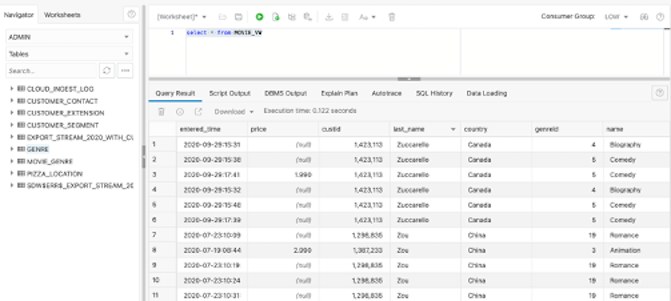
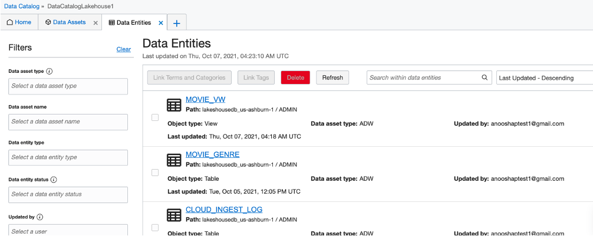

# Lakehouse: Putting it together for Analytics

## Introduction

The Data Lake is really all of the pieces working together to ingest data in many different forms from APIs, database, file formats and locations. The catalog documents the metadata and business value of the data with classifying data with business meaning and where the data is found. Data integrations allows for ETL processes and loading of new data assets along with the OCI Data Flows to process and filter new data and store as new data assets. Then the querying of the data whether or not using SQL to pull from the data lake or other reporting tools, the data assets in the data lake can now be consumed for business reporting and analytics.

### Objectives

In this lab, you will:
* Query the data values
* Validate that new data is being loaded
* Review the components of the Data Lake

Estimated Time: 15 minutes

## Task 1: SQL queries

Navigate from the main menu to Autonomous Data Warehouse. Select the lakehousedb. If the database is not listed, double check the compartment is set to lakehouse1.


Click on the database and then proceed to click on the Tools Tab and click on Open Database Actions.


Click on SQL to execute the query to create the table.


You can just simply query the MOVIE GENRE table to view data, or create a view to see the additional data along with the join to the MOVIE GENRE entity.

```
<copy>
SELECT
   "genreid",name,country, count("custid")
FROM
    ADMIN.MOVIE_GENRE,customer_contact,GENRE
    where genre_id="genreid" and "custid"=cust_id
group by "genreid",name, country
order by country;
</copy>
```
This query will demonstrate the combination for the customer, country and if they would recommend the movie and can be grouped by genre and other activities.



## Task 2: View of the Oracle Data Lakehouse

We have a database, csv and json files in our data lake but there can be all of the various data platforms and types of data stored in the data lake and even streamed. We don't always have to load data into a database to be able to use our data sets with other data sets and assets. There are simple queries to the object storage that will allow us to join the data together with our data warehouse in our data lakehouse. Here is just one example using the data that we have loaded in this short time.

Navigate back to DBActions. Under Development, click on SQL. We are going to run a few queries here for analysis. At this point you can take the queries and information to analytics and reporting.

Optionally you can also get the results using either external tables or Data Lake Accelerator. Here is an example to use an external table to access the CSV file in the object storage and join to the database tables.

Create an external table to view the data transformation in the object storage files that were created as part of the data integration and data loader tasks. The file_uri_list can be pulled from the object storage, object details - However, you just need to replace the REPLACENAMESPACE with your namespace for your bucket.

```
<copy>
BEGIN
DBMS_CLOUD.CREATE_EXTERNAL_TABLE (
table_name => 'json_cust_sales_ext',
file_uri_list => 'https://objectstorage.us-ashburn-1.oraclecloud.com/n/REPLACENAMESPACE/b/dataflow-warehouse/o/customersales.json',
column_list => 'doc varchar2(32000)',
field_list => 'doc char(30000)',
format => json_object('delimiter' value '\n')
);
END;
</copy>
```

View the data in the external table.

```
<copy>
select * from JSON_CUST_SALES_EXT
</copy>
```

Join the data to the existing customer data:

```
<copy>
select GENRE_ID,MOVIE_ID,CUSTSALES.CUST_ID,AGE,GENDER,STATE_PROVINCE
from CUSTOMER_CONTACT, CUSTOMER_EXTENSION,
(select CUST_ID,GENRE_ID,MOVIE_ID
FROM JSON_MOVIE_DATA_EXT,
JSON_TABLE("DOC", '$[*]' COLUMNS
"CUST_ID" number path '$.CUST_ID',
"GENRE_ID" number path '$.GENRE_ID',
"MOVIE_ID" number path '$.MOVIE_ID')) CUSTSALES
where CUSTOMER_EXTENSION.CUST_ID=CUSTSALES.CUST_ID and CUSTOMER_EXTENSION.CUST_ID=CUSTOMER_CONTACT.CUST_ID
and COUNTRY_CODE='US'   
</copy>    
```

If you want to also see the initial csv file in your object storage you can just create an external table on that as well.

```
<copy>
BEGIN
DBMS_CLOUD.CREATE_EXTERNAL_TABLE (
table_name => 'csv_cust_sales_ext',
file_uri_list => 'https://objectstorage.us-ashburn-1.oraclecloud.com/n/REPLACENAMESPACE/b/dataflow-warehouse/o/custsales_custsales-2020-01.csv',
format => json_object('type' value 'csv','skipheaders' value '1'),
column_list => 'DAY_ID NUMBER,
GENRE_ID NUMBER,
MOVIE_ID NUMBER,
CUST_ID NUMBER,
APP VARCHAR2(250),
DEVICE VARCHAR2(250),
OS VARCHAR2(250),
PAYMENT_METHOD VARCHAR2(250),
LIST_PRICE NUMBER,
DISCOUNT_TYPE VARCHAR2(250),
DISCOUNT_PERCENT NUMBER,
ACTUAL_PRICE NUMBER'
);
END;
</copy>    
```


## Task 3: OCI Data Catalog - View of the Data Lake

You have updated data, added new tables and views into the database. Let's take another look at the OCI Data Catalog to see that it captured the changes and the new entities.

Navigate to the menu Cloud Menu. Click on Analytics & AI and click on Data Catalog under the Data Lake header.

Click on DataCatalogLakehouse1 from the Data Catalogs. Verify compartment if you do not see it listed.


Click on Data Assets and click on Harvest using the dropdown menu for the database Data Asset. This harvesting for the Data Catalog should be scheduled to automatically pull the entity information into the Data Asset, but for now in the lab you can run this manually.

Now if you go back to the Home Tab from the Data Catalog, you will discover that there are now 8 Data Entities are being kept up to data in the Data Catalog.


Click on Entities just to verify that all of the tables and views are now here.




***Oracle Data Lakehouse

The Oracle Data Lakehouse uses the tools under the main menu of Analytics & AI. The Data Lake header contains the services needed to create integrations, catalog and data flows to build the lakehouse. The configuration that was setup in the beginning allows for consistent security through out the different pieces of the data lake environment which also grants least privilege for administration, developers and consumers of the data lake.

Take a quick view at the steps that you went through to create the lakehouse that ended with a view or queries to be utilized in further analysis.


## Next Steps
Congratulations! You have now completed the Oracle Cloud Lakehouse LiveLab. You have seen how to populate and manage the Data Lake, and the next steps are pulling together some analytics on the data and using these tools with the Data Lake Assets.

Be sure to check out the labs on Oracle Machine Learning and how the Lakehouse fits into the Movie Stream story lab along with several other labs on analytics and ADW.

## Acknowledgements

* **Author** - Michelle Malcher, Database Product Management, Massimo Castelli, Senior Director Product Management
* **Last Updated By/Date** - Michelle Malcher, Database Product Management, September 2021
