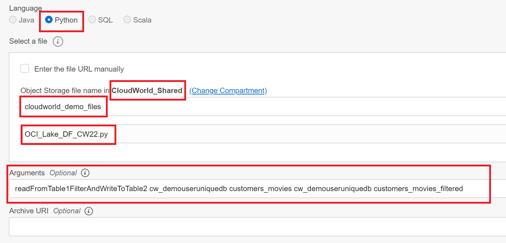
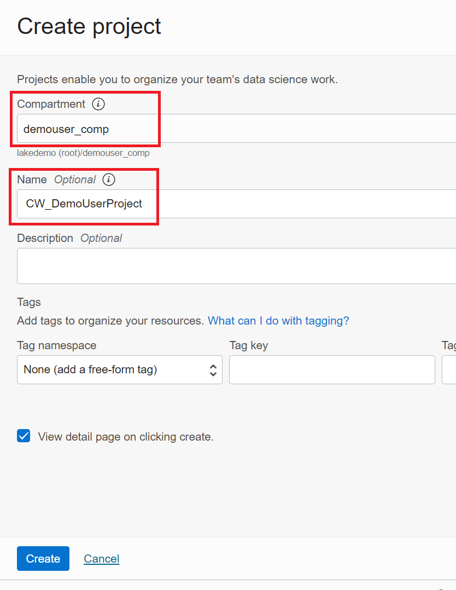
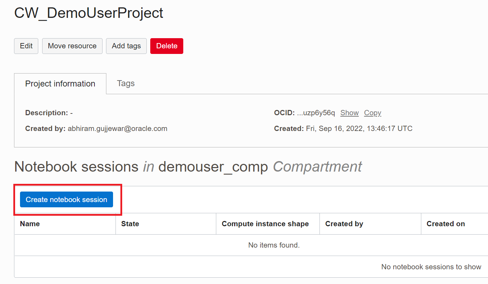
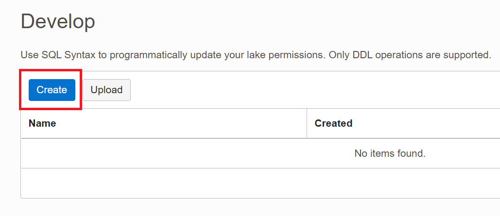
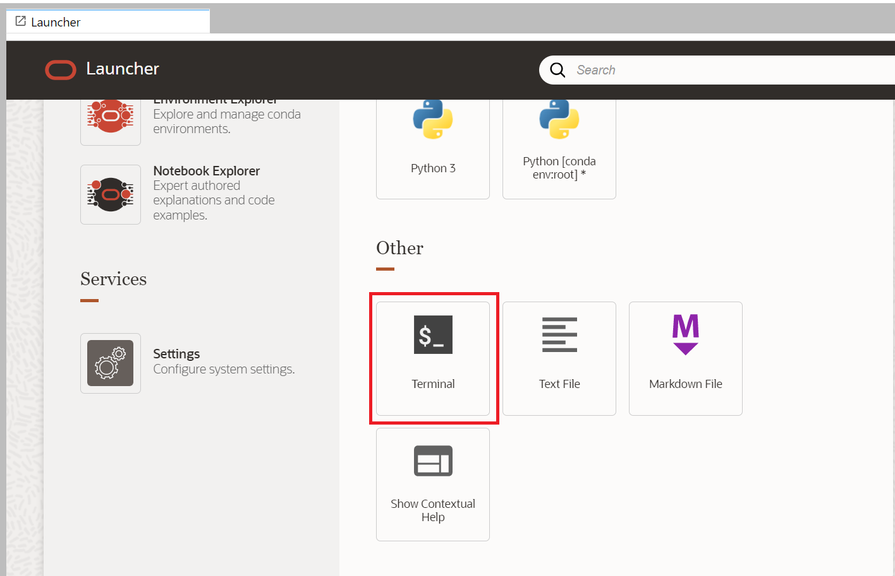

# Using OCI Lake to create a secured Data Lake 

Here we will work with OCI Lake which is a new service which service provides a unified access control of both structured and unstructured data in Data Lake. Using the service, customers can easily ingest, secure, and govern data in their Data Lake. The service allows customer to create logical schemas, tables, and views on top of Object Storage and those entities can be access via other OCI service such as ADW, Big Data Service, Data Flow and Data Science Notebook while honoring the defined access control in OCI Lake service. 

Safe harbor statement
The following is intended to outline our general product direction. It is intended for information purposes only, and may not be incorporated into any contract. It is not a commitment to deliver any material, code, or functionality, and should not be relied upon in making purchasing decisions. The development, release, timing, and pricing of any features or functionality described for Oracle's products may change and remains at the sole discretion of Oracle Corporation.

Estimated Time: 15 minutes

### About Product

In this lab, we will learn more about the OCI Data Catalog It allows creating hive style relational abstraction on top of object store files and implement Role based access control to all resources in the lake. Users can create roles such as business users, analysts, data owners, administrators, data scientists, and programmers and assign specific permissions on specific objects in the lake. And these privileges will be enforces when lake objects are accessed from any processing engine like OCI Data Flow or Big Data Service. The access rights can be set for all object storage, by bucket, by databases and tables, using standard SQL data definition language. 

See this [announcement blog](https://blogs.oracle.com/cloud-infrastructure/post/oracle-welcomes-customers-to-oci-lake-public-beta) for more information.

We will also be using [OCI Data Flow](https://www.oracle.com/big-data/data-flow/) and [OCI Data Science](https://www.oracle.com/artificial-intelligence/data-science/) to interact with data in OCI Lake.

### Objectives

- Learn how to create a table in OCI Lake. Note that we will be using an existing OCI Lake instance shared by multiple users.
- Learn how to process data in the Lake with OCI Data Flow.
- Learn how to create a OCI Data Science Notebook and use it interactively query the data in the lake. 
- Learn how to create Roles and permissions in OCI Lake

## 

## Task 1: Create a table in OCI Lake

We will be using an OCI Lake instance which will be shared by multiple users. But each user will be able to create their own databases, tables, roles and permissions etc.  

From the home navigation menu, click Analytics & AI and then **Click OCI Lake** under Data Lake group.


Here you will use a pre-created shared OCI Lake instance. 

1. Navigate to the compartment **CloudWorld_Shared** and on the right hand side in the list of Lakes, **click on CW_Shared_Lake**. 


A Dashboard showing details and contents of this Lake is shown.  All lake instances have a default database and out of the box roles. 

You will first create a new database that you will use for the rest of the exercise. 

Click on **Create Database**.


In Database Name field, enter a unique name for this database. Use your LiveLabs username as a prefix to create the unique name. **Caution: This is critical. Otherwise you will not be able to complete this exercise.**

 For example **LLXXXX_CW**. This will be used only by one user and hence it's important to be unique. **Click on Create.** 
 
 

This will create a new database with that name and will show it in the list. 


Now you will create an "Mount table" on an "External Mount".  

External Mounts are essentially references to Object Store buckets that OCI Lake can help you manage access control for. External Mount tables are external tables created on top of files in External Mounts.  

In the left navigation, **click on External Mounts**. For this exercise, an external mount called "CW_Shared_Mount" is already created for all users. **Click on CW_Shared_Mount** 


This will open up page to show details of this mount such as object store location and also a list of available files and folders in this mount. 

**Locate a file called export-stream-2020-custid-genreid.json** in this list. 

At the end on the right corresponding to this file, **Click on Kebab Menu (three dots) and then click on Create External Table**    


A SQL Editor is opened. Replace the placeholders as follows.

<database-name> : Name of the database you created in earlier steps. **Caution: This is critical. Otherwise you will not be able to complete this exercise.** 

<table-name> : customers_movies

<format> : json

Ensure that the whole SQL is on one line. **Double check the name of the database you specified and click on Run.** 


The SQL command will execute and create a new table. Expand the database on the left navigation to see the newly created table and its schema. **Click on Cancel to close this dialog.** 


Click on "CW_Shared_Lake" in the breadcrumb at the top to return to the Dashboard. 


This concludes the creation of database and table in the Lake. In the next task you will process the data in this table with OCI Data Flow. 


## Task 2: Create an OCI Data Flow app to process data in the Lake

Data is constantly growing being enhanced, validated and updated. That is why once you have the data assets you need to make sure that processing continues to manage the data assets and provide updated values you data lake.

OCI Data Flows handles these processes by loading new data or updating. 

In addition, OCI Data Science Notebook is integrated with Data Flow to provide an interactive querying experience. 

Watch the video below for a quick walk through of the lab. **TBD**

[](youtube:arWzMjy5-y8)

You have several choices on how to create applications and languages. You can choose something that makes sense for your environment. In this exercise, we are using Python. We are going to take a look at the OCI Data Flow and create an application to read a table from OCI Lake, process it and create another table in the lake.

We have already created a python script for you to use as part of your OCI Data Flow application. You will provide arguments to this script to read the right table in the database you created earlier and write to a new table you will specify. 

Navigate to the OCI Data Flow.


You will be shown the list of Applications. Ensure that you are in your designated compartment, LLXXXX-COMPARTMENT. **Caution: This is critical. Otherwise you won't be able to complete this exercise.**

**Click on Create application.**


This will open a Create Application overlay dialog. 

Enter a name for the application, **preferably unique** using your LLXXXX username and if you would like a description. Setup the rest of the parameters as shown in the screenshot below. **Caution - If you don't set these parameters correctly, the application will not run successfully.** 


This application uses a python script to read data from a database tables, filter the data where values in the column "recommended" are set to "Y" and writes the filtered data into another table. 

For the Application configuration section, set the parameters as shown below. Ensure that the language and location of the Python file is set correctly. **Caution - If you don't set these parameters correctly, the application will not run successfully.** 

For Arguments you can copy paste with modification the following string. 

```
readFromTable1FilterAndWriteToTable2 <YourUniqueDBName> <ExternalTableYouCreatedEarlier> <YourUniqueDBName> <NewUniqueTableName>
```

For example, 
readFromTable1FilterAndWriteToTable2 LLXXXX_CWDB customers_movies LLXXXX_CWTAB customers_movies_filtered




In the bottom part of the form, for Application log, ensure you select the correct compartment and bucket. 

Also, for the Lakehouse, ensure you select the compartment "CloudWorld_Shared" and the lake as "CloudWorld_Shared_Lake". 

**Caution - If you don't set these parameters correctly, the application will not run successfully.** 

Review all the parameters for accuracy once more and **click Create.**


A new application is created and shown in the list of apps. 


Now we can run the application by selecting the more option dots and selecting Run from the menu.


Run Python Application dialog is shown. **Click on Run**


It of course depends on how big your data file is but this sample takes about three minutes to return successfully. This job has filtered out the data and populated the target table with the job.


Now let's go back to OCI Lake and check the newly created table. 

Navigate to OCI Lake, select the CloudWorld_Shared compartment and select CW_Shared_Lake. Click on Databases and then on <YourUniqueDB> 

You should see the newly created table in the list of tables and views. 


This concludes the task of processing the data in the lake using OCI Data Flow. 


## Task 2: Create OCI Data Science Notebook to query lake tables

In this exercise we will use the integration between OCI Data Science Notebook and OCI Data Flow to interactively query data in the lake. Here are the main steps. 

- Create a new Notebook session. 
- Install special packages that enable the integration between Notebook and Data Flow. 
- Create a new Notebook file to attach to an interactive Data Flow session 
- Grant this interactive Notebook session authorization to work with the OCI Lake instance
- Execute interactive SQL queries on the tables in the lake.    

Navigate from the Hamburger menu to Analytics & AI, select Data Science,.


Ensure that you are in your designated compartment. **Caution. This is critical. Otherwise you may not be able to complete the exercise**

**Click on Create Project**


In the Create Project dialog, ensure that the compartment is selected correctly. Provide a name, preferably unique, for this project and description if you like. **Click on Create**




Now, in the project details page, **click on Create Notebook session.**




On the create notebook session page, ensure that the compartment is correct. Provide a name, preferably unique and **click on Create**.  


Notebook details page opens. But the notebook is still being created. "Open button" will be grayed out.  

**Copy the OCID of the Notebook.**    


In order for this Notebook to be able to access the Lake, we need to grant permissions to this Notebook Resource Principal. 

Note that for simplicity of this exercise, we are using a Resource Principal. You may choose to utilize user principal in production scenarios. 

**Switch to the browser tab that has OCI console open.** Do not use this Notebook browser tab. We need to come back to this later.  

Navigate to the compartment **CloudWorld_Shared** and on the right hand side in the list of Lakes, **click on CW_Shared_Lake**. 


On the main Dashboard page, click on Develop. We will be using SQL editor to grant access. 


This will show list of available SQL scripts. **Click on Create.** 




This opens up a SQL Editor. Let's grant permission to the Notebook session. Copy paste the following statement and replace with the Data Science Notebook session OCID you copied from earlier steps. 

```
grant role DATA_ADMIN to <YourNotebookSessionOCID>
```

**Click on Run**


The command should execute successfully and you should see the following int he Results pane. 


You also need the OCID of your dedicated compartment for future use. Let's get that as well while we wait for the notebook session to be ready. 

Click on the Hamburger menu on the global navigation. In the **Search box in the navigation menu**, type in Compartment. This will result in Compartment menu item on the right. Click on that. 


This will open the list of compartments. Locate your dedicated compartment and click on it to open the details. 


This will show the compartment details. Ensure you are looking at your own compartment and copy the OCID and save it for later use. 


Now you can use the Browser back button to come back to the Notebook session details page.  Or you can manually navigate to the notebook details that you created. 

Creation of Notebook session can take up to 3 minutes. Please wait for Open button to turn blue and then **click Open.**


Our Notebook session is ready to use. Now we will install special packages for Data Science and Data Flow integration.

The Notebook session will open in a different browser tab. You may be asked for credentials again. It will show the main Launcher UI. 


Scroll all the way to the bottom. **Click on "Terminal"**




This will open a bash terminal which we will use to do the installation of packages one by one using commands provided. 

First copy paste the following command on the terminal and press enter to execute. 

```
echo|odsc conda install -s pyspark30_p37_cpu_v5
```

This will download the download and install conda pack for pyspark.  

 It may take a couple of minutes to complete. Successful download and installation will show this type of result.


Next, we will activate this package. 

First copy paste the following command on the terminal and press enter to execute.  This will happen immediately.

```
conda activate /home/datascience/conda/pyspark30_p37_cpu_v5
```


Next we will install sparkmagic. Copy paste the following command on the terminal and press enter to execute.


```
pip install https://objectstorage.us-ashburn-1.oraclecloud.com/p/xmPutsVak8sVl2B0D0Aw8v0e8Wnq1OgZjQ0z5aSx5QYeY4IJ9bwd8Q4k977JwQ6Y/n/ociodscdev/b/ads_preview_sdk/o/DataFlow/sparkmagic-1.0_ds_integ_la_common.6.d4a7b580da0-py3-none-any.whl --upgrade
```

This will take a couple of seconds and result in successful installation as shown below.


You have now successfully installed and activated the required packages for integration between OCI Data Science Notebook and OCI Data Flow.  

Next we will create a Data Flow session for interactive querying.


On the Launcher Tab, in the Kernel section, **click on "PySpark 3.0 and Data Flow"** and **click on Create Notebook**


This will create a new .ipynb file that you can use for interactive operations.

In the first cell, copy paste and run these commands. This will import the ADS library provided by OCI Data Science. For simplicity in this exercise, we will be using Resource Principal based authorization. But in real world use case, you may end up using User Principal (which requires a different setup).

This will also load the sparkmagic extension required to connect with Data Flow.  

```
import ads
ads.set_auth("resource_principal")
%load_ext sparkmagic.df_magics
```

You can ignore the warning.


Now let's connect this notebook to a Data Flow session. For this we will need OCID of your dedicated compartment: This you should have copied and saved in earlier steps when you created the Notebook. 

Copy the following command and replace these parameters

**compartmentId : OCID of YOUR dedicated compartment you copied and saved in earlier session**

**displayName: Provide some unique name so that you can identify this on the OCI Data Flow side.** 

You don't need to change the lakehouseId.

```
create_session -l python -c '{"compartmentId":"YourCompartmentOCID","displayName":"YourUniquenameForIdentification","sparkVersion":"3.2.1","driverShape":"VM.Standard2.1","executorShape":"VM.Standard2.1","numExecutors":1, "lakehouseId": "ocid1.lakehouse.oc1.iad.amaaaaaaetlj22iatvcmtt2agibixejwhhdhn7jblpahzdlqg55fii2qzwda"}'
```

This will create a Data Flow cluster in the background and will connect to that cluster for queries. This will take about 5 minutes. Please be patient. 


Now the session is ready for interactive queries. Let's run a query again. Copy paste the following and replace the placeholders with your unique database name and tables you created in earlier steps.  

```
%%spark
sqlContext.sql("select count(*) from <YourUniqueDBName>.<YourUniqueTableName>").show()
```

This should show you the number of rows in the table. 


Let's run a query with some actual data selection. Let's say we want to see all the transactions related to movieid 16219. 

```
%%spark
sqlContext.sql("select * from <YourUniqueDBName>.<YourUniqueTableName> where movieid = '16219'").show()
```


This will show 20 rows of transactions.  


Now we will stop this interactive session. Copy past the following command and run it. Once you run this command, you cannot execute any more queries, as expected. 

```
%stop_session
```


You may logout and close the browser tabs opened for Notebook sessions. 

This concludes the exercise for interactively working with OCI Lake data from Data Science Notebook. 

## Optional Task : Create Roles and Permissions in OCI Lake

Imagine you have a group of data analysts who should be given only select privileges on one of the tables in the Lake. In this exercise, you will create a role, create permissions and manage those permissions for specific Lake tables.  

We will be using an OCI Lake instance which will be shared by multiple users. But each user will be able to create their own databases, tables, roles and permissions etc. From the home navigation menu, click Analytics & AI and then **Click OCI Lake** under Data Lake group.


Here you will use a pre-created shared OCI Lake instance. 

Navigate to the compartment **CloudWorld_Shared** and on the right hand side in the list of Lakes, **click on CW_Shared_Lake**. 


A Dashboard showing details and contents of this Lake is shown.  

Click on **Create Role**.


Provide a unique name for the role using your LLXXXX username. For example movies_data_analysts__LLXXXX  and **Click on Create**


Role is created and appears in the list. 

Click on the Kebab menu for the new role and **click View and Edit.** 


View and Manage Role dialog opens. Observe that currently there are no permissions granted on any lake objects. There are no users assignments either. Click **Add Role Assignment**


  

In Add Role Assignment Dialog, **for Type, select User Principal**

This will show a list of available users. **Pick any user from the list**. This is just for example. 

**Click Add**


The user is added in the Members list. **Click on Done.**


You have successfully created a Role and added members to it. 

Next, you will assign this Role to a Lake table. 

Click on Databases in the Left navigation. On the right side, you will see list of all databases created. **Caution: This is a shared Lake instance and you will see databases created by other users. Please ensure you use only the database you created earlier. Otherwise, you won't be able to complete this exercise.


 


 For one of the tables listed, click on the Kebab menu at the rightmost end and click Manage Permissions. 


 


A dialog shows up showing the current permissions on the table you selected. Click on **Create permission**

 


In Create Table Permission dialog, **select the radio button Role**. The drop down box shows all the available Roles. Select the Role that you just created earlier. In Table Permissions, check the box for **Select** . This means the role you have selected can only read the data (issue Select queries) on this table. 

**Click on Create**

 


The permission is created and the new permission shows up in the list of permissions for this table. **Click Done**

 


This concludes the exercise on how to manage permissions on lake objects. In the interest of time, we will not be validating this with logging in as different users. 

You may now proceed to the next lab.


## Acknowledgements

* **Author** - Abhiram Gujjewar, Senior Principal Product Manager
* **Contributors** - Michelle Malcher, Database Product Management, Massimo Castelli, Senior Director Product Management 
* **Last Updated By/Date** - Michelle Malcher, Database Product Management, October 2022