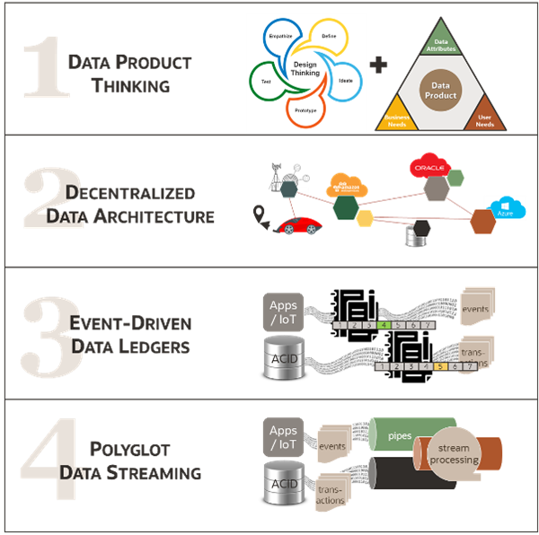
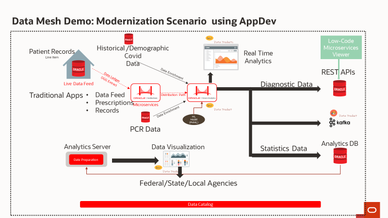

# Introduction & Overview

## About this Workshop
This workshop will help you understand Data Mesh and its technical attributes by exploring an industry-specific use case. You will be introduced to Data Fabric, Data Mesh, and GoldenGate Event Integration through a financial services use case and its associated architecture. A successful Data Mesh can fulfill use cases for Operational as well as Analytic Data domains. This ability is key to reducing friction across data domains, which inherently span Operations and Analytics.

A New Concept for Data – Oracle’s Approach:
1.	Emphasizes cultural change, as a mindset shift towards thinking of data ‘as a product’ – which in turn can prompt organizational and process changes to manage data as a tangible, real capital asset of the business.
2.	Calls for alignment across operational and analytic data domains. A Data Mesh aims to link data producers directly to data consumers and remove the IT middleman from the processes that ingest, prepare and transform data resources.
3.	Technology platform built for ‘data in motion’ is a key indicator of success – a two-sided platform that links enterprise data producers and consumers. Data Mesh core is a distributed architecture for on-prem and multi-cloud data.

A trusted Data Mesh is a data architecture approach focused on business outcomes, faster innovation cycles and trusted data-in-motion for both operational apps & analytics. A Data Mesh is implemented with the following key attributes: data product thinking, a decentralized data architecture, event-driven data ledgers, and polyglot streaming.

Data Mesh Four Key Attributes

1.	Data Product Thinking
A mandatory attribute of Data Mesh concept is a commitment to treat data as a product.
Data products may be a part of any kind of data architecture but thinking of data as a product is a crucial part of all Data Mesh architecture since it puts the data consumers at the heart of the design.

2.	Decentralized Data Architecture
Today, the decentralized architecture is in fashion as a software design for applications and as a data architecture for the enterprise. 
Data is increasingly distributed across the networks: at the edge, multi-cloud, on-premises, cloud@customer, etc. Modern designs must account for this reality - treat it as a feature, not a bug.

3.	Event-Driven Data Ledgers
Ledgers are the fundamental component of making a distributed data architecture function. Just as with an accounting ledger, a data ledger records the Tx events as they happen. 
A Data Mesh is not just one single kind of ledger, it can make use of different types of event-driven data ledgers, depending on the use cases and requirements.

4.	Polyglot Data Streaming
A mandatory attribute of Data Mesh concept is a commitment to treat data as a product.
Data products themselves may be a part of other data architectures, but data products are a crucial part of the inception of all Data Mesh designs.

App Modernization Use Case Summary & Architecture – Healthcare
In this lab, you will explore a medical records use case. Specifically, you will add functionality to an existing medical records application through the use of microservices powered by Helidon. This microservice will be responsible for viewing data products filtered through GGSA.

 
In the architecture above, credit card transactions are captured as Data Ledgers using GoldenGate Capture. The data is enriched with customer information and geo-locations. Finally, a machine learning model is applied to detect risky transactions and identify good credit patterns.

