# Create Pipeline

## Introduction
In this lab, we will observe how to build a pipeline in GGSA. All of the components used to elicit Kafka events from a machine learning classification model will be described in detail. Lastly, data will be sent to OAS for analysis. 

Estimated Time: 55 minutes

### Objectives

In this lab, you will complete the following tasks:
- Validate That the Required Services are Up and Running
- Log in to GoldenGate Stream Analytics
- Create File Stream
- Create a pipeline
- Create a GoldenGate Stream
- Add a Query Stage
- Add a Filter to the Query Stage
- Add a OML Stage
- Add a Spending Factor Filter
- Create a Spending Factor
- Add a Filter using the Spending Factor
- Create a Kafka Stage
- Create an OAS Stage
  
### Prerequisites

This lab assumes you have:
- An Oracle Always Free/Free Tier, Paid or LiveLabs Cloud Account

## Task 1: Validate That the Required Services are Up and Running

1. When deploying the stack, access the GGSA Server using the NoVNC link.

## Task 2: Log in to GoldenGate Stream Analytics

1. Use the following login information to access the GGSA portal:
- username: **osaadmin**
- password: **welcome1**

    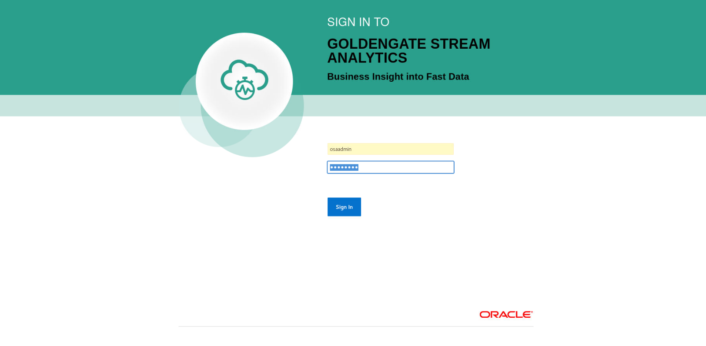

2. On the left hand side of the portal, a catalog of the components of which are able to be filtered (if not available, select the sidebar button next to the text **Catalog**). Select **Pipelines** to filter and select **DMIngestPipeline** to edit the pipeline. 

    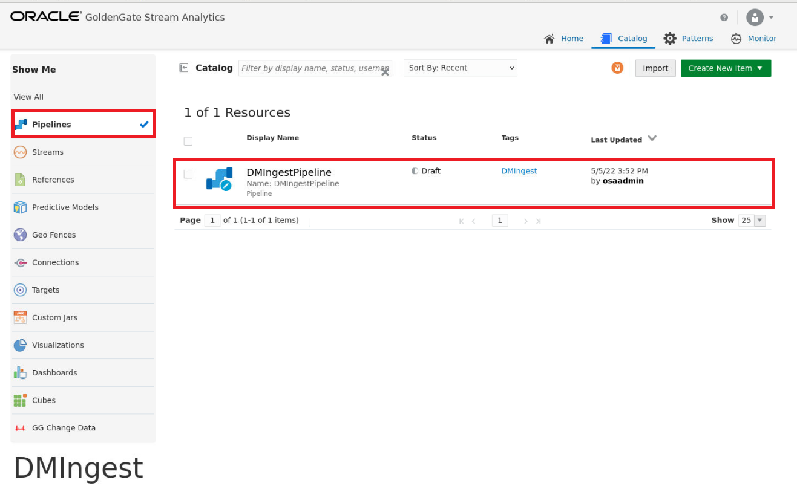

## Task 3: Create File Stream

## Task 4: Create a pipeline

## Task 5: Create a GoldenGate Stream

## Task 6: Add a Query Stage

1. In the workflow section, click on the **Entertainment** stage and make sure it is highlighted blue. This is where the live data is streaming from and acts as a query stage.

    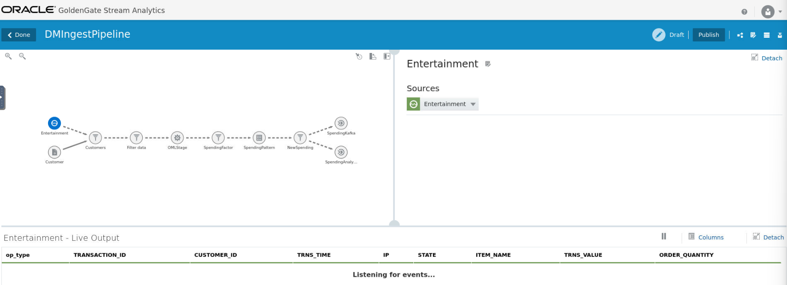

## Task 7: Add a Filter to the Query Stage

1. Click on the **Customers filter.** Customer data that is hosted in the database is merged with streaming data using a filter stage. Notice the sources are joining the two datasets, **Entertainment** and **Customer** with the following correlation conditions:
    - CUSTOMER_ID_1 = CUSTOMER_ID

    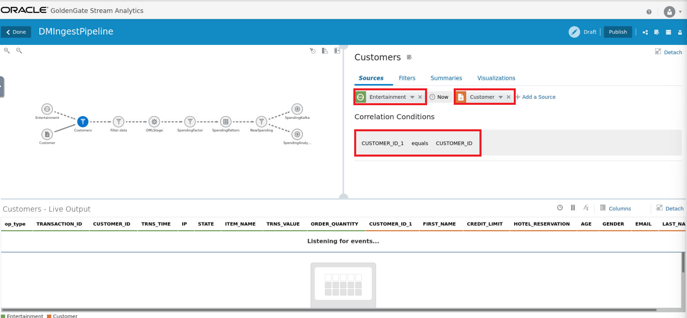

## Task 8: Add a OML Stage

1. Click on the **OMLStage** to inspect the parameters used for the Neural Network Classification model. Using input fields to score the data, such as:
    - State
    - Age
    - Gender
    - Hotel_Reservation 
    - Credit_Limit

    

## Task 9: Add a Spending Factor Filter

1. Click on the **SpendingFactor** stage to view the filter created from the OMLStage

    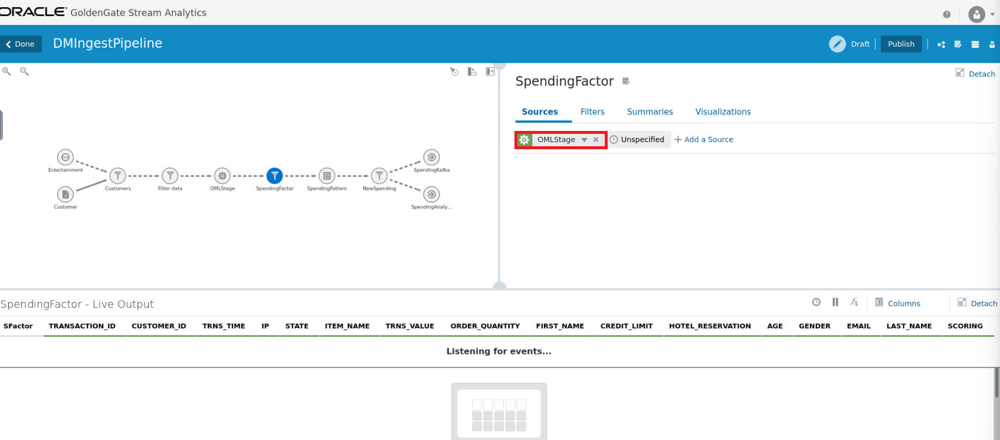

## Task 10: Create a Spending Factor

1. Click on the **SpendingPattern** stage to see the set rules for predicting likely spending.
    - High: **IF SCORING greater than 0.6 -> Then SET SFactor TO 3**
    - MedHigh: **IF SCORING lower than or equals 0.6 AND SCORING greater than 0.5 -> THEN SET SFactor TO 2**
    - MedLow: **IF SCORING lower than or equals 0.4 AND SCORING greater than 0.3 -> THEN SET SFactor TO 0.85**
    - Low: **IF SCORING lower or equals 0.3 -> Then SET SFactor TO 0.5**

    

## Task 11: Add a Filter using the Spending Factor

1. Click on **NewSpending** stage to see how this source is sent to both Kafka and OAS.

    

## Task 12: Create a Kafka Stage

1. Click on **SpendingKafka** to view the target mapping.

    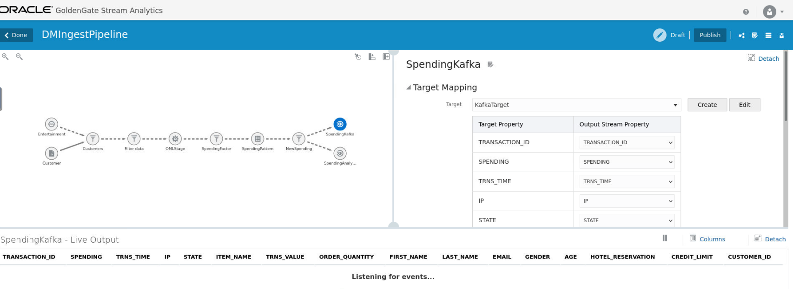

## Task 13: Create an OAS Stage

1. Click on **SpendingAnalytics** to view the target mapping for OAS.

    

## Task 14: Create a visualization

1. Right-click on **SpendingFactor** and add a stage. Select **Query Group** and then **Stream,** which will open a popup window.
    
    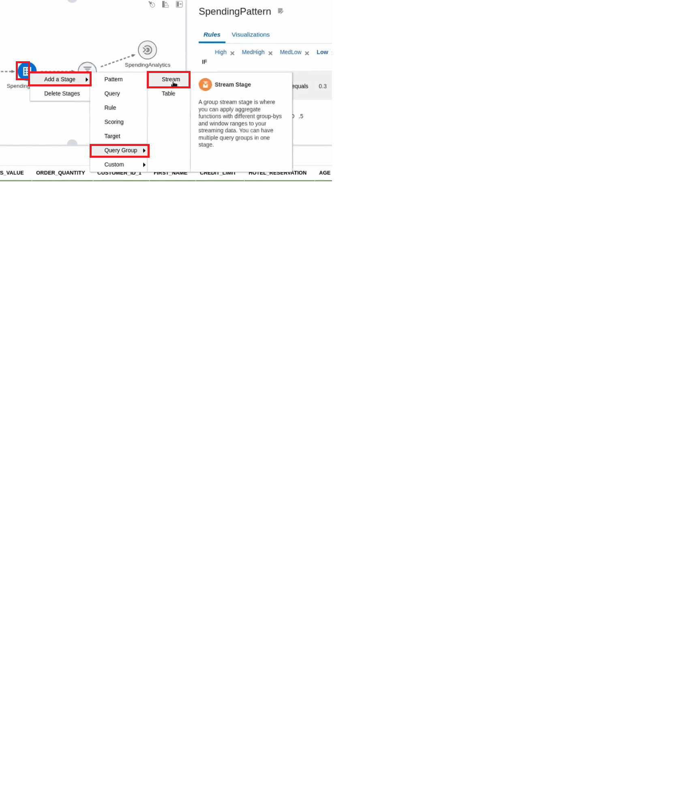

2. Name the component **StreamCategorization** and click **Next.**

    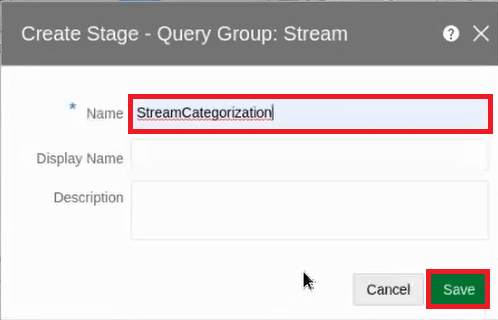

3. Click **Groups** tab and then **Add a Summary.**

    

4. From the first drop-down menu, Select **Count,** then select **SFactor** on the next drop-down menu to the right.

   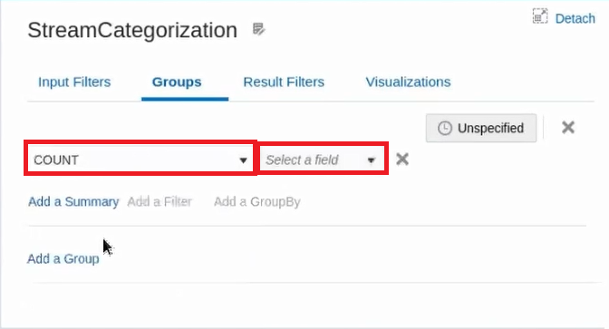

5. Select **Add a GroupBy** to present a new drop-down menu.

   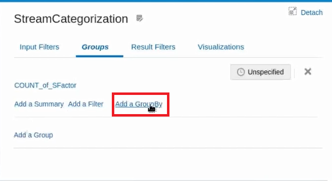

6. Select **SFactor** from the menu options.

   

7. Select the **Visualization** tab and scroll down to select **Add Visualization.**

   

8. Select the **Pie Chart** from the drop-down menu.

   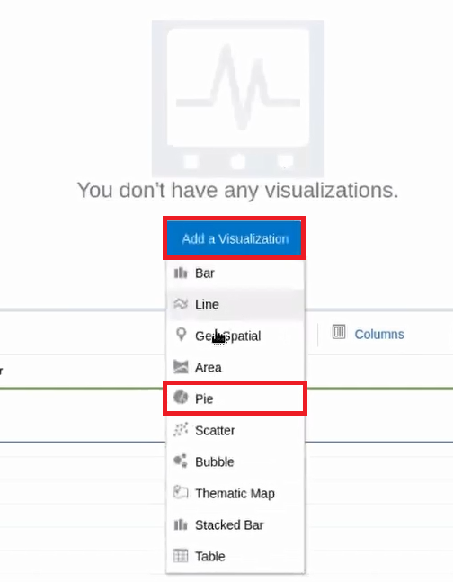

9. Name the visualization **Score** and select **COUNT_of_SFactor** from the Measure menu and **SFactor** from the Group menu. Click **Create** when done.

   

10. The result will populate a live chart that will update as the pipeline is populated with data.

   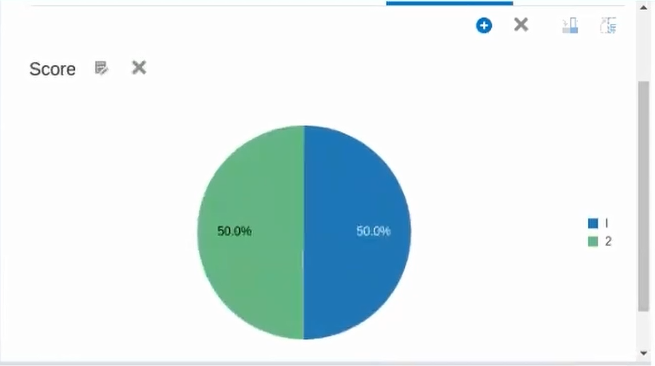

You may now **proceed to the next lab.**

## Acknowledgements

- **Author**- Nicholas Cusato, Santa Monica Specialists Hub, July 14, 2022
- **Contributers**- Hadi Javaherian, Hannah Nguyen, Gia Villanueva, Akash Dahramshi
- **Last Updated By/Date** - Nicholas Cusato, Santa Monica Specialists Hub, July 14, 2022