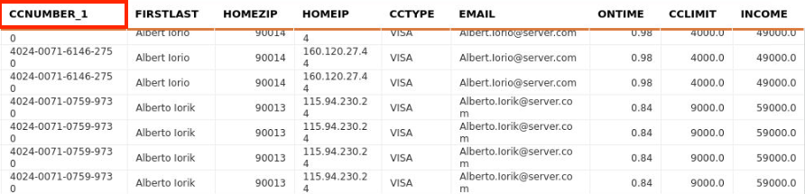
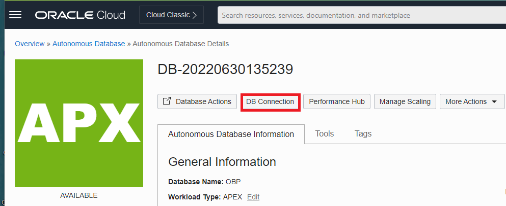
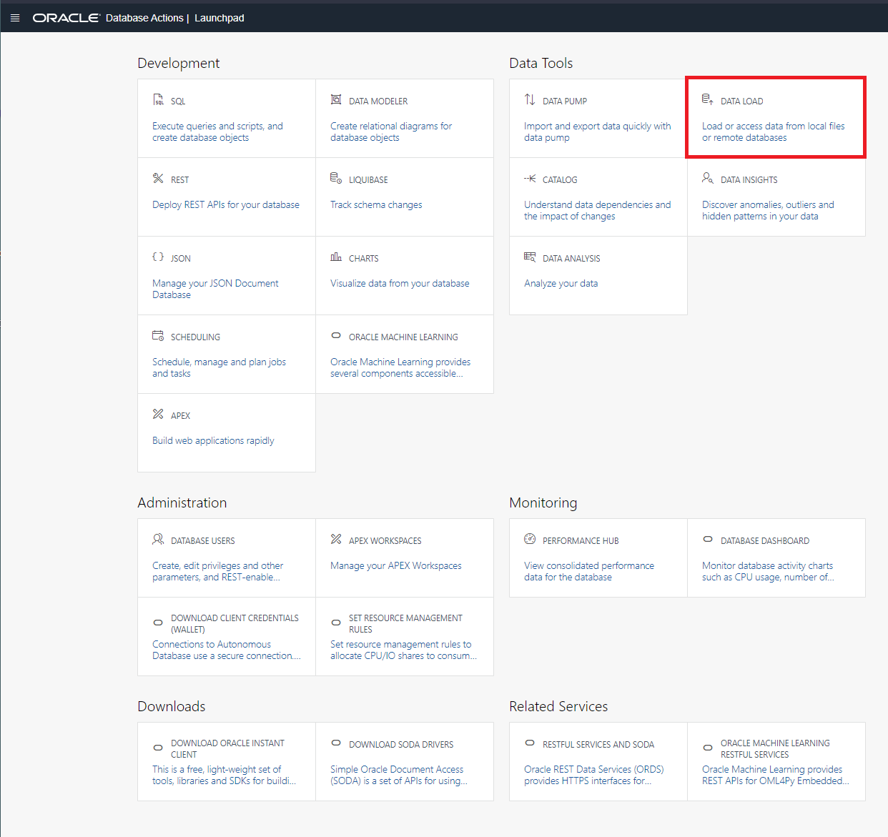
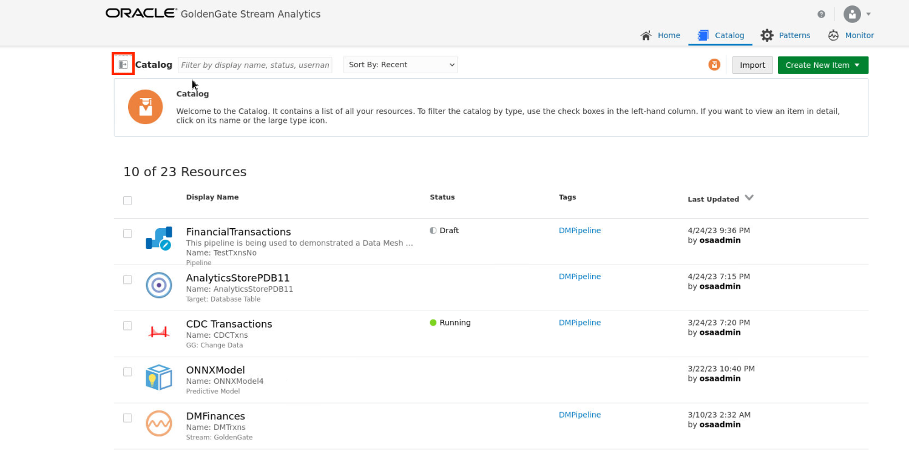
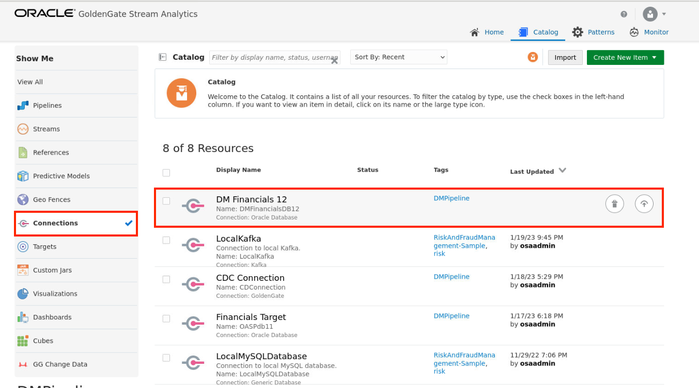
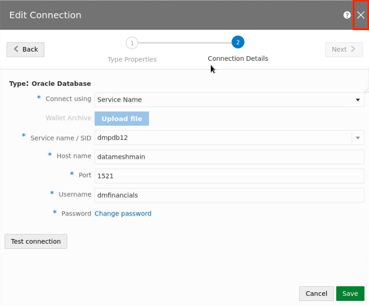
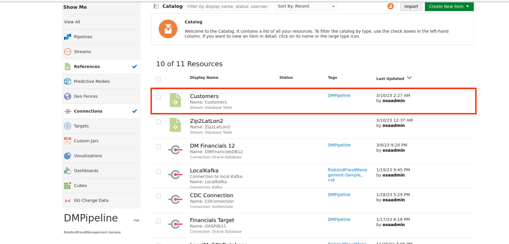
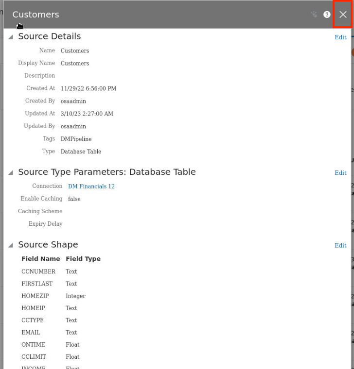

# Prepare Data for Pipeline

## Introduction

Establishing a connection to a database is important process of streaming ingest. The data collected by the customers is stored in the Oracle Autonomous Database (ADB). This data is ingested with event data to allow for events to be invoked based on a combination of factors that will be discussed later. This lab explores the data that be used in preparation of this lab.

Estimated Time: 15 minutes

### Objectives

In this lab, you will complete the following tasks:

- Analyze Customer data
- Analyze Event data
- Explore Upload Process
- Confirm Upload

### Prerequisites

This lab assumes you have:
- An Oracle Always Free/Free Tier, Paid or LiveLabs Cloud Account

## Task 1: Analyze Customer and Geospatial data

1. For the event, customers are required to register certain data. This is populated in a database for access during the streaming ingest. This information includes a customer ID number, first name, credit limit, hotel reservation, age, gender, email address and last name. The key column that links the event data is the **CCNUMBER**.

2. In addition to the customer data, the geospatial data is also registered. This data includes the latitude, the longitude and the zip. The key column that links the customer data is the **ZIP**.

## Task 2: Analyze Event data

1. The event data is the streaming data that is produced during the festival. This includes op type, which is a consistent value based on the operation, TRANSNUM, CCNUMBER, TXNAMOUNT, TXNZIP, TXNTYPE, PURCHASETYPE, IPADDRESS. Notice the key column **CCNUMBER** is again featured, as it is the key column for joining the datasets. 

## Task 3: Explore Upload Process

1. Customer data is stored in a database that is connected to the GGSA service. In order to connect the database table, SID, service name, or a wallet is required to establish this connection. For example, in OCI, after provisioning an ADB, selecting **DB Connection** will bring up the wallet options. This process is only for an example and is not required for completion of the lab, as we will be using another database connection.

2. Selecting **Download wallet** will require creating a password, which after confirmation, will allow you to download the zip file. 

3. Uploading data to Oracle ADB is easy. Selecting Database Actions will open a launch pad, where data can be uploaded using **Data Load**.

## Task 4: Confirm Upload

1. Now that we have discussed how to upload data to ADB and download wallet credentials, lets observe the connection in the GGSA portal. Select the button to the left of the **Catalog** text at the top left of the page to expand the sidebar.

2. From the sidebar, select **Connections**.

3. On the Catalog, find the resource titled **DM Financials 12** and select it.

2. On the type properties page, note the following values:
   - Name is **DMFinancialsDB12**. 
   - Display Name is **DM Financials 12**.
   - Description is blank.
   - Tags include **DMPipeline**
   - Connection Type is **Oracle Database**

   After reviewing, select the **Next** button.

3. Notice on the connections page, the connect using **Service Name** is selected. Other options include SID or wallet (as discussed in previous task). Select **X** in the top right corner after observing the following:
   - The service name is **dmpdb12**. 
   - Host name is **datameshmain**.
   - Port number is **1521**.
   - Username is **dmfinancials**
   - Password is predefined with an option to change.

4. Now we want to view the details on the customer table we are using, next also select **References**.

5. Next, on the catalog find the resource titled **Customers** and select it.

6. Inspect the table information diplsayed on the pop-up window. You should see information on the **Source Details**, the **Source Type Parameters: Database Table** and the **Source Shape**. After viewing, click on the **X** on the top right corner of the window to close it.

7. After exiting, observe that the connection window can easily be accessed through the directory.

You may now **proceed to the next lab.**

## Acknowledgements

- **Author**- Nicholas Cusato, Santa Monica Specialists Hub, July 14, 2022
- **Contributers**- Hadi Javaherian, Hannah Nguyen, Gia Villanueva, Akash Dahramshi
- **Last Updated By/Date** - Alpha Diallo, Stephen Stuart North American Specialists Hub, May 12, 2023