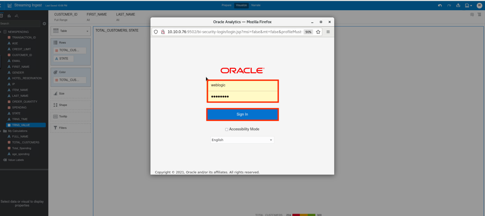
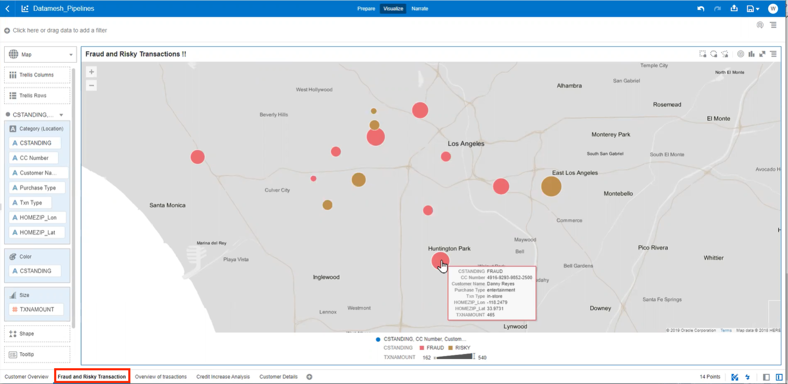
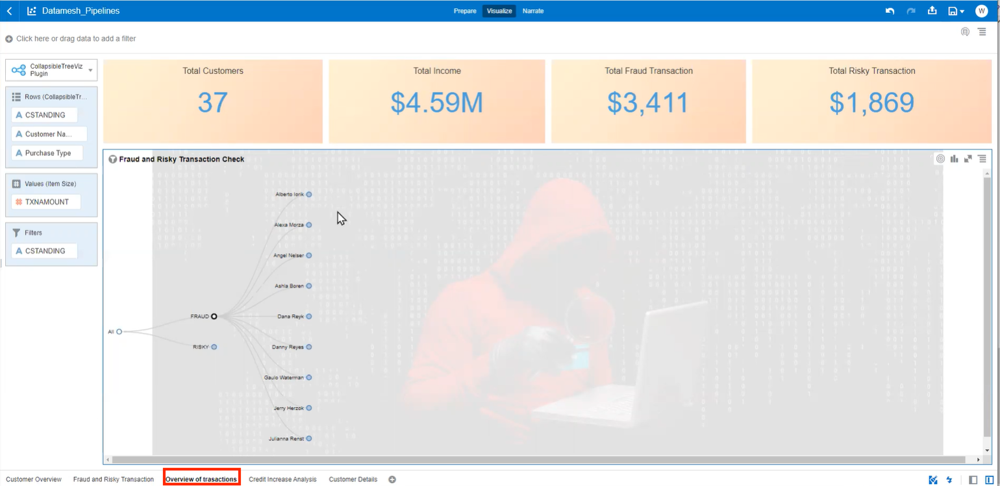
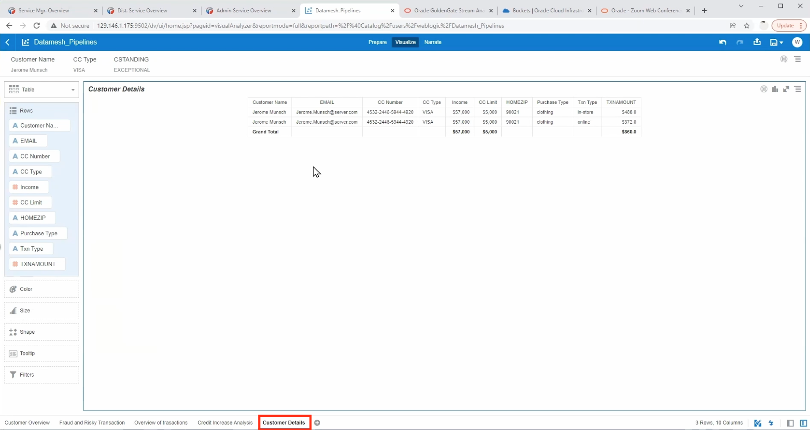

# Analyze Data Products in OAS

## Introduction
In this lab, we will review the analytics that were performed on the results of the data mesh pipeline. Analyzing customer spending with respect to industry and credit, businesses can make better informed decisions about customer loyalty.

Estimated Time: 10 minutes

### Objectives

In this lab, you will complete the following tasks:

- Log in to Oracle Analytics Server
- View Customer Overview Canvas
- View Fraud and Risky Transactions
- View Overview of Transactions
- View Credit Increase Analysis
- View Customer Details

### Prerequisites

This lab assumes you have:
- An Oracle Always Free/Free Tier, Paid or LiveLabs Cloud Account

## Task 1: Log in to Oracle Analytics Server

1. Sign on to OAS using the Weblogic portal. The username and password should be preconfigured, but if not then use the following:
- username: **weblogic**
- password: **welcome1**

## Task 2: View Customer Overview Canvas

1. Open the **Datamesh_Pipelines** workbook.

2. Inspect the bar chart titled **Customer spending by purchase type** and notice that we are tracking transaction amounts with respect to industry. Here we are comparing online and in-store transactions.

3. Inspect the chart titled **Top 10 Customers - Income vs CC Limit** and notice that we are comparing income and credit card limits for each of the top 10 customers.

4. Inspect the table titled **Customer CC Payment Details** and notice that our customer credit card number is masked. We can see the percentage of on-time payments are color coded by high(green), medium(yellow), and low(red). 

## Task 3: View Fraud and Risky Transactions

1. Inspect the map titled **Fraud and Risky Transactions** and notice that we're able to view instances of fraudulent activity and the location where they occur.

2. Zoom in on the map and select the circle with fraudulent and risky activity in Southern California. From there, you are able to see a more in-depth view of fraudulent and risky activity. 

**Note**: The size of the bubble is correlated with the size of the transaction.

## Task 4: View Overview of Transactions

1. Inspect the Overview of Transactions canvas. Here you can see the the total customers that have risky behavior, the total income, the total fraudulent transactions and total risky transactions.

2. Click on the Fraud and Risky Transaction Check to see the list of customers that are in the fraudulent category as well as the customers in the risky category.

3. Click on the fraudulent option and then select a customer's name. Clicking on the customer will show the transaction type and the amount.

## Task 5: View Credit Increase Analysis 

1. Inspect the Credit Increase Analysis canvas to view a radar chart with all the different categories from risky,  fraudulent, excellent, etc.

2. Click on one of the slices. Here we can see the number of customers that belong in that category. 

3. Hover your mouse over a name. Here we will see more details such as CC limit, CC type, and the customer name.

4. Right click on a customer and select the option **Drill to Attribute/Hierarchy...**. This allows us to further analyze customer attributes.

## Task 6: View Customer Details

1. Continuing from the previous step, from the dropdown menu, select **Detail About Customer**. This allows us to see attributes such as email, credit card type, income, etc. Ultimately, this will help us identify the behavior of our customer.

You may now **proceed to the next lab.**

## Acknowledgements

- **Author**- Nicholas Cusato, North American Specialists Hub
- **Contributers**- Hadi Javaherian, Hannah Nguyen, Gia Villanueva, Mathew McDaniel
- **Last Updated By/Date** - Nicholas Cusato, Stephen Stuart, and Alpha Diallo North American Specialists Hub, April 25, 2023